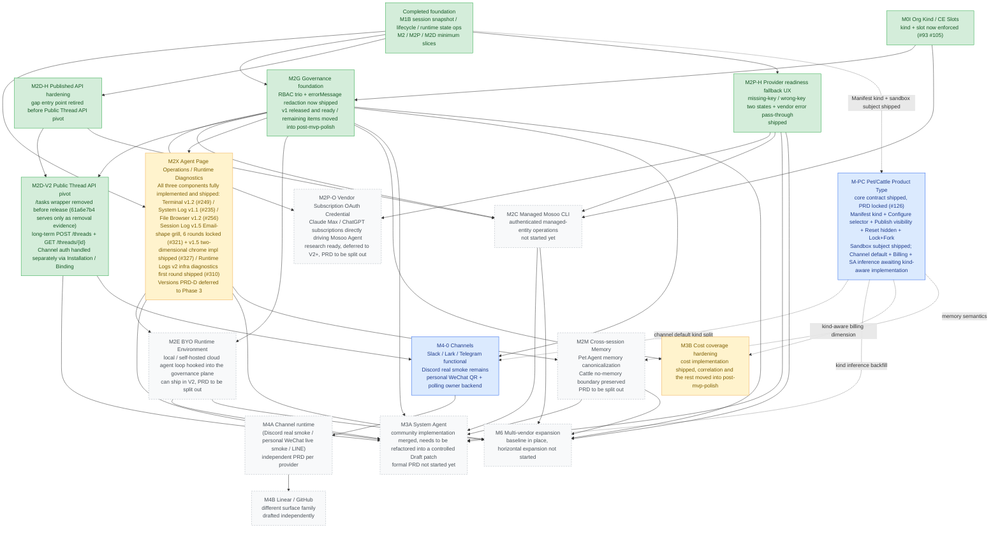

# Mosoo

Language: [Simplified Chinese](./docs/README.zh-Hans.md)

Mosoo is an open-source Agent Cloud project in alpha, built on a Cloudflare-native architecture. The current priority is OPC / personal developers: people should be able to run a lightweight, self-hostable, fast-moving Agent Cloud in their own Cloudflare account with low operational overhead.

In the long term, we want Mosoo to grow from an open-source community edition into Agent infrastructure that supports individuals, OPCs, small teams, and enterprise governance. Personal developers can experiment and fork freely, teams can build shared Agent and Knowledge assets, and enterprises can add permission, cost, version, and runtime-state management.

## What Is Mosoo

The name Mosoo comes from Moso Bamboo.

Moso bamboo grows differently from many trees. It does not slowly create new cells while rising upward; it completes a long preparation underground first:

1. Underground rhizomes and roots accumulate nutrients for years.
2. After the shoot emerges, it rapidly stretches existing cells.
3. It completes almost all of its height growth in only 40-60 days.

Moso bamboo is one of the fastest-growing large woody bamboos and is often treated as a symbol of rapid vertical growth. It never appears alone; it grows as a bamboo forest. In Chinese culture, bamboo also carries the meaning of humility, resilience, and long-termism.

We want Mosoo to grow in the same way: first taking root in the developer and OPC communities, letting a lightweight open-source version grow quickly; then gradually hardening over a longer period, helping teams and enterprises transform as Agent and Knowledge assets expand, and eventually growing into an Agent forest owned by each organization.

## Why We Are Building It

Mosoo was originally named Dify-Lite. The initial goal was to build a lighter version of Dify: reduce the overall feature surface, use a technology stack and engineering tradeoffs oriented toward 2026, and lower the barrier to adoption.

The value proposition at this stage is not to clone a complete large platform. It is to make the Agent Cloud skeleton thin, fast, and open-source first, so personal developers can own infrastructure that is runnable, understandable, and easy to fork.

Mosoo continues to evolve around three planes:

- **Consumption plane**: let users access Agents through natural entry points.
- **Production plane**: let application / Agent developers configure, launch, and distribute Agents faster.
- **Governance plane**: let administrators manage permissions, cost, versions, and runtime state.

During the open-source alpha, the consumption, production, and governance planes are focused on personal developers and small-scale self-hosting first. We will satisfy real individual and OPC needs before extending the same architecture toward team collaboration and enterprise governance.

## Roadmap

Mosoo's main direction is still moving quickly. We are currently focusing on the Cloudflare-native open-source version so the core loop can close in a lighter, faster, and more verifiable way: make personal developer and OPC scenarios genuinely usable first, then extend the same architecture toward team and enterprise support.

The current roadmap centers on these goals:

- **OPC / personal developers first**: polish the full loop for deploying, configuring, running, and debugging Agents as an individual developer.
- **Cloudflare-native runtime**: continue converging the architecture around Workers, Durable Objects, D1, R2, and related platform capabilities.
- **Complete open-source community path**: prioritize the core capabilities required for a self-hostable, modifiable, extensible community edition.
- **Agent asset management**: gradually turn Agent, Knowledge, Skill, MCP, Space, Credential, and Channel capabilities into manageable assets.
- **Enterprise capability expansion**: after personal and OPC scenarios work end to end, add team collaboration, permissions, cost, version control, and runtime governance.



## Vision

In the long term, Mosoo aims to grow from an open-source Agent Cloud project into a management-oriented platform rather than a pure tool. This vision is aimed at internal enterprise AI governance and Agent infrastructure management, letting application / Agent developers, administrators, and users participate in the same AI infrastructure from different perspectives.

For producers, the future goal is to complete application configuration and launch within 15 minutes, delivering different kinds of Agent Runtime to employees, such as Claude Code and Hermes. Mosoo should also connect to channels / platforms such as GitHub, Slack, and Lark, or integrate into internal enterprise systems and application development workflows through APIs and Skills.

For administrators, Mosoo aims to provide an easy-to-use WebUI for understanding which Agents are running inside the company, who can access them, who is using them, how cost is calculated, how versions are controlled, and how internal Agent infrastructure becomes managed infrastructure.

## Project Status

Mosoo is still in alpha exploration. Product boundaries, data models, deployment methods, and management experience are all evolving quickly. This repository currently prioritizes fast validation and architectural convergence for the open-source version, with no promise of stable APIs or backward compatibility.

- PRDs and product design: [dev/prd/README.md](./dev/prd/README.md).
- Architecture design: [dev/architecture.md](./dev/architecture.md).
- Development and contribution guide: [CONTRIBUTING.md](./docs/CONTRIBUTING.md).

## Local Development

See [CONTRIBUTING.md](./docs/CONTRIBUTING.md) for the full development flow. The shortest local path is:

```bash
bun install
vp run env:init
vp exec prek -c dev/config/prek.toml install
vp run db:migrate:local
just dev
```

- Web: `http://localhost:5173`
- API: `http://localhost:8787`
- Regular email login uses OTP.
- In local development, email addresses ending with `@mosoo.ai` skip OTP and log in directly.
