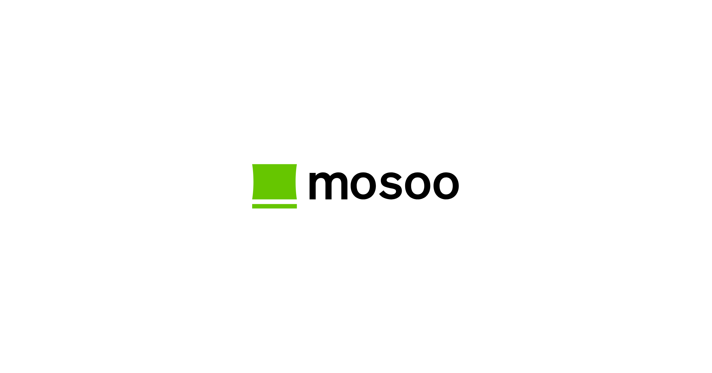

<p align="center">
  
</p>

<h1 align="center">mosoo</h1>

<p align="center">
  <strong>An open-source, API-first managed Agent runtime for application backends.</strong><br />
  Run OpenAI Codex, Claude Agent SDK, OpenCode, and Pi behind one API, each Session in its own sandbox.
</p>

<p align="center">
  <a href="./LICENSE"></a>
  
</p>

<p align="center">
  <a href="https://cloud.mosoo.ai">Try mosoo</a> ·
  <a href="https://mosoo.ai">Website</a> ·
  <a href="https://mosoo.ai/docs">API Documentation</a> ·
  <a href="https://github.com/langgenius/mosoo-agent-driver">mosoo-agent-driver</a> ·
  <a href="https://github.com/langgenius/mosoo-connector">mosoo-connector</a> ·
  <a href="https://github.com/langgenius/mosoo-skills">mosoo-skills</a>
</p>

Your application keeps its business logic, end-user authentication, and UI. mosoo runs the Agent: it executes each turn in an isolated sandbox, keeps the working directory and the native conversation between turns, stores input files and artifacts, streams events, and records usage. It is built on Cloudflare Workers, Durable Objects, D1, R2, and Containers.

## How It Works

```text
Project API key + harness/model + instructions + input + optional files
  -> create a durable Session (a Thread in the API) and run the first turn
  -> follow status and events, download artifacts
  -> optionally send follow-up input to the same Session
```

Model credentials belong to your Project: you bring your own provider key. On `/api/v2` the configuration is inline or a saved Agent, a reusable preset (harness, model, instructions, Skills, MCP servers, Environment); `/api/v1` takes only a published Agent and runs its live version. [docs/SPEC.md](./docs/SPEC.md) is the product contract.

mosoo is in Alpha. Public APIs and product behavior may still change.

## Getting Started

The fastest way to try mosoo is the hosted console at [cloud.mosoo.ai](https://cloud.mosoo.ai). To run it locally you need `bun >= 1.4.0-canary.1`, `just`, and a Docker-compatible daemon for Agent sandboxes.

```bash
git clone --recurse-submodules https://github.com/langgenius/mosoo.git
cd mosoo
just setup   # dependencies, submodules, apps/api/.dev.vars, Git hooks, local D1
just dev     # console on http://localhost:5173, API on http://localhost:8787
```

From another terminal, `curl http://localhost:8787/api/health` returns `{"name":"mosoo","ok":true}`. [CONTRIBUTING.md](./CONTRIBUTING.md) covers local sign-in, verification, and the commit policy.

## Example: Build a Codex Agent API

[Codex Pet](https://mosoo.ai/en/use-cases/codex-pet) integrates a mosoo Agent into an existing product backend through the Thread API.

https://github.com/user-attachments/assets/4a4bbaab-c192-4462-99e0-020eab966fff

## Documentation

- API reference: [mosoo.ai/docs](https://mosoo.ai/docs)
- Product contract: [docs/SPEC.md](./docs/SPEC.md)
- Architecture and invariants: [docs/architecture.md](./docs/architecture.md)
- Product notes: [docs/prd/README.md](./docs/prd/README.md)
- Production status: [mosoo.ai/status](https://mosoo.ai/status)

## Contributing

Report bugs and request features in [GitHub Issues](https://github.com/langgenius/mosoo/issues). Read [CONTRIBUTING.md](./CONTRIBUTING.md) before opening a pull request; CLA Assistant asks first-time contributors to sign the [Contributor License Agreement](./CLA.md).

<a href="https://github.com/langgenius/mosoo/graphs/contributors">
  
</a>

## License

mosoo is licensed under the [Apache License 2.0](./LICENSE).
