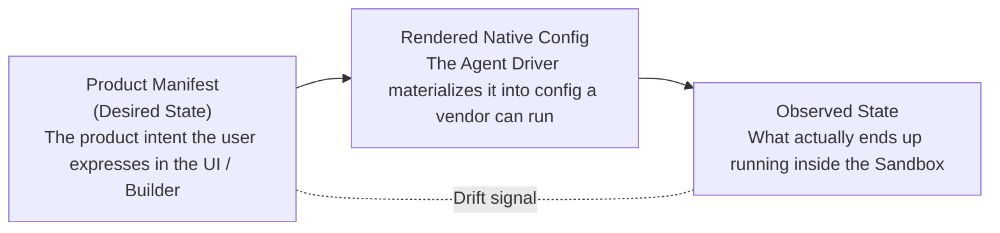
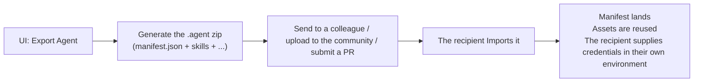
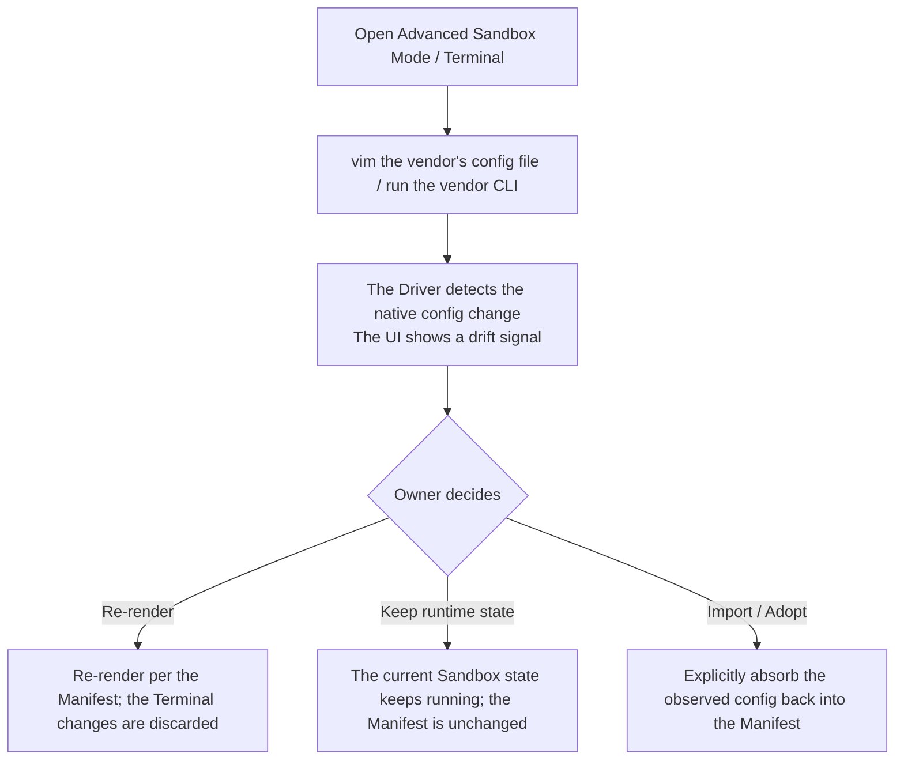
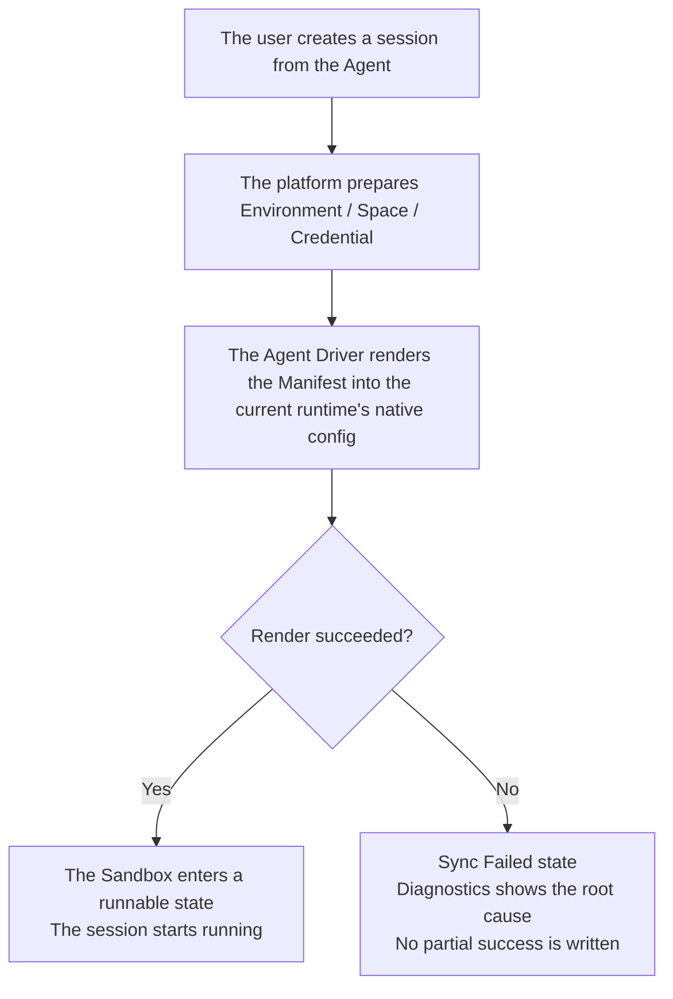

### Agent Manifest — for humans

> This is the product-narrative version written for non-engineer readers. For the field-level types, see `pkgs/contracts/src/agent/agent-manifest.contract.ts` — the manifest contract source is the de-facto engineering reference.

---

## Positioning in one sentence

The Agent Manifest is the **declarative product configuration** of a Mosoo Agent:

- It uses **a small set of stable fields** to spell out who an Agent is, which runtime it runs on, which model it uses, which system prompt it follows, and which Skills / MCP / Spaces / Environment it has installed.
- Upstream: the Agent owner edits it through a UI form, or lets **Agent Builder** generate it.
- Downstream: any tool — Agent Builder, the CLI, CI, a future IDE plugin — can read the same Manifest and package it into a **`.agent` file** to distribute, fork, and import across teams, organizations, and the community.

It is **not** a "super `agent.yaml`" that unifies the vendor configuration files of OpenAI runtime, Claude Agent SDK, OpenCode, Cursor, and so on. Those vendors have their own full-featured configuration formats, and we do not try to swallow them.

> Analogy:
> The Manifest is to an Agent what `package.json` is to a frontend project — it pins down "which framework this project uses, which packages it depends on, and where the entry point is." But it does **not** write every webpack plugin option for you, and it does **not** manage the internal config of each dependency inside `node_modules`.

---

## Breaking it down in one sentence

> The Agent Manifest is mostly about **defining a problem**, not enumerating a field table.

The core points it solves are:

1. **Consumable by downstream tools** — whether it is our own Agent Builder, other automation tools, or future third-party platforms, all of them can read the same Manifest to understand "who this Agent is and what it needs."
2. **Making `.agent` files easy to distribute** — a `.zip` that contains `manifest.json` plus asset files (skills / environment definition / etc.) can be attached to a GitHub, Notion, or Slack file and handed to a colleague, and can also be imported into any Mosoo workspace or organization.
3. **Declarative** — the user expresses "what I want," and the platform renders it into something a concrete runtime can run. The user does **not** write startup commands, does not maintain a vendor `.toml`, and does not toggle dozens of advanced switches in a UI form.

---

## 1. The user problem

Mosoo simultaneously supports a host of heterogeneous Agent runtimes: OpenAI runtime, Claude Agent SDK, OpenCode, OpenClaw, Gemini, Hermes, Pi, Cursor Agent, and more. Each of them has its own:

- Configuration files (`config.toml` / `settings.json` / `.cursorrules` / …)
- Startup parameters, login state, and cache directories
- Way of wiring up MCP
- Prompting conventions
- Vendor-native session state

If we stuffed all of this into one big, all-encompassing `agent.yaml`:

- Users would see a pile of fields they **don't understand**, **can't migrate**, and **shouldn't be responsible for** in the first place.
- The Manifest would look like a vendor adapter spec rather than a product configuration.

If we built only the lowest common denominator:

- The Agent would become an "anemic wrapper" — unable to retain the full capabilities of OpenAI runtime or OpenClaw.
- Advanced users would go into the Terminal to change the vendor config, only to have the UI silently overwrite it again.

The real problem is not "how do we merge every vendor's fields into one," but rather:

- **Agent authors need a readable, editable, publishable entry point for product configuration.**
- **The platform needs a stable contract** that can create, start, diagnose, and recover Agents, and that can also be consumed by Agent Builder and other downstream tools.
- **Each Agent's runtime environment** must still retain the vendor's full capabilities.
- **When the UI, the Sandbox, and the vendor-native config disagree**, the user must clearly understand who is the source of truth and what to do next.

---

## 2. Goals

### What Agent authors can do

- Define a long-lived Agent with a small set of stable fields: `kind`, runtime, model, system prompt, Skills, MCP, Environment, Spaces.
- Let Agent Builder take over the complex editing work: say in natural language "give me an agent that can read Linear tickets," and Builder translates it into a Manifest patch.
- Export the Agent as a **`.agent` package** to send to colleagues, upload to the community, or fork across organizations.
- Import someone else's `.agent` package: the Manifest lands, assets are reused, and **credentials / tokens are not carried along with it**.

### What the UI makes clear

- Whether this Agent **renders successfully right now** — whether the config is in effect and whether it is still running the way you last saved it.
- When any one of model / runtime / credential / MCP / Space is unavailable, the UI **shows a clear grayed-out state** with a fix-it entry point, instead of silently swapping in a substitute for you.
- When the actual state inside the Sandbox disagrees with the Manifest, there is a **clear drift indicator** — and the UI will not reverse-write over it.

### What advanced users can do

- Open the Terminal / Advanced Sandbox Mode and directly edit the vendor-native config: change it however the vendor CLI lets you change it.
- Know that these changes **will not** be automatically reverse-written back into the Manifest — unless you explicitly choose "Import / Adopt."
- Fork the Agent to get a clean copy: the Manifest is copied over, while runtime state / login state / historical sessions are left behind.

---

## 3. The relationship lock: a three-layer mental model

The key to understanding the Manifest is not to confuse these three layers:

| Layer                      | What it is                                                                                                                  | Is it the source of truth?                             |
| -------------------------- | --------------------------------------------------------------------------------------------------------------------------- | ------------------------------------------------------ |
| **Product Manifest**       | The user form / Builder / advanced YAML view / the state the platform saves                                                 | ✅ Yes. This is what the UI displays.                  |
| **Rendered Native Config** | The vendor config file / startup parameters the Agent Driver renders from the Manifest                                      | ❌ No. It is a materialized result.                    |
| **Observed State**         | The facts Diagnostics reads out of the Sandbox — the actually-running runtime, the native config hash, startup errors, etc. | ❌ No. Used only for diagnostics and drift comparison. |

**Rules**:

- Editing the Manifest in the UI → triggers a re-render → changes the Sandbox.
- Editing the Sandbox in the Terminal → **does not** change the Manifest; it only produces a drift signal.
- The user can choose "Re-render" (re-render the Manifest into the Sandbox), "Keep runtime state" (keep the current Sandbox state and keep running), or explicitly "Import / Adopt" (absorb the Sandbox's current state back into the Manifest).

---

## 4. The minimal common set + the "full-power VPS" mental model

What we are building is the **overall unification of heterogeneous vendors** — so at the product layer the Manifest only ever appears as a **"minimal common set"**: runtime / model / system prompt / Skills / MCP / Environment / Spaces.

For configuration that is **not on the user's side** (vendor-private parameters, native CLI settings, login caches, reasoning_effort, performance tuning, and so on), our principles are:

### Principle 1 · The runtime environment should be "full-power"

Running an Agent inside a Container should feel **close to deploying a fully uncrippled Agent on a VPS**.

- If you were using OpenClaw / Harness Agent / Claude Code on your own computer, how would you configure it? — Most likely `cd ~/.config/<tool> && vim config.toml`.
- It is the same inside Mosoo: open the Terminal, edit the vendor's own config file, and restart the process.

Whatever can be done inside the Sandbox, **we do not re-cripple it for you in a UI form**.

### Principle 2 · Balance "presentation" against "parameterized configuration"

Not every piece of configuration should surface in front of the user.

- **What belongs to product semantics** — long-term stable, common across runtimes, the user's responsibility — goes into the Manifest form.
- **What belongs to vendor-private parameters** — things like `reasoning_effort` / thinking level / fallback strategy / native cache size / startup flags — is left inside the Sandbox, to be changed by the **Terminal / vendor CLI / a future System Agent**.

> In one sentence:
> Anything you would solve on your own computer "by changing `~/.config/<tool>` from the command line" goes through the Terminal / Sandbox / System Agent in Mosoo too; we do not reinvent a separate form for it in the UI.

### Principle 3 · No promise of lossless cross-vendor migration

The Manifest is a minimal common set → it is impossible to move all of the OpenAI runtime's private fields 1:1 onto the Claude Agent SDK. Switching runtime = **Fork Agent / migration**, and we only promise to migrate the main Manifest fields; vendor-private native state does not migrate.

---

## 5. Concept definitions

| Term                             | Plain-language definition                                                                                                                                                                                                                                   |
| -------------------------------- | ----------------------------------------------------------------------------------------------------------------------------------------------------------------------------------------------------------------------------------------------------------- |
| **Agent Manifest**               | An Agent's declarative product configuration. The **minimal common set** + user intent + platform governance fields. Downstream tools only need to read this.                                                                                               |
| **`.agent` package**             | A distributable zip: `manifest.json` + assets (skills / environment / avatar / …). Can be exported / imported / forked. **Does not carry credentials.**                                                                                                     |
| **`kind: pet \| cattle`**        | Pet = a Sandbox that follows the Agent long-term (your VPS / colleague). Cattle = an independent Sandbox per session (one instance per task). Locked after the first Publish; switching requires a Fork.                                                    |
| **Sandbox**                      | The execution environment in which the Agent actually runs. Pet uses an "Agent Sandbox"; Cattle uses a "Session Sandbox." All of the vendor's full capabilities are preserved here.                                                                         |
| **Rendered Native Config**       | The vendor config file / startup parameters the Agent Driver renders from the Manifest. **A materialized result, not the truth.**                                                                                                                           |
| **Drift**                        | The intent expressed by the Manifest vs. the actual state running inside the Sandbox disagree. Possible sources: you changed it in the Terminal / the vendor runtime changed it on its own / the platform failed to sync.                                   |
| **Advanced Sandbox Mode**        | The Terminal / advanced entry point that operates the Sandbox directly. It can change native state, but **cannot break through** the Space / Credential / Network boundaries.                                                                               |
| **Import / Adopt**               | Explicitly absorb certain observed config from the Sandbox back into the Manifest. **By default this never happens automatically.**                                                                                                                         |
| **Fork Agent**                   | Take a clean copy: the Manifest + asset bindings are copied over, while runtime state / login state / session history / cost are left behind.                                                                                                               |
| **Readiness (grayed-out state)** | When any one of runtime / model / credential / MCP / Environment / Space is unavailable, the Manifest is **kept**, but the frontend shows a clear grayed-out state + a fix-it path; it does **not** auto-swap the runtime and does not auto-swap the model. |
| **Unavailable Model**            | A model that was selected before but is no longer in the dynamic model list. The Manifest still keeps it, the UI marks it Unavailable, and the user switches it manually.                                                                                   |

---

## 6. What is and isn't in the Manifest

| Section                                                    | User mental model                                 |                                      In the Manifest? |
| ---------------------------------------------------------- | ------------------------------------------------- | ----------------------------------------------------: |
| Name / Description                                         | Who this Agent is                                 |                                                    ✅ |
| Runtime                                                    | Which Agent runtime it runs on                    |                   ✅ (switching after publish = Fork) |
| Model                                                      | Which provider / model is the default             |                                ✅ (can be grayed out) |
| System Prompt                                              | The Agent's role, boundaries, and answering style |                                                    ✅ |
| Skills                                                     | Built-in capability bindings                      |                                                    ✅ |
| MCP Servers                                                | External tool / connector bindings                |                                                    ✅ |
| Environment                                                | Reference to a runtime container template         |                                                    ✅ |
| Space Bindings                                             | The data spaces visible to the Agent              |                                                    ✅ |
| Vendor native config (`config.toml` / `settings.json` / …) | Vendor-private                                    |                               ❌ → Sandbox / Terminal |
| Login state / CLI cache / vendor session state             | Runtime-internal state                            | ❌ → Pet Sandbox state / Cattle Session Sandbox state |
| Performance / auto-switching / reasoning effort            | Vendor-private preferences                        |                               ❌ → Runtime / Advanced |

---

## 7. User journeys

### Owner creates an Agent (through the UI or Agent Builder)

| Stage                     | Action                                                     | Experience                                                                           |
| ------------------------- | ---------------------------------------------------------- | ------------------------------------------------------------------------------------ |
| 1. Getting started        | Fill in name, description                                  | The form shows only stable product semantics                                         |
| 2. Choose runtime / model | Pick from dropdowns                                        | See the list of runtimes + models available to the current organization / individual |
| 3. Write the prompt       | Fill in the system prompt                                  | The platform stores the prompt as part of the Manifest                               |
| 4. Attach capabilities    | Skills / MCP / Environment / Spaces, each in its own group | Clear section boundaries, no nesting into each other                                 |
| 5. Check readiness        | The UI validates automatically                             | Any unavailable item is grayed out with its reason + a fix-it path                   |
| 6. Save / Publish         | One click                                                  | Enters the Manifest state machine: draft / preview / live                            |

### Owner distributes the Agent

### A user enters the Terminal to edit the vendor-native config

### Session startup

---

> Field-level types and the manifest schema live in `pkgs/contracts/src/agent/agent-manifest.contract.ts` — the contract source is the de-facto engineering reference.
