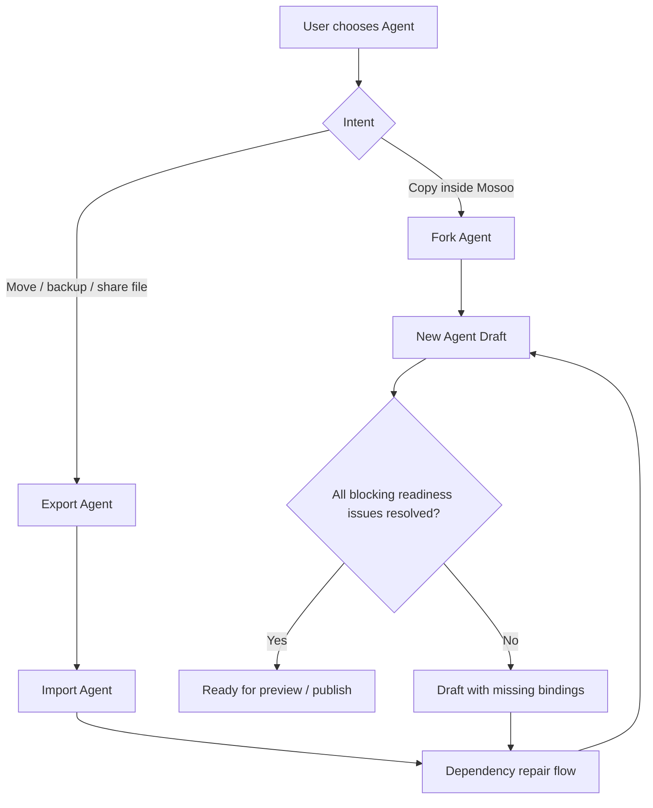

# Agent Import / Export & Fork — for humans

> This is the product-story version for non-engineer readers. The field-level package contract lives in `pkgs/agent-package/src/archive-path-policy.ts` and `pkgs/contracts/src/agent/agent-manifest-serializer.contract.ts`; the export/import services are under `apps/api/src/modules/agents/application/agent-package-*.service.ts`.

---

## One-line positioning

On Day 1, the user surface has only three actions: **Fork Agent / Export Agent / Import Agent**. `.agent` is a portable Agent file — it packages an Agent together with its assets, Skills, MCP, Environment, and Space binding intent into a single zip. You can back it up, move it from one instance to another, promote it from a test environment to production, or hand it to a colleague so they can build their own version.

Think of it as the "frictionless distribution" experience of a Claude Code Plugin: the user receives a `.agent` file, imports it, and gets a **new Agent draft**, fixing whatever is missing. But **secrets, runtime state, and session history never travel with the file** — the target side must re-authorize and reconnect.

---

## User problem

When a user actually wants to "copy / back up / migrate an Agent," they are not moving a Manifest config file — they are moving a **re-deployable Agent**. A `.agent` file carries both control-plane descriptions such as runtime / model / prompt and application-layer material:

- App name, description, avatar / logo / brand asset.
- Controlled package assets such as avatar, custom Skill, custom MCP, or Environment definitions.
- Skills, MCP, Environment, Space bindings.
- Already-stabilized, declarative configuration from Web / API distribution.

If you stuff all of this into the Agent Manifest, the Manifest swells from a runtime contract into an application bundle. If you treat the Manifest as the user-facing import/export object, users will mistakenly think they are only moving config. So on Day 1, the user surface must be locked to **Import Agent / Export Agent / Fork Agent**, and the Manifest only participates in the implementation as part of the `manifest.json` inside the `.agent` file.

The real problems are:

- A user needs to **Fork** an Agent in one click and get an editable copy.
- A user needs to **Export** a complete Agent for backup, migration, or template distribution.
- A user needs to **Import** an Agent and clearly understand which dependencies can be restored automatically and which must be re-bound or re-authorized.
- An import may happen in a different Organization, or between different users in the same Organization; the permissions, references, and credentials of the source environment cannot be assumed to still hold.
- Persisted content inside the sandbox execution environment may be valuable, but it must not be mixed into ordinary import/export by default.

## Goals

Users should be able to:

- **U1**: Fork an Agent within the same Organization and get their own editable Agent draft.
- **U2**: Export an Agent and get a `.agent` file; the file contains the declarative definition, controlled assets, and a dependency manifest.
- **U3**: Import an Agent, create a new Agent draft from the `.agent` file, and fill in missing dependencies through a clear repair flow.
- **U4**: Understand that Fork / Export / Import copies an Agent definition — **not a computer that has already been running**.
- **U5**: See, after import, which of MCP, Space, Environment, Credential, and so on are available, missing, or need to reconnect.
- **U6**: When importing into another Organization or under another user, confirm item by item whether runtime, model, MCP, Integration, Environment, and Space can hold in the target context.

---

## Concept definitions

| Term                          | Definition                                                                                                                                                                                                                                                      |
| ----------------------------- | --------------------------------------------------------------------------------------------------------------------------------------------------------------------------------------------------------------------------------------------------------------- |
| **Agent Manifest**            | The product desired state of an Agent. Defines how the Agent behaves.                                                                                                                                                                                           |
| **Portable Agent (`.agent`)** | The complete, importable/exportable Agent file. Contains App metadata, the Agent Manifest, asset files, and a resource catalog. On the user surface it is simply called an Agent; the internal implementation may handle it as a ZIP bundle / package contract. |
| **App Metadata**              | The application information shown to users: name, description, avatar / icon.                                                                                                                                                                                   |
| **Package Asset**             | A controlled file asset carried inside the Package, such as the avatar, custom Skill, custom MCP, or Environment definition. On import, a new asset id must be generated under the target Organization / new Agent.                                             |
| **Fork Agent**                | Creating a new Agent draft based on an existing Agent within the Mosoo control plane. By default it copies the Agent definition, not the session runtime state or Agent memory.                                                                                 |
| **Export Agent**              | Packaging an Agent's definition, controlled assets, and dependency manifest into a portable `.agent` file.                                                                                                                                                      |
| **Import Agent**              | Creating a new Agent from a `.agent` file and entering the dependency repair flow.                                                                                                                                                                              |
| **Resource Catalog**          | The minimal declaration in `manifest.json` of the resources inside the zip and the external intents; it does not include import-time readiness state.                                                                                                           |
| **Package-owned Resource**    | A resource carried in full with the `.agent` file and managed under the new Agent's private resource domain after import, such as a custom Skill, custom MCP, or custom Environment.                                                                            |
| **External Reference Intent** | A resource for which the Package only records the reference intent and which must be resolved or repaired in the target Organization at import time, such as runtime, model, marketplace MCP, or Space binding.                                                 |
| **Needs Reconnect**           | A dependency whose declaration exists but whose credential or external connection must be re-authorized, such as an MCP credential.                                                                                                                             |
| **Repair Flow**               | The flow after import for filling in missing dependencies, replacing resources, re-authorizing, or skipping a given binding.                                                                                                                                    |
| **Import Context**            | The target Organization, target user, role, available runtime, available model, and existing Integration / Environment / Space / Credential at the time of import. All package content must be re-resolved within this context.                                 |
| **Resolve**                   | The process of converting declarative material in the package into governable resources within the target Organization. The core of Import is resolve, not restore.                                                                                             |
| **Recreated Resource**        | A resource re-created in the target Organization from a package declaration, such as a copy of an MCP Server or Environment.                                                                                                                                    |
| **Floating Config**           | Transient config that is not managed by the package, asset store, or domain service and is merely scattered inside the Agent config. This PRD prohibits such uncontrolled floating config; what V1 allows is an Agent-private package-owned resource.           |
| **Runtime State Clone**       | The advanced capability of copying the Agent Manifest plus a runtime snapshot. This PRD explicitly does not do this.                                                                                                                                            |

---

## Package content boundaries

| Content                              | Export Agent | Fork Agent | Notes                                                                                                                       |
| ------------------------------------ | -----------: | ---------: | --------------------------------------------------------------------------------------------------------------------------- |
| App name / description               |          Yes |        Yes | Editable after copy                                                                                                         |
| Avatar / icon                        |          Yes |        Yes | Copied as an asset                                                                                                          |
| Agent Manifest                       |          Yes |        Yes | Core desired state                                                                                                          |
| System prompt                        |          Yes |        Yes | Manifest field                                                                                                              |
| Runtime intent                       |          Yes |        Yes | Carried losslessly; enters a runtime-disabled grayed-out state when the target Organization has not enabled it              |
| Skills binding                       |          Yes |        Yes | Carried losslessly as a non-mandatory capability; shows a missing optional skill if the package was manually stripped of it |
| MCP binding                          |          Yes |        Yes | Does not carry credential plaintext                                                                                         |
| Environment binding                  |          Yes |        Yes | Reference may be preserved; requires replacement when missing                                                               |
| Space bindings                       |          Yes |        Yes | Copies only the binding intent, not the Space files                                                                         |
| Logo / brand assets                  |          Yes |        Yes | Copied as a package asset; a new asset id is generated on import                                                            |
| Provider / MCP / Environment secrets |           No |         No | Re-authorize or re-enter after import                                                                                       |
| Session runtime state / Agent memory |           No |         No | Belongs to the runtime snapshot, not the Package                                                                            |
| Sessions / logs / cost               |           No |         No | Run history                                                                                                                 |

> **Security red line**: a `.agent` file **never carries a plaintext secret** — provider key, MCP token, Environment secret, webhook signing secret, and personal OAuth token are all excluded. Secrets are configuration items and must be reconfigured in the new environment.

---

## Bundle Layout

The physical form of `.agent` = a **branded ZIP bundle with directory structure**. `.agent` is the only product file extension for Export / Import; the underlying container stays a standard ZIP.

This section is a product-level example of the package contract: it locks down the content boundary and interop form of a user-portable Agent.

### Directory structure inside the zip

```
my-agent.agent
├── manifest.json                        # Primary contract (JSON; aligned with Claude Code plugin.json)
├── attachments/                          # User-uploaded file assets
│   └── avatar.png                       # Native PNG/SVG
├── skills/                               # Embedded skill directory tree (agentskills.io standard)
│   └── <skill-name>/
│       ├── SKILL.md                     # frontmatter (name=parent dir) + body
│       ├── scripts/                     # optional
│       ├── references/                  # optional
│       └── assets/                      # optional
├── environment/                          # Embedded Environment template (no secret values)
│   └── definition.json                  # packages + setupScript + networkPolicy
└── .mcp.json                            # Embedded MCP servers (Claude Code standard schema)
                                         # credentials are not here; they go through needs_reconnect (OAuth re-authorization)
```

### manifest.json top-level schema (catalog, does not embed large files)

```jsonc
{
  "name": "my-agent",
  "version": "1.0.0",
  "description": "...",
  "author": { "name": "...", "email": "..." },
  "license": "MIT",
  "sourceAgentId": "01J...",
  "exportedAt": "...",
  "packageVersion": "mosoo.agent.package.v1",
  "manifestVersion": "mosoo.agent.manifest.v1",

  "kind": "pet",
  "runtime": "claude-agent-sdk",
  "model": "claude-sonnet-4-5",
  "provider": "anthropic",
  "providerOptions": {},
  "prompts": { "system": "..." },

  "avatar": "attachments/avatar.png",

  "skills": [{ "name": "web-search", "path": "skills/web-search/" }],
  "mcpServers": [{ "name": "linear", "ref": ".mcp.json#linear" }],
  "environment": { "ref": "environment/definition.json" },
  "spaceBindings": [{ "alias": "docs", "expectedName": "Product Docs" }],
}
```

| Content group                          | Enters package | Product constraint                                                                                           |
| -------------------------------------- | -------------: | ------------------------------------------------------------------------------------------------------------ |
| Agent Manifest                         |            Yes | Expresses desired state, not vendor-native full config                                                       |
| Avatar / other attachments             |            Yes | Carried as file assets inside the package; a new target-side asset is generated on import                    |
| Skills                                 |            Yes | Carried as a portable capability directory; shows a repairable state when missing or corrupted               |
| MCP declaration                        |            Yes | Carries only the server intent; credential, token, and source connection state do not enter the package      |
| Environment template                   |            Yes | Carries declarative config; secret values must be reconnected target-side                                    |
| Space bindings                         |            Yes | Carries only binding intent such as alias / expected name; does not copy Space content or source permissions |
| Runtime state / sessions / logs / cost |             No | Belongs to run history, not the package                                                                      |

### Key constraints

| Constraint                                                                                                      | Rationale                                                                                                                                   |
| --------------------------------------------------------------------------------------------------------------- | ------------------------------------------------------------------------------------------------------------------------------------------- |
| **A Skill must be a `skills/<name>/SKILL.md` directory** (frontmatter `name` = parent dir name)                 | A multi-file unit (SKILL.md + scripts/ + references/)                                                                                       |
| **MCP server config lives in `.mcp.json`** using the remote HTTP/SSE subset                                     | First guarantee no secrets, no arbitrary command execution, and target reconnect-ability                                                    |
| **The Environment template lives in `environment/definition.json`** as a full definition, without secret values | Secrets go through needs_reconnect                                                                                                          |
| **Space binding intent goes into `manifest.json`**                                                              | Carries only alias / expectedName, not Space files, source Space id, blocking policy, or permission state                                   |
| **Space permissions are computed by target-side RBAC**                                                          | Determined in real time at import repair / preview / publish / session start, based on the target user, Agent owner, and the selected Space |
| **The only source ULID that may appear is `manifest.json#sourceAgentId`** (provenance pointer to the exporting Agent); no other source ULIDs (Organization id, user id, asset ids, Space ids, MCP server ids) appear in any file in the zip | Resolution is still by name; `sourceAgentId` is provenance only — the importer does not look it up against the target Organization, and a mismatch never blocks an import                                                                   |

---

## Import Resolution

The goal of Import is not to restore the source Organization, but to reconstruct a **governable, authorizable, runnable** Agent App on the target Organization / User.

```text
Import = Parse package
       + Compute readiness in target context
       + Create Agent draft with explicit unresolved items
```

Therefore every item in the package must land within the real resource boundary of the target Organization / target Agent, without producing uncontrolled floating config. Agent-private package-owned resources are controlled resources, not equivalent to arbitrary scattered config.

> See the engineering contract for the full resolution matrix, collision policy, and MCP / Space invariants.

---

## User journey map



---

> The field-level package contract, manifest schema, and resolve / repair flow are implemented in `pkgs/agent-package/src/`, `pkgs/contracts/src/agent/agent-manifest-serializer.contract.ts`, and the export / import services under `apps/api/src/modules/agents/application/`. Note: avatar packaging is described in the bundle layout above but is not yet wired up — `agent-package-export.service.ts` currently writes `avatar: null` and emits no `attachments/` directory.
