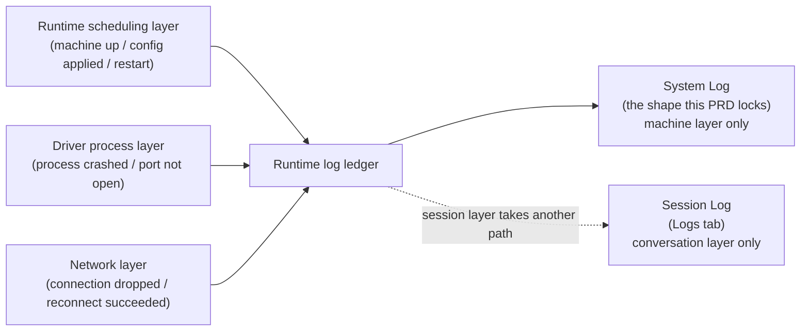
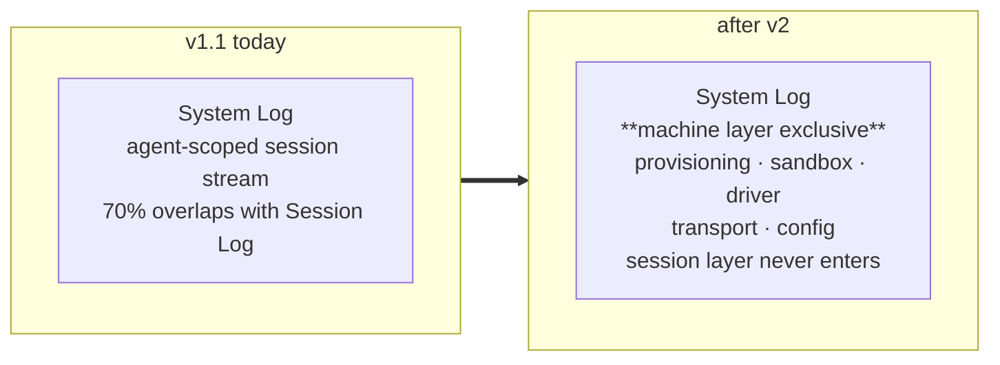

# Agent Runtime Logs — for humans

> This is the product-story version for non-engineering readers. For the **complete engineering contract** (event catalog / family enums / visibility rules / signal-source alignment / state-machine coverage matrix / Architecture Impact), see the full PRD.
>
> This document is aligned with v2.1 (post-grill).

---

## One-line positioning

Upgrade Debug → System Log from an "agent-scoped event stream" into a "runtime diagnostics stream on par with **Railway / Vercel / journalctl**." Event sources live strictly **below the session layer** (sandbox / driver / transport / config / provisioning / resource) and **do not duplicate session-layer events** (agent message, tool call, token usage, etc. stay in Session Log).

---

## The two-reader lock

System Log serves two kinds of people at once. They don't see two separate streams — they see **different slices of the same stream** (driven by permissions and filters).

### 1. Agent owner / creator

Can **self-diagnose the problems they can fix themselves** from System Log:

- Configuration errors (manifest validation failure / misspelled skill name / wrong model selected)
- Missing env
- Invalid credential (key revoked / expired / nonexistent)
- Space permission revoked
- Model quota exhausted
- OOM triggering a context reduction

**How they self-fix**: the event type name (e.g. `manifest_render_failed` / `credential_missing` / `mount_failed`) plus expanding the raw payload is enough to determine the root cause. **v2.1 does not provide hint text or cards** (decided during grill) — the event name itself should be self-explanatory.

### 2. Mosoo developer (oncall / platform)

Can **diagnose the problems the platform needs to fix** from the same stream:

- Sandbox cold-start failure
- Driver process crash / abnormal exit
- WebSocket connection dropped
- File-watch SSE stream interrupted
- R2 mount failure
- CF Sandbox internal error code surfaced

**How they diagnose**: these signals are **hidden from ordinary owners by default** (visibility = owner_debug) and are visible only to the platform oncall role; the payload carries technical anchors such as trace_id / CF error code / driver pid for cross-system correlation.

---

## 1. User problems

After v1.1 shipped, neither reader truly got the diagnostic surface they wanted:

### On the owner side

- **I just published v5 — did the new prompt / new model take effect?** — What they see today is a session event stream, with no explicit "deployment applied" signal.
- **A customer says the agent crashes the moment it starts — did I misconfigure it, or is the platform broken?** — The root cause of a manifest render failure is buried in backend logs that the owner can't see.
- **Is the Anthropic key expired?** — A credential resolution failure currently only manifests as "the agent stays silent," with the root cause invisible.
- **Is the MCP server I added down / has my Space permission been revoked?** — Neither has a dedicated signal.

### On the Mosoo developer side

- **A user reports "the agent hung for 30 seconds" — is it slow cold start / driver not coming up / or a dropped network?** — None of the three layers has a dedicated event, so the only option is correlating trace_id across OTel / Honeycomb.
- **How many times has this agent's driver crashed recently?** — There's no owner-visible, exportable event stream; every time means digging through the backend.
- **Why isn't the file tree refreshing?** — Today we only learn the SSE stream dropped after the user complains.
- **Is the R2 mount failure a revoked permission or an R2 outage?** — Currently a mount failure lets the agent run but unable to read its data, which looks like "the agent doesn't recognize my files."

### The shared shape mismatch

v1.1 dumped both classes of problem into the same "agent-scoped event stream," and the result was:

- Owners see a flood of "agent talked / called a tool / used N tokens" filling the screen, and **can't find** the config / credential / mount signals they care about.
- The "driver crash / wsConnect drop / sandbox cold start" that platform oncall wants is also drowned in the session stream.

---

## 2. Goals

When v2 is complete:

### Owners can

- Open Debug → System Log and see a list that is **100% machine-layer events** — no agent conversation content (to see the conversation, go to the Logs tab).
- See a "config v5 applied" event within seconds of publishing.
- Get a dedicated event for manifest errors, where the event type name itself conveys the failure semantics.
- Get a dedicated event for missing credential / Space mount failure, and locate it by expanding the raw payload.
- See cold-start durations (millisecond-level data surfaced; they decide for themselves whether to upgrade tier).

### Platform oncall can

- Open the same panel (owner_debug role) and additionally see internal diagnostic signals: driver pid / CF error code / trace_id.
- Use the dropdown to single-select the "machine process" family and look specifically at process-related events.
- See precise reconnection timings ("was the network blip 4 seconds or 40 seconds?").
- Export JSONL for colleagues to search with `rg` and transform with `jaq` for offline analysis (carried over from v1.1).

---

## 3. Data sources (relationship lock)

**Key points**:

- **No new event sources** — the existing runtime scheduling / driver process / network layers already emit these; v2 simply turns those signals into events and exposes them to owners.
- **Session layer and machine layer use different surfaces** — there is no "toggle switch"; to see the conversation, go straight to the Logs tab.

---

## 4. User journey map

| Stage                           | Who             | Doing what                              | What they see                                                                                                                        | Mood                          |
| ------------------------------- | --------------- | --------------------------------------- | ------------------------------------------------------------------------------------------------------------------------------------ | ----------------------------- |
| Post-publish self-check         | Owner           | Switch to System Log                    | A "config v5 applied" event at the top                                                                                               | Reassured                     |
| Config-error triage             | Owner           | Sees a red failure event                | The event type name says "manifest validation failed" directly; expand the raw to see which field is wrong                           | Medium → clearly located      |
| Add missing credential          | Owner           | Sees "credential missing · anthropic"   | Expands to see the cause of failure; manually jumps to Settings to fix                                                               | Medium → fixed                |
| Decide whether to upgrade tier  | Owner           | Filters to sandbox-class events         | 7 cold starts, all 6800–9100 ms                                                                                                      | Medium (data-driven decision) |
| Triage frequent driver crashes  | Platform oncall | Dropdown-selects driver class           | 3 crashes, all exit 137 + crashed within 8–12 seconds                                                                                | High (OOM suspected)          |
| Triage network blips            | Platform oncall | Filters to transport                    | Sees reconnection time of 4.2 seconds                                                                                                | Medium (clear data)           |
| Send evidence to a colleague    | Platform oncall | Selects "last 24 hours" and exports     | Browser downloads a .jsonl                                                                                                           | Efficient                     |
| Cattle: finding the entry point | Owner           | Looks for diagnostics on the Agent Page | **Sees no Debug entry** (the entire Debug menu is hidden for Cattle); goes to the Logs tab instead to view the corresponding session | Not confused                  |

---

## 5. Information architecture (Before / After)

**There's only one change**: the contents of System Log are **completely rebuilt** — the 6 session-layer event classes (message / tool / permission / usage / file / input) are taken out, and the 10 machine-layer classes (provisioning / sandbox / driver / transport / config / resource / lifecycle / diagnostics / state / run) go in exclusively.

**The outer menu / Logs tab / Terminal / File System / Cost / Preview are all untouched.**

---

## 6. Key flows

### Flow A · Owner self-fixes the manifest

1. Owner publishes v5 → switches back to Debug → System Log.
2. At the top, sees a red "manifest validation failed" event.
3. Opens the raw: `{ failed_field: "skills[2].name", reason: "not_found" }`.
4. Owner concludes: "the skill name is misspelled."
5. Manually jumps to the Manifest editor → fixes → re-publishes v6.
6. Returns to System Log and sees "config v6 applied" + "manifest render succeeded," and the red is gone.

### Flow B · Owner self-fixes a credential

1. Customer reports "the agent errors out as soon as you send a message."
2. Owner opens System Log and sees "credential missing · anthropic."
3. Expands the raw: `{ provider: "anthropic", reason: "active_key_revoked" }`.
4. Owner jumps to Settings → Credentials → switches the active key.
5. The next session shows credential resolution passing (visible to owner_debug).

### Flow C · Platform oncall triages frequent driver crashes

1. An alert fires: "agent X had 3 driver crashes within 1h."
2. Oncall opens the owner_debug view → dropdown single-selects "driver class."
3. Sees that all 3 crashes are `exit_code=137`, with survival times of 8–12 seconds.
4. Infers OOM; checks the payload's trace_id → jumps to the backend to see the specific prompt size.
5. Exports the last 1 hour of JSONL and attaches it to a support ticket or an internal bug.

### Flow D · Owner reviews cold starts to decide on a tier upgrade

1. Owner reports "the agent takes 8 seconds to respond every time."
2. Opens System Log dropdown and selects "sandbox class."
3. Sees that all 7 cold-start data points are between 6800–9100 ms.
4. Owner decides for themselves whether to upgrade the sandbox tier (v2 only exposes the data; automatic recommendations are deferred).

### Flow E · Cattle owner looks for the diagnostics entry

1. Task-agent owner opens the Agent Page.
2. **The Debug entry doesn't appear at all** (Cattle has no persistent machine to diagnose, so the entire Debug menu is hidden — no hover tooltip and no empty menu left behind).
3. Switches to the Logs tab → opens the corresponding failed session to view its Session Log (carried over from v1.0 behavior); Cattle runtime infra events are still emitted, but they're shown from the entry of the session/run that owns them, and don't enter the Agent Debug System Log.

---

## Boundaries at a glance

There are three kinds of "log / history" in this product. Don't mix them up:

| What you want to know                                                                | Where to look                                                         |
| ------------------------------------------------------------------------------------ | --------------------------------------------------------------------- |
| What the agent said / which tool it called in a specific session                     | **Logs tab** → select a session (session-layer view)                  |
| What recently happened to this agent's machine (sandbox / driver / network / config) | **Debug → System Log** (v2 turns this into a machine-layer exclusive) |
| Agent Manifest history (v1 → v2 → current live)                                      | **Versions tab** (a separate PRD)                                     |

**Key boundary**: System Log and Session Log share the same data source but differ in perspective — the former slices by machine layer, the latter by session. After v2 the two **no longer have any content overlap**.
