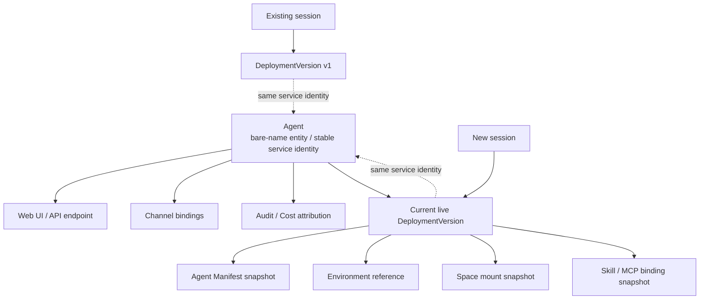
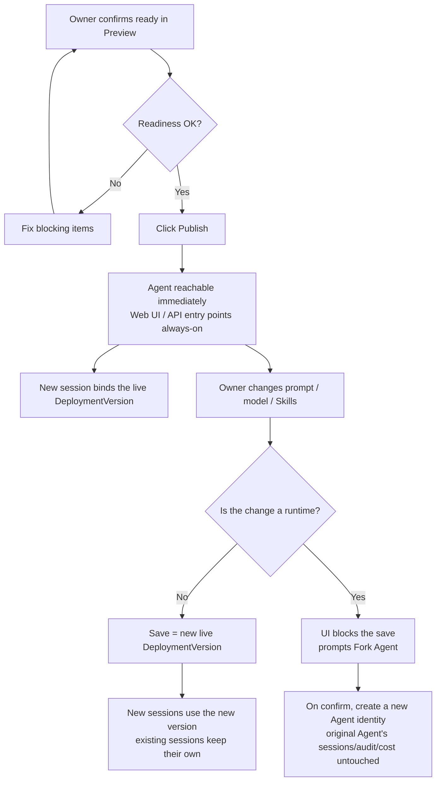

# Agent Service Identity & Deployment Version — for humans

> This is the product-story version for non-engineer readers. The full engineering contract lives in the shipped `agent-service-identity-prd`.
>
> This document covers only two things: **service identity** and **versioning**. How the Apply Changes button works, how the driver restarts, how agent-state resets — all of that lives in [`./runtime-state-operations.md`](./runtime-state-operations.md).

---

## One-line positioning

Lock a **Published Agent** into a **stable service identity** — like a Vercel project + domain, not the rollout of a single build. Web / API / Channel / Audit / Cost all hang off this bare-name Agent; **every config save = one DeploymentVersion snapshot**; **new sessions use the new version, existing sessions are never interrupted**; **you cannot swap the runtime in place — you must Fork into a new Agent**.

Analogy:

> Vercel's `my-app.vercel.app` is always `my-app.vercel.app`; which deployment is running behind it is a separate matter. An Agent works the same way — once published, that Agent is the Agent. Change the prompt today, swap the model tomorrow: the URL doesn't change, the bindings don't change, and the Slack bot doesn't drop offline.

---

## 1. User problem

After an Agent owner publishes an Agent, they run into a handful of questions nobody answers for them:

- **"Will changing the prompt interrupt sessions that are currently running?"** — A customer is chatting with the agent right now; if I go change a model option, will their conversation suddenly switch personalities mid-sentence?
- **"I come back from a meeting and keep chatting — why am I seeing the prompt I edited later?"** — A user keeps asking questions in a thread and the agent suddenly "changes its face," and nobody can explain it.
- **"Switching the runtime from OpenAI to Claude Agent SDK looks like just editing a field — why does it tell me to Fork?"** — Swapping the runtime actually swaps native state, resume behavior, tool behavior, logs, and cost attribution. That's not editing a field; it's a different agent.
- **"Which version are Channel / API users bound to?"** — Is the Slack bot connected to this Agent, or to a snapshot of one particular build? If it drifts, do I have to reconnect it?
- **"Which config did this session actually run last Wednesday?"** — When I see a charge in Audit / Cost, I need to be able to trace whether it ran v3 or v5 at the time.

What the owner actually wants to do:

1. Create an Agent and confirm it runs.
2. Get a **stable service entry point immediately after publishing** (Web / API / Channel).
3. When changing config, have **new sessions pick up the new version while existing sessions are not interrupted**.
4. When they want to swap the runtime, have the system **clearly say "this is a Fork, not an in-place save."**
5. When reviewing historical sessions / audit / cost, be able to **see which version ran at that time**.

---

## 2. Goals

When this is done, the owner should be able to:

- Understand that **Published = the service is reachable**, not the rollout of a single build — there is no Deploying / Failed / health check / rollout copy.
- Get a **stable service entry point on the very first Publish**: Web UI / API endpoint always-on, with Channel left for the owner to connect later on demand.
- See the **current live version** and the **list of historical versions** (Versions Sheet) on the Agent page.
- After changing prompt / model / Skills / MCP / Environment / Space, **understand that "new sessions use the new version, existing sessions each keep their own"** — without worrying about disrupting production traffic.
- Be **blocked** when switching the runtime, with the UI clearly stating "Runtime change is not allowed in place. We'll clone this Agent to a new identity." Sessions / logs / cost / audit / agent-state stay with the original Agent.
- Find **version attribution** in Session details / Audit / Cost, so they can explain "which Agent + which version this call belongs to."

What external consumers (API / Channel / Web Threads users) experience:

- **A Published Agent's URL / Channel binding does not drift.** Changing config doesn't change the address; to swap the runtime, the system prompts the owner to Fork rather than quietly migrating consumers over.
- **Sessions currently running are not silently reconfigured.** After a change, signals the caller can perceive appear — updating / ready / reconnect (the details of this live in the runtime-state-operations PRD, not here).

---

## 3. Concept definitions

| Term                     | Plain-language explanation                                                                                                                                                                                                                                                                 |
| ------------------------ | ------------------------------------------------------------------------------------------------------------------------------------------------------------------------------------------------------------------------------------------------------------------------------------------ |
| **Agent**                | A single Agent entity. While in Draft it's an editable draft; after Publish it also takes on the **service identity**: Web / API / Channel entry points and Audit / Cost attribution all hang off it. This id never changes.                                                               |
| **Service identity**     | "Who that Agent is to the outside world after it's published." It carries the entry points, bindings, permissions, audit, and cost. **It is not the name of a database entity** — it's a product-level stability promise.                                                                  |
| **Draft Agent**          | An Agent not yet published. It can be Previewed, but API / Channel users can't reach it.                                                                                                                                                                                                   |
| **Published Agent**      | An Agent that has been published and is reachable. **It's purely a "reachability" switch**, not a rollout phase.                                                                                                                                                                           |
| **DeploymentVersion**    | A **snapshot** of one runnable configuration: prompt + model + Skills + MCP + Environment ref + Space binding. A new session binds to a DeploymentVersion.                                                                                                                                 |
| **Live Version**         | The version the current Published Agent uses for **new sessions**. There is exactly one at any moment.                                                                                                                                                                                     |
| **Versioned Config**     | Fields that create a new DeploymentVersion when changed: prompt / model / `AGENTS.md` / Skills / MCP / Environment ref / Space binding.                                                                                                                                                    |
| **Metadata-only Config** | Fields that do **not** create a new version when changed: name / description. The display refreshes immediately.                                                                                                                                                                           |
| **Runtime Driver**       | Which runtime the Agent runs on, for example `OpenAI runtime` or `claude-agent-sdk`. **It cannot be swapped in place after Publish.**                                                                                                                                                      |
| **Fork Agent**           | Copies the migratable Manifest intent and creates a **new Agent identity**. The original Agent's sessions / logs / cost / audit / agent-state / Channel binding **all stay in place and are not migrated**. This is an owner-initiated action path, not an automatic background migration. |
| **Existing Session**     | A session that has already started running. At creation it bound a DeploymentVersion + EnvironmentRevision + mount snapshot, and **it won't be swapped out even if the owner changes config afterward**.                                                                                   |
| **New Session**          | A session created after a config change, which **uses the current live version**.                                                                                                                                                                                                          |

---

## 4. Relationship lock: the three layers of service identity / version / session

**Three sentences to remember the relationship:**

- **The Agent id never changes** — after Publish, the Web URL / API endpoint / Channel binding / Audit / Cost all hang off it.
- **Every save of a versioned config leaves one DeploymentVersion snapshot** — new sessions use the new one, existing sessions keep their own.
- **The runtime can't be changed in place; to change it you Fork** — Fork creates a **new** Agent, and the original Agent's service identity and history stay completely untouched.

---

## 5. User journey map

| Stage                   | What the owner is doing                   | Touchpoint                    | Mood                                      |
| ----------------------- | ----------------------------------------- | ----------------------------- | ----------------------------------------- |
| Preview succeeds        | Confirming in Preview that the Agent runs | Agent detail / Preview        | High                                      |
| First Publish           | Clicking Publish                          | Publish modal                 | High (afraid of complex deployment)       |
| Being consumed          | Users / API / Channel create a session    | Web UI / API / Channel        | Medium                                    |
| Changing config         | Changing prompt / model / Skills          | Agent editor / Versions Sheet | Medium (afraid of affecting what's live)  |
| Reviewing problems      | Admin checks which version a session ran  | Sessions / Audit / Cost       | Medium                                    |
| Wanting to swap runtime | Switching from OpenAI to Claude Agent SDK | Runtime picker                | Medium (thinks it's just editing a field) |

---

> Full engineering contract, state machines, scope matrix, and reasoning audit: see the shipped `agent-service-identity-prd`.
