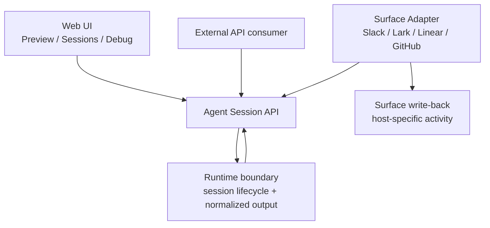
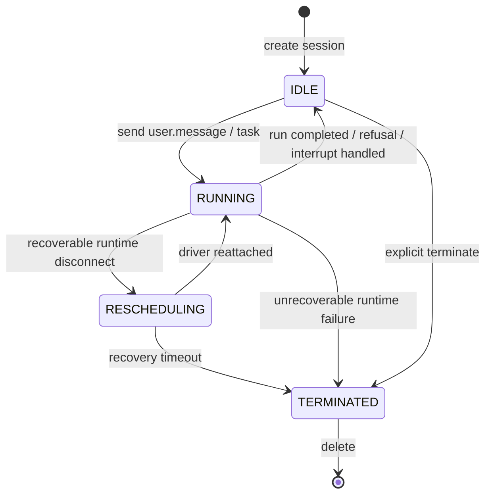

# Agent Session API · For-Human PRD

> **Source**: `agent-session-api-draft.md`
>
> **Purpose**: This is the human-readable version for PMs, designers, GTM, and reviewers — not an implementation contract. The full PRD remains the single source of truth for implementation.
>
> **One-line summary**: The Agent Session API is the Agent execution-session contract that Mosoo exposes to the Web UI, API consumers, and Surface Adapters. It consolidates the already-locked Session Execution Snapshot, Session Lifecycle, and Runtime State Operations into a single northbound contract: create, send, retrieve, transcript, diagnostics, archive, unarchive, delete, and cancel.
>
> **2026-05-27 Public Thread API Pivot**:
> [`public-task-api.md`](./public-task-api.md) v1.4 retired the standalone public `Task` wrapper layer. This PRD remains valid as the internal/implementation-layer AgentSession contract, but external developer documentation should use Thread-named routes and responses rather than Task-first or Session-first nouns.

---

## 1. TL;DR

Mosoo's value proposition is not to have every channel directly understand the OpenAI runtime / Claude / OpenCode / future runtimes. Instead, it is to turn a Published Agent into a consumable Agent Session API. The Web UI, external APIs, and Surface Adapters such as Slack / Lark / Linear / GitHub should all go through the same Session-first capability.

On top of this capability, the Public Thread API can create a Thread-backed AgentSession and an initial Run, serving as a Thread-first entry point for external developers. However, subsequent inputs, permission decisions, interrupts, archiving, deletion, cancellation, and transcript / diagnostics reads are still carried by the Agent Session API, which is the internal, lower-level axis.

This draft locks down three things:

1. **The Agent Session API answers only "how the Agent runs"**: Agent + EnvironmentRevision + Credential + Space mount plan -> AgentSession -> Run -> runtime projection.
2. **Surfaces / Channels answer only "where the Agent is dispatched"**: install, external identity, trigger, session key, write-back, and attribution belong to the Surface Deployment API, not the Agent Session API.
3. **The Web UI must also be an API consumer**: Preview / Sessions / Debug no longer use a separate internal mock or legacy run grammar; they consume the same create / send / retrieve / transcript / diagnostics / archive / unarchive / delete / cancel capabilities.

The API mental model should resemble Claude Managed Agents Sessions, but the object semantics are owned by Mosoo itself:

```text
Agent
  + EnvironmentRevision
  + Execution Actor credentials
  + Space mount plan
    -> AgentSession
      -> Run
        -> runtime projection
```

---

## 2. User Problem

Mosoo has already converged its internal execution loop in the Runtime Session Kernel PRD: the Builder can actually launch an Agent in Preview, the Driver emits a unified AG-UI stream, and the frontend displays readiness, Working, Needs approval, Stopped, and Diagnostics.

The next step is not to build yet another channel adapter, but to first externalize this session capability:

- If the Web UI, API consumers, and Surface Adapters each implement their own logic, the Published Agent has no stable consumption surface.
- If the Agent Session API leaks vendor-native resume pointers or event grammar, downstream consumers become bound to the runtime, and future multi-runtime evolution becomes impossible.
- If the Agent Session API directly includes Linear / Slack / GitHub / Lark native event content, the Runtime gets polluted by the deployment layer.
- If the API only offers "send a message" without auto-resume semantics, archive / unarchive / delete, or durable retrieval, neither channels nor the Web UI can reliably recover long-running tasks.

The jobs users actually need to get done:

1. Publish or select an Agent.
2. Create a session from the Web UI, the API, or a surface trigger.
3. Send user messages, permission confirmations, interrupts, and other events into the session.
4. Continuously read session output and render text, tools, file changes, permission confirmations, status, and diagnostics.
5. Preserve the same behavioral semantics across disconnects, archiving, deletion, recovery, and runtime errors.

---

## 3. Goals

After this round, Mosoo should be able to clearly articulate, both internally and externally:

- The Agent Session API's public resource model: Agent, EnvironmentRevision, AgentSession, Run, SessionMessage, CapabilityRegistry; vendor-native resume pointers exist only as internal recovery records.
- The public session lifecycle keeps only the states `IDLE`, `RUNNING`, `RESCHEDULING`, and `TERMINATED`; archived / deleted are not mixed into lifecycle status.
- Input events are unified as `send events`, rather than the legacy `run.start` or vendor-native commands.
- Runtime output is first projected uniformly into text, tools, permissions, files, usage, status, and diagnostics; the Web viewer consumes live state, while the public API consumes stable projections such as retrieve / transcript / diagnostics.
- The native runtime id can serve only as an internal recovery record; it never becomes a URL, public id, Manifest field, or external API id.
- Execution Actor = Agent Owner; the Caller only feeds into surface trigger, permission context, and attribution.
- Surface Adapters act as consumers of the Agent Session API and must not bypass it to drive the native runtime directly.

---

## 4. Concept Definitions

| Term                      | Product Definition                                                                                                                                                                                                                                                               |
| ------------------------- | -------------------------------------------------------------------------------------------------------------------------------------------------------------------------------------------------------------------------------------------------------------------------------- |
| Agent Session API         | The Agent execution-session contract that Mosoo exposes to the Web UI, API consumers, and Surface Adapters. It handles only how an Agent runs.                                                                                                                                   |
| Agent                     | The externally stable service identity (bare name `Agent`, consistent with Claude Managed Agents naming; replaces the historical names `AgentService` / `PublishedAgent`). The callable Agent capability surface, which may come from a draft or a published deployment version. |
| Published Agent           | A published Agent version that downstream consumers can use. When consuming it, downstream should not be aware of the builder's internal draft state.                                                                                                                            |
| AgentDeploymentVersion    | The runtime version frozen for an Agent at a given publish, containing the Product Manifest snapshot and runtime references.                                                                                                                                                     |
| EnvironmentRevision       | An immutable runtime snapshot of an Environment. New sessions use the latest selected revision; already-running sessions are not hot-swapped.                                                                                                                                    |
| AgentSession              | The business session corresponding to Mosoo's public session id. It is the source of truth — not an OpenAI runtime thread or a Claude session.                                                                                                                                   |
| Run                       | A single unit of work within a session, triggered by an input event. A user message, surface trigger, or API task typically produces one Run.                                                                                                                                    |
| Runtime output projection | The internal normalization layer for runtime output. Text, tools, permissions, files, usage, status, and diagnostics are first normalized, then routed into the Web live state, transcript, run, usage, files, and diagnostics respectively.                                     |
| Native resume pointer     | The vendor runtime's own resume pointer, such as an OpenAI runtime thread or a Claude session. It exists only in internal state / diagnostics.                                                                                                                                   |
| CapabilityRegistry        | The capabilities self-reported by the Runtime / Driver: native resume, permission bridge, usage, file watch, recoverable disconnect, MCP mode, and so on.                                                                                                                        |
| Execution Actor           | The Agent's runtime identity. Locked to the Agent Owner, used for credential resolution, Agent memory ownership, and runtime identity.                                                                                                                                           |
| Caller                    | The person, API client, or surface that triggered this session/event. The Caller influences entry-point context and permission attribution, but does not by default determine the Credential, Agent memory, or runtime identity.                                                |
| Surface Adapter           | A deployment-layer entry point such as Slack / Lark / Linear / GitHub. It converts an external trigger into Agent Session API calls and writes session output back to the host.                                                                                                  |
| SessionFile               | A copy of user-provided material attached to a given AgentSession. Its lifecycle follows that Session, and the Agent can read it in every turn for the duration of the Session. See [`session-files.md`](./session-files.md).                                                    |

---

## 5. Layering Relationships



Decisions:

- The Agent Session API is the shared consumption surface for the Web UI, External API consumers, and Surface Adapters.
- Surface Adapters must not bypass the Agent Session API to connect directly to the runtime's private entry points.
- The Web UI gets no special bypass; it consumes the same API.
- The Agent Session API does not understand the native content of a Slack thread, a Linear issue, or a GitHub PR; the Surface Deployment API converts those into Caller / context / input.

---

## 6. Resource Model

### 6.1 Public resources

| Resource               | Created by                                             | Lifecycle                                                                      | Invariants                                                                                                                                                                                       |
| ---------------------- | ------------------------------------------------------ | ------------------------------------------------------------------------------ | ------------------------------------------------------------------------------------------------------------------------------------------------------------------------------------------------ |
| Agent                  | Mosoo / Agent publish flow                             | Follows the Agent draft or published version                                   | Downstream depends only on the Agent identity; it does not read builder draft internals.                                                                                                         |
| AgentDeploymentVersion | Publish flow                                           | Immutable                                                                      | Already-created sessions are not hot-swapped by a subsequent re-publish.                                                                                                                         |
| EnvironmentRevision    | Environment save / publish flow                        | Immutable                                                                      | A session records the revision it uses.                                                                                                                                                          |
| AgentSession           | API / Web / Surface Adapter                            | create -> running/idle/rescheduling/terminated -> archive/delete               | The public id is generated by Mosoo and is not equal to the vendor id.                                                                                                                           |
| Run                    | Triggered by send events                               | started -> completed/failed/canceled                                           | An interrupt cancels the Run but does not delete the Session.                                                                                                                                    |
| SessionMessage         | User / Runtime projection                              | Follows the Session                                                            | A durable projection of the conversation transcript; not equivalent to a transient runtime delta.                                                                                                |
| SessionFile            | API consumer (Web UI / Surface Adapter / external API) | Add -> Available -> Remove; follows its Session's archive / unarchive / delete | The system is responsible for making it readable to the Agent within that Session; runtime adapters are unaware of it; the consumer does not specify a mount path; a maximum of 100 per Session. |

### 6.2 Internal-only resources

| Resource                             | Purpose                                                                      | Must never leak as                                  |
| ------------------------------------ | ---------------------------------------------------------------------------- | --------------------------------------------------- |
| Vendor native resume pointer         | The vendor-native resume pointer                                             | URL, public id, Manifest field, Surface session key |
| Rendered Native Config               | The compiled runtime configuration summary derived from the Product Manifest | The source of truth for the user's primary YAML     |
| Session runtime state / Agent memory | Runtime-local state, cache, login state, native config, agent-state memory   | The Space file tree                                 |
| Driver Health                        | Process, transport, heartbeat, capability readiness                          | A secret / credential dump                          |

---

## 7. Session Lifecycle

The Agent Session API's public states inherit the four states of the Runtime Session Kernel:

| Public status  | Meaning                                                                                           | API behavior                                                                            |
| -------------- | ------------------------------------------------------------------------------------------------- | --------------------------------------------------------------------------------------- |
| `IDLE`         | The session can accept new input; the runtime may be warm or cold                                 | `send events` can start a new Run.                                                      |
| `RUNNING`      | At least one Run is executing; may include thinking, tool, permission wait, cold start, or resume | The Web viewer receives the live projection; an interrupt cancels only the current Run. |
| `RESCHEDULING` | The runtime connection is temporarily unavailable and the platform is auto-recovering             | Input can enter the reconnect queue; on timeout it transitions to `TERMINATED`.         |
| `TERMINATED`   | An unrecoverable error or an explicit end                                                         | Only transcript / diagnostics can be read; continuing work requires a new session.      |

Non-status expressions:

| Concept                                           | How it is expressed                                                                |
| ------------------------------------------------- | ---------------------------------------------------------------------------------- |
| archived                                          | A nullable `archivedAt` timestamp (presence = archived); an archived session is read-only and does not restore the sandbox. |
| deleted                                           | A delete operation / tombstone, not an interactive status.                         |
| creating / resuming / checkpointing / hibernating | An internal phase or UI subtitle; not a public status.                             |
| needs approval                                    | A permission event + a UI pill; the Session remains `RUNNING`.                     |



---

## 8. Input Categories

### 8.1 Consumer Input Categories

| Input category      | Who sends it                            | Product semantics                                                                                                                                                                                   |
| ------------------- | --------------------------------------- | --------------------------------------------------------------------------------------------------------------------------------------------------------------------------------------------------- |
| User message        | Web UI / API consumer / Surface Adapter | A natural-language or structured task given to the Agent by a user or an external trigger.                                                                                                          |
| Permission decision | Web UI / Surface Adapter                | An allow / reject / scoped decision for a given permission request.                                                                                                                                 |
| User interrupt      | Web UI / API consumer / Surface Adapter | Cancels the current Run while keeping the Session resumable.                                                                                                                                        |
| Appended context    | Surface Adapter / API consumer          | Appends external context to the session, such as an issue summary, thread excerpt, or artifact pointer. The first slice only reserves the semantics; it is not a required input event to implement. |

### 8.2 Platform-Generated Resume

The platform may append an internal resume signal in the cold-start / resume path of Send input. It is not an input that API consumers can send manually.

Input event rules:

- All inputs enter the same session processing pipeline: they first trigger a runtime projection, then, according to their semantics, persist facts into transcript / run / usage / files, etc.
- Every input event must carry caller attribution, but credential resolution does not by default follow the caller.
- A permission decision must reference the original permission request; it cannot be handled as a standalone chat message.
- Appended context accepts only normalized context, not Slack / Lark / Linear / GitHub native content; when it is not implemented this round, it must be explicitly marked as a future Surface/API input.
- Unknown consumer events are rejected by default; future extensions must explicitly enter the API spec.
- When a User message enters the Agent Session API, the platform **automatically** attaches, to the context handed to the Agent, a manifest of all SessionFiles currently in the Session. The consumer does not need to write out paths by hand in the message; runtime adapters also do not apply any special handling. The Agent is therefore explicitly informed of the current state of the materials area on every turn, and **does not rely** on watching / polling the materials area.

---

## 9. Runtime Output Projection

The runtime output projection is an internal normalization layer, not a public cursor contract. Output produced by the Driver / File Service / diagnostics is projected onto three consumption surfaces:

- Web viewer: receives, via a live stream, the frames needed for the current view, and does not treat the viewer's transient state as durable product facts.
- Durable history: product facts such as transcript, run, usage, and files are persisted according to their semantics.
- Diagnostics: the owner/admin reads redacted execution diagnostics, which do not expose vendor-native resume pointers or vendor-native secrets.

| Projection family            | Default visibility                      | Purpose                                                                                                                                                                                                                                                                  |
| ---------------------------- | --------------------------------------- | ------------------------------------------------------------------------------------------------------------------------------------------------------------------------------------------------------------------------------------------------------------------------ |
| `session.status`             | All consumers                           | Synchronizes `IDLE` / `RUNNING` / `RESCHEDULING` / `TERMINATED`.                                                                                                                                                                                                         |
| `run.started`                | All consumers                           | Creates a unit of work.                                                                                                                                                                                                                                                  |
| `run.completed`              | All consumers                           | Wraps up the final output, usage, and artifact pointers.                                                                                                                                                                                                                 |
| `run.failed`                 | All consumers                           | Displays errors and the retry / new-session decision.                                                                                                                                                                                                                    |
| `agent.message.delta`        | All consumers                           | Streaming assistant text output.                                                                                                                                                                                                                                         |
| `agent.thinking.delta`       | Product-controlled                      | Optional thinking/planning output; whether it is shown is decided by product policy.                                                                                                                                                                                     |
| `tool.use.started`           | All consumers                           | Tool-call cards and host activity.                                                                                                                                                                                                                                       |
| `tool.use.completed`         | All consumers                           | Tool results and failure explanations.                                                                                                                                                                                                                                   |
| `tool.confirmation.required` | All consumers with a permission surface | Triggers Needs approval.                                                                                                                                                                                                                                                 |
| `file.changed`               | Web UI / Surface if subscribed          | Updates the session file tree or the Space file tree.                                                                                                                                                                                                                    |
| `session_files.updated`      | All consumers viewing the session       | The SessionFile list changed (Add / Remove / upload complete / upload failed); a Files Panel surface, if rendered, refreshes in real time accordingly. The agent chat header's Files Panel is currently removed (see `dev/prd/session-files.md` UI status note); the event remains contractual for other consumers. Distinguished from `file.changed`: the latter is an artifact written out by the runtime, the former is material uploaded by the user. |
| `usage.updated`              | Owner/Admin or allowed consumer         | Cost and usage.                                                                                                                                                                                                                                                          |
| `native.event`               | Owner/Admin debug only                  | Diagnostic vendor-native events, not exposed to ordinary users by default.                                                                                                                                                                                               |
| `machine.drift.detected`     | Owner/Admin debug only                  | The machine-observed state is inconsistent with the compiled result of the Product Manifest.                                                                                                                                                                             |

Projection contract:

- Within a single driver ingestion, projection happens in the order received; a transient delta is not a public durable contract.
- Public consumers currently cannot use a cursor to resume reading runtime events from a breakpoint; they must read the durable transcript / retrieve / diagnostics.
- The runtime does not guarantee that every vendor-native event is exposed verbatim; exposed events must first be normalized.
- Diagnostics may retain a redacted native summary, but must not output a secret or the raw NativeRuntimeRef to ordinary consumers.
- The minimal northbound implementation is projection-first: `retrieve`, transcript, and diagnostics read stable product facts; the Web UI may use the live viewer projection, but public consumers do not depend on the old viewer grammar.
- Native diagnostics that cannot be normalized may appear only as a redacted `diagnostics` event, with default `owner_debug` visibility.

---

## 10. How Web / API / Surface Consume

### 10.1 Web UI

The Web UI is a first-party API consumer:

1. When Preview opens, it reads readiness and session metadata.
2. When the user sends the first message, it creates a session or reuses an existing one.
3. The Chat panel receives the Web viewer live state and can restore history from the transcript.
4. The Approval card writes back to the same session via `permission.decision`.
5. The Sessions list uses retrieve/list/archive/delete.
6. Debug / Diagnostics only show diagnostic events within the authorized scope.
7. SessionFiles are managed via Add / Remove / List session file and subscribe to `session_files.updated` for real-time refresh; the upload-success chip is UI feedback, not an API concept. (The agent chat header's Files Panel surface is removed and the composer paperclip is the only first-party upload entry point; the underlying contract is unchanged. See `dev/prd/session-files.md` UI status note.)

### 10.2 External API

External API consumers should not have to understand Mosoo's internal Driver:

1. Create a session with an Agent.
2. Send a `user.message` or a structured task event.
3. Read retrieve / transcript / diagnostics and render the session output into their own system.
4. Manage history with archive/delete.

### 10.3 Surface Adapter

The Surface Adapter is the deployment/binding layer on top of the Agent Session API:

1. Receive a native Slack / Lark / Linear / GitHub trigger.
2. Convert it into a WorkTrigger and Caller attribution.
3. Find or create a SurfaceSessionBinding.
4. Call the Agent Session API create/send/retrieve.
5. Write session output back to the host via the ActivityBridge.
6. Retain external identity, session key, and write-back records.

The Surface Adapter must not:

- Directly store the vendor-native resume pointer.
- Directly call the OpenAI runtime / Claude native API.
- Pass the host activity schema into the Agent Session API as a first-class object.
- Let a surface caller override the Execution Actor credential by default.
