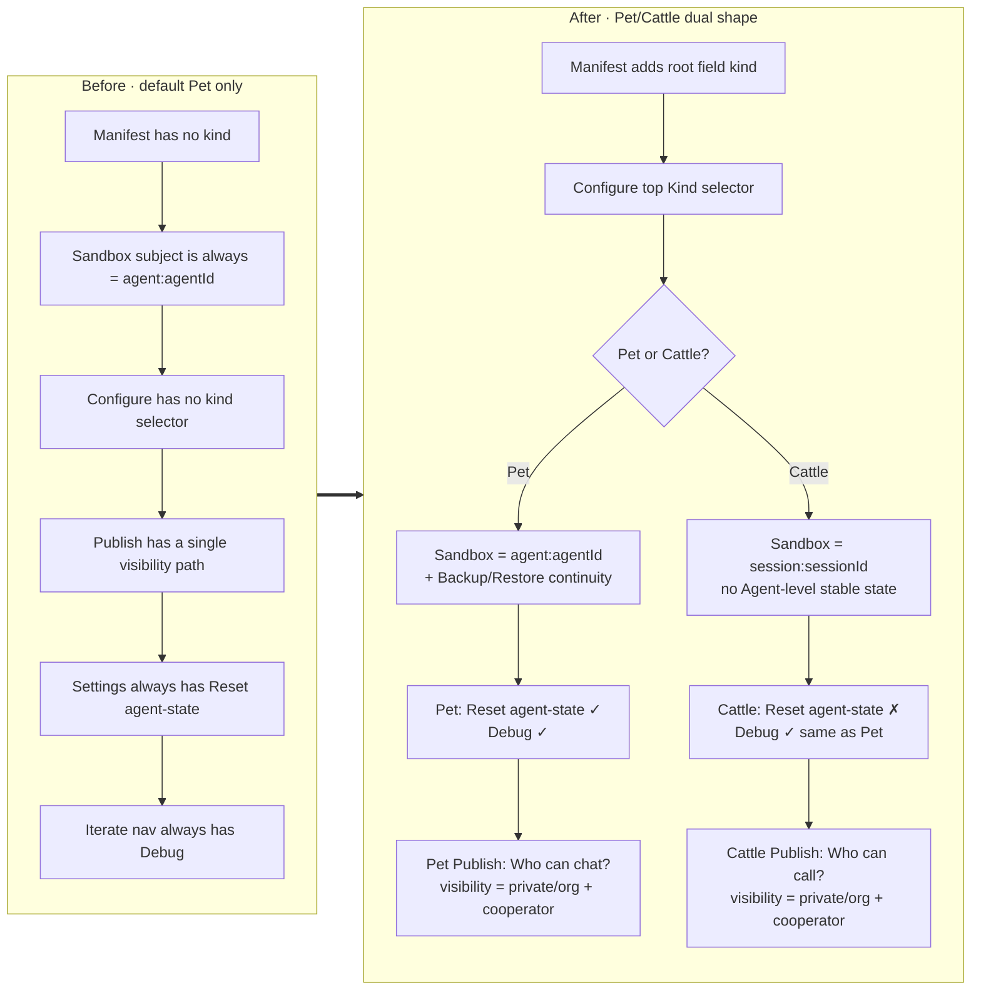
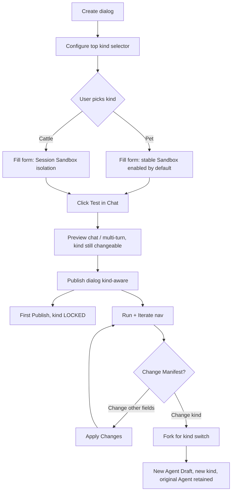
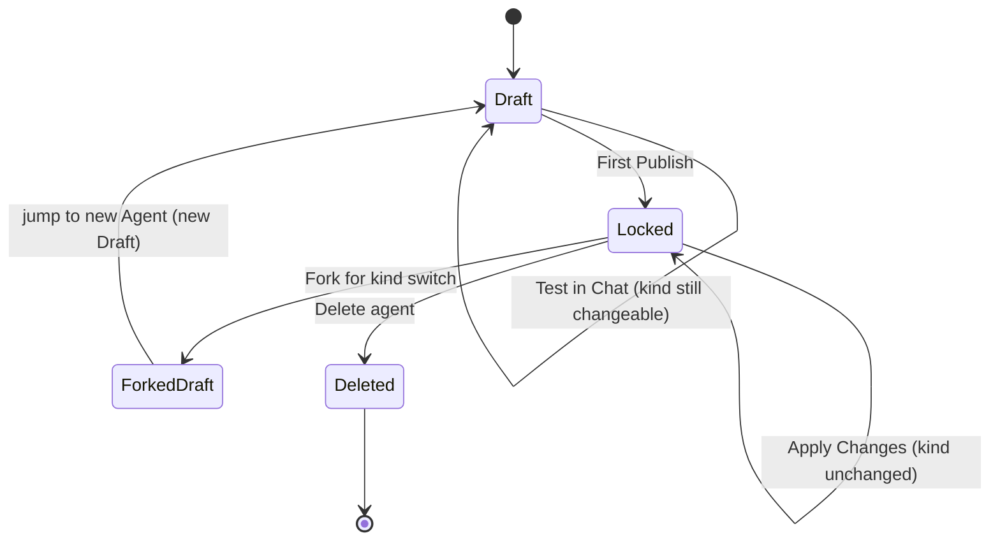

# Agent Type (Pet vs Cattle) — for humans

> This is the product-story version written for non-engineer readers.

> **UI status (2026-06-10)**: the user-facing labels in the Agent editor and the kind-fork dialog are **Assistant Agent** (kind = `pet`) and **Task Agent** (kind = `cattle`); the on-screen control is now a single-row segmented switch tab with hover tooltips, not the previous "two stacked cards / either-or toggle." The engineering-contract kind keys (`pet` / `cattle`) and the doc / API language below are unchanged. When this PRD says "Pet" or "Cattle," that is the contract term — the UI shows it as "Assistant Agent" / "Task Agent."

> **UI status (2026-06-10, creation flow)**: the `+ New agent` primary CTA no longer opens the previous **Name + Description + Runtime profile** create dialog. It now opens a launcher (`create-agent-launcher.tsx`) that takes a free-text first-message (plus a templates row and a `Start from blank` link), derives the default runtime from the Organization's configured vendor credentials (`runtime-default.ts` reads them via `useVendorCredentialsQuery(organizationId)`), silently creates an `Untitled agent` draft via the existing `createAgent` mutation, and auto-sends the stashed first message to Agent Builder once the submit gate opens. The Configure-page kind selector (Pet/Cattle), the kind lock at first Publish, and the Fork-for-kind-switch path described in the user journey below are unchanged; only the upstream "fill in Name / Description / Runtime profile" framing in the §"User journey" Create row is stale — read that row through this banner.

---

## In one sentence

Mosoo splits Agents into two **kinds**:

- **Pet** (UI label: **Assistant Agent**) — a stable, companion-style agent: "like a coworker or co-pilot" that remembers what you talked about before and what you set up together.
- **Cattle** (UI label: **Task Agent**) — an industrial, task-style agent: "like a disposable worker" that gets a clean environment for every task and is torn down once the run finishes.

The Builder explicitly chooses the kind when creating an Agent (today the product surfaces this as a single-row segmented switch tab with hover tooltips on each option; the UI/UX may evolve later). **The kind is locked after the first Publish**; to switch, you Fork into a new Agent.

> This is a product-shape decision, not an internal engineering toggle. Pet / Cattle is the single engineering-contract naming scheme; the user-facing surface today re-labels them as "Assistant Agent" / "Task Agent" but the contract keys are unchanged — analogous to Dify's "Workflow vs Chatflow".

---

## The user problem

Mosoo currently runs every Agent on a long-lived sandbox by default (the Pet shape). That fits "team assistant / knowledge keeper / personal co-pilot" scenarios where the agent provides ongoing companionship, but it is completely unsuited to high-concurrency, short-task scenarios like "PR auto-review / Linear assign / batch jobs":

- A long-lived sandbox hits the container concurrency ceiling under dozens of invocations per second.
- Every invocation is forced to reuse the same sandbox state, so calls easily contaminate one another.
- Billing is computed per-Agent slot, which does not match the "pay per invocation" expectation users have.

But switching exclusively to Cattle (one independent, short-lived sandbox per session) would lose the core emotional value of "the agent is like my coworker and remembers that we discussed X" — Mosoo's key differentiator.

**The real problem**: the Builder needs to distinguish these two shapes at Agent-creation time. A wrong choice cannot be switched in place, because the sandbox lifecycle boundary is both an engineering decision and a product decision, so it must go through a Fork.

---

## Goals

When this is done, the Builder should be able to:

- **U1**: clearly distinguish a "resident coworker" (Pet) from a "task worker" (Cattle) at Agent-creation time.
- **U2**: see the kind selector at the top of Configure at a glance, alongside a one-line scenario description and a comparison table — and choose correctly without relying on external docs.
- **U3**: switch the kind freely before the first Publish; after Publish the kind is locked and switching requires a Fork.
- **U4**: see the Locked state and the Fork path on a published Agent, feeling exactly consistent with the existing published-Agent configuration lock.
- **U5**: see kind-aware content in the Iterate phase (Logs / Cost / Settings / Debug), while 90% of the Studio shape is shared.
- **U6**: have API consumers consume both kinds through the same session product semantics; the only difference shows up in sandbox lifecycle and state continuity.

---

## Concepts

| Term                       | Meaning                                                                                                                                                                                                                                                                         |
| -------------------------- | ------------------------------------------------------------------------------------------------------------------------------------------------------------------------------------------------------------------------------------------------------------------------------- |
| **Agent**                  | The bare name for Mosoo's outward-facing product entity. draft / published are states of an Agent, not separate entities.                                                                                                                                                       |
| **Kind**                   | The product shape of an Agent: `pet` / `cattle`. Chosen by the user at creation time (defaults to Pet) and locked after the first Publish.                                                                                                                                      |
| **Pet**                    | A stable, companion-style Agent. One Agent owns one stable, persistent Sandbox, and multiple Sessions reuse that same Sandbox; suited to long-term companionship.                                                                                                               |
| **Cattle**                 | An industrialized, session-style Agent. Each Session gets its own Session Sandbox, and the Sandbox itself is the Session boundary; suited to high-concurrency, repeatable tasks.                                                                                                |
| **Space**                  | A user-managed, shareable, long-lived file / knowledge space. Both Pet and Cattle can mount it; content written to a Space persists across Sessions / Sandboxes.                                                                                                                |
| **Non-Space state**        | Content outside a Space follows sandbox semantics: for Pet it stays in the stable Sandbox; for Cattle it disappears when the session ends, unless explicitly persisted.                                                                                                         |
| **Cattle continuation**    | A user can resume an old Cattle Session; if the old Sandbox has already been destroyed, the platform creates a new Session Sandbox that inherits only the conversation history and explicitly persisted content — not the old Sandbox's temporary files / caches / login state. |
| **Kind lock**              | The first Publish makes the kind field immutable; during the Draft phase (including after Test in Chat) the kind can be switched freely; after that, switching the kind requires a Fork.                                                                                        |
| **Fork (for kind switch)** | Creates a new Agent identity (with the new kind). The original Agent's sessions / cost / logs stay on the original Agent and are not migrated.                                                                                                                                  |
| **Lock banner**            | A yellow inline banner that mirrors the existing published-Agent configuration lock, telling the user "Agent type is locked, Fork to switch".                                                                                                                                   |

---

## User journey

| Stage                          | What the Builder is doing                                                                    | What they see                                                                                     | Mood         |
| ------------------------------ | -------------------------------------------------------------------------------------------- | ------------------------------------------------------------------------------------------------- | ------------ |
| Create                         | Click "+ Create agent" → fill in Name / Description / Runtime profile                        | Create dialog (**does not expose kind**, to avoid an entry barrier)                               | Anticipation |
| Pick kind                      | Enter the Configure page; see the Assistant Agent (Pet) / Task Agent (Cattle) switch tab + Compare types ▾ at the top | A segmented switch tab with hover tooltips (tagline + description + examples) per option + comparison table                                     | Learning     |
| Configure                      | Fill in Identity / Model / System Prompt / Skills / MCP                                      | Standard Studio shape (shared by Pet/Cattle)                                                      | Smooth       |
| Test                           | Click "Test in Chat" → enter Preview                                                         | Multi-turn conversation; **kind can still be switched freely during Draft**, with no side effects | Anticipation |
| Publish                        | Click "Publish" → choose visibility                                                          | Single-step dialog: Pet copy says "Who can chat?", Cattle copy says "Who can call?"               | Decisive     |
| Run                            | View sessions / Logs / Cost / Debug                                                          | Both have consistent nav (Dev / Preview / Logs / Cost / Debug ▾)                                  | In control   |
| Discover a wrong choice        | Click the locked kind card                                                                   | Fork confirmation: clearly lists ✓ what carries over / ✗ what is lost / ⓘ what stays in place     | Alert        |
| Change your mind (pre-Publish) | Switch the kind directly                                                                     | No confirmation, free switch, including after Test in Chat                                        | Smooth       |

---

## Information architecture (Before / After)

---

## Product flow from creation to lock

---

## Lifecycle states of the kind

**Things to remember**:

- The kind can be changed at will during the Draft phase (including after Test in Chat).
- The first Publish is the decision point (the kind gets locked).
- After Locked, there is only one way to switch the kind: Fork.
- A Fork produces a **new Agent identity**; the original Agent's sessions / cost / logs are **not migrated** and stay in place.
