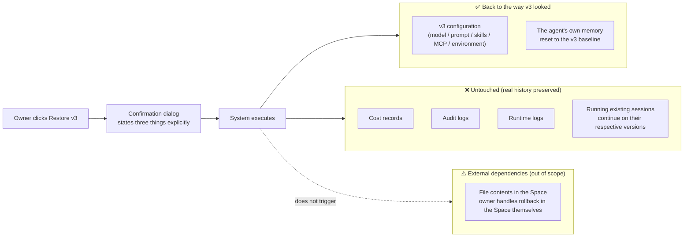
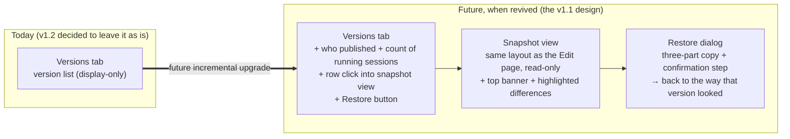

# Agent Versions — for humans

> This is the product-story version written for non-engineer readers. For the full engineering contract, the three-tier implementation playbook, and the criteria for deciding when to revive this work, see the complete PRD.
>
> **Current status: 🚫 Deferred from M2X (decided 2026-05-18).** This document covers two things: (1) what we wanted to build and how (the v1.1 design snapshot); and (2) why we are not building it this time.

---

## One-line positioning

Upgrade the **Versions tab** on the Agent Page from a "list of versions you can look at" into a **time machine**: click into any version to see what the agent looked like at that point (read-only), and press "Restore" to roll the entire agent back to that version — the kind of experience **Vercel's deployments page** offers, where "yesterday's deployment is still there and you can promote it back."

> **Reference shape (Vercel):** one row per deployment; click in to see the complete snapshot of that version; "Promote to Production" rolls back in a single click. The Versions tab aims to be the agent-equivalent of that.

---

## Why we are not building it this time (the v1.2 deferral decision)

In short: **we assumed there was a "looks broken" experience that needed fixing, and then discovered there was no such thing.**

- The v1.1 draft repeatedly cited the claim that "the Versions tab currently shows an awkward `Rollback is not available — clone or re-publish` banner; the experience is bad and needs fixing."
- When we actually searched the code, **that banner does not exist anywhere in the UI a user can see** — it was only a mock-screenshot description from some old PRD that kept getting cited, and it never made it into the real product.
- The Versions tab as it stands today is a clean version list. Its header reads "New sessions use the live version. Existing sessions keep their pinned execution binding." — it already looks finished, with no sense of being incomplete.

On top of that:

- With a 4-week launch window and 3 engineers, **Terminal / Logs / Files are the capabilities the ops surface actually lacks**.
- The "what if we publish the wrong version and need to roll back" case has no real evidence of frequency pre-launch (and if it does happen, a quick shout in Slack and we roll it back by hand).
- Applying Musk's "delete 10% then add it back" test to the 10 scope items in v1.1: 9 of them would not be added back after deletion — a sign of over-engineering.

So: **the v1.1 design is frozen and kept on the shelf, to be picked back up when a real signal appears.** The Versions tab UI does not change by a single character.

---

## 1. User problem (to solve when revived)

Agent owners have real pain in two kinds of scenarios — but **there is currently no evidence that either occurs frequently in the first month after launch**:

### Scenario A: routinely reviewing "what changed when v5 was published"

- Today you only see a one-line summary ("Skills + 2 · MCP server added").
- You want to know exactly which skill changed, whether the prompt was touched, whether the model was changed → you can't see it.
- You want to know who published it → you can't see the actor; you have to go search the Audit page yourself.

### Scenario B: v5 broke and you need to roll back immediately

- Today there is no Restore button.
- To recover, you either fork the agent (which breaks all channel bindings) or go into the Edit form and retype the v3 fields by hand (a prompt that is hundreds of lines long is easy to mistype).
- There is no "press once → back to v3" path.

---

## 2. Goals (the promise when revived)

Once done, an owner should be able to:

- See a reverse-chronological list on the Versions tab — each row carrying two extra fields: **who published it** + **how many sessions are still running on this version**.
- **Click any row to enter a "snapshot view"** — seeing the complete configuration of that version (model / prompt / skills / MCP / environment bindings), all read-only, with the parts that differ from the current live version highlighted.
- **Press "Restore this version" + a confirmation step** → the entire agent returns to the way it looked at that version (including the agent's own accumulated memory).

---

## 3. Concept definitions

| Term                                  | Meaning                                                                                                                                                                                              |
| ------------------------------------- | ---------------------------------------------------------------------------------------------------------------------------------------------------------------------------------------------------- |
| **Version (DeploymentVersion)**       | The configuration snapshot left behind by one publish. New sessions use this version from then on; existing sessions keep their respective original versions.                                        |
| **Live Version**                      | The version currently used for new sessions. There is only ever one at a time.                                                                                                                       |
| **Snapshot view (frozen view)**       | The read-only page you reach by clicking a version row — it reuses the layout of the Edit page, but all inputs are disabled.                                                                         |
| **Restore (rollback / time machine)** | Select an old version → the system creates a new live version that copies the configuration from that time + resets the agent's own accumulated memory back to its initial state at that time.       |
| **The "time machine" principle**      | From the user's point of view, the agent is 100% back to the way it was (configuration + memory); records that belong to the observer's point of view (cost / audit / logs) keep their real history. |
| **Session pinning**                   | A session is bound to the live version that was current when it was created; this binding **never changes**. Restore does not switch sessions that are already running.                              |

---

## 4. The relationship lock: what Restore does and does not do

**Key boundaries:**

- **Everything from the user's point of view is rolled back** (configuration + agent memory).
- **Everything from the observer's point of view is preserved** (cost / audit / logs = "things that actually happened").
- **External dependencies are untouched** (the Space has its own file versioning system).
- **Running existing sessions are not switched** (this is a feature, not a bug — a customer's experience must not be interrupted midway).

---

## 5. User journey map

| Stage                   | What the owner is doing                             | What they see                                                                                                   | Mood           |
| ----------------------- | --------------------------------------------------- | --------------------------------------------------------------------------------------------------------------- | -------------- |
| Routine review          | Wants to see what changed in v5 after publishing    | Reverse-chronological list, each row carrying actor + count of running sessions                                 | Neutral        |
| Entering snapshot view  | Clicks the v4 row                                   | Same layout as the Edit page, all inputs read-only, parts that differ from the current live version highlighted | Neutral → high |
| Spotting the difference | "v4 is missing that new skill compared to v5"       | The highlight makes it obvious at a glance, no need to compare side by side                                     | Smooth         |
| Discovering v5 broke    | User feedback: "the agent is answering incorrectly" | Goes to Versions to find v3                                                                                     | Anxious        |
| Restore                 | Clicks v3 → confirmation → "Restore"                | The dialog clearly states three things (what is rolled back / what is not / running sessions are not switched)  | Neutral → high |
| Done                    | Toast: "Rolled back to v3 (now v6 live)"            | v6 appears at the top of the list                                                                               | Reassured      |

---

## 6. Information architecture (Before / After)

**Very few things change:**

1. The Versions list rows gain **two extra fields** (actor + count of running sessions).
2. Rows become clickable → into the **snapshot view**.
3. The snapshot view has a **Restore button** in the top right (only on non-live rows).
4. The Restore dialog → the system executes the rollback.

**Everything else (the overall list layout, the Edit page itself, Logs / Cost / Preview / Audit Log) is completely unchanged.**

---

## Understanding the boundaries at a glance

This product has several kinds of "logs / history / versions." Do not mix them up:

| What you want to know                                             | Where to look                                                                  |
| ----------------------------------------------------------------- | ------------------------------------------------------------------------------ |
| Who performed what mutation (publish / share / fork / login …)    | **Audit Log** (top navigation)                                                 |
| What a given session did (messages / tools / permissions / files) | **Logs tab** → select session                                                  |
| What recently happened on this agent's machine                    | **Debug → System Log** (a separate PRD, [for-humans](./agent-runtime-logs.md)) |
| An agent's historical versions + rolling back to an old version   | **Versions tab** (**this PRD, currently deferred**)                            |

---

## When we will pick this back up

We will not pick it up just because an engineer's gut says "it's time." The specific trigger conditions are in §19 of the full PRD; the three key ones are:

- **≥ 3 independent owners** complaining in Slack / Issues about the missing rollback.
- **≥ 1 production incident** amplified by the lack of rollback (slow owner reaction → the customer perceives bad behavior persisting for > 30 min).
- **The support team is asked ≥ 5 times/week** to "switch my agent back to an old version."

**Reverse trigger:** if after 6 months the Versions tab has MAU ≤ 5% and there are no rollback tickets → we instead **delete the Versions tab itself**.

---

> Full engineering contract + three-tier implementation playbook (Skim ~0.5 day / Light ~2 days / Full ~4–5 days) + repo-ready asset checklist: see the complete PRD.
