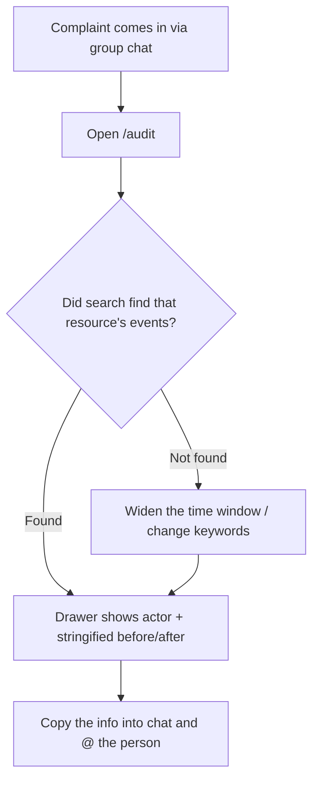
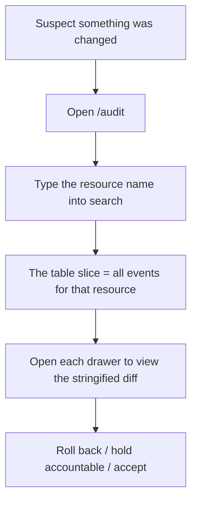

# Audit Log PRD (v3)

> **Status**: v3 (rewrite from v2) · **Last updated**: 2026-05-16 · **Owner**: Evanchen
>
> **Why this rewrite** — This is not an ROI recalculation (most of v2's functionality is already implemented in code); it is about **closing out experience uncertainty**. The feature surface that v2 locked in (per-field shape rendering, contextual chips, 4 metric cards, 8 URL state params, a 5s SLA, regex-based sensitive-data detection) could not be confidently shown to be the experience customers actually need; the larger the surface, the more diluted the identity signal becomes. A Day-1 admin's sense of "this is what the tool is" comes from the shapes an admin tool is supposed to have (a top-level nav entry, a 6-column table, denied events standing out, a retention banner, CSV export, and an `api_key` chain of accountability) — not from how finely diffs are rendered. **The PRD is being slimmed down in lockstep with the code**: uncertain functionality is pulled back so that the Day-1 surface is narrow enough and clear enough.
>
> v3 supersedes v2; v2 is not archived separately and lives on in git history.
>
> The data schema, write path, query contract, and retention policy are owned by [`architecture.md`](../architecture.md) §8 Audit Service. This PRD does not repeat them and only locks down user-visible behavior.

---

## User Problem

When administering the Mosoo organization, admins run into situations like these but **cannot find the root cause or the responsible person**:

- "Last Wednesday the customer-support agent suddenly started spouting nonsense — did someone change its prompt? Who?"
- "The OpenAI company credential got swapped at some point, causing a batch of agents to return 401 — who swapped it?"
- "Sarah says she never touched the agent's config, but the agent's behavior changed — is it really true that nobody touched it?"
- "The admin who just joined kicked someone out — who, and when?"

Today Mosoo has no admin-accessible "record of control-plane changes" — admins can only guess or ask everyone.

---

## Goals

Enable admins to investigate efficiently in two scenarios:

- **A. Find the person**: the admin already knows that something happened to a particular resource (agent / credential / member / mcp / space / environment / org settings) and needs to immediately find out **who touched it and when**, so they can @ that person.
- **C. Reconstruct the scene**: the admin needs to see the **before vs. after** of that change in order to decide whether to roll it back, hold someone accountable, or let it go.

---

## Concept Definitions

| Term                       | Definition                                                                                                                                                                                                                                          |
| -------------------------- | --------------------------------------------------------------------------------------------------------------------------------------------------------------------------------------------------------------------------------------------------- |
| **Audit Event**            | An immutable record of a control-plane change that answers "who did what to which resource at what time, and what was the outcome"                                                                                                                  |
| **Control-plane mutation** | An admin operation within the closed set of 11 verbs on control-plane resources                                                                                                                                                                     |
| **Channel-agnostic**       | The same control-plane mutation enters the audit log **regardless of which entry point triggered it** (web UI / a future Mosoo CLI / calling GraphQL directly with an API key); the coverage an admin sees is independent of the triggering channel |
| **Actor**                  | The entity that initiated the operation (Day-1: `user` or `api_key`)                                                                                                                                                                                |
| **Owner**                  | The human behind the actor. For a `user`, the owner is the person themselves; for an `api_key`, the owner is that key's owner                                                                                                                       |
| **Outcome**                | A tristate: `success` / `failure` / `denied`. `denied` carries the highest visual weight                                                                                                                                                            |
| **Before / After**         | The object's state before and after the change, in a **uniformly stringified** form; sensitive fields are always `[redacted]` (determined by schema markers)                                                                                        |
| **Verb**                   | A closed set of 11; the action name is `{resource}.{verb}`; TypeScript types block any new verb                                                                                                                                                     |
| **Retention**              | ~30 days in the open-source edition; events past their retention are cleaned up automatically; the cleanup action itself is not written to the audit log                                                                                            |
| **Resource Display**       | A human-readable name for the resource object ("customer-support agent"); stored redundantly so that old events remain readable after the resource is deleted                                                                                       |

---

## User Journey Map

### Use case A · Find the person

| Phase              | User Actions                                                                               | Touchpoints           | Emotion        |
| ------------------ | ------------------------------------------------------------------------------------------ | --------------------- | -------------- |
| 1. Trigger         | Someone in the group chat yells "agent X is broken / how did this credential get swapped?" | Slack / internal chat | -1 anxious     |
| 2. Enter           | Click `Audit Log` in the sidebar                                                           | Top nav               | 0 neutral      |
| 3. Locate          | Type a resource / actor / action keyword into free-text search                             | Filter bar            | +1 found it    |
| 4. Gather evidence | Open the drawer, look at the mechanical triple + stringified before/after                  | Drawer                | +2 confirmed   |
| 5. Close the loop  | Copy the actor + time into chat: "@Sarah you changed this yesterday at 14:30, right?"      | External chat         | +2 loop closed |

### Use case C · Reconstruct the scene

| Phase          | User Actions                                                      | Touchpoints       | Emotion         |
| -------------- | ----------------------------------------------------------------- | ----------------- | --------------- |
| 1. Suspicion   | The admin suspects an agent / credential was changed              | In their own head | 0 neutral       |
| 2. Enter       | Click `Audit Log` in the sidebar                                  | Top nav           | 0 neutral       |
| 3. Slice       | Type the resource display into free-text search                   | Filter bar        | +1 sliced       |
| 4. Reconstruct | Open each drawer one by one, look at the stringified before/after | Drawer            | +2 seen clearly |
| 5. Decide      | Decide to roll back / hold accountable / accept                   | External decision | +2 loop closed  |

---
