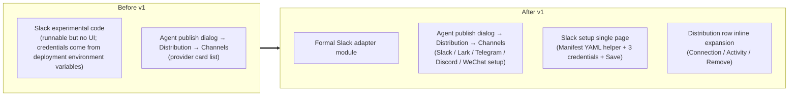

# Channels — for human

> The Channels product story for non-engineers. For the full engineering contract, see the complete Channels PRD.
>
> **UI status (2026-06-05)**: the "Distribution → Channels" sub-zone inside the Agent Publish Settings dialog described below is the target information architecture. Today, the Distribution panel exposes Threads and API Access cards plus a `Coming soon` Channels card, and the actual Channel setup forms live in the **Agent Editor → Environment → Channels** section. Phrases below such as "Distribution row" or "row inline expansion" describe the target interaction; the current shipping UI uses a sidebar list + detail view in the editor.

---

## One-line positioning

Let a Published Agent show up **as a bot** on external collaboration platforms. The v1 owner-facing setup providers are Slack, Lark / Feishu, Telegram, Discord, and personal WeChat. Discord already has a setup form plus a backend relay / Gateway connection slice; personal WeChat already has QR setup, a scheduled poll-once owner lifecycle, encrypted account/context persistence, and stored-context final delivery. A live smoke test against real external Discord / WeChat accounts has not yet been recorded, so until it runs we cannot claim it is live-verified. An external team can use the bot simply by `@`-mentioning it or DMing it, and the bot writes the answer back into the same thread — **nobody needs to log in to the Mosoo Web app**.

Here, `functional` describes the product / backend path, not a claim that this repository has recorded a real external-account smoke test. Until a live smoke test against a real account has run, we do not treat unit tests or mocked provider APIs as live provider proof.

Analogy:

> Think of GitHub's PR assistant bot or Linear's Cycle bot. It is still the same Agent — it just gains one more "summoned to the scene" entry point.

---

## 1. The user problem

After an Agent owner publishes an Agent, here is what they often say:

- "I published this Agent — can I make it trigger when someone `@`-mentions it in our Slack `#growth` channel?"
- "I can't figure out Slack scopes — **can't I just paste in a manifest?**"
- "Slack is already connected — can I just swap in a different Agent to take over this bot?"

And here is what external collaborators (Slack users) say:

- "`@mosoobot read this PR and give me a summary`" — they expect to see a working indicator within 30 seconds and the full reply within tens of seconds to a few minutes.
- "Now list three risks for me" — they expect to keep asking in the same thread, with the bot aware of the context.
- "When I pull the bot into a thread to discuss with a coworker, the bot should not leak internal Mosoo org information."

**Current state**: Slack / Lark / Telegram / Discord / WeChat have all entered the Distribution → Channels setup path. In the same area, the owner pastes credentials, runs Lark's scan-to-create prefill, or uses WeChat QR pairing to save a per-Agent binding. Discord already has a backend relay + Gateway scaffold + runtime-state/owner harness + a `ChannelConnection` Durable Object boundary. Personal WeChat already has a backend QR pairing mutation, the `wechat` provider enum, QR-confirmed → channel binding + internal account runtime persistence, an iLink HTTP client, a scheduled poll-once owner lifecycle, encrypted account/context persistence, and a stored-context reply path. Real external-account smoke tests for Lark / Feishu, Telegram, Discord, and personal WeChat still need to be recorded separately per the runbook; until that is recorded, Discord / WeChat count only as setup-enabled, not live-verified.

---

## 2. Goals

### What the Agent owner can do

- See Slack / Lark / Telegram / Discord / WeChat setup cards in the **Agent Publish Settings → Distribution → Channels** sub-zone
- Click `Connect` on Slack to enter the single-page setup, follow the one-click-copy manifest YAML at the top, and **finish connecting Slack within 5-10 minutes**; for Lark, use scan-to-create to prefill the App ID / Secret and then fill in the webhook fields; for Telegram / Discord, paste the platform credentials; for WeChat, go through QR pairing
- After configuring, see `Active · @mosoobot · Growth HQ` on the row
- Expand the row day to day to see the 7-day session count + last triggered ("is this bot still in use?")
- When credentials expire, see `Error · Bot token expired` at a glance, then click Remove + re-Add and **fix it within 1 minute**
- To swap Agents: Remove first, then create a new one and paste the credentials again — about 1 minute

### What external collaborators (Channel users) can do

- Trigger the bot inside a Slack / Lark / Telegram thread and **immediately see a working indicator or a native platform reply**
- See the full reply appear in the same thread within tens of seconds to a few minutes (Slack can rewrite the working message; Lark / Telegram present it as a native reply / new message. Discord / WeChat already have setup and backend paths, but a successful setup, a relay fixture, or a QR fixture must not be treated as live delivery proof)
- Ask a follow-up like `now give me the risks` in the same thread, and **the bot automatically continues the same Session** and remembers the context
- Have the trigger recorded in Session metadata / Logs, while **never** being automatically counted as a Mosoo member and **never** entering any user's private Web Threads

### The product promise for future channels

- The current setup providers are Slack / Lark / Telegram / Discord / WeChat; Lark and Feishu are the same provider, and the regional difference is the binding credential
- Both Discord and personal WeChat have already been proven feasible in the reference. This round, Discord adds the setup UI, the backend relay slice (internal enum / binding mutation / relay-signed callback / REST writeback), a testable Gateway protocol / relay / health scaffold, a `channel_runtime_state` persistent lease/health/resume-state, a deterministic owner harness, a `ChannelConnection` Durable Object runtime, a scheduled reconciler, a heartbeat ACK watchdog, and fatal-close binding error mapping; it still lacks a real bot-token smoke test under the Cloudflare runtime. This round, personal WeChat is built out to QR setup + backend QR pairing registration (the `wechat` provider enum + QR start/poll mutation + a pending pairing token hash table + confirmed QR → `agent_channel_binding`), an internal iLink client + a scheduled poll-once owner lifecycle + encrypted runtime persistence. With fixtures we can already prove that QR-confirmed credentials enter the vault, that the `getupdates` cursor/runtime state can be recovered, that the per-peer `context_token` is encrypted and saved, that a DM trigger enters the shared channel session spine, and that final delivery must read the stored token; but a real QR/account smoke test is still needed. Personal WeChat should first be viewed as a DM-first surface; whether ordinary WeChat group events are delivered reliably needs verification against a real account.
- Adding a new channel **will not** change already-shipped product behavior such as the existing Slack binding / Web Threads / Logs

---

## 3. Concepts + relationship locks

### A few terms

| Term                        | Plain-language definition                                                                                                                                                                                                                                                                                                                                                                                                                                    |
| --------------------------- | ------------------------------------------------------------------------------------------------------------------------------------------------------------------------------------------------------------------------------------------------------------------------------------------------------------------------------------------------------------------------------------------------------------------------------------------------------------ |
| **Channel**                 | A type of external collaboration platform. The current owner-facing setup providers are Slack / Lark / Telegram / Discord / WeChat; Discord is a setup-enabled backend relay + Gateway scaffold + runtime-state/owner harness + Durable Object runtime; personal WeChat is a setup-enabled backend-registered QR pairing + iLink client + scheduled poll-once owner lifecycle. Discord / WeChat live-verified status still awaits a real-account smoke test. |
| **AgentChannelBinding**     | One Agent + one channel provider = one binding. It expresses "Agent X accepts messages as a bot on Slack / Lark / Telegram." **Isolated per Agent**: if one external bot wants to serve multiple Agents, create multiple bots/apps on the corresponding platform or configure them separately.                                                                                                                                                               |
| **Distribution / Channels** | A section within Agent Publish Settings. It contains three sub-zones: Web Threads / API Access / Channels. **A Channel is a configuration item** (a set of fields + status), at the same level as the Web toggle / API token; it is not a standalone setup wizard.                                                                                                                                                                                           |
| **Triggered_by**            | The "source fingerprint" recorded on the Session triggered by a Channel: which platform, which workspace, which external user, which external message, which event id. Session UI / Logs can show "Slack #growth · @alice · 12 seconds ago."                                                                                                                                                                                                                |
| **Binding status**          | Only `Active` (normal) / `Error` (credentials expired). There is **no** pause / soft-delete / 30-day retention; once deleted, it is gone, and to restore it you re-paste the credentials.                                                                                                                                                                                                                                                                    |

### What changed and what didn't

```mermaid
flowchart LR
  subgraph Unchanged["Unchanged"]
    A1["Agent configuration (Skill / MCP / Space / Env)"]
    A2["Public Thread API contract"]
    A3["Owner Shadow execution model"]
    A4["Session trigger metadata"]
    A5["Web Threads (channels do not project into them)"]
  end

  subgraph New["New in v1"]
    N1["Slack / Lark / Telegram first-party adapters"]
    N2["binding + event receipt + thread-session reservation"]
    N3["Distribution / Channels functional cards"]
    N4["Provider-specific setup panels"]
    N5["Session source fingerprint (triggered_by)"]
  end

  Unchanged ==> New
```

---

## 7. User journeys

### Owner onboarding

| Stage             | Action                                               | Current pain point                    | v1 experience                                                                                |
| ----------------- | ---------------------------------------------------- | ------------------------------------- | -------------------------------------------------------------------------------------------- |
| Decide to connect | Want the Slack team to use the Agent                 | Don't know where to start             | Agent Publish Settings → Distribution → Channels card grid stands out                        |
| Create Slack App  | Go to api.slack.com and create an App                | Many scopes, ~30 minutes of fumbling  | **One-click copy the Manifest YAML** and paste it into Slack, skipping the scope checkboxes  |
| Paste credentials | Copy Bot Token / Signing Secret / Optional App Token | Fields are error-prone                | masked input + inline help per field + immediate validation against Slack on Save            |
| Day-to-day upkeep | Check whether the binding is still alive             | "Is this bot still in use?"           | Expand the Distribution row to see the 7-day session count + last triggered                  |
| Failure           | The bot stopped                                      | Don't know why                        | Red Error banner + error code → Remove → re-Add (1 minute)                                   |
| Swap Agents       | Want the bot to take over another Agent              | "Do I have to delete and rebuild it?" | v1: delete and rebuild (paste credentials again, ~1 minute). Bulk re-binding is pushed to v2 |

### External user usage

| Stage                        | User experience                                                                                  |
| ---------------------------- | ------------------------------------------------------------------------------------------------ |
| First `@bot`                 | Immediately see a "Working on it..." indicator                                                   |
| Waiting for the answer       | Tens of seconds to a few minutes; working indicator → full reply (the same message is rewritten) |
| Follow-up in same thread     | The bot automatically continues the same Session and remembers the context                       |
| New question in a new thread | The bot treats it as a new conversation (the thread is the session boundary)                     |

## 9. Information architecture (before / after)

---
