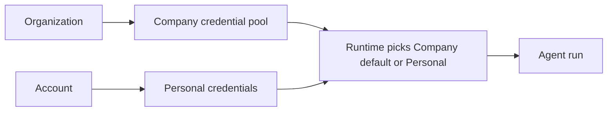
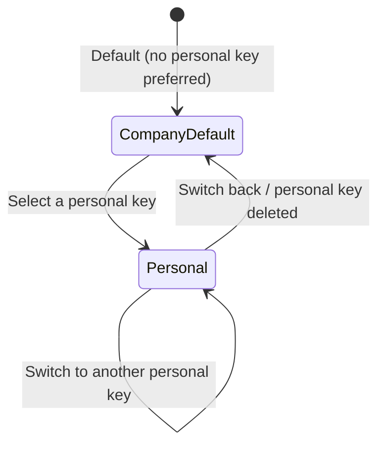
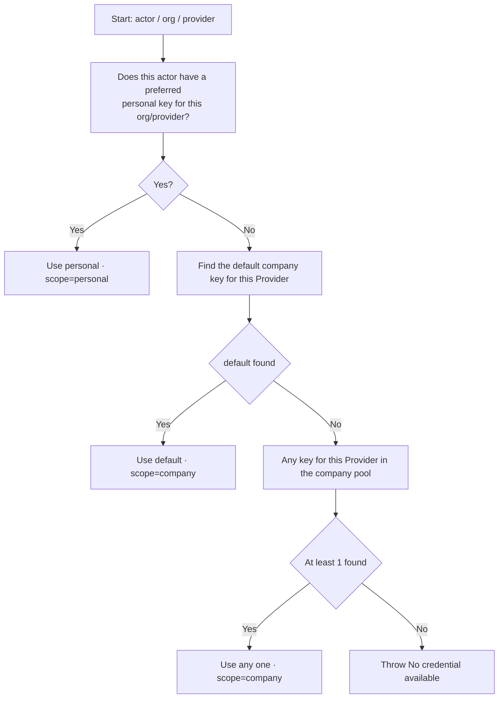

# Credentials — for humans

> The Credentials product story for non-engineers. For the **complete engineering contract**, see the shipped Credentials PRD.

---

## One-line positioning

Let both kinds of role in an organization comfortably connect "their own LLM credentials" to Mosoo:

- **Admins** configure a **company key pool** so that every Agent in the organization has a key available by default.
- **Members** can **bring their own key (BYOK)**, using their own subscription or department key to run specific Agents on their own, with the bill charged to them.

When an Agent runs, the system automatically picks "which key this person should use right now on this Provider" by following one simple rule, so users never have to agonize over which of several company keys to use.

Analogy:

> Like company Wi-Fi. The admin sets up the "shared company Wi-Fi" that everyone can connect to by default; anyone who wants to use their own mobile hotspot can switch over at any time, and switching back to company Wi-Fi next time is just as easy. The system remembers your last choice, and it won't kick you off midway.

---

## 1. User problems

**Admins** often say:

- "I want to configure the company's OpenAI / Anthropic keys so the whole team can run Agents without everyone having to bring their own key."
- "Some people will want to run Agents on their own Claude Pro quota, so they can just add their own key."

**Members** often say:

- "I have a personal OpenAI subscription and want to run Agents on my own quota without consuming the company pool."
- "After I add my own key, it should be used immediately, not require me to go tick a box in some settings page."
- "There are several keys in the company pool — how would I know which one to pick? Just let the admin decide."

**At Agent runtime**, all the system wants to do is one thing:

- "Give me `(whose identity, in which organization, using which Provider)`, and just tell me which available key to use right now."

---

## 2. Goals

### What admins can do

- Configure company keys in `/providers` (Provider, name, API Key, optional custom endpoint)
- Mark a company key as the **default**, making it the default choice for that Provider
- Edit and delete company keys (deletion is a hard delete — the secret is destroyed immediately)

### What members can do

- Add their own personal key for a Provider in `/providers` (it is automatically set as "my preferred key for this Provider")
- Switch back to **Company default** at any time from the dropdown, or switch to another one of their own personal keys
- Delete their own personal key (after deletion, the next Agent run automatically falls back to Company default)
- Cannot see or modify anyone else's personal key — this is a privacy boundary that not even admins can cross

### What the Agent runtime receives

- A **deterministic** plaintext key that is usable (only briefly available within a controlled call, never echoed back to the frontend, and never written to diagnostics in cleartext)
- A scope marker indicating whether it is `company` or `personal`, to support cost attribution down the line

---

## 3. Concept lock

### Two resource types

| Resource                | Owned by                     | Visible to                           | Editable by   |
| ----------------------- | ---------------------------- | ------------------------------------ | ------------- |
| **Company Credential**  | Organization                 | All members of the same Org (masked) | Owner / Admin |
| **Personal Credential** | (member, organization) tuple | Owner only                           | Owner only    |

> The uniqueness boundary for a personal key is `(member, organization, Provider)`. The same person adding a key for the same Provider in different organizations doesn't affect either one; when a person leaves an organization, all of their personal keys under that organization are deleted outright — no soft delete, no recovery on re-invitation.

### Naming lock

| Term         | Examples                                                                                                                                             |
| ------------ | ---------------------------------------------------------------------------------------------------------------------------------------------------- |
| **Provider** | `anthropic` / `openai` / `google` / `moonshot` / `zai` / `deepseek` / `aws-bedrock` / `openai-compatible` — UI copy and the PRD always use this word |
| **Runtime**  | The Agent Driver runtime; one Runtime depends on one Provider                                                                                        |
| **BYOK**     | Bring Your Own Key — a member brings their own key                                                                                                   |

### The Active Key has only 2 states (**core simplification**)

| State               | Meaning                                               | UI display                                                    |
| ------------------- | ----------------------------------------------------- | ------------------------------------------------------------- |
| **Personal**        | I have selected one of my own personal keys           | `PERSONAL · {label}` (green badge)                            |
| **Company default** | I haven't selected a personal key (the default state) | `COMPANY · {default key name}` or `COMPANY · No key selected` |

> We **deliberately do not let** members pick a specific key from among multiple company keys — members neither need to nor are able to tell the difference between the keys in the company pool. Which one is the default is decided by the Admin.

---

## 4. Relationship lock

### 4.1 Product relationship diagram

### 4.2 State machine for the Active selection

---

## 5. Runtime how-to-use (the part the product makes visible)

> This is an **internal capability, not exposed to the frontend**, but the behavior is part of the product guarantee — users can feel when it is right or wrong.

Given an `(actor, organization, provider)` triple, the runtime picks a key along this decision path:

### Key behaviors (which users can feel)

- **No usable key at all**: the Agent fails to start, and a UI banner shows `No credential available for {Provider}. Configure in Providers.`
- **Decryption failure** (an extreme case): the Agent is interrupted, and the UI shows `Credential could not be unlocked. Re-add in Providers.`

### Who runs the Agent

Locked by [`runtime-session-kernel.md`](./runtime-session-kernel.md): **Execution Actor = Agent Owner**. Even if someone else triggers the Agent, the "identity" used to pick the key is still the Agent's owner; the trigger merely enters the ingress and permission context and never gets hold of someone else's Provider key.

---

## 6. User journeys

### 6.1 Main view — Providers page

The whole page is centered, with one card per Provider:

- At the top, vendor info + the Admin `Add Key` action (visible only to admins)
- In the middle, the company key list + Edit / Remove
- At the bottom, an `ACTIVE KEY FOR ME` divider + a Select dropdown

The Active Select has only 2 badges:

| State                                                     | Badge                              |
| --------------------------------------------------------- | ---------------------------------- |
| **COMPANY** (grey, default state)                         | `COMPANY`                          |
| **PERSONAL** (green, the member's preferred personal key) | Same layout, different badge color |

### 6.2 The dropdown has only 2 sections

| Section     | Content                                             | On click                                                |
| ----------- | --------------------------------------------------- | ------------------------------------------------------- |
| **Top**     | `Company default · {key name}` or `No key selected` | Switch back to Company default                          |
| **MY KEYS** | The personal keys you've added, each with a 🗑      | Switch to that key / click 🗑 for a confirm-then-delete |
| **Bottom**  | `+ Add my {Provider} key…`                          | Expand the inline Add Form in place                     |

### 6.3 Inline Add Form (no Dialog, no page navigation)

After clicking `+ Add my {Provider} key…`, the Select turns into an outlined form card in place:

- **Label** (optional, with a default placeholder)
- **API Key** (password input, with Show / Hide)
- At the bottom, `Cancel` / `Save & use`

### 6.4 Save & Use, unified

After saving:

- The new key is written to encrypted storage
- It is **automatically** set as preferred — the Select immediately switches to `PERSONAL · {label}`
- The user can immediately run Agents with their own key, without having to go tick a box on some switch

