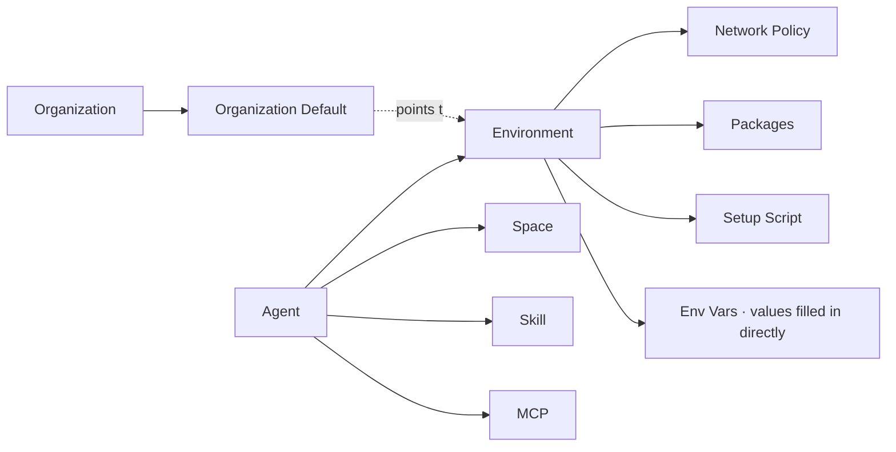
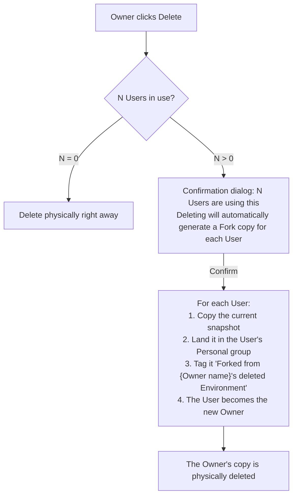

# Environment — for humans

> This is the product-story version for non-engineer readers. The **full engineering contract** (change-impact matrix / revisions / lifecycle protocol / override-governance details) lives in the shipped Environment PRD.

---

## One-line positioning

**An Environment is the operating manual for the "little machine" an Agent runs inside**—where its network can reach, what's pre-installed in the container, whether a setup script runs before launch, and which env vars to inject. It packages all of this into a **reusable template** that multiple Agents can share by reference.

Analogy:

> Think of Vercel's Project Settings → Environment Variables + Build Settings + Runtime, but **extracted into a standalone asset** that can be attached to many Agents at once—and it doubles as the switch an Org Admin flips to lock down compliance network policy.

It sits alongside the other first-class assets—**Agent / Space / Skill / MCP Server / Environment**:

| Asset           | In one line                                                                |
| --------------- | -------------------------------------------------------------------------- |
| **Agent**       | A "unit of work" with a persona, capabilities, and configuration           |
| **Space**       | A **file container** an Agent can mount (an organization-level data asset) |
| **Skill**       | A stateless capability unit (a callable tool)                              |
| **MCP Server**  | An external capability server (tool endpoint) an Agent can call            |
| **Environment** | The **runtime container template** an Agent runs inside                    |

---

## 1. The user problem

DifyLite v1 has no concept of an Environment. As a result, all three of the people below end up wrestling with the "runtime container":

### Scenario A · Agent author, Wang Qiming

He publishes a data-analysis Agent that needs pandas / numpy / scikit-learn. Today he puts this in the system prompt:

> "Please run `pip install pandas` first"

Every session cold-start costs an extra 12 seconds, tokens are wasted in tool-call logs, package versions aren't pinned—and when a downstream Agent breaks, he spends ages debugging.

### Scenario B · Org Admin, Li Xue

Compliance requires that all outbound traffic be limited to `mcp.linear.app` and `api.githubcopilot.com`. She wants to "**flip one switch in one place and have it apply org-wide**"—rather than digging through settings Agent by Agent.

### Scenario C · Design intern, Yang Yaxin

She uses an Agent a colleague published, and the UI asks her "which Environment?". She doesn't understand network policy or package managers—**what she wants is a sensible default that just works, with no thinking required**.

> Without Environment: Wang Qiming can only hack it in the prompt; Li Xue can only edit each Agent one at a time; and Yang Yaxin should never have been asked this question at all.

---

## 2. Goals

### What the Agent author (Wang Qiming) can do

- Define a named "runtime template"—network policy + pre-installed packages + setup script + env vars, written once and shared by reference across multiple Agents
- Pick an Environment from a dropdown on the Agent config page; or create one on the spot with **"+ Create new environment…"** without leaving the Agent form
- See the compliance template the Org Admin configured (Limited network + allowlist), and—when needed—**Fork it directly** and add his own pandas, without bothering the Admin

### What the Org Admin (Li Xue) can do

- Create a named Environment ("compliance-locked") configured with Limited network + Allowed Hosts
- **Share it with the entire Organization** and mark it as the **Organization Default**—so new Agents adopt it automatically
- Discover that a member's forked version reset the network back to Full → **edit that copy directly to change it back** through the Org Admin override permission
- See from the Environment detail who last changed `api.notion.com` in Allowed Hosts

### What a regular Member (Yang Yaxin) can do

- Use any Agent a colleague published **without needing to understand what an Environment is**—the platform already provides a System Default (Full network, no pre-installed packages) as a fallback, and the picker auto-fills the Org Default

### What InfoSec (Zhang Min) can do

- Quarterly review: which Environments are shared, forked, cascade-forked, or overridden by an Admin

---

## 3. Concept definitions

| Term                     | Plain-language definition                                                                                                                                                                                                                                                                                           |
| ------------------------ | ------------------------------------------------------------------------------------------------------------------------------------------------------------------------------------------------------------------------------------------------------------------------------------------------------------------- |
| **Environment**          | A reusable runtime container template. **Contains only**: network policy + pre-installed packages + setup script + env vars + metadata (name / description). **Does not contain** Spaces / Skills / MCP server—those all belong to the Agent itself.                                                                |
| **System Default**       | The platform's built-in, read-only Environment: Full network, no pre-installed packages, empty setup, no env vars. **Every Org has one**—a fallback so that any Agent can at least run.                                                                                                                             |
| **Organization Default** | What the Admin designates in Org settings as "what a new Agent is pre-filled with." It can be the System Default, or one of the Org's own custom Environments. At most 1 per Org.                                                                                                                                   |
| **Network · Full**       | The sandbox can reach any external domain (the development default)                                                                                                                                                                                                                                                 |
| **Network · Limited**    | The sandbox can only reach the domains listed in Allowed Hosts, plus the implicit set permitted by two switches (Allow MCP / Allow Package Manager)                                                                                                                                                                 |
| **Allowed Hosts**        | The outbound allowlist under the Limited policy—a comma-separated list of bare domains. For example, `api.githubcopilot.com, mcp.linear.app` (no https://, no port)                                                                                                                                                 |
| **Packages**             | The list of dependencies pre-installed by pip / npm / apt at container startup; versions can be pinned                                                                                                                                                                                                              |
| **Setup Script**         | A shell snippet that runs at container startup, before the Agent process is brought up. If it fails, the session fails to start                                                                                                                                                                                     |
| **Env Vars**             | `KEY = plaintext value`. The front end uses a password input; once submitted, **the backend encrypts it at rest**, and the UI thereafter shows only a masked preview (e.g. `xoxb-…-abcd`). **There are no cross-resource references**—to use the same token in several places, you fill it in each place separately |
| **Snapshot**             | At session start, the Environment's current configuration is copied wholesale into the sandbox. Editing the Environment afterward does not affect that session—it runs to completion on the snapshot it started with                                                                                                |
| **Owner**                | The person who created the Environment. The **only** one who can Edit / Delete / manage sharing                                                                                                                                                                                                                     |
| **User**                 | An Account that an Owner has shared an Environment with. **Can only Use or Fork**—cannot Edit, cannot Delete, and cannot remove themselves from the share list                                                                                                                                                      |
| **Use**                  | A User selects this Environment as the current value in their own Agent—this is a **reference**, so when the Owner makes a change the next new session picks up the new version (protected by snapshots, so the current session is unaffected)                                                                      |
| **Fork**                 | Copy an independent duplicate. **The forker becomes the new Owner and is fully severed from the source.** Later edits to the source do not affect this copy                                                                                                                                                         |
| **Cascade Fork**         | When an Owner deletes a shared Environment, the system **automatically lands an independent Fork copy for each User**—avoiding a sudden broken reference for downstream Agents                                                                                                                                      |

---

## 4. The relationship rule: Environment **does not nest** other assets

Environment is **orthogonal** to the other first-class assets—an Agent references Environment and Space and Skill simultaneously, and **the Environment itself does not nest Spaces / Skills / MCP**.

> **Why no nesting**: a Space is an organization-level data asset with its own ACL; MCP / Skill are the Agent's capability pool. Each has its own lifecycle, and cramming them all into the Environment would turn it into a "manages everything" grab-bag—change one thing and everything breaks.

---

## 5. The collaboration model: reuse the Skill playbook (Owner / User · Cascade Fork on Delete)

Environment and Skill look very much alike—both are "template assets." So we **directly reuse the two-tier RBAC already proven out on Skill**:

```mermaid
stateDiagram-v2
  [*] --> Personal: Member creates → automatically becomes Owner
  Personal --> Personal: Owner edits
  Personal --> Shared: Owner shares with a User or the whole Org
  Shared --> Shared: Owner edits (User's next session picks up the new version automatically, protected by snapshots)
  Shared --> Personal: Owner removes all Users
  Shared --> [*]: Owner deletes → triggers Cascade Fork
  Personal --> [*]: Owner deletes (no Users → physically deleted directly)
  Shared --> Personal: User actively Forks (the forker's copy is independent; the source is unchanged)
```

### A few product rules worth remembering

- **Environments in your "Shared with me" list are not editable.** To change one, you must Fork a copy. Rationale: an Environment is a template asset, not a collaborative document; multi-person co-editing is pointless and only increases the surface for conflicts
- **A User cannot opt out of the collaboration.** To leave fully, Fork; to wait, wait for the Owner to delete (at which point Cascade Fork covers you). This simplifies the mental model—"is it mine?" is strictly yes or no
- **Forking severs the link completely.** There is no "submit to Owner for merge" PR flow; that's only considered for Phase 2+
- **There is no ownership transfer.** To hand off, have the other party Fork and then the Owner delete (triggering Cascade Fork)

### Cascade Fork: why we do it and how it works

> **Why we do it**: to avoid the disaster of "the Owner silently deletes it, every downstream Agent's reference breaks, and a User wakes up with no env to start with." Each User inherits an independent copy—whoever uses it owns it.

### The Org Admin override permission (this differs from Skill)

The Org Admin **has a compliance-governance right over any Environment**—they can directly edit someone else's Environment (e.g. changing the network from Full back to Limited). The UI must make this explicit before saving and show the Owner that the Environment was changed by an Org Admin.

Rationale: the **blast radius of network policy is too large**—a single member resetting the network to Full breaks compliance, so someone must be able to dial it back immediately.

> Skill does not enable this override right—Environment's is a special carve-out opened specifically because of compliance pressure.

---

## 6. User journeys

### Admin creates a compliance template → sets it as the default

| Stage          | Actor  | Experience                                                                              | Pain point → experience                                                                                            |
| -------------- | ------ | --------------------------------------------------------------------------------------- | ------------------------------------------------------------------------------------------------------------------ |
| Discover       | Li Xue | Hears the compliance requirement, opens the sidebar `Studio → Environments`             | The first item in the list is the System Default with a BUILT-IN badge—clear at a glance                           |
| Create         | Li Xue | A dialog lets her fill in Name + Limited + Allowed Hosts + one env var in one go → Save | No need to first create an empty shell and then jump to a detail page to configure it—fully configured in one step |
| Share          | Li Xue | On the detail page, top-right Share → "Add everyone in organization"                    | Once added, it instantly appears under "Shared with me" in every member's list                                     |
| Set as default | Li Xue | Settings → Organization → select this one as the Default                                | The description is explicit: "Affects new Agents only; existing ones are left untouched"                           |

### Agent author forks and adds packages → without bothering the Admin

| Stage                          | Actor       | Experience                                                                                                                                                                                                    |
| ------------------------------ | ----------- | ------------------------------------------------------------------------------------------------------------------------------------------------------------------------------------------------------------- |
| Open config page               | Wang Qiming | The picker is already pre-filled with the Org Default "compliance-locked"                                                                                                                                     |
| Needs pandas                   | Wang Qiming | For him, this env is "Shared with me"—he can't Edit it                                                                                                                                                        |
| Fork & customize               | Wang Qiming | In the picker dropdown he clicks "+ Create new environment…" or "Fork & customize" on the tile → copies the source, renames it "data-sci-locked", and adds pip packages; he becomes the Owner of the new copy |
| Continue configuring the Agent | Wang Qiming | **He never left the Agent form**                                                                                                                                                                              |

### The person using the Agent notices nothing

| Stage | Actor      | Experience                                                            |
| ----- | ---------- | --------------------------------------------------------------------- |
| Run   | Yang Yaxin | Chats with the Agent in Chat—with no idea what an Environment even is |

### Owner deletes a shared env → User discovers an extra copy two weeks later

| Stage                 | Actor       | Experience                                                                                                                                           |
| --------------------- | ----------- | ---------------------------------------------------------------------------------------------------------------------------------------------------- |
| Cascade Fork fallback | Wang Qiming | One day, his List's Personal group has an extra entry, "compliance-locked-cascade", with an inline banner _Forked from Li Xue's deleted Environment_ |
| Reaction              | Wang Qiming | "Ah, so Li Xue deleted the original—good thing the system took over automatically, the session can still run." Whether to clean it up is his call    |

---

> Full engineering contract + 18 Non-Goals + change-impact matrix + protocol-layer lifecycle decisions + override-governance details are covered in the shipped Environment PRD.
