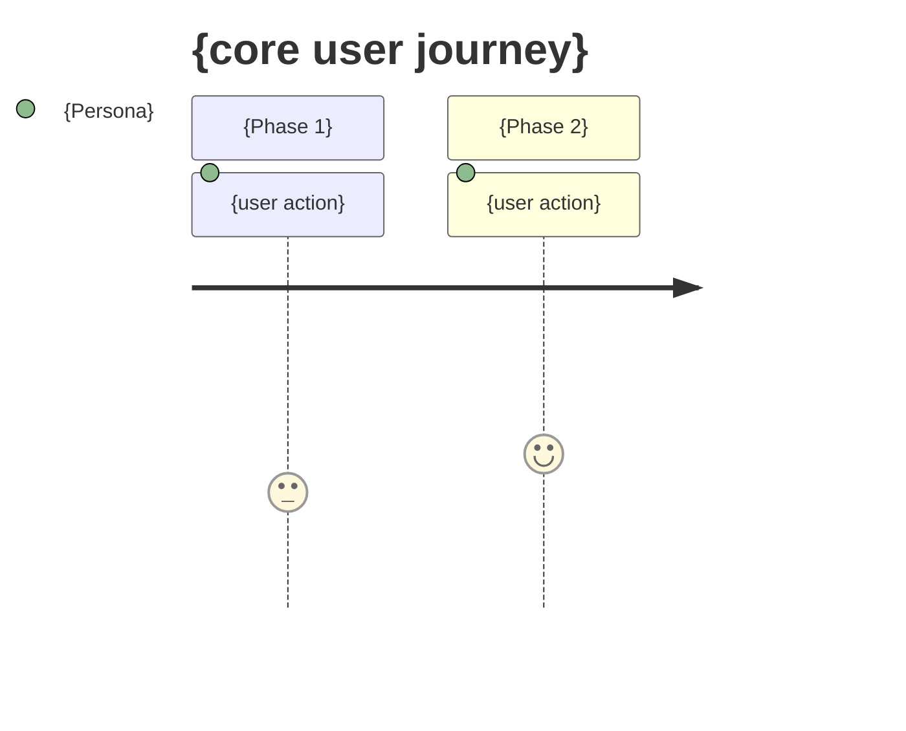
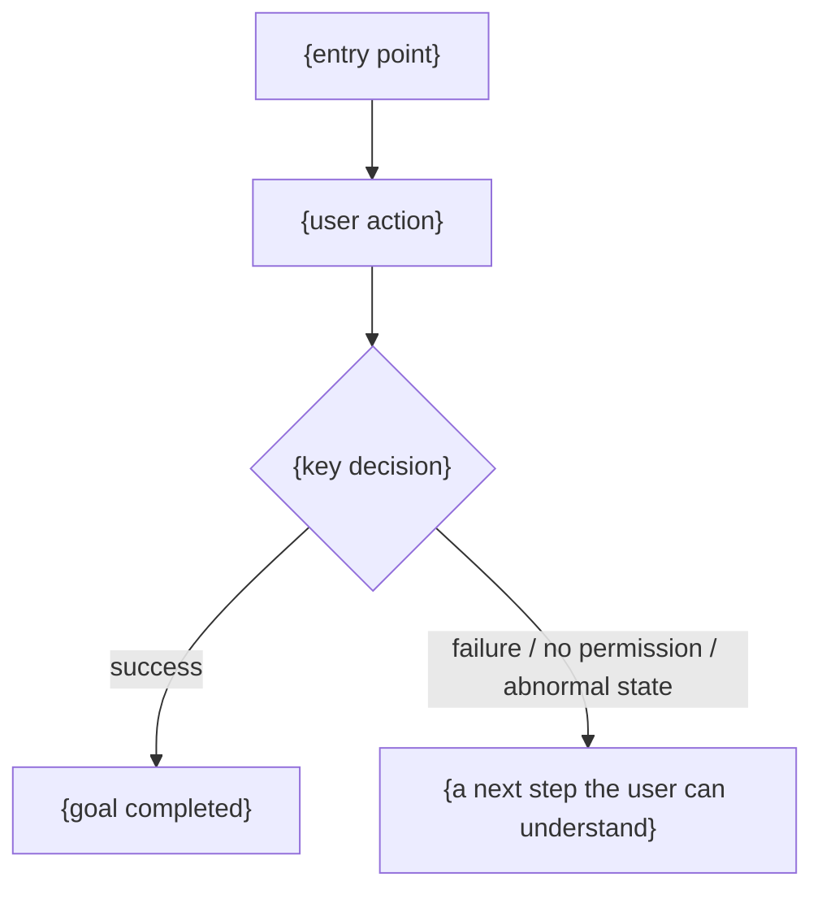
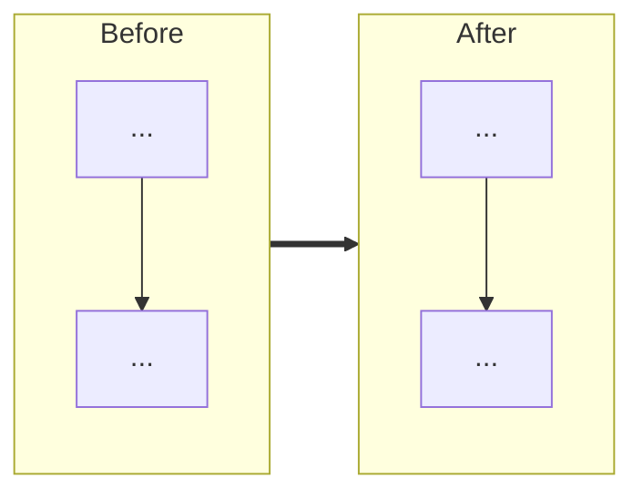
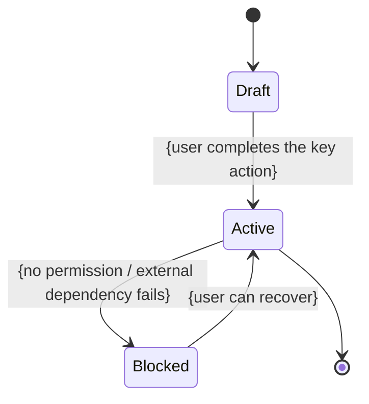

# What Makes a Good PRD (v2 Writing Charter)

> **Status**: Living document · **Maintainer**: Evanchen · **Last updated**: 2026-05-09

> This document is not a PRD for any single feature. It defines the writing constraints and acceptance criteria for every PRD under `dev/prd/`.
> Audience: product and design people who write PRDs, plus the engineers who pick up and implement them.

---

## 1. Core Thesis

**A good PRD is aligned with people, not with engineers.**

The audience for a PRD is human judgment, not a database. Keep engineering details out of the PRD entirely — schemas, API endpoints, interface definitions, intricate sequence diagrams, entity attributes, deployment topology. Those belong in `architecture.md`, an API spec, or a code review. After reading a PRD end to end, the product decisions should be completely clear and the engineering implementation should have full room to breathe.

### 1.1 Token Budget

Estimate the lines of code the implementation needs (X) → the PRD word count should be ≈ X × 30%.

- 10,000 lines of code ≈ a 3,000-word PRD
- Too few words → flexibility is not locked down, and implementers will fill in the gaps themselves
- Too many words → either engineering details have crept in, or extension scenarios have not been pruned

After writing, self-check: if you delete a paragraph, does the intent drift? If not, that paragraph should go.

### 1.2 The Deliverable = the Minimum Viable System That Meets the User Need

Extensibility, abstraction, future scenarios, operational flourishes — all of these go into Non-Goals.
"We'll need it later" is not a reason to put something in this round's PRD.

---

## 2. Before You Start: Choosing a Problem-Definition Method

> Different requirements call for different problem-definition methods. The table below lists 17 commonly used ones. You will likely use only one or two of them — **use the right one, you don't need to use them all**.

### 2.1 Method Index

| #   | Method                         | In One Line                                                           | When to Use                                                        |
| --- | ------------------------------ | --------------------------------------------------------------------- | ------------------------------------------------------------------ |
| 11  | Musk's Five-Step Algorithm     | Question → Delete → Simplify → Accelerate → Automate                  | Scope tends to expand / cutting redundancy                         |
| 12  | 5 Whys Analysis                | Ask "why" five times in a row                                         | Symptom is known but root cause is not                             |
| 13  | HMW (How Might We) Framing     | Reframe an insight as "How might we…"                                 | Early-stage open exploration                                       |
| 14  | POV Statement                  | User + need + insight, in three parts                                 | The team is not aligned on "what we are solving"                   |
| 15  | Issue Tree                     | MECE decomposition                                                    | Spans multiple modules / multiple personas                         |
| 16  | Iceberg Model                  | Event → pattern → structure → mental model                            | Treating the symptom vs. treating the root cause                   |
| 17  | Double Diamond                 | Diverge → converge, twice                                             | Exploring a 0→1 new direction                                      |
| 18  | Root Cause Analysis (RCA)      | Trace back up the causal chain                                        | Postmortems for outages / bugs / experience incidents              |
| 19  | Cynefin Framework              | Four quadrants: clear / complicated / complex / chaotic               | When you don't know which method to use (use this first to assess) |
| 20  | Job Definition                 | Draw clear Job boundaries                                             | Preventing scope creep                                             |
| 33  | Mental Models                  | Align with the user's internal assumptions                            | Redesigns / high learning cost                                     |
| 54  | CIRCLES Method                 | A seven-step answering framework                                      | A complete reasoning loop (interview-style PRD)                    |
| 55  | Working Backwards              | Write the PR + FAQ first, then reason backward                        | Driven by the customer's perspective                               |
| 56  | Event Storming                 | Collaborative DDD modeling                                            | Complex business workflows                                         |
| 89  | PESTLE Analysis                | Political / Economic / Social / Technological / Legal / Environmental | Strategy / long-term planning                                      |
| 90  | SWOT Analysis                  | Four quadrants: Strengths / Weaknesses / Opportunities / Threats      | Strategy / project initiation                                      |
| 92  | Competitive Analysis Framework | Direct + indirect + substitutes                                       | Finding differentiation                                            |

### 2.2 PRD Type → Recommended Methods

| PRD Type                                             | Recommended Combination                                            |
| ---------------------------------------------------- | ------------------------------------------------------------------ |
| Brand-new feature / 0→1 exploration                  | Double Diamond + HMW + POV + (optional) Working Backwards          |
| Clear user complaint, fixing the experience          | 5 Whys + RCA + Iceberg Model (to make sure you fix the root cause) |
| Scope tends to expand                                | **Musk's Five-Step Algorithm + Job Definition** (run by default)   |
| Touches multiple user paths / multiple modules       | Issue Tree (MECE decomposition)                                    |
| Redesign, user feedback says it feels "unintuitive"  | Mental Models + POV                                                |
| Modeling a complex business workflow                 | Event Storming                                                     |
| Strategy / project initiation / long-term planning   | PESTLE + SWOT + Competitive Analysis                               |
| You don't know which category the problem falls into | Use **Cynefin** first to assess the category, then pick a tool     |

> The output of this section does not need to appear in full in the PRD body, but the key pruning conclusions must leave a trace in the PRD. Sections 2.3 and 2.4 below are the two foundational mindsets that every PRD should run by default; their conclusions should ultimately land in the "Reasoning Audit" section rather than staying only in the writer's head.

### 2.3 First Principles (run this first on every PRD)

Whichever method above you use, first-principles thinking is the underlying mindset. For each requirement, ask three things:

- **What is the underlying assumption?** What does this requirement implicitly assume?
- **Does that assumption actually hold?** If it doesn't, does the requirement still need to be built?
- **Is this a problem that B2B / SaaS has already solved N times?** Is there a ready-made, minimal form?

For mature problems (authentication, invitations, roles, email, billing, audit…) — first look at how Notion / Linear / Vercel / Stripe do it, assess how easy it is to implement, and **don't reinvent the wheel**.

### 2.4 Musk's Five-Step Algorithm (run this whenever you need to cut redundancy)

In order:

1. **Question the requirement** — Requirements that come from a "smart person" in the brief are the most dangerous, because no one challenges them. Ask: who proposed it, why, and does the premise still hold?
2. **Delete** — Any part, step, field, state, or role that can be deleted should be deleted, as aggressively as possible. If you don't end up adding back at least 10% of what you deleted, you didn't delete enough.
3. **Simplify** — Simplify only after deleting. **Do not optimize a step that should not exist.**
4. **Accelerate** — Only consider speeding things up at this stage. Accelerating the wrong process just produces garbage faster.
5. **Automate** — Always last. Automating a broken process just cements the mistake.

### 2.5 Breakdown Reflection

After the draft is written, go back through the breakdown / boundary scenarios and ask of each:

> Do we really need to consider this scenario in this round? Does its underlying assumption hold?

Anything that should not be in this round must be written explicitly into **Non-Goals** — don't quietly handle it on the main path.

### 2.6 Reasoning Audit (must leave an explicit trace)

If first principles and Musk's five steps are only run in your head, implementers cannot see the trade-off boundaries, nor can they tell whether a feature is "deliberately not done" or simply "missed." Every PRD must capture this in a short paragraph:

- **Premises that were challenged**: Which requirements depend on a particular assumption? To what extent does that assumption hold?
- **Scope that was deleted**: Which states, fields, entry points, roles, or automations were removed? Does the user's goal still hold after removing them?
- **Alignment with mature solutions**: When this is a mature B2B problem such as authentication / invitations / roles / email / billing / audit, which mature product's minimal form is the default reference?
- **Why automation is deferred**: Should capabilities like automation, batch operations, or smart recommendations really be in this round? If so, why aren't they Phase 2?

This section records **decision outcomes**, not a lengthy reasoning narrative; the goal is to let whoever picks this up later understand "why not the other approach."

---

## 3. The Four "Locks": The Four Things a PRD Must Lock Down

Writing a PRD is essentially **locking flexibility to the right granularity**. Lock too little and the implementation drifts; lock too much and it becomes an engineering document.

### 3.1 Concept Lock

Pin down the definitions of the core nouns. For example: Account / Org / Member / Role / Permission / Invitation / Disabled user / Provider / Credential / Agent / Space / Run / Session.

- Use one consistent spelling for the same noun throughout (don't mix "user / Member / member")
- A noun has exactly one definition; once defined, don't swap in synonyms
- If the nouns aren't locked, every requirement that follows will drift

### 3.2 Relationship Lock

Express the relationships between objects using a **mermaid flowchart / state machine**.

- **Mermaid first, dataflow second**: if mermaid can draw it, use mermaid; only reach for a dataflow diagram when mermaid cannot express the real data movement
- **Don't draw ERDs**: entity attributes / foreign keys / field types belong to the engineering layer
- **Don't draw sequence / API diagrams**: interface contracts belong to the engineering layer

| What You Want to Draw                     | In the PRD?                    | Use                       |
| ----------------------------------------- | ------------------------------ | ------------------------- |
| A user's flow from A to B                 | ✅                             | mermaid `flowchart`       |
| State transitions                         | ✅                             | mermaid `stateDiagram`    |
| How real data moves through the system    | ✅ (when mermaid isn't enough) | dataflow                  |
| Before/After information architecture     | ✅                             | mermaid `flowchart LR`    |
| Entity attributes / fields / foreign keys | ❌                             | put it in architecture.md |
| API paths / request bodies                | ❌                             | put it in the API spec    |
| Sequencing / call stacks                  | ❌                             | put it in architecture.md |
| Deployment topology / networking          | ❌                             | put it in infra docs      |

Principle: include diagrams that make **product decisions** clearer; leave out diagrams that only make the **engineering implementation** clearer.

### 3.3 Behavior Lock

Lock behavior with **user journeys** and **numbered Flows**:

- Must include a user journey map (Phase | Actions | Touchpoints | Emotion high/low | Pain points | Opportunities)
- The user journey must be paired with a mermaid diagram: the table handles emotion / pain points / opportunities, and the mermaid diagram handles the path, branches, fallbacks, and state visualization
- A journey with no branches can use mermaid `journey`; when there are branches, failures, or fallbacks, you must use mermaid `flowchart`
- Write key flows as numbered steps (Flow A / Flow B…); a single flow should be no more than 7 steps
- Use assertion-style sentences for acceptance: "When a new user signs in with Google and has no Org, they should enter the create/join flow."

### 3.4 Boundary Lock

Be explicit about **what you won't do**. Every PRD must have a **Non-Goals** section. Examples:

- The MVP does not do SCIM
- No dynamic permission configuration
- No complex department trees
- No audit-log redaction
- No cross-Org resource sharing

The boundary lock is the single most important section for the implementer. Omitting a Non-Goal is effectively granting permission for the implementation scope to expand on its own.

---

## 4. Required Sections (the Minimum Skeleton)

The four sections below are the minimum skeleton that any PRD must have. You can add sections; you cannot remove these.

### 4.1 User Problem

> What problem the user faces **right now**.

Be specific down to persona + scenario. "Permissions are too weak" doesn't count; "A Member cannot choose, on `/providers`, whether to use their own key or the company key" does.

### 4.2 Goal

> What the user **should be able to** accomplish once this is done.

Phrasing: "Without leaving `/providers`, a Member can independently choose whether to use the company key or their own key for each Provider."
Write from the user's perspective, not the vendor's "we will provide…".

### 4.3 In Scope

> What this round **must** include.

List it item by item. Each item should ideally map to an acceptance criterion.

### 4.4 Out of Scope

> What this round **explicitly will not do**.

This section matters more than 4.3. Write down everything that is Phase 2+, "will do later," and "do it if there's time."

---

## 5. Other Required Sections

### 5.1 Concept Definitions (Glossary)

List every noun this PRD introduces or redefines. **List only product semantics, not engineering entity attributes.**

### 5.2 User Journey Map

A horizontal Phase table covering at least one happy path plus one common failure path:

| Phase | User Actions | Touchpoints | Emotion | Pain Points | Opportunities |
| ----- | ------------ | ----------- | ------- | ----------- | ------------- |

The user journey must also have a mermaid diagram:

- **User emotion / understanding each phase**: use `journey`
- **Path branches / failure fallbacks**: use `flowchart`
- **Complex object state**: use `stateDiagram-v2`; don't hide state inside the Edge Cases table

### 5.3 Information Architecture (Mermaid Before/After)

Make it clear to the implementer: which part changed, and which part didn't.

### 5.4 Screens (Required)

- Path: `./screenshots/{prd-slug}-NN-{state}.png`
- Reference: use Markdown image syntax pointing to the corresponding screenshot path.
- Number them in Screen / Flow order
- When there's no image yet: write the pending screenshot path and mark it TODO, then swap in the image reference once the screenshot lands.

### 5.5 Key Flows (Numbered Steps)

In the form Flow A / Flow B. A flow longer than 7 steps means one of two things: the scenario is too complex and wasn't broken down, or engineering detail has crept in.

### 5.6 State and Corner Case Coverage

Complex state is inherently easy to miss — especially identity, permissions, external services, async tasks, and deletion / disabling / expiry / failure recovery. Any PRD that has an object with multiple states must first draw a state diagram, then list a coverage matrix.

The state diagram should express only **product states the user can perceive**, not the engineering lifecycle.

The coverage matrix should check at least these dimensions:

| Dimension           | Mandatory Questions                                                                                                             |
| ------------------- | ------------------------------------------------------------------------------------------------------------------------------- |
| Actor / Role        | Are the results that Owner, Admin, Member, and a logged-out user see consistent, or clearly different?                          |
| Object State        | Do draft, active, disabled, deleted, expired, failed, and similar states each have a product behavior?                          |
| Permission State    | How is it handled with no permission, while permissions are changing, after removal, or on cross-Org access?                    |
| Entry Point         | Is it consistent when entered from the default entry point, a deep link, a refresh, a back navigation, or a notification entry? |
| External Dependency | What does the user see when email, payment, a model provider, the sandbox, or a third-party API fails?                          |
| Recovery            | Can the user retry, undo, recover, or know who to contact — or is it explicitly blocked?                                        |

### 5.7 Edge Cases Table

| Case | Handling |
| ---- | -------- |

Edge Cases is not a list of engineering exceptions; write down only product exceptions that change the user's understanding, permissions, next action, or recoverability. Don't pile up text for anything derivable from the state diagram / coverage matrix; for anything that can't be handled, explicitly put it in Non-Goals or "must come back and ask."

### 5.8 Reasoning Audit (First Principles / Musk 5)

Record the product judgments that first principles and Musk's five steps ultimately left behind. Keep it short, but it cannot be empty.

| Audit Item                                                            | This PRD's Conclusion |
| --------------------------------------------------------------------- | --------------------- |
| Core premises that were challenged                                    | ...                   |
| Scope explicitly deleted                                              | ...                   |
| The minimal form after simplification                                 | ...                   |
| The mature SaaS form referenced                                       | ...                   |
| Why automation is not in this round / or why it must be in this round | ...                   |

### 5.9 Architecture Impact (Requirement Contract)

Every PRD must declare this requirement's impact on the architecture. The goal is not to turn the PRD into an engineering design, but to ensure the implementer doesn't have to guess which boundaries, contracts, generated artifacts, and acceptance posture apply.

This section records only the architectural impact triggered by the product requirement — not schema fields, API bodies, call stacks, or deployment details. If this requirement changes a long-term architectural assumption, you must also update or reference the stable source of truth in `dev/architecture.md` or the corresponding PRD / plan memo.

`E2E proof required?` declares only the acceptance posture; it does not ask the PM to write engineering test details. Allowed values are `none` / `deterministic-e2e` / `live-smoke` / `manual-only` / `deferred-with-trigger`.

| Question                                         | This PRD's Conclusion                                                                                                                                                                                                                                   |
| ------------------------------------------------ | ------------------------------------------------------------------------------------------------------------------------------------------------------------------------------------------------------------------------------------------------------- |
| Which boundary did this add / change?            | For example Web/API, GraphQL, Public API, Runtime/Driver, Space/File, Credential/Vault, Audit, Cost, Organization/Access, etc.                                                                                                                          |
| Which contract is the truth source?              | For example `dev/architecture.md`, some `pkgs/contracts/*`, the GraphQL spec, the runtime protocol, the DB schema, an OpenAPI doc, or an existing PRD.                                                                                                  |
| Which generated artifacts must run?              | For example `vp run graphql:codegen`, `vp run db:regen`, OpenAPI example validation, etc.; write "none" if there are no generated artifacts.                                                                                                            |
| E2E proof required?                              | For example `none`, `deterministic-e2e`, `live-smoke`, `manual-only`, `deferred-with-trigger`; state clearly why this posture is sufficient.                                                                                                            |
| Which old architectural assumptions are retired? | For example Workspace is still a product layer, the Driver actively calls back over the public internet, Session state equals Space, the Runtime defaults to a generic protocol, the API targets only the UI, etc.; write "none" if nothing is retired. |

---

## 6. Implementation Boundary

**This section is the PRD's implementation-boundary handoff, and it is required.** A PRD without this section should not enter implementation.

### 6.1 The Implementer Can Decide

Generally micro-level UI details, copy tweaks, loading / empty states, accessibility defaults, animation durations… spell these out in each PRD.

### 6.2 Must Follow Existing Product Patterns

Reuse existing v2 components, reuse existing hooks, preserve the spacing / typography / container widths already established by `layout-prd` (such as `max-w-3xl mx-auto`)… spell these out.

### 6.3 Must Come Back and Ask (Reverse-Alignment Protocol)

If any of the following arise, the implementer must stop and confirm, and **must not** expand scope on their own:

- The current requirement affects **another** core user path
- It requires adding a **new role / permission semantic / billing semantic**
- An existing product rule conflicts with this PRD
- Completing this requirement requires introducing a **new page / new module / long-term abstraction**
- The acceptance criteria cannot be met directly under the existing architecture
- There are **two or more** reasonable product approaches with clearly different user experiences

### 6.4 Don't Build It Even If It's Technically More Complete

Reiterate the Non-Goals items an engineer is most likely to do by reflex. For example:

- Don't casually turn this Select into a searchable combobox
- Don't casually add an admin-view bulk edit
- Don't casually extract i18n (unless this round explicitly calls for it)

---

## 7. Don't Reinvent the Wheel

90% of B2B requirements are mature problems that unicorn SaaS companies have solved N times:

- Sign-up / sign-in / invitations / password reset / SSO
- Roles / permissions / user disabling
- Teams / workspaces / resource ownership
- Billing / quotas / subscriptions
- Audit logs / notifications

When you reach these points, first ask:

1. How do Notion / Linear / Vercel / Stripe / Slack do it?
2. Where is our differentiation? Is the product fundamentally different, or have we just not found the ready-made solution?
3. Pick the simplest ready-made form, and put your differentiation into the one point that is genuinely different.

> **Copy the mature solution by default; differentiation has to earn its place.**

---

## 8. Anti-Patterns (These Will Get Bounced Back)

| Anti-Pattern                                         | Why It's Not Allowed                                                                                                                             |
| ---------------------------------------------------- | ------------------------------------------------------------------------------------------------------------------------------------------------ |
| Writing SQL schemas, TS interfaces, API paths        | Engineering-layer documentation that pollutes the product semantics                                                                              |
| Non-Goals empty or with only 1 item                  | The boundary isn't locked, which is effectively authorizing scope to expand freely                                                               |
| No user journey map                                  | Behavior isn't locked; the implementer doesn't know the emotion curve or pain points                                                             |
| User journey has only a table, no mermaid            | Path branches, fallbacks, and state changes are invisible                                                                                        |
| No screenshots and no placeholders                   | Visual decisions aren't locked; screen state is left entirely to imagination                                                                     |
| Mermaid drawing an ERD / sequence diagram            | Disguising an engineering diagram as a product diagram                                                                                           |
| Complex state written only in Edge Cases             | Coverage is inherently low; misses identity / permission / failure-recovery branches                                                             |
| No reasoning audit                                   | First principles and Musk's five steps left no reviewable pruning result                                                                         |
| No Architecture Impact                               | The implementer doesn't know the boundary, truth source, generated artifacts, E2E acceptance posture, or retired assumptions, and can only guess |
| Writing Architecture Impact as schema / API design   | This pollutes the PRD back into an engineering document; when long-term architectural decisions are needed, add an ADR                           |
| Multiple spellings for the same noun                 | The concept isn't locked                                                                                                                         |
| Missing the implementation-boundary section          | No reverse-alignment protocol, so the implementation scope will expand on its own                                                                |
| Word count far exceeding "lines of code × 30%"       | Most likely details that shouldn't be there have crept in                                                                                        |
| "We will provide…" throughout                        | Vendor's perspective, not the user's                                                                                                             |
| Writing Phase 2+ extension points into the main line | Flexibility isn't locked, and the minimum viable system stops being "minimum"                                                                    |

---

## 9. PRD Template (Copy and Use)

````markdown
# {Feature Name} PRD (v2)

> **Status**: Draft / Mock / Design approved · **Last updated**: YYYY-MM-DD · **Owner**: {you}

## User Problem

{persona + scenario + how it can't be done today}

## Goal

{what the user can accomplish — user's perspective}

## In Scope

- {must-do item 1}
- {must-do item 2}

## Out of Scope

- {Phase 2+ item 1}
- {Phase 2+ item 2}

## Concept Definitions

| Noun | Definition |
| ---- | ---------- |
| ...  | ...        |

## User Journey Map

| Phase | User Actions | Touchpoints | Emotion | Pain Points | Opportunities |
| ----- | ------------ | ----------- | ------- | ----------- | ------------- |
| ...   | ...          | ...         | ...     | ...         | ...           |





## Information Architecture (Before / After)



## Screens

### 1. {scenario name}

Pending screenshot path: `./screenshots/{slug}-01-{state}.png`
{description}

### 2. {scenario name}

Pending screenshot path: `./screenshots/{slug}-02-{state}.png`
{description}

## Flows

### Flow A · {happy path name}

1. ...
2. ...

### Flow B · {failure / edge path name}

1. ...
2. ...

## State and Corner Case Coverage



| Dimension           | Mandatory Questions                                                          | This PRD's Decision |
| ------------------- | ---------------------------------------------------------------------------- | ------------------- |
| Actor / Role        | Do different roles see different results?                                    | ...                 |
| Object State        | How are draft / active / disabled / deleted / failed handled?                | ...                 |
| Permission State    | How is it handled with no permission, after removal, or on cross-Org access? | ...                 |
| Entry Point         | Is it consistent for deep links, refresh, and notification entries?          | ...                 |
| External Dependency | What is shown when email, payment, a model provider, or the sandbox fails?   | ...                 |
| Recovery            | Can the user retry, undo, recover, or is it explicitly blocked?              | ...                 |

## Edge Cases

| Case | Handling |
| ---- | -------- |
| ...  | ...      |

## Reasoning Audit

| Audit Item                                                            | This PRD's Conclusion |
| --------------------------------------------------------------------- | --------------------- |
| Core premises that were challenged                                    | ...                   |
| Scope explicitly deleted                                              | ...                   |
| The minimal form after simplification                                 | ...                   |
| The mature SaaS form referenced                                       | ...                   |
| Why automation is not in this round / or why it must be in this round | ...                   |

## Architecture Impact (Requirement Contract)

| Question                                         | This PRD's Conclusion                                                                                 |
| ------------------------------------------------ | ----------------------------------------------------------------------------------------------------- |
| Which boundary did this add / change?            | ...                                                                                                   |
| Which contract is the truth source?              | ...                                                                                                   |
| Which generated artifacts must run?              | ...                                                                                                   |
| E2E proof required?                              | none / deterministic-e2e / live-smoke / manual-only / deferred-with-trigger; why it's sufficient: ... |
| Which old architectural assumptions are retired? | ...                                                                                                   |

> If this PRD changes a long-term architectural assumption, you must update or reference the stable source of truth in `dev/architecture.md` or the corresponding PRD / plan memo. Choose one of the E2E posture values above; don't write engineering implementation details in the PRD.

## Implementation Boundary

### The Implementer Can Decide

- ...

### Must Follow Existing Product Patterns

- ...

### Must Come Back and Ask (Reverse Alignment)

- The current requirement affects another core user path
- It requires adding a new role / permission semantic / billing semantic
- An existing product rule conflicts with this PRD
- Completing this requirement requires adding a new page / module / long-term abstraction
- The acceptance criteria cannot be met directly under the existing architecture
- There are two or more reasonable product approaches with clearly different user experiences

### Don't Build It Even If It's Technically More Complete

- ...
````

---

## 10. Self-Check Checklist

After writing a PRD, tick off each item below:

- [ ] **Concept lock**: core nouns are consistent throughout and defined
- [ ] **Relationship lock**: at least one mermaid diagram, no ERD / sequence diagram
- [ ] **Behavior lock**: there's a user journey map, a user journey mermaid diagram, and numbered Flows (each ≤ 7 steps)
- [ ] **Boundary lock**: Non-Goals ≥ 3 items
- [ ] **State coverage**: complex objects have a state diagram; Corner Cases cover roles, states, permissions, entry points, external dependencies, and recovery paths
- [ ] **Screenshots**: every key screen has an image or a placeholder
- [ ] **Implementation boundary**: all four sub-sections are filled in
- [ ] **Reasoning audit**: first principles, Musk's five steps, and the mature SaaS reference all have explicit pruning results
- [ ] **Architecture Impact**: the boundary, truth source, generated artifacts, E2E acceptance posture, and retired architectural assumptions are all declared; if a long-term architecture changes, an ADR has been added / referenced
- [ ] **Word count** ≈ estimated lines of code × 30%
- [ ] **No** schema / API path / interface definitions
- [ ] Nouns, terminology, and button copy are consistent throughout
- [ ] Read through: if you delete a paragraph, does the intent drift? If not, it should go
- [ ] Musk's five steps were run once: delete → simplify → accelerate → automate (and automation comes last)
- [ ] First principles: the underlying assumption of every requirement is explicit and stands up to challenge
- [ ] No reinventing the wheel: mature problems are aligned with the minimal form used by Notion / Linear / Vercel / Stripe / Slack
