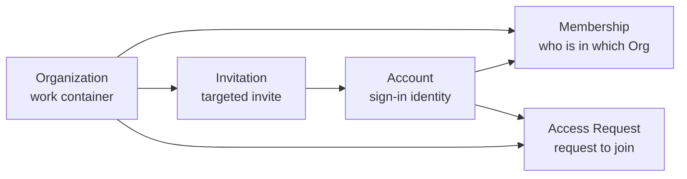
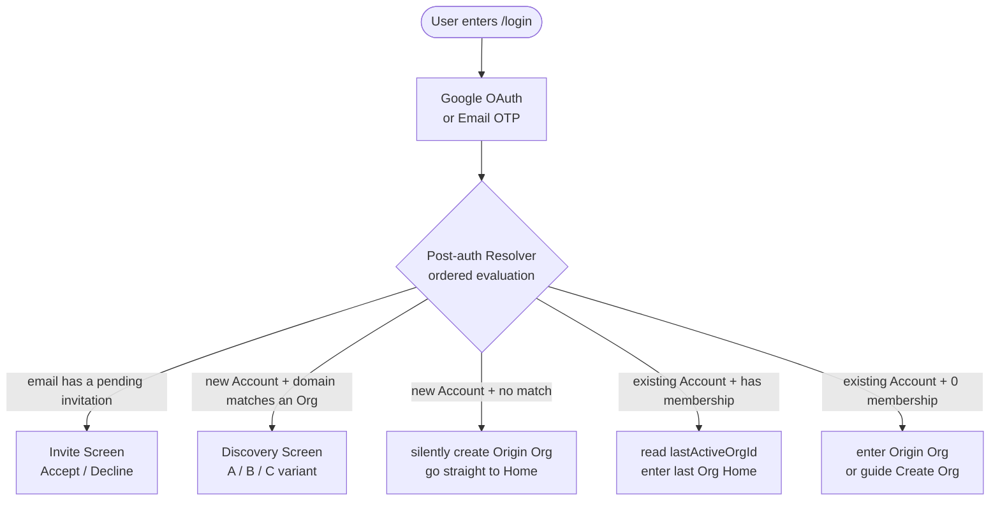
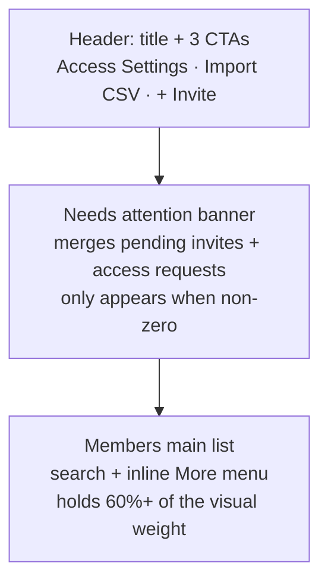
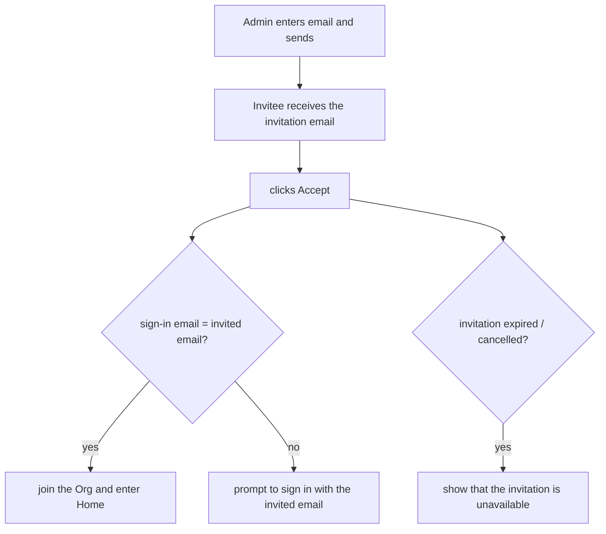
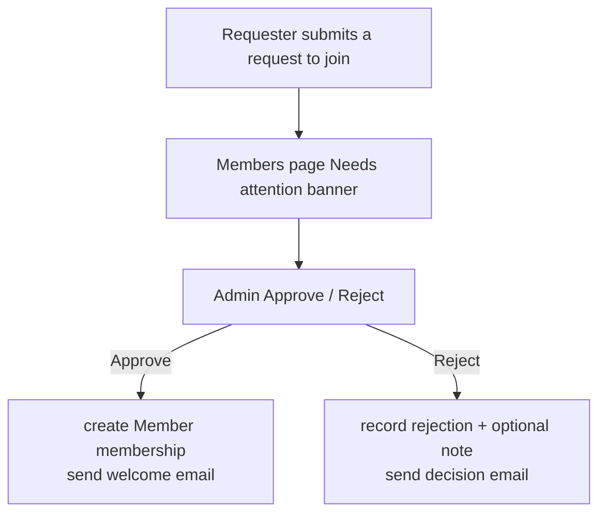

# Identity & Access — for humans

> The Identity & Access product story for non-engineers. The **complete engineering contract** (Resolver priority, Org / Account / Membership fields, email skeletons, the decisions column) lives in the full Identity & Access PRD.
>
> This document is aligned with v2.2 (Unified Lock, locked on 2026-04-25).

---

## One-line positioning

Let anyone **sign in or sign up for Mosoo within 60 seconds, and always land in a valid Organization** — there is no intermediate state where you have "signed in successfully but have nowhere to go." Let an admin manage the entire member lifecycle of an organization from a single page (invite / approve / change Role / Disable / Remove).

Analogy:

> The minimal closed loop that compresses together Google Workspace's "auto-discover teammates with the same company email" PLG onboarding, Linear's "switch orgs via the sidebar OrgCard," and Notion's "manage all members on one page."

---

## 1. The user problem

After its pivot, Mosoo is positioned as an **AMS (Admin Management System)** — comparable to ERP / CRM / CMS / LMS, and **not** a "collaboration product" like Slack or Notion. This single decision drives every identity story: the architecture is no longer the three-layer `Organization → Workspace → Account`, but the two-layer `Organization → Account`. The Workspace concept is **scrubbed completely out of the code, UI, and docs**.

Before the pivot we had already shipped some scattered capabilities: Better-Auth wired up Google OAuth + Email OTP, Members & Access had a complete v2 UI mock, and Cloudflare Email Workers handled real OTP delivery. But these capabilities had **no closed loop** between them — the telltale symptoms were sentences like:

- New employee: "I signed in with Google, but I don't see any Organization. Where do I go?"
- Admin: "I set `@mosoo.ai` as our primary domain. When a new colleague signs up with `evan@mosoo.ai`, can they see our Org directly?"
- Admin: "I removed this person. Next time they sign in, will they see a 'you've been removed' error?"
- Small startup team: "We're a company of just 3 people. Do we really have to create an Org first and then add members? Can we just start PLG-style?"
- External collaborator: "I was invited to join ACME, but my current email is gmail.com, not acme.co. Can I still use it?"

The goal for this cycle is to **organize these fragmented capabilities into a minimal complete closed loop**, so that every sentence above has a clear, natural, error-free experience answer.

---

## 2. Goals

### What ordinary users can do

- Complete sign-in or sign-up **within 60 seconds** — Google OAuth or Email OTP, take your pick
- **Always** land in a valid Organization after signing in; when a new account has no Org, the system **silently** creates an Origin Org for them
- A given email maps to **one and the same** Mosoo account no matter which provider it comes in through — no "link account" button is needed; the merge is **implicit and automatic**
- Switch orgs with one click from the OrgCard at the top of the sidebar (Linear style); we no longer pursue a separate top-bar switcher

### What an Admin / Owner can do

- Manage the entire member lifecycle on **one page** in Members & Access: invite, approve, change Role, Disable, Re-enable, Remove
- Set the organization's "primary domain" to upgrade a "personal sandbox" into a "company" — new hires from the same company automatically see the Discovery Screen
- Choose a join policy: `Auto join` (matching domains join the org automatically) / `Invite only` (requires approval)
- Paste emails in bulk via CSV to send invitations; the frontend deduplicates automatically
- Copy a "Request access link" to share externally so people can apply to join on their own

### What the system promises

- **No useless flexibility reserved**: the Workspace layer, the Personal/Team kind split, and SAML/SCIM protocol interfaces are **all scrubbed out of the code**
- **Security boundaries that don't dig holes**: Email OTP expires in 10 minutes / throttled to 60 seconds / locked for 15 minutes after 5 consecutive wrong attempts
- **Data never becomes "homeless"**: deleting an Org, removing a person, unbinding a primary domain, and similar actions all have fallback chains; the next time the user signs in they land seamlessly on the next available Org

---

## 3. A few terms (defined in plain language)

| Term                   | Plain-language definition                                                                                                                                                                                                                                                              |
| ---------------------- | -------------------------------------------------------------------------------------------------------------------------------------------------------------------------------------------------------------------------------------------------------------------------------------- |
| **Account**            | One verified email = one Account. The same email is the same Account whether it comes in via Google or Email OTP.                                                                                                                                                                      |
| **Organization (Org)** | The "container" a user works in. Each Org has a name, a URL slug, an optional logo, and an optional **primary domain**. Org names can repeat; slug + primary domain are globally unique.                                                                                               |
| **Origin Org**         | The Org automatically assigned at sign-up, named `${firstName}'s Org` by default ("Evan's Org"). It is **fully equivalent to any other Org** — it's just that its name is system-assigned and it serves as the backstop of the fallback chain. Once renamed it is no longer "special." |
| **Primary domain**     | A company email suffix (such as `acme.co`). **Setting a primary domain = this Org is a "company"**; not setting one = a "personal sandbox." Public email suffixes (gmail.com / outlook.com / qq.com and 14 others) cannot be claimed.                                                  |
| **Membership**         | An Account's role (Owner / Admin / Member) plus status (Active / Disabled) within an Org.                                                                                                                                                                                              |
| **Invitation**         | A targeted ticket an Admin actively sends to a specific email to join the org; expires in 14 days.                                                                                                                                                                                     |
| **Access Request**     | The "please let me in" request received by an invite_only Org; the Admin reviews it Approve / Reject.                                                                                                                                                                                  |
| **Resolver**           | The "traffic controller" that runs after a user signs in — it decides which screen they see based on email, Membership, and invitation status.                                                                                                                                         |

---

## 4. Core relationships



### A few invariant red lines

- **Email is the primary identity.** Signing in with Google as `evan@mosoo.ai` and signing in with Email OTP as `evan@mosoo.ai` land on the same Account; they **never** become two.
- **Every new Account has an Origin Org.** The state of "signed in with no Org" does not exist in the product.
- **Whether an Org is a "company" depends entirely on whether it has claimed a primary domain** — independent of the creator's email or the member count. A `personal / team` kind field **does not exist**.
- **Primary domains are globally unique.** First come, first served; latecomers must negotiate with the original Org admin or go through the Phase 2 DNS verification.
- **The same company primary domain + the same Account** has exactly one Membership in that Org; there are no duplicates.

---

## 5. User journeys

### 5.1 Sign-in and routing (Post-auth Resolver)

The first time any credential passes = an Account is created automatically (**there is no Sign up / Log in toggle**); then the Resolver runs to decide which screen you land on:



### 5.2 Last-active fallback — "being removed" doesn't error out

**Example**: Sarah is a member of the ACME Org and is removed by an admin on Monday. Tuesday morning Sarah signs in directly:

> The system reads `lastActiveOrgId = acme-id` → detects that her ACME membership is gone → goes to fallback → picks the most recent `joinedAt` among her other Orgs → updates lastActiveOrgId → enters the new Org Home.

Sarah **does not see a "you've been removed" error**; she simply lands seamlessly in another Org she uses, which matches enterprise-SaaS intuition. If she no longer has any other Org, she is guided to Create Org.

### 5.4 The 4 starting points for growing membership

| #   | Inbound path                             | Triggered by                                | End state                                                    |
| --- | ---------------------------------------- | ------------------------------------------- | ------------------------------------------------------------ |
| P1  | Domain Discovery (auto)                  | registrant's domain matches + auto policy   | becomes a Member directly                                    |
| P2  | Domain Discovery → Request (invite_only) | registrant's domain matches + invite_only   | AccessRequest pending review; becomes a Member once approved |
| P3  | Direct invitation                        | Admin actively invites (single or CSV bulk) | invitation pending accept; becomes a Member once accepted    |
| P4  | Self-service Create Org                  | the creator themselves                      | becomes Owner upon creation                                  |

---

## 6. The Members & Access page

### 6.1 The three-layer IA



**What changed from v1 → v2**: v1 stacked five peer sections — Domain discovery / Request link / Pending invites / Access requests / Members — into one list, with Members squeezed at the bottom and empty sections perpetually taking up space. v2 instead:

- Domain discovery + Request link → **tucked into the Access Settings Dialog** (opened on demand)
- Pending + Access requests → **merged into a single collapsible banner**, hidden when there are zero
- Members → **the star of the page**

### 6.2 The inline More menu

A member has only two states: **Active** and **Disabled**. Remove is a third terminal state (hard delete) and is not part of the state machine.

**Active row menu**:

```
ROLE: 🛡 Admin ✓ / 👤 Member
─────────
⏸  Disable          soft delete (recoverable)
🗑 Remove from org   hard delete (irreversible)
```

**Disabled row menu** (the row is visually de-emphasized + a `Disabled` pill):

```
▶ Re-enable
─────────
🗑 Remove from org
```

**Display rules**:

- Owner row / viewing yourself / an Admin viewing an Admin → **no menu**
- Owner viewing a Member / Admin → full menu
- Admin viewing a Member → full menu (cannot manage the Owner, and cannot manage a peer Admin)

> The full "who can do what to whom" matrix is in [`./rbac.md`](./rbac.md). This page only specifies the UI entry points and state transitions.

### 6.3 What the three verbs mean

| Action        | What the user sees as the result                                                                                                                                                                                                                                     |
| ------------- | -------------------------------------------------------------------------------------------------------------------------------------------------------------------------------------------------------------------------------------------------------------------- |
| **Disable**   | The row is grayed out and the session is invalidated immediately; the assets they created are **retained**, and access locks are released to the Admin; can be restored with a one-click Re-enable.                                                                  |
| **Re-enable** | The reverse of Disable; the row returns to normal and asset access locks are restored immediately.                                                                                                                                                                   |
| **Remove**    | The Membership is hard-deleted, and personal credentials / personal MCP are wiped along with it. **The assets they created are retained**, and access locks are released to the Admin. Re-inviting them back counts as a new relationship (it does not "resurrect"). |

---

## 7. Invitations & approvals

### 7.1 Single invitation

Click `+ Invite` in the Header → a small dialog pops up to enter a single email → submit → an Invitation email is sent → the recipient joins the org after they Accept.



On the Admin side there is a `Cancel` button in the banner; pressing it invalidates the invitation immediately.

### 7.2 CSV bulk

- Supports both drag-and-drop and click interactions
- Parsing strategy: scan the full text for emails, with **no requirement** on column order
- The frontend **deduplicates and lowercases automatically**
- Soft cap of **200 entries**; prompts to split into batches if exceeded
- All-green (`Sent N invites`) auto-closes after 1.4s; on failures an amber box retains the first 3 failed emails

### 7.3 Access request approval



When approving or rejecting, the Admin can fill in a note ("We're currently only open to the engineering team"), which appears in the decision email.

---

## 8. Upgrading to a "company" — Set Primary Domain

Org Settings contains a `Primary domain` block (visible to Owner / Admin):

```
┌─ Primary domain ─────────────────────────┐
│  Set this organization's primary email   │
│  domain to enable teammate discovery.    │
│                                          │
│  [ acme.co              ] [ Set domain ] │
│                                          │
│  ⚠ Public email domains (gmail.com,      │
│   outlook.com…) cannot be used.          │
└──────────────────────────────────────────┘
```

After it is set successfully:

```
┌─ Primary domain ─────────────────────────┐
│  acme.co · claimed                       │
│  Members signing up with @acme.co will   │
│  see your organization in Discovery.     │
│                                          │
│  [ Remove ]                              │
└──────────────────────────────────────────┘
```

- **Public email allowlist**: gmail.com / outlook.com / hotmail.com / yahoo.com / icloud.com / qq.com / 163.com / 126.com / sina.com / foxmail.com / live.com / aol.com / protonmail.com / msn.com — 14 in total, none of which can be claimed.
- **Globally unique**: a primary domain can be held by only one Org at a time. First come, first served; DNS TXT verification will be added in Phase 2.
- **Remove** only disables discovery; it does **not** delete any membership or any data.

---

## 9. Access Settings Dialog

Opened from the `Access Settings` CTA in the Header, it controls the two things about "how new people get in":

| Control                 | Options                                                                                                                   |
| ----------------------- | ------------------------------------------------------------------------------------------------------------------------- |
| **Domain discovery**    | `● Auto join` (matching users join the org directly, no approval) / `○ Invite only` (every request requires Admin review) |
| **Request access link** | A copyable URL; share it externally so people can apply. Copy → Copied → Copy state toggles over 1.8s.                    |

The descriptive copy for `Auto join` and `Invite only` is written directly beneath the radio buttons so the Admin can clearly see the risk.

---

## 10. The three email types (what users can receive)

> Delivery is handled in engineering by Cloudflare Email Workers, with the Sender being `Mosoo AUTH <auth@mosoo.ai>`. Owners don't need to care about provider details, but they do need to understand **what the user sees in each email** and **who is notified when delivery fails**.

### 10.1 OTP Code

- Subject: `Your sign-in code`
- Content: a 6-digit code in 32px monospace (`123 456`, separated 3+3 by a space), valid for 10 minutes
- **Delivery failure must be surfaced** — the sign-in page shows `Code couldn't be sent. Try again.`

### 10.2 Invitation

- Subject: `You're invited to {Org Name} on Mosoo`
- Content: the inviter's name + the Org name + an `Accept invitation` button + the expiration date (14 days later, in `Month D, YYYY` en-US format)
- **Delivery failure is surfaced to the admin** — that row on the Members page shows `Email delivery failed`, but the invitation is already persisted and is not blocked

### 10.3 Access Decision

- **Approved**: subject `Welcome to {Org Name}` + an `Open organization` button
- **Rejected**: subject `Update on your access request` + (when the admin filled in a note) a quoted note block + a line reading "You can request again later, or create your own organization on Mosoo."
- **Delivery failure is not surfaced** — the requester can still see the outcome in their Origin Org / Org Home the next time they sign in

### 10.4 Constraints from the PM perspective

- No queue, no retry, no bounce webhook, no unsubscribe, no localization, no A/B test — on Day 1 we use plain-text templates; bring in React Email only when we want branded emails
- Permanently retain `email_log` (masked recipient + type + provider + success/fail + reason), but **do not store the body**

---

## 11. Multi-Org Switcher

The OrgCard at the top of the sidebar expands a dropdown on click:

- Lists all active Memberships (most recent `joinedAt` first)
- Each entry shows the Org name + a Role badge
- A fixed `+ Create Organization` entry at the bottom
- Switching updates `lastActiveOrgId` + jumps to that Org's Home

We do **not** add a separate switcher to the top nav, consistent with the Linear style. Pending invitations do **not** go into the switcher (to avoid mixing them with the concept of "the Orgs I can use right now").
