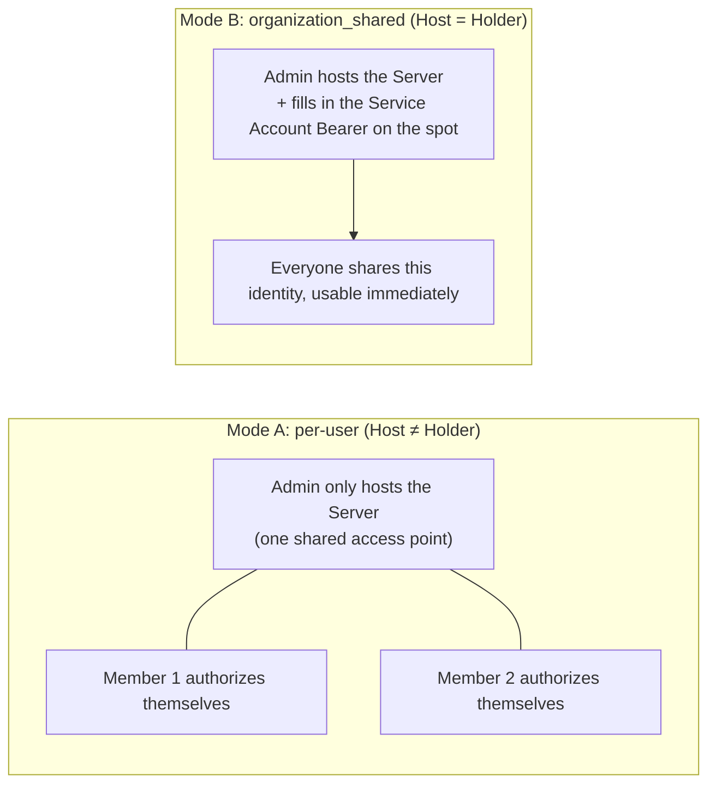
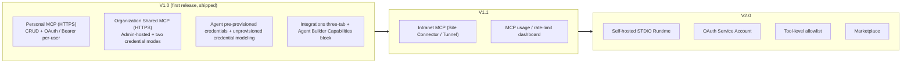

# MCP (Connector) — for human

> This is the product-story version for non-engineering readers. For the **complete product contract + protocol index + security baseline + OAuth registration policy**, see the shipped MCP PRD.
>
> Adjacent PRDs: [`credentials`](./credentials.md) · [`agent-manifest`](./agent-manifest.md) · [`skill-interaction`](./skill-interaction.md) · [`rbac`](./rbac.md).
>
> **Current Project/App boundary note**: New Project/App work should scope MCP servers, bindings, and credentials to Project/App first. Organization-managed servers, per-user credential holder modes, and service-account governance are future extensions unless already required by shipped code. Keep Server / Credential / Binding separation and the rule that credentials never travel with exported Agent packages. See [Project / App Boundary](./project-app-boundary.md).

---

## One-Line Positioning

> **"Users only authorize, Admins only host — and the Agent builder decides whether credentials travel with the Agent."**

MCP (Model Context Protocol) is how a Mosoo Agent plugs into the **company's real tool chain**: Figma, Notion, Lark Base, Jira, an internal ERP, or a company-built API all hook in here. An Agent that can only chat isn't truly "getting work done"; it only counts once it can connect to the company's tool chain.

V1 is scoped to **Remote HTTPS Only**: cloud-hosted first-party MCP endpoints (Linear, GitHub, and the like) plus company-built HTTPS MCP. STDIO, third-party hosting platforms, and intranet tunnels are all pushed to V2+.

---

## 1. The User Problem

After the pivot, Mosoo is an AMS (Admin Management System). The real audience for MCP is four kinds of governance roles, not ordinary members:

| Role                     | What they typically say                                                                                                                                                   |
| ------------------------ | ------------------------------------------------------------------------------------------------------------------------------------------------------------------------- |
| **AI Lead / Officer**    | "I need to connect our company-built Jira and internal ERP to Agents, and the authorization flow can't get employees stuck."                                              |
| **IT / Platform Ops**    | "I host the company's MCP, but I need to decide up front, at configuration time, whether each employee uses their own token or everyone shares a single service account." |
| **InfoSec / Compliance** | "Employee tokens must be encrypted at rest, and the OAuth hops and callbacks must be traceable."                                                                          |
| **FinOps / Finance**     | "The LLM cost generated by MCP calls must be splittable by department and by Agent, so we can compute ROI."                                                               |

Ordinary members have a need too — "connect my Figma account for my own Agent to use" — but in this PRD they are credential holders, not the primary persona.

---

## 2. Three Product Concepts (Don't Conflate Them)

In Mosoo, MCP is split into three independent things:

| Concept        | Plain-language definition                                                                                                                                    | Who creates it                                                                                                                       |
| -------------- | ------------------------------------------------------------------------------------------------------------------------------------------------------------ | ------------------------------------------------------------------------------------------------------------------------------------ |
| **Server**     | An MCP access point: name + HTTPS URL + description + which authorization method to use. **This is just access-point metadata; it contains no credentials.** | A Member themselves (personal) or an Admin (organization-managed)                                                                    |
| **Credential** | The authorization credential for a given Server: an OAuth token or a Bearer token. **Stored encrypted in the Vault; the UI never echoes the secret back.**   | In per-user mode, generated by the credential holder themselves; in organization_shared mode, filled in by the Admin on their behalf |
| **Binding**    | Which Servers (and optionally which pre-provisioned credentials) are attached in an Agent's configuration                                                    | Travels with the Agent. When an Agent is forked, **credentials do not travel with it** (a hard security boundary)                    |

**Why split into three layers**: whether a Server exists is one thing, who holds a credential is another, and which Agent is using it is yet another. These three things are kept strictly separate in the data model, so the same Server can be authorized independently by many people and referenced by many Agents at once, and deleting one Agent does not take away other Agents' credentials.

---

## 3. Two Credential Modes (Key V1 Decision)

When an Admin hosts an organization-managed Server, they must pick a **credential mode**, one of two:

| Mode                                        | Who holds the credential                                                      | When to use it                                                                          |
| ------------------------------------------- | ----------------------------------------------------------------------------- | --------------------------------------------------------------------------------------- |
| **`user` (per-user, default)**              | Each Member authorizes themselves and holds their own token                   | MCP that returns different data per employee identity: Jira / GitHub / CRM / HR systems |
| **`organization_shared` (Service Account)** | The Admin configures a single Bearer token, and everyone shares this identity | Public MCP readable by everyone: company FAQ / knowledge base / public datasets         |

**The key difference between the two modes**:



**V1 Service Account limitation**: only simple HTTP Bearer is supported. OAuth Service Account is deferred to V2 because of its multi-hop complexity.

**Default is per-user** (isolation first).

A **personal Server** always uses per-user credentials — the creator holds their own and **cannot share them** (to share, an Admin must recreate it as organization-managed with explicit ownership and credential history).

---

## 4. Two Main User Journeys

The MCP product is composed of two orthogonal journeys, both of which happen in **Integrations** and **Agent Builder**.

### Journey A — Agent Builder perspective: attach an MCP inside an Agent

The Agent author adds an MCP in the "Capabilities" block:

```text
Agent Builder
  └─ Capabilities block
     └─ + Add MCP
        ├─ Pick from organization-managed (hosted by an Admin)
        ├─ Pick from your personal Pool (ones you configured before)
        └─ If you need a new custom MCP
             └─ First go to Integrations → MCP Servers to create it, then come back and bind it

    ↓ After selecting a Server

  Authorization strategy (the builder picks one of two):

  ├─ 🔐 Option 1: Authorize now, credential ships with the Agent
  │       · The builder completes OAuth / fills in the Bearer right now
  │       · At runtime, all callers share the builder's credential
  │       · Use case: public upstream Agents, or when you don't want every user to re-authorize
  │
  └─ 🌱 Option 2: Stay unauthorized (recommended default)
        · After the Agent is published there is no pre-provisioned credential
        · Each caller completes authorization under their own identity
        · Credentials are stored per (User × Server)
        · Use case: personal data is involved, or multi-person collaboration
```

**The choice belongs to the Agent Builder**; the platform does not decide for them. In V1, the Agent Builder is only responsible for "selecting and binding existing MCP"; it **does not take on the job of creating new Servers**.

### Journey B — Integrations page perspective: manage your own MCP

The entry point is `/integrations` → `MCP Servers`, with three tabs:

| Tab                      | Who can see it  | What they can do                                                                                                                                                                                                                                                                 |
| ------------------------ | --------------- | -------------------------------------------------------------------------------------------------------------------------------------------------------------------------------------------------------------------------------------------------------------------------------- |
| **My MCP**               | Everyone        | Add your own HTTPS MCP / authorize / revoke / delete                                                                                                                                                                                                                             |
| **organization-managed** | Everyone        | See Servers hosted by an Admin. In per-user mode, members authorize themselves (currently primarily via pre-connection, with on-demand in-session authorization to follow); in Service Account mode it is usable immediately with no Connect button; the Server cannot be edited |
| **Management**           | Org admins only | Host an Organization HTTPS MCP, **choosing the credential mode (per-user / Service Account) on the spot**; view member authorization coverage                                                                                                                                    |

**Typical scenarios**:

- A Member adds their own Figma under "My MCP," then goes to Agent Builder and binds it to an Agent they created.
- An Admin, in the "Management" tab, hosts the company-built Jira (`https://mcp.company.com/jira`), selecting `user` mode + Bearer. A Member opens the "organization-managed" tab, sees the Jira badge "per-user" with status "Pending connection" → clicks Connect → pastes their own Jira token → it is stored encrypted.
- The Admin separately hosts a company FAQ MCP, selecting `organization_shared` mode and filling in the Service Account Bearer on the spot. A Member opens the "organization-managed" tab, sees the FAQ badge "Service Account · configured by admin" with status "Authorized," and **no Connect button**.

**The Management tab's hosting dialog (a key design)**: the Admin clicks "Host Organization MCP" to open a dedicated `HostOrganizationMcpDialog` (separate from the personal `AddMcpDialog`). Its fields include Name / URL / Description / **a credential-mode choice between the two**.

---

## 5. Collaboration Model (Two Orthogonal Dimensions)

| Dimension            | Options                                                    | Who decides                                                   |
| -------------------- | ---------------------------------------------------------- | ------------------------------------------------------------- |
| **Server ownership** | personal / organization-managed                            | The creator themselves                                        |
| **Credential mode**  | per-user (default) / organization-shared (Service Account) | The Admin chooses when hosting an organization-managed Server |

**The two dimensions are orthogonal, but there are constraints**:

- A personal Server **always** uses per-user credentials (cannot be shared).
- Only an organization-managed Server offers the per-user vs organization-shared choice.

> **The permission matrix lives in RBAC**: the specific MCP Action × Role matrix (`owner` / `admin` / `member` + asset-level `creator` passthrough) is in [`rbac`](./rbac.md) §3.5. This PRD only describes the two-dimensional collaboration semantics specific to MCP.

---

## 6. Credential Lifecycle (Events the User Perceives)

| Event                                      | What the user perceives                                                                                                                                         |
| ------------------------------------------ | --------------------------------------------------------------------------------------------------------------------------------------------------------------- |
| User actively revokes                      | The credential is marked revoked; the next call triggers re-authorization                                                                                       |
| Token expires                              | If there is a refresh_token, it refreshes automatically; if not, it follows the revocation path                                                                 |
| **Credential becomes invalid mid-session** | If the current request already holds a token, it completes; the next call triggers inline re-authorization on demand — **the session is not interrupted**       |
| **Agent forked to another Organization**   | **The Agent's pre-provisioned credentials do not travel with it**; the forked Agent shows "Authorization required" (a hard security boundary, not configurable) |
| Admin disables the Server                  | The credential is retained; once the Server is re-enabled it is usable directly                                                                                 |
| Admin deletes the Server                   | The associated credentials are cascade-deleted                                                                                                                  |

---

## 7. Who Can Do What

| Operation                                 | Personal Server                  | Organization Shared Server                                                                                            |
| ----------------------------------------- | -------------------------------- | --------------------------------------------------------------------------------------------------------------------- |
| Add                                       | The owner themselves (HTTPS)     | Admin only (HTTPS)                                                                                                    |
| Enable / Disable                          | The owner themselves             | Admin (takes effect across the whole Organization)                                                                    |
| Delete                                    | The owner themselves             | Admin only, with an "N Agents are currently using this" confirmation                                                  |
| Authorize / Revoke (per-user mode)        | The credential holder themselves | The credential holder themselves (**an Admin has no right to revoke a Member's per-user credential on their behalf**) |
| Authorize / Revoke (Service Account mode) | N/A                              | Only the Admin can set / replace / clear it; Members have no right to operate on it                                   |

**Cascade effects of disable / delete**:

- Admin disables an Organization Shared Server → the next call from an Agent in use fails, with the prompt "This capability has been disabled by the administrator," and **the session is not interrupted**.
- Admin deletes an Organization Shared Server → a confirmation dialog + cascade deletion of credentials (including the Service Account credential).
- Admin clears the Service Account credential but keeps the Server → that Server becomes "Pending configuration" for all Members.
- Personal Server deletion → only affects the Agent Bindings the creator made themselves.

---

## 10. Phased Roadmap



---

## About the MCP Protocol Itself

MCP is an open protocol (`https://modelcontextprotocol.io/`). The core mental model:

- **Tools** = executable functions the AI can call (used in V1, e.g. `JIRA_CREATE_ISSUE`)
- **Resources** = data sources the Server provides (not in V1)
- **Prompts** = reusable templates (not in V1)

In the protocol, Mosoo plays the role of **MCP Host + Client**: it hands the list of available MCP to the corresponding Agent runtime, and the runtime decides which tools to call. V1 implements only the **Streamable HTTP** transport (remote), not STDIO (local process).

**Sampling / Elicitation** — these two client primitives are outright rejected in V1: Mosoo does not allow a Server to make a reverse request for host LLM completion, nor does it allow a Server to pop up and ask the user for additional information.

---

_This for-human version reflects the product model and capability boundaries that shipped in MCP V1. After the pivot, the consumption side (Work Page / Default Agent) was removed and is out of scope. For the concrete interface shapes, protocol details, and security baseline, refer back to the shipped MCP PRD._
