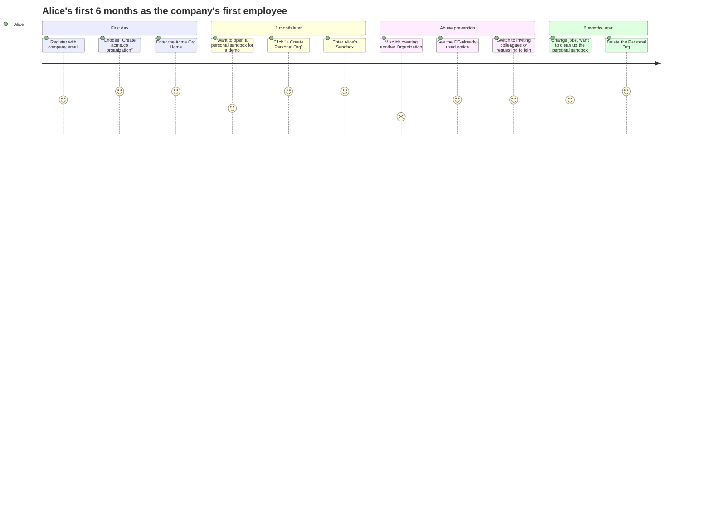
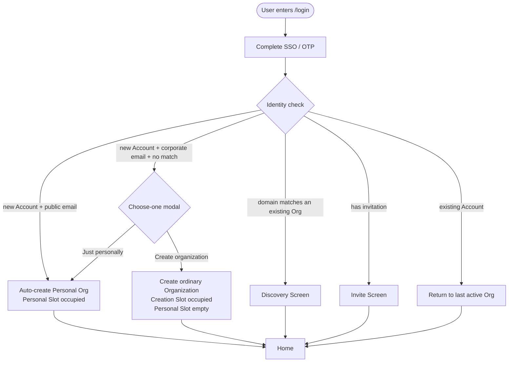
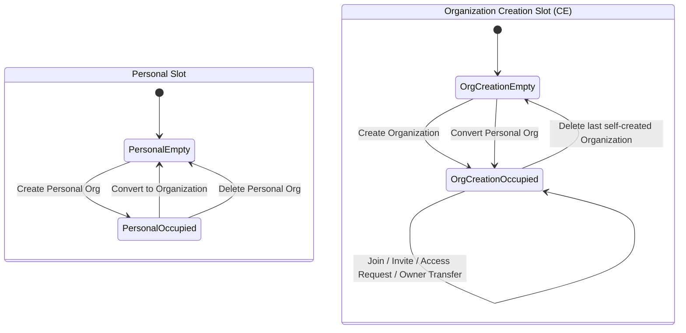
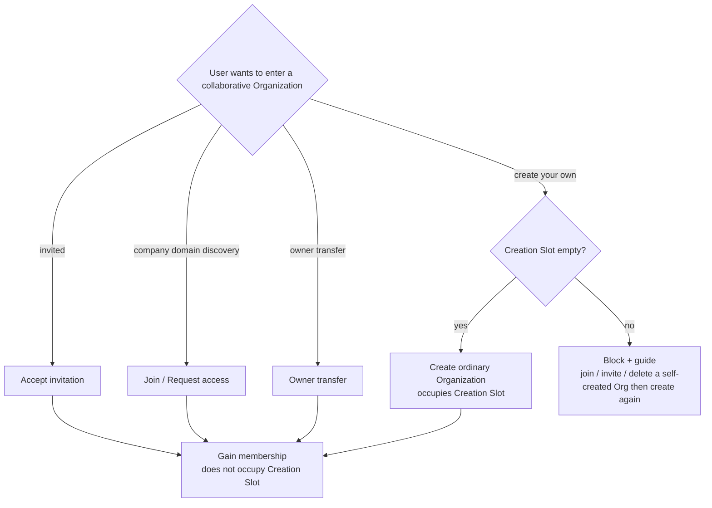

# Organization Kind & CE Creation Slots — for humans

> This is the product-story version for non-engineering readers. The full engineering contract lives in the shipped PRD of the same name.
>
> This PRD is a **targeted revision** of [Identity & Access](./identity-access.md). It changes only three things: the Personal Org is no longer "once in a lifetime," the `kind` field is reintroduced, and CE limits each person to self-creating at most one ordinary Organization. Everything else — SSO login, Members & Access, email templates, RBAC — stays the same.

---

## One-line positioning

A single Mosoo account **may have at most one personal sandbox at any given moment** (the Personal Org), and the CE edition allows **self-creating at most one ordinary Organization**. When registering with a company email, the user **explicitly chooses** whether they are opening a collaborative organization or a personal sandbox this time, and is **no longer silently forced into the "personal slot."**

Analogy:

> Like Notion / Linear: a single login identity can belong to multiple workspaces at once, but **"belonging to many" is not the same as "unlimited self-creation."** CE does not yet offer plans, billing, or admin approval, so we use a single slot to hold back abuse.

---

## 1. The user problem

**Story A: Alice, the company's first employee**

The first employee of Company A, Alice, registers with `alice@acme.co`. Under the old rules, the system automatically creates an "Alice's Org" for her as her Origin Org. A week later, CTO Bob joins, and Alice upgrades that Org into the company `Acme`, while she remains the owner.

At this point her "personal slot" is already taken by Acme. She wants to spin up a personal sandbox for herself (to test new agents or look at demos) — and the system refuses, because the Origin Org is **once in a lifetime**. Her only way out is to delete Acme, which is obviously impossible. Likewise, if she later moves to a new company, Beta, and wants to reopen something as an individual, she can't.

**Story B: The CE abuse boundary**

The `+ Create Organization` action at the bottom of the Org Switcher is one-click creation: a user can repeatedly click out multiple Organizations with the same name. The Personal Org already enforces "one per person" to prevent arbitrage, but **an ordinary Organization is still a top-level tenant boundary** — each one opened brings the full cost of member invitations, Credentials, Access Requests, auditing, and domain discovery. CE should not accidentally implement "belonging to multiple organizations" as "unlimited self-creation of company organizations."

Common complaints owners hear:

- "After I registered with my company email, the system just decided for me that 'this is the company Org,' and now I can never open a sandbox again."
- "I accidentally clicked out three Orgs with the same name, and when deleting them I had no idea which was which."
- "Can I join the Orgs of two different companies?" — Of course you can, but you used to think you had to open one yourself for each.

---

## 2. Goals

### What an account owner can do

- When registering with a **company email**, explicitly choose "Create acme.co organization" or "Just trying it personally," **without being silently assigned a slot**
- When registering with a **public email** (gmail / outlook / qq, etc.), behavior is unchanged: automatically get a Personal Org
- Open / close a personal sandbox at any time: delete it and you can open one again — **it no longer permanently occupies the quota**
- **Explicitly Convert** a Personal Org into a collaborative Organization; immediately after Convert, you can create another personal sandbox
- In the CE edition, **self-create at most one** ordinary Organization; to collaborate with another company, use "be invited / domain discovery / request to join / owner transfer"
- Joining **multiple** Organizations is completely fine — the slot only limits "creating your own," not "joining"

### Platform guarantees

- Drop the "Origin (birth)" mental model and replace it with **kind** (the current type, which can transition)
- A Personal Org cannot invite people, does not participate in domain discovery, and cannot independently claim a primary domain — to collaborate, you must Convert first
- When a Personal Org claims a company domain, a one-time "Convert + claim" confirmation pops up, to avoid "I thought I was just filling in a domain"
- Entry points are greyed out with an explanation; no one-click silent creation

---

## 3. Concept definitions

| Term                           | Plain language                                                                                                                                                                                                                                                                                                              |
| ------------------------------ | --------------------------------------------------------------------------------------------------------------------------------------------------------------------------------------------------------------------------------------------------------------------------------------------------------------------------- |
| **Organization (Org)**         | Mosoo's single top-level tenant; an account enters one or more Orgs through membership. Mosoo has only two layers: `Organization → Account`.                                                                                                                                                                                |
| **Ordinary Organization**      | An Org with `kind=team`. Its meaning is "it exists for collaboration / a company / a project" — it can invite people, receive access requests, and claim a primary domain. In the UI it is simply called Organization; "team" is not exposed.                                                                               |
| **Personal Org**               | An Org with `kind=personal`. "My personal sandbox" — it can have only the owner as its single member and cannot be joined. Each account has **at most one owner membership at any moment**.                                                                                                                                 |
| **Personal Slot**              | The derived state of whether you "have already used up your personal sandbox quota." Used = you can't create another; empty = you can create one.                                                                                                                                                                           |
| **Organization Creation Slot** | The CE limit: the derived state of whether you "can still self-create an ordinary Organization." Used = `+ Create Organization` and the Convert entry are greyed out; empty = you can create one.                                                                                                                           |
| **Self-created Organization**  | An ordinary Organization that you **actively created yourself** via `Create Organization`, or that you `Convert`ed from a Personal Org. An Organization obtained via **invitation / domain discovery / access-request approval / owner transfer** does not count as self-created and **does not occupy** the Creation Slot. |
| **Convert to Organization**    | An explicit action triggered by the Personal Org owner: change `kind=personal` to `kind=team`, releasing the Personal Slot while **occupying** an Organization Creation Slot. **Irreversible**.                                                                                                                             |
| **Public / corporate email**   | Follows the public-email allowlist in [Identity & Access](./identity-access.md) §3 (gmail / outlook / qq, etc.). On the allowlist = public email; otherwise = corporate email.                                                                                                                                              |

> ⚠️ **Deprecated terminology**: Origin Org, "birth," "once in a lifetime." Replace these everywhere in docs and UI copy.

---

## 4. User journey: Alice's first 6 months as the company's first employee

| Stage               | Action                                               | Mood | Experience                                                                                                                                                |
| ------------------- | ---------------------------------------------------- | ---- | --------------------------------------------------------------------------------------------------------------------------------------------------------- |
| First day           | Registers with `alice@acme.co` (no domain match)     | ↗    | A choose-one modal pops up: primary option "Create acme.co organization"; secondary option "Just trying it personally"                                    |
| 1 week later        | Wants to open a personal sandbox to look at a demo   | ↗    | In the Org Switcher she sees `+ Create Personal Org` (**the Personal Slot is still empty**), and one click opens it                                       |
| Misclick prevention | Wants to create yet another Organization             | ↓→↑  | `+ Create Organization` is greyed out with the explanation "CE allows one organization you create"; she switches to inviting / requesting to join instead |
| 6 months later      | Changes jobs, wants to clean up the personal sandbox | ✓    | Delete the Personal Org → the Personal Slot is released, and she can reopen one whenever she likes                                                        |

---

## 5. Routing at registration

Key points:

- A public email **does not** trigger the choose-one modal (unchanged) — the shortest path for individual players
- A corporate email triggers it only when there is **no domain match** — if there is a match, it goes to Discovery (priority: Discovery > kind selection)
- Closing / refreshing the choose-one modal = treated as incomplete onboarding; it pops up again on the next login

---

## 6. The state machine of the two slots

**Core points**:

- Belonging to multiple Orgs is expressed through the membership table — invitation, domain discovery, access request, and owner transfer all **do not occupy** the Creation Slot
- The slot only limits "self-creation" and "Convert"
- After you delete the last self-created ordinary Organization, the Creation Slot is released and you can create again
- Convert releases the Personal Slot while **occupying** the Creation Slot; if the Creation Slot is already occupied, you cannot Convert

---

## 7. Product boundaries of Create / Join

---

## 10. Information architecture (before / after)

```mermaid
flowchart LR
  subgraph Before["Before"]
    B1["Origin Org<br/>(once in a lifetime, not releasable)"]
    B2["Org has no kind distinction"]
    B3["Onboarding: public / corporate email<br/>uniformly auto-created"]
    B4["CE: + Create Organization<br/>one-click, unlimited"]
  end
  subgraph After["After (this PRD)"]
    A1["Personal Slot derived state<br/>≤ 1 per Account at any moment"]
    A2["Organization Creation Slot (CE)<br/>≤ 1 self-created team per Account"]
    A3["Organization.kind:<br/>personal / team"]
    A4["Onboarding routing:<br/>public = Personal, corporate = choose-one"]
    A5["Convert to Organization<br/>releases the Personal Slot<br/>and occupies the Creation Slot"]
    A6["Personal Org does not support invitation / domain claim"]
    A7["Belonging to multiple Orgs is still expressed via membership<br/>not subject to the Creation Slot limit"]
  end
  Before ==> After
```

---

> The full engineering contract lives in the shipped PRD of the same name.
