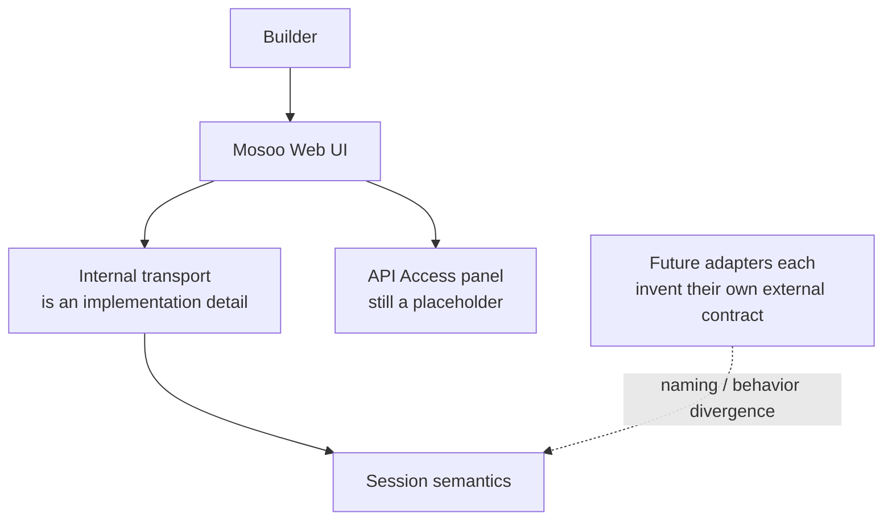
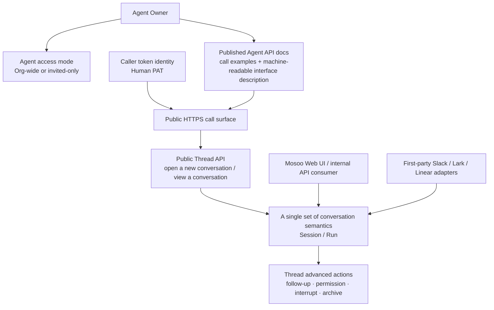

# Published Agent API Surface — for humans

> This is the product-story version for non-engineering readers. The full engineering contract (interface shape, machine-readable interface description, token implementation, events projection rules, receive-window semantics) is described in the shipped engineering PRD.
>
> This document is aligned with the 2026-05-28 Thread-first public API lock.

---

## One-line positioning

Once a Mosoo Agent is published, it gains a service surface that **can be called over public HTTPS**. This surface promises: it has docs, copy-and-run call examples, a machine-readable interface description, clear authentication and attribution, and a product-level answer to **who is allowed to call it and whose permissions the call runs under**.

An analogy:

> It's the same thing OpenAI and Anthropic have both done — turning a model or an agent into a callable API. Mosoo's promise is: once published, you're no longer limited to "clicking on this Agent inside the Web UI." You can also invoke it directly from the CLI, a customer backend, or an automation to get work done.

But this public call surface **only exists on a Published Agent**. Channels (Slack / Lark / Linear / Discord / WeChat) take their own path and do not call it. The Mosoo Web UI can reuse the same underlying semantics, but it does not necessarily go through the public token gate.

---

## 1. User problems

### 1.1 Agent Owner / Builder

A Builder can already configure an Agent in Mosoo, invite cooperators, and click Publish, but the "API Access" panel is not yet a genuinely deliverable developer entry point. What they want to say is:

> "Before I publish, I want to take a look at what this Agent actually looks like once it's exposed as an API, so I know whether it's ready."
>
> "I want to confirm that once this Agent is published it really can be called externally, and that I get ready-made call examples."
>
> "I want to decide whether this Agent can be called by everyone in the Organization, or only by the few people I've invited."
>
> "When it's called externally, whose permissions are used to access Space, credentials, and MCP? Can the Thread attribution show who made the call?"

### 1.2 Internal Web UI + API Consumer

Mosoo's own Web UI and internal system integrations need to call Agents, but they should not be forced to understand implementation axes like the runtime driver, vendor-native resume pointers, or the sandbox cwd. What they want to say is:

> "Give me a stable mental model: create a thread → query a thread → continue the same thread when needed."
>
> "Follow-ups, permission confirmations, interrupts, archive / delete — let me do all of these on the thread as the main axis. Don't make me learn a separate session API."
>
> "How I log in, get admitted, and get attributed in the Web UI should be the same as when I call in through the API. Don't split it into two systems."
>
> "I want to add / remove / list a piece of material for this thread directly. Don't make me first learn where files live, and don't make me learn some vendor's file API."

### 1.3 First-party Slack / Lark / Linear Adapter

Mosoo's own channel adapters need to turn a Slack mention, a Lark message, or a Linear issue trigger into Agent work, but an adapter is a **consumer** — it is not the primary content-model host of this public API. What they want to say is:

> "I'm responsible for my own host installation, signing, thread binding, and reply write-back — don't mix these into the Agent Session API."
>
> "I shouldn't have to pretend to be a Personal token caller; I have my own channel binding."
>
> "I don't care whether the backend is the Claude Agent SDK, an OpenAI runtime, or something else — give me a surface-neutral set of conversation semantics and that's enough."

### 1.4 Future external developers / customer backends

The first wave of M2D consumers is primarily Mosoo internal and first-party adapters, but once a Published Agent commits to public HTTPS, it will naturally be called by customer backends initiating HTTPS calls from their own services.

> "I want to get a token, call this Agent from our backend to accomplish some task, and then write the result back into our ticketing system."

So this phase must be designed with a public-API mental model. It can't be built as a temporary, frontend-only internal route.

---

## 2. Concept definitions

| Term                            | Plain-language explanation                                                                                                                                                                                                                                            |
| ------------------------------- | --------------------------------------------------------------------------------------------------------------------------------------------------------------------------------------------------------------------------------------------------------------------- |
| **Published Agent API Surface** | The public HTTPS call surface that an Agent exposes to API consumers after publishing. Includes docs, call examples, and authentication and admission semantics.                                                                                                      |
| **API Consumer**                | A system that calls a Published Agent. Primarily aimed at customer backends, CLIs, and automations; the Mosoo Web UI and first-party adapters reuse the same underlying semantics, but do not necessarily go through the public token gate.                           |
| **Thread**                      | The "one unit of work" context that an external caller creates and continues. The first screen of the public docs only talks about opening a new conversation / viewing a conversation, and does **not** require the caller to understand session mechanics first.    |
| **Human PAT**                   | Personal Access Token. Identifies a **person** as the caller. It carries no per-agent scope, does not replace vendor credentials, and is not involved in BYOK.                                                                                                        |
| **Caller**                      | The principal that issues a request holding a PAT. Used for admission and attribution; it is **not** the same as the executor.                                                                                                                                        |
| **Agent Owner**                 | The person who creates and owns the Agent's service identity. **The Agent's execution permissions are understood as an RBAC proxy of the Owner.**                                                                                                                     |
| **Cooperator**                  | A collaborator that the Agent Owner has explicitly authorized to access the Agent.                                                                                                                                                                                    |
| **Organization-wide access**    | The Owner allows every valid member in the Org to call the Agent.                                                                                                                                                                                                     |
| **Invited-only access**         | The Owner allows only invited cooperators to call the Agent.                                                                                                                                                                                                          |
| **Admission**                   | The admission decision made before entering the Agent service: whether the Agent has been published, whether the caller is authenticated, whether Org membership is valid, and whether the Agent's access mode allows it.                                             |
| **Execution Actor**             | The permission principal that the Agent actually acts as when accessing Space / credentials / MCP. **It is the Agent Owner, not the caller.**                                                                                                                         |
| **SessionFile**                 | A copy of material that a user attaches to a given thread; its lifecycle follows the thread. The Files Panel and the API list share a single product truth.                                                                                                           |
| **Pet / Cattle**                | The product language for explaining lifecycle and Sandbox mental models (Pet = a stable Sandbox shared across multiple sessions; Cattle = an independent Sandbox per session). **They are not two separate call surfaces** — the way you call them is identical.      |

---

## 3. Information architecture (Before / After)

### 3.1 Before — the public API is still a placeholder

### 3.2 After — Thread-first public call surface + a single product contract

Key changes:

- API Access is no longer placeholder copy, but a real developer entry point that you can copy and call immediately.
- The default language of the public entry point is **Thread**, not Session. The internal conversation context still exists, but it's just an implementation axis that the first screen of the docs doesn't need to understand.
- Both the Web UI and the first-party adapters consume **the conversation semantics under the same product contract**, but the adapters don't go through the public token gate.

---

## 6. Pet / Cattle are not two separate APIs

> "If my Agent is a Pet or a Cattle, do I have to choose different ways to call it?"

**No.**

- The way you call them is identical — the system will tell you whether this Agent is a Pet or a Cattle, but there's no difference in how you call it.
- **Pet**: Multiple sessions share one stable Agent Sandbox; continuity comes from Pet Sandbox Backup/Restore plus the platform's session history.
- **Cattle**: Each session uses an independent Session Sandbox. When you continue the same session and the old Sandbox has already been destroyed, the runtime simply builds a new one, inheriting only the platform-persisted conversation history, metadata, and explicit Space / Backup content — it does **not** return a "cannot continue" error, and it does not try to restore the old Sandbox's transient state.
- The main semantics — PAT, access mode, cooperator, SessionFile, archive / delete — are **exactly the same** for Pet and Cattle.

---

> The full engineering contract is described in the shipped engineering PRD.
