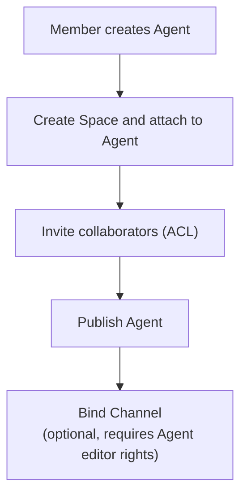
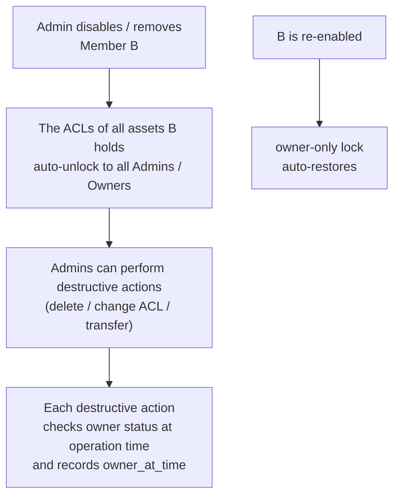

# RBAC — for humans

> The Mosoo RBAC product story for non-engineers. The **complete engineering contract (Action IDs / matrices / field-level permissions)** lives in the full RBAC PRD.
>
> This document only answers "who can do what" and "who can stop whom." Action IDs, lookup tables, and schema fields are out of scope here.
>
> **Current Project/App boundary note**: RBAC is historical foundation and future governance guidance. The current Project/App cut assumes a single Organization owner; Project access maps to that owner. Owner / Admin / Member matrices, admin reach-through, member requests, and asset takeover must not block Project model, App routing, or Project-owned resource work. See [Project / App Boundary](./project-app-boundary.md).

---

## In one sentence

Mosoo's permission model is **3 organization roles × 5 kinds of user assets + 1 kind of work object**, all statically enumerated — there is no dynamic capability editor.

In day-to-day use, there are **only two principles to remember**:

1. **Visible / usable / shared with you ≠ being able to manage it.** Being able to see it, run it, or have it shared with you does **not**, by default, mean you can delete it, change its ACL, copy it, open a terminal, or view its cost ledger.
2. **Admin is the one who can reach through everything, but while the asset owner is still around, the "destroy the asset" tier stays locked.** An Admin can edit / publish / run an asset on the owner's behalf, but **as long as the owner is still in the Org**, the three actions of deleting the asset, changing its ACL, and transferring it are reserved for the owner. The moment the owner leaves the Org, the Admin is automatically unlocked — no "take over" button required.

Analogy:

> Think of the IT Admin at a company. They can remotely log into any machine to install software or change configs for you; but as long as you're still employed, your desk, your file cabinet, are yours to manage. The day you leave, IT automatically gains the right to clear the desk, hand things over, and change the door access — no "request to take over" form needed.

---

## 1. User problems

After the pivot, Mosoo is a self-managed Agent platform for a single organization — it is not Slack or Notion. These are the kinds of things people in the org say over and over:

**What Owners / Admins say:**

- "Member B created an Agent — can I delete it?"
- "If an Admin reaches through a Space, does that mean they can also delete the files inside it?"
- "This Agent's Sandbox is stuck — as the Admin, can I reset it directly?"
- "Member B has left. What happens to all the Agents and Spaces they set up? Do we need a 'take-over request' workflow?"
- "Member B is gone, but the bot they configured is still running in Slack. Is it going to suddenly die?"

**What Members say:**

- "I created the Agent, so I'm its owner. I'm fine with an Admin editing it, but **don't delete it while I'm still here.**"
- "Hands off my personal MCP credentials — an Admin shouldn't view them or disconnect them on my behalf."
- "Someone shared a Skill with me — can I fork it as my own?"
- "Can I see how much I personally spent inside a Public Agent?"

**What Finance / Compliance say:**

- "Who can see the Org's overall cost ledger? Can a Member read it through a side channel?"

**Current pain points:**

- What an Admin can do in each module is passed around by word of mouth or scattered across individual PRDs.
- Boundary questions like "Does Admin reaching through a Space include delete file?" get debated back and forth repeatedly.
- When engineers write permission checks, they mix if/else with the RBAC table, so the code can't be statically reviewed.
- From a Compliance perspective, there's no way to answer "who can do what."

---

## 2. Goals (the shortest answer to "who can do what")

### What Owners / Admins can do

- See the entire organization's members, assets, and cost.
- Invite / approve / disable / remove members (the Owner exclusively holds these five: "promote to Admin / demote from Admin / change the Org's primary domain / delete the Org / transfer Owner").
- **Reach through** any Agent / Space / Skill / MCP / Environment to edit, publish, and run it.
- After an asset owner leaves, **automatically** gain the right to delete / change the ACL / transfer that asset.
- Manage Org-level credentials (Company Provider keys, Organization MCP) and Credential Policy (the BYOK toggle).

### What Members can do

- Create their own Agent / Space / Skill / personal MCP / Environment; **creating it makes them the owner.**
- Manage the ACLs of the assets they created, transfer them to someone else, and delete their own assets.
- Use assets others have shared with them (browse the visible list / call a Published Agent / read and write an authorized Space).
- See their own My Usage, and the per-collaborator cost breakdown of their own Agents.
- Configure / test / delete their own Personal Provider keys (when the BYOK toggle is on and the vendor allows it).
- Connect / disconnect their own per-user MCP credentials.
- Submit an "invitation request": a Member who wants to bring a new person into the Org files a request, which only takes effect once an **Admin approves it**.

### What nobody can do

- **See someone else's private Threads, or send messages or approve permission requests as another caller** (only the Session creator can do this).
- **See Org-level cost / export** (only the Owner/Admin).
- **Open an Agent's Debug Terminal** (allowed only for the Agent owner in person — neither the Agent admin nor the Org admin can do this).
- **Share a personal MCP** (hard-locked; to share it, ask an Admin to rebuild it as an Organization MCP).
- **See someone else's personal Provider key value or per-user MCP connection status** (fully personal).

---

## 3. Concepts + relationship locks

### A few terms

| Term                           | Plain-language definition                                                                                                                                                                                                     |
| ------------------------------ | ----------------------------------------------------------------------------------------------------------------------------------------------------------------------------------------------------------------------------- |
| **Org role**                   | `owner` / `admin` / `member` — three tiers, evaluated only at the Org level. A fourth read-only compliance tier is out of scope for this release.                                                                             |
| **Asset owner**                | The person who created an asset, automatically granted "the highest asset-level role on that asset." This is a dimension **orthogonal** to the Org role.                                                                      |
| **Asset**                      | An object a user can directly create, share, delete, or select. Mosoo locks this to 5 kinds: **Agent / Space / Skill / MCP Server / Environment.**                                                                            |
| **AgentSession (work object)** | A single working context between a caller and a given Agent. **It is not an asset** — it has no ACL, cannot be shared, and cannot be transferred. Its lifecycle belongs to the Session creator alone.                         |
| **Admin reach-through**        | An Org `admin` can edit / publish / run any asset by default, but the "destroy the asset" tier (delete / change ACL / transfer / reset) is locked while the asset owner is still around.                                      |
| **Org owner break-glass**      | An Org `owner` can delete / change the ACL / transfer any asset **at any time**, without waiting for the asset owner to leave.                                                                                                |
| **Policy, not state**          | "Owner leaves → Admin auto-unlocks" is a **decision rule**, not a data migration. There is no claim API and no scheduled job that rewrites the owner field. The moment the owner returns, the lock is automatically restored. |

### Who owns the three key actions (the most frequently asked question)

| Who                                          | Edit / Publish / Run                                          | Delete / Change ACL / Transfer                                  | Open Terminal            |
| -------------------------------------------- | ------------------------------------------------------------- | --------------------------------------------------------------- | ------------------------ |
| **Asset owner (active)**                     | ✅                                                            | ✅ (exclusive)                                                  | ✅ Agent owner only      |
| **Org admin**                                | ✅ reach-through                                              | ❌ (while owner is active); ✅ auto-unlocked after owner leaves | ❌                       |
| **Org owner**                                | ✅ reach-through                                              | ✅ at any time (break-glass)                                    | ❌ (must transfer first) |
| **ACL collaborator (the shared-with party)** | Depends on the specific ACL tier (read / edit / user / admin) | ❌                                                              | ❌                       |

---

## 5. User journeys

### A Member self-serves creation and publishing

A Member can go through the entire flow without asking an Admin. Along the way, an Admin can reach through to help edit / publish, but **cannot** delete the Agent or change its ACL while the Member is still active.

### Hand-over on departure (no Claim API)

There is **no** `/claim` API, **no** "transfer-on-leave" cron job, and **no** automatic rewriting of the owner field.
This is purely **decision logic** — before every destructive operation, the backend reads the asset owner's current membership status in real time.

### Transfer (the only way to hand over while the asset owner is active)

| Step        | Action                                                                                          |
| ----------- | ----------------------------------------------------------------------------------------------- |
| 1. Initiate | The asset owner specifies a `newOwnerId` in Settings.                                           |
| 2. Notify   | The designated recipient receives an in-app notification + email.                               |
| 3. Accept   | Automatically revoked if not accepted within 7 days.                                            |
| 4. Complete | The owner field is rewritten; the former owner is automatically demoted to admin / edit / user. |

> The Org owner can **force a one-way, cross-tier assignment** without waiting for acceptance (use case: taking over an asset created by an Admin). An Admin cannot force this — they must go through two-way acceptance.

---
