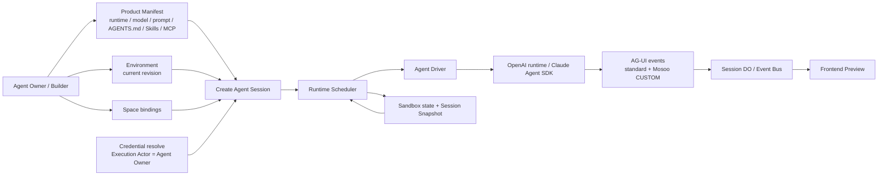
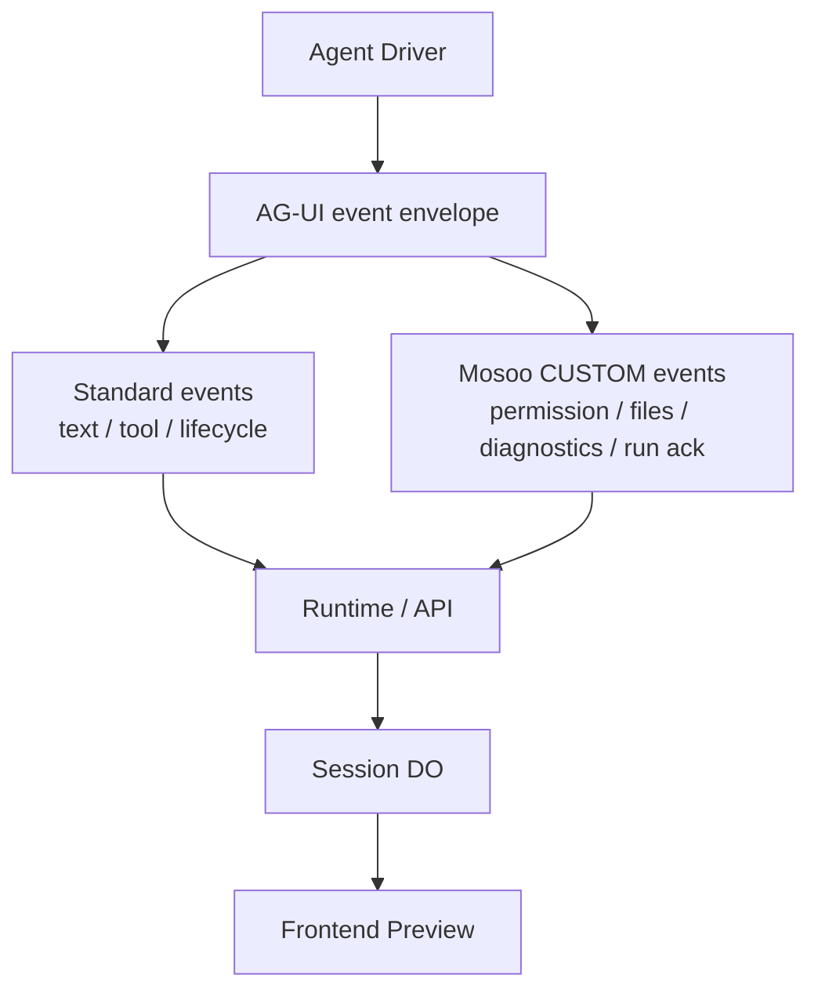
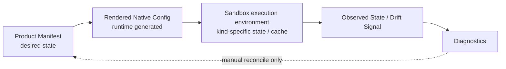
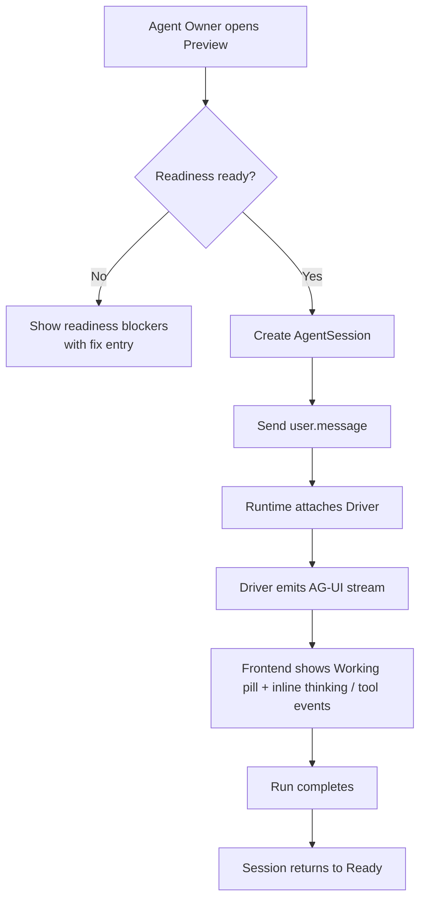
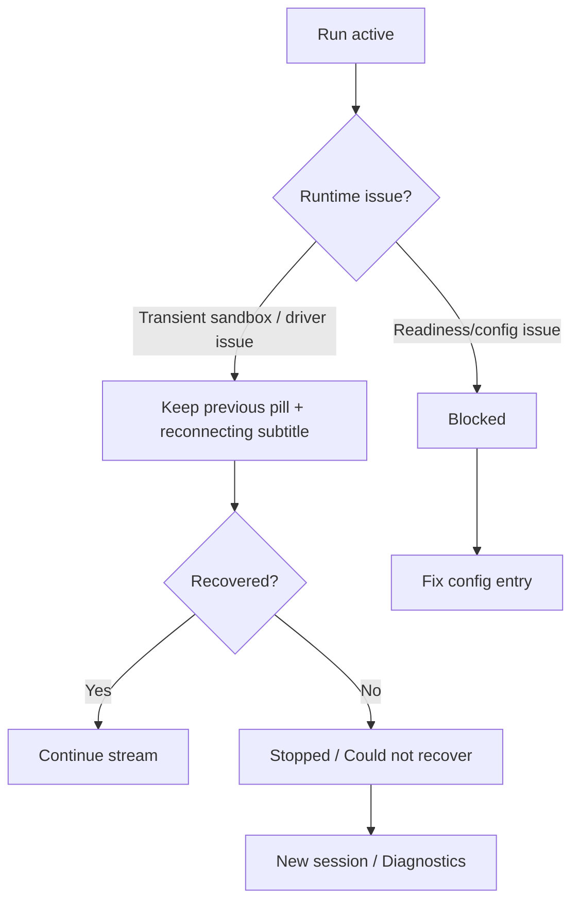

# Runtime Session Kernel — for humans

> This is the product-story version written for non-engineering readers. The complete engineering contract lives in the full PRD.

---

## One-line positioning

The first usable end-to-end loop for the Mosoo Runtime Session Kernel: a hand-configured Agent can actually start up in Preview, work through a unified AG-UI event stream, and let users clearly understand its readiness, running, recovering, failed, and diagnostic states.

---

## 1. The user's problem

Mosoo already has configuration surfaces for Agent Manifest, Environment, Credentials, Spaces, Skills, MCP, and more, along with early frontend versions of Dev / Preview / Sessions / Debug. But the biggest gap today is not "one more missing form field" — it's that the user cannot confirm:

- Whether this hand-configured Agent can actually start at all.
- When startup fails, whether the cause is missing Product Manifest configuration, an unavailable Credential, a non-executable Environment, a Space without permission, or a Driver / native runtime incident.
- Whether the OpenAI runtime, Claude Agent SDK, and the upcoming `opencode` / `openclaw` / `gemini` / `hermes` / `pi` / `cursor-agent` runtimes all share the same product session mental model, or whether each runtime exposes its own thread / session / log rules.
- Which of Dev Chat mock, Preview session, Driver native event, and AG-UI stream is the primary acceptance path.
- Where an Agent's "full native capabilities" should live: polluting the main YAML / Manifest, or kept in kind-specific Sandbox state and Diagnostics.

The job the user actually needs to get done:

1. Create a long-lived Agent.
2. Tell it, using a small set of understandable fields, which runtime / model / prompt / `AGENTS.md` / Skills / MCP / Environment / Spaces to use.
3. Have it preserve the corresponding login state, native configuration, cache, CLI settings, and vendor capabilities by kind — in either the Pet Agent Sandbox or the Cattle Session Sandbox.
4. Be able to copy, publish, recover, and review this Agent.
5. When something goes wrong, know whether the product configuration is wrong or the machine / native runtime had an incident.

So the core of the Runtime Session Kernel is not "unify every vendor schema," but rather:

> Keep the Product Manifest small and stable; preserve full native capability by kind in either the Pet Agent Sandbox or the Cattle Session Sandbox; have the Runtime/Driver translate different runtimes into a unified AG-UI event stream; and have the frontend present runtime states the user can understand in Preview.

---

## 2. Goals

After this round, an Agent Owner / Builder should be able to:

- Start a hand-configured Agent from the Preview panel in Agent Detail and see a real running stream, not a mock conversation.
- See readiness blockers before startup: missing `AGENTS.md`, missing Provider Credential, unavailable Environment, insufficient Space permission, unavailable MCP binding, and so on.
- See 5 user-visible pills in Preview: Setup required, Ready, Working, Needs approval, Stopped. Thinking / tool activity / reconnecting are shown only as inline activity or a subtitle.
- Render text, tools, permission confirmations, file changes, run status, and diagnostic signals on the frontend through the same AG-UI event stream when the Driver / native runtime emits events.
- Know the next step when recovering or failing: wait for automatic recovery, start a new session, fix configuration, or open Diagnostics.
- Trust that advanced state such as login state, cache, and native session state is preserved per kind in the corresponding Sandbox, but never appears in the main Manifest / YAML. A Pet's stable Sandbox state persists through Backup/Restore; a Cattle's transient Sandbox state disappears by default after destruction.

Platform-side goals:

- Treat the Mosoo Session as the source of truth for the Runtime Session, without turning a vendor's native session id into a public id.
- Have the OpenAI runtime and Claude default to their respective vendor-native paths; any new runtime must provide an explicit vendor-specific backend.
- Treat AG-UI not just as a browser protocol but as the unified event protocol the Driver exposes upward; Mosoo custom events are also embedded inside AG-UI `CUSTOM` events.
- Fix the Execution Actor explicitly as the Agent Owner; the Caller is whoever triggered the event and does not by default determine the Agent's Provider Credential, Sandbox state, or runtime identity.

---

## 3. Concept definitions

| Term                   | Product definition                                                                                                                                                                                                                                                                                                                                                                       |
| ---------------------- | ---------------------------------------------------------------------------------------------------------------------------------------------------------------------------------------------------------------------------------------------------------------------------------------------------------------------------------------------------------------------------------------- |
| Runtime Session Kernel | The minimal kernel that takes an Agent from configuration to real execution: it resolves Manifest / Environment / Credential / Space, creates a Session, drives the Driver, and emits the AG-UI stream.                                                                                                                                                                                  |
| Agent Session          | The business conversation a user opens with a given Agent within a given EnvironmentRevision. The Mosoo Session is the source of truth.                                                                                                                                                                                                                                                  |
| Run                    | One execution of a user message / job within a Session. What the user sees is a single "working" turn.                                                                                                                                                                                                                                                                                   |
| AG-UI Upward Protocol  | The envelope through which the Driver uniformly exposes events to the Runtime / Session DO / Frontend. Both standard events and Mosoo custom events live inside AG-UI.                                                                                                                                                                                                                   |
| Mosoo Custom Event     | A Mosoo event embedded inside AG-UI `CUSTOM`, for example permission resolve, run ack, files updated, or diagnostics signal.                                                                                                                                                                                                                                                             |
| Execution Actor        | The Agent's execution identity. Locked this round to the Agent Owner, used for Provider Credential resolve, Sandbox state ownership, and runtime identity.                                                                                                                                                                                                                               |
| Caller                 | The person or surface that triggered this session/event, for example a Builder, API caller, or Channel adapter. The Caller affects entry context but does not by default determine the Provider Credential.                                                                                                                                                                                |
| Product Manifest       | The user-understandable desired state of an Agent: runtime, model, prompt, `AGENTS.md`, Skills, MCP, Environment, Spaces.                                                                                                                                                                                                                                                                  |
| Rendered Native Config | The local configuration or startup parameters the Agent Driver backend generates for the vendor runtime from the Product Manifest. Diagnosable, but not the source of truth.                                                                                                                                                                                                             |
| Agent kind             | `pet \| cattle`. Pet uses a stable Agent Sandbox; Cattle uses a dedicated Session Sandbox.                                                                                                                                                                                                                                                                                               |
| Pet Sandbox            | A stable Agent Sandbox with subject = `agent:{agentId}`. Multiple Sessions share the same Sandbox, default to the same initial working directory, and maintain continuity through Backup/Restore.                                                                                                                                                                                        |
| Cattle Session Sandbox | A dedicated Session Sandbox with subject = `session:{sessionId}`. One Sandbox per Session, destroyed when it ends; a continuation may continue the same product Session, but after the old Sandbox is destroyed it uses a brand-new Sandbox.                                                                                                                                             |
| Sandbox state          | The vendor-native local state, login state, cache, native session state, and rebuildable caches inside a Sandbox. Pet state persists with the stable Sandbox by default; Cattle state is destroyed with the Session Sandbox by default.                                                                                                                                                  |
| Sandbox workspace      | The `/workspace` skeleton the Runtime provisions inside the Sandbox before any session run or Owner debug terminal opens. It contains three subdirectories: `/workspace/cache` (rebuildable cache for Environment packages and setup artifacts), `/workspace/memory` (persistent agent state survived across runs), and `/workspace/se` (per-session execution scratch space).                  |
| NativeRuntimeRef       | The vendor's own recovery pointer, such as an OpenAI runtime thread or a Claude session. It enters internal runtime state only and is never exposed as a public id.                                                                                                                                                                                                                      |
| Diagnostics            | The diagnostic view for Owner/Admin, showing the runtime transport, driver type, rendered config summary, native events, drift signals, and errors.                                                                                                                                                                                                                                      |
| Readiness              | The runnability check before Preview / Publish. When a required item is missing, it blocks the run and provides a fix entry.                                                                                                                                                                                                                                                             |
| Runtime catalog        | The registry of M1 confirmed runtimes (`OpenAI runtime` / `claude-agent-sdk`) plus planned runtimes (`opencode` / `openclaw` / `gemini` / `hermes` / `pi` / `cursor-agent`). Each entry self-reports its visibility, transport, provider/default provider/default model, whether it accepts a custom provider, driver backend, and capabilities / unsupported gaps / envVarRestartKinds. |

---

## 4. Relationship locks: target state

### 4.1 Overall loop

### 4.2 AG-UI is not frontend-only

Decisions:

- The Driver exposes only a unified AG-UI event stream upward.
- Mosoo custom events do not introduce a separate protocol; they are AG-UI `CUSTOM` events.
- The Runtime may handle permissions, attribution, persistence, and filtering, but it does not leak vendor-native events directly to the frontend.
- Ordinary users do not see `native.event` by default; Owner/Admin can see a summary or debug log in Diagnostics.

### 4.3 Product Manifest and Runtime State

Decisions:

- Sandbox -> Product produces only observed state / drift signals by default.
- Terminal or native runtime changes are not automatically written back into the Product Manifest.
- `native.overlay` does not enter the main YAML.
- Advanced native config belongs to Advanced / Diagnostics / Sandbox state, not to the ordinary Agent Manifest editing surface.

---

## 5. User journey map

| Phase                 | User Actions                                                                 | Touchpoints                          | Emotion       | Pain point                                              | Opportunity                                                                                            |
| --------------------- | ---------------------------------------------------------------------------- | ------------------------------------ | ------------- | ------------------------------------------------------- | ------------------------------------------------------------------------------------------------------ |
| Configure Agent       | Builder fills in runtime / model / prompt / AGENTS.md / Environment / Spaces | Agent Manifest form                  | Medium        | Unsure whether the configuration is enough to start     | Readiness gives a clear result before Preview                                                          |
| Start Preview         | Builder clicks Preview / Start session                                       | Preview panel                        | High          | Worried it is still a mock                              | A real Session + AG-UI stream                                                                          |
| Observe the run       | Builder watches the Working pill + inline thinking / tool events             | Chat stream / tool cards             | High          | Unsure whether the agent is stuck                       | Status language like the OpenAI runtime / Claude Code                                                  |
| Wait for confirmation | Driver requests to run a command or access a resource                        | Approval card                        | Medium        | Unsure of the risk                                      | Show the action, target, and risk; allow / deny                                                        |
| Auto recovery         | Sandbox / Driver briefly interrupted                                         | Working pill + reconnecting subtitle | Low to medium | Afraid the task was lost                                | Keep the previous pill frame and show reconnecting, without requiring the user to understand hibernate |
| Failure block         | The run is unrecoverable or configuration is missing                         | Error banner / Diagnostics           | Low           | Unsure whether it is a config error or a broken runtime | Distinguish Fix config / New session / Diagnostics                                                     |
| Diagnose              | Owner/Admin opens Debug                                                      | Diagnostics                          | Medium        | Native state is a black box                             | Show transport, rendered config, native drift, and debug events                                        |

### 5.1 Preview happy path

### 5.2 Failure and recovery path

