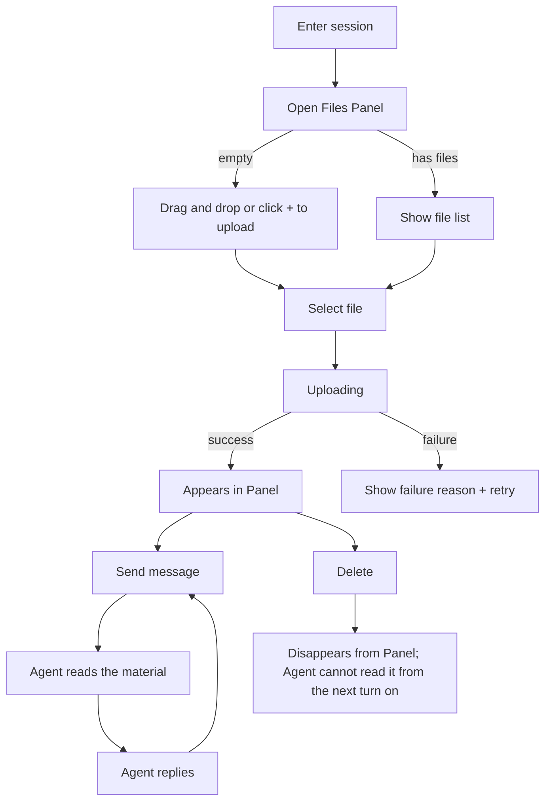
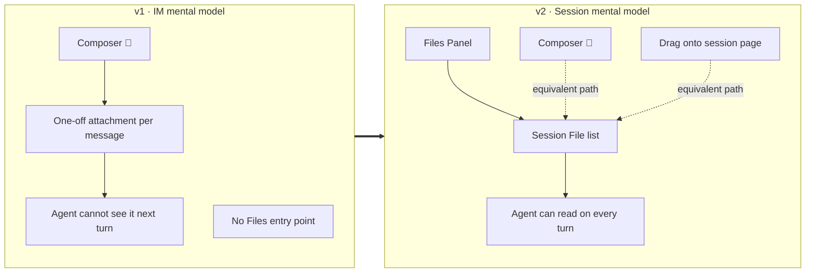

# Session Files — for humans

> This is the product-narrative version for non-engineering readers. The full engineering contract (the file-manifest injection mechanism, state machine, corner cases, thinking audit, implementation boundaries, and runtime-adapter constraints) lives in the shipped engineering PRD for this same feature.

## In one sentence

This upgrades "dropping a local file at the Agent" from "**an attachment on this one message**" to "**a file that belongs to this session**":

- After a user uploads a file, it **stays in the Session for the long term** and is no longer bound to a single message.
- The session page has a **Files Panel**, which is the **single authoritative view** of what files the session currently has attached.
- From the moment of upload until the Session is archived or deleted, **the Agent can read these files on every turn** — the user does not need to re-upload them or paste paths into messages by hand.
- The mechanism does not distinguish by entry point: a Builder debugging in Preview, an Operator getting work done with a Published Agent, and (in the future) an API consumer attaching `files` when creating a Thread through the Public Thread API — the local files they hand to the Agent are **all the same Session File concept**.

Analogy: Claude.ai's Project Knowledge / ChatGPT's "add an attachment in this conversation" — but simpler than either. It **exposes no mount path and introduces no resource id**; a file is simply the session's material and travels with the Session.

---

## 1. The user problem

When a Builder debugs an Agent in Preview, or an Operator uses a Published Agent to solve a work problem, they frequently need to hand a local file (a CSV, a spec doc, a screenshot, a code snippet, a log) to the Agent. The composer in the session panel has a paperclip, but today, once a user finishes uploading, they discover:

- **The file is attached only to "this one message"**: ask a follow-up next turn and the Agent "pretends to remember" while actually no longer being able to see the original.
- **You cannot see what is actually in the session**: a user who wants to verify "did the Agent really read my file?" has no entry point that lists which files are in the Session.
- **Reusing across turns means uploading over and over**: to first summarize, then translate, then cross-check the same file, you have to upload it three times.

The result: users **distrust the attachment capability by default**. They either copy-paste the content into the message body, or abandon this interaction path entirely.

---

## 2. Goals

After a session is done, the user should be able to describe it like this:

> "In this session I uploaded N files; the Agent read which one on which turn; I deleted which one and when."

Concretely:

- In any given Session, a user can **keep** several local files attached to the current session for the long term; from the moment of upload until the session is archived or deleted, the Agent can read them on every turn.
- A user can see, on the session page, "which files are currently attached to this Session," and can add, delete, and download them.
- Files a Builder uploads in Preview belong only to that Preview Session and **will not leak into** the operational sessions of a Published Agent.
- A single Session may hold at most 100 files (aligned with the Claude Managed Agents limit).

---

## 3. The key mental model

| Term                          | Plain-language explanation                                                                                                                                                                                                                                                                                            |
| ----------------------------- | --------------------------------------------------------------------------------------------------------------------------------------------------------------------------------------------------------------------------------------------------------------------------------------------------------------------- |
| **Session File**              | A copy of a local file that the user has attached to a Session. **Its lifecycle follows that Session** — it lives while the Session lives, goes into read-only cold storage when the Session is archived, and is hard-deleted when the Session is deleted.                                                            |
| **Files Panel**               | The list entry point on the session page that displays all Session Files for the current Session. It is the **single authoritative interface** for managing Session Files.                                                                                                                                            |
| **Three upload entry points** | The composer paperclip / drag-and-drop onto the session page / the "+" in the Files Panel. All three are fully equivalent and lead to the same session material.                                                                                                                                                      |
| **Upload-success chip**       | A transient hint that appears near the composer after a successful upload — "foo.csv added to session." It is **not** the carrier of the file itself (the file is already in the Files Panel); it is only feedback that "the upload succeeded," and it auto-dismisses after a few seconds or can be closed with an X. |
| **Attachment** _(deprecated)_ | The v1 concept: "a one-off attachment sent with a single message." After this PRD the concept is retired, unified into Session File.                                                                                                                                                                                  |

**Key boundary**: "one-off attachment sent with a message," "review attachments per message," "the chip list below the composer acts as the file carrier" — this entire v1 IM-style interaction is **deprecated wholesale**. The Files Panel is the file's only home.

---

## 4. How the Agent "knows" what is in the material area

This part is worth spelling out, because it shapes what users expect the system to do.

- **The Agent does not actively watch the folder** — it does not listen for upload/delete events.
- **When the user sends a message on the next turn**, the system **automatically attaches the manifest of all currently available Session Files** to the context handed to the Agent.
- So the way the Agent learns "which files are in the material area" is: **every time the user sends a turn, the system re-tells it the latest manifest.**

The observable behavior on the user's side:

- Upload and then **close the session without sending a message** — the file is still in the Files Panel and is still there next time you come in; but the Agent has **no idea this file exists** until it receives the next user message. This is expected behavior, not a bug.
- Upload and then **send a message** — the Agent can read it on that turn.
- **Delete a file** — the text of historical messages does not change; but from the next turn on, the Agent can no longer read it.
- **Upload or delete in the middle of a turn the Agent is currently running** — the current turn is not interrupted or restarted; the change takes effect on the **next turn**.

This mechanism has one important side effect: **every runtime adapter (the OpenAI runtime / Claude Agent SDK / Hermes / a future Python runtime) receives an ordinary message with a path manifest** — they need no special-case logic for Session Files. Cross-runtime consistency comes from the session product layer, not from the runtime layer.

---

## 5. User journey map

| Phase                        | What the user does                                                 | What they see                                                                                                                                           | Mood                                           |
| ---------------------------- | ------------------------------------------------------------------ | ------------------------------------------------------------------------------------------------------------------------------------------------------- | ---------------------------------------------- |
| 1. Enter the session         | Open an Agent / create a new Session                               | The session page, with the Files Panel entry point                                                                                                      | Neutral                                        |
| 2. Upload material           | Click the paperclip / drag and drop / click "+" in the Files Panel | An upload-in-progress status bar → listed in the Panel immediately on completion                                                                        | Neutral → high (no more worry about losing it) |
| 3. First turn of use         | Type a question, press send                                        | The system **automatically** attaches the file manifest to the message handed to the Agent                                                              | High (the Agent really saw it)                 |
| 4. Going deeper across turns | Keep asking follow-ups                                             | The Agent can always ls / cat, **with no need for the user to re-upload**                                                                               | High                                           |
| 5. Cleanup                   | Delete a file                                                      | It disappears from the Files Panel immediately; the text of historical messages is unchanged; **the Agent can no longer read it from the next turn on** | Neutral (clear and predictable)                |
| 6. End of session            | Archive / delete the Session                                       | Archive: the files go into read-only cold storage with the Session; Delete: the files are hard-deleted with the Session                                 | Neutral (no leftover-leak concerns)            |

---

## 6. Information architecture (Before / After)

---

> For the full engineering contract, see the shipped engineering PRD for this feature.
