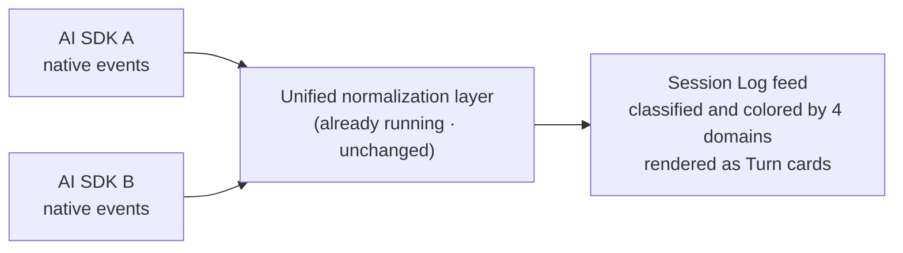
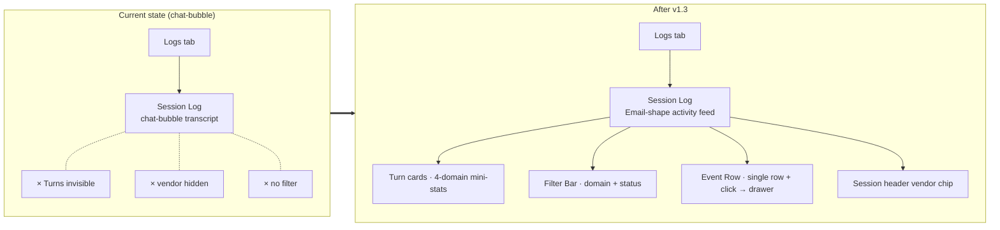

# Session Log — for humans

> This is the product-story version for non-engineer readers. The full engineering contract (event classification mapping / Turn boundary detection / component implementation / the complete v1.0 → v1.3 grill history) lived in a separate draft that is not part of the open-source docs.

## One-line positioning

Change the "Logs → Session Log" view on the Agent Page from a **chat-bubble** layout into a **structured event stream** like a **Linear activity feed / GitHub PR conversation**:

- One card per Turn (a Turn = one complete conversation loop the agent runs)
- One row per event (user input / agent reply / tool call / state change / token usage are each classified separately)
- Click a single row → open the Turn Drawer to see that event's complete input/output

Analogy: Linear's issue activity feed — every comment, status change, and assignee change is a row, and you click to see the detail. Our Session Log has this same shape, but "comment" becomes "agent event".

---

## 1. User problem

When an agent owner / admin (the "builder") opens the Session Log to debug in Preview or troubleshoot in Production, today they see:

- **Shape mismatch**: chat bubbles mimic an IM conversation, but the builder is not "chatting" — they want to scan horizontally to spot "which turns failed".
- **Turn boundaries are invisible**: in a long, multi-turn session the bubbles cascade in one continuous stream, making it impossible to see "how the thinking in turn 3 relates to the tool choices in turn 4".
- **Vendor is invisible**: events produced by different AI SDKs all land in the same bubble transcript, so you cannot tell "which SDK produced this thinking event", and vendor behavior differences are easy to misread.
- **No filtering**: with hundreds of events, wanting to "see only errors" or "see only agent output" means scrolling to find them yourself.
- **Drill-down is hard**: viewing each event's details requires opening the right-hand diagnostics panel and cross-referencing, which is clumsy.

---

## 2. Goals (v1.3)

When complete, the agent owner should be able to:

- Open the Session Log and see the selected session grouped into **Turn cards** (each Turn = one complete agent run).
- See a **vendor chip** at the top of the session header (indicating which AI SDK is running) plus runtime and version, so they can **tell at a glance which SDK is running**.
- See a **single-row event list** in each Turn body: every row carries a domain row tint (one color per domain: user blue / agent purple / session green / span gray, expressed in the row background color, the Filter Bar chip, and the timeline bar; on 2026-05-27, the 2px color strip on the left of the row was removed, with color now conveyed through the row tint + chip + timeline) + an event-shape chip + event type + summary + timestamp + status badge.
- **Click a single row → open the centered Turn Drawer**: a horizontal timeline bar + the complete event list + bidirectional highlighting (click a bar segment ↔ click a row) + the event's input/output details auto-expanded.
- Use the **Filter Bar** at the top: four domain chips to toggle (user / agent / session / span, all selected by default) + a status toggle ("All" / "Errors only" to filter to errors in one click).

---

## 3. Concepts

| Term            | Meaning                                                                                                                                                                                  |
| --------------- | ---------------------------------------------------------------------------------------------------------------------------------------------------------------------------------------- |
| **Session Log** | The only mode of the Logs tab at the bottom of the Agent Page. Shows the event timeline for a **single session**. (The sibling System Log "VPS tail-f" mode described in [`./agent-runtime-logs.md`](./agent-runtime-logs.md) was removed.) |
| **Turn**        | One loop of user input → complete agent response. Each Turn = one card.                                                                                                                  |
| **4-domain**    | Sorting all events into four domains — user (input) / agent (output) / session (lifecycle) / span (observability) — borrowing the naming convention from Claude Managed Agents.          |
| **Email-shape** | The "one event per row" structured shape of a Linear activity feed / GitHub PR review, rather than chat bubbles.                                                                         |
| **Turn Drawer** | The centered Dialog that opens after clicking an event row, showing that Turn's horizontal timeline bar + the complete event list, auto-focused on the clicked event.                    |
| **Vendor chip** | A line of metadata on the session header indicating which AI SDK the current session uses (which determines the capabilities that SDK supports and its behavior differences).            |

---

## 4. Data flow (how heterogeneous vendors are normalized)

**Key points**:

- **Do not invent new event types.** The backend's existing events are sufficient; the frontend only classifies and colors them by the four domains.
- **Do not change the normalization layer.** Each SDK's adapter is already running; the frontend only adds chrome (colors, icons, labels) on top in the UI.
- **The explicit mechanism for vendor heterogeneity = the session header chip.** Vendor is not repeated in each row — a single session with a single vendor is the 99% case.
- **The 4-domain split is a UI classification convention, not a protocol.** The frontend just needs a small constant table to map backend events to the four domain colors.

---

## 5. User journey map

| Stage       | What the builder is doing                | What they see                                                                                                                                                             | Mood      |
| ----------- | ---------------------------------------- | ------------------------------------------------------------------------------------------------------------------------------------------------------------------------- | --------- |
| Enter       | Agent Page → Logs tab → select session   | Three-column layout: session list + central feed + right-hand diagnostics panel                                                                                           | Neutral   |
| Overview    | Scroll through Turn cards                | Each Turn has mini-stats ("2 user · 5 agent · 3 session · 4 span") so volume is clear at a glance                                                                         | Confident |
| Find errors | Click "Errors only" in the Filter Bar    | The feed instantly filters down to only error events                                                                                                                      | Efficient |
| Deep dive   | Click a suspicious row                   | The central Drawer opens, with the timeline bar + that event's input/output auto-expanded                                                                                 | Satisfied |
| Close       | ESC                                      | Return to the original position in the feed                                                                                                                               | Smooth    |
| Anomaly     | See the vendor chip indicating which SDK | Understand that this session lacks a certain capability (that SDK does not support streaming thinking display); no longer worried about "why don't I see the agent think" | Relieved  |

---

## 6. Information architecture (Before / After)

**The change is only in the central Session Log rendering**:

- Left rail (session list) unchanged
- Right rail (diagnostics panel) unchanged
- Vendor chip added to the top header
- Central transcript switched from bubbles to an activity-feed
