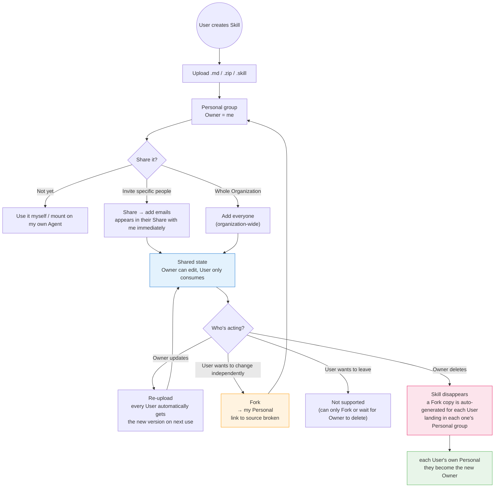

# Skill — for humans

> This is the product-story version of Skill, written for non-engineering readers. The **complete engineering contract** (file/directory layout, frontmatter fields, acceptance criteria, explicit Upgrade flow, and open questions) lives in the full PRD.

---

## Calibrate your mental model first (drift note)

The product described in §1 / §11 / §13 of the full PRD looks like this:

- An account-level **Default Agent** automatically picks Skills on the Work page.
- Each user controls "does my Default Agent automatically invoke a given Skill" through a **per-user toggle**.

After the pivot, both of these have been retired: the Work page and the Default Agent concept have been removed, and the per-user toggle has neither UI nor persistence in the mainline code. The "toggle / automatic invocation / uninstall (Owner = delete)" behaviors that appear in this document are v1 thinking — treat them as historical for now. The **only** Skill consumption path that is actually in effect today is:

> **Explicitly mount a Skill in a Published Agent's configuration.**

Who mounts which Skills is decided by the Agent owner. This has nothing to do with "which Skill I, as a user, switch on or off." For current Project/App work, Skills should become App-local resources before they become Organization-wide shared capabilities. Coworker sharing, team-wide distribution, and org-wide libraries are future governance. Whether to bring the per-user toggle back will be decided if and when the Default Agent concept returns. See [Project / App Boundary](./project-app-boundary.md).

Where the word root "Workspace" lingers in this document, it means Organization (the pivot removed the Workspace entity). The term still follows external naming only when referring to a workspace on an external platform (Slack / Lark / Linear, etc.).

---

## One-line positioning

A Skill is a **stateless capability unit** (a prompt plus optional scripts / reference material) that an Agent invokes on demand.

The registry entrypoint lives at `/integrations → Skills`, split into two groups: **Personal** and **Share with me**. It sits alongside Agent / Space / MCP / Environment as a first-class, Organization-level asset.

By analogy:

> Like a skill file in Claude Code, but living inside a team where it can be shared and forked. Its relationship to an Agent is similar to an Agent referencing a "capability pack" — each execution pulls the latest version from the current Owner.

---

## 1. User problems

Sentences Agent owners / configurators often say:

- "I have a few prompts I've tuned. I want to bundle them into a reusable 'skill' so I can just attach it the next time I configure a new Agent."
- "A coworker wrote a really good translation skill — can I just use it directly?"
- "He updated the skill; do I need to copy it again?" — No. What you reference is always the owner's latest version.
- "I want to change a couple of lines on top of his skill without affecting his own version." — Fork it.
- "If he deletes that skill, will my Agent suddenly break?" — No. A Fork copy is automatically kept for you.
- "Our team wants to share this skill across the entire organization without adding people one by one."
- "Why is there no icon / avatar on the skill card?" — Intentional. A Skill is a tool, not a person.

---

## 2. Goals

When this is done, an Agent owner should be able to:

- Upload a `.md` / `.zip` / `.skill` file at `/integrations → Skills` and have it appear immediately in the **Personal** group
- Share it with individual coworkers by email, or share it with the whole Organization in one click via "Add everyone in organization"
- Mount accessible Skills in a Published Agent's configuration
- Fork a copy when they want to experiment on someone else's skill, breaking the link to evolve it independently
- Delete one of their own team skills, and — **after confirmation** — have the system automatically generate a Fork copy for every coworker who is using it, so no one experiences a "feature mysteriously disappeared" moment

A coworker the skill has been shared with should be able to:

- See the skill in the **Share with me** group
- Open its detail view to read the full `SKILL.md`, or download the `.skill` archive to modify it themselves
- Not be able to edit, delete, or "actively leave the collaboration" — they can only Fork an independent copy, or wait for the Owner to delete it

---

## 3. Roles: deliberately only two tiers

| Role      | What I can do                                                                                      |
| --------- | -------------------------------------------------------------------------------------------------- |
| **Owner** | Create, edit (re-upload), delete, share / unshare, Fork their own                                  |
| **User**  | View / preview / download / Fork; **cannot edit, cannot delete, cannot "leave the collaboration"** |

> Why can't a User "leave the collaboration"?
> — Keep the mental model simple. A User doesn't worry about the collaboration relationship; they just consume. The Owner is the sole controller of the collaboration relationship. If you don't want to receive the owner's updates, Fork an independent copy and you'll have no further relationship with the source skill.

We deliberately do **not** reuse Space's three-tier admin / edit / read model; three permission levels would be over-engineering for a fine-grained capability unit like a Skill.

---

## 4. Two groups: Personal vs Share with me

The registry has only two groups:

| Group             | Who's in it                                                                                                                   |
| ----------------- | ----------------------------------------------------------------------------------------------------------------------------- |
| **Personal**      | Skills where the current user is the Owner (self-created + self-forked + skills cascade-downgraded into a Fork by the system) |
| **Share with me** | Skills where the current user is a User (invited by a coworker / shared with the whole Organization)                          |

A "team skill," in product semantics, simply means the contents of the **Share with me** group; there is no longer a separate "personal / team" tag.

---

## 5. Collaboration model (core semantics)

### 5.1 Invitation: visible immediately

- On the detail page, an Owner clicks "Share," searches for users by email to add them, or clicks "Add everyone in organization" (which writes an organization-wide wildcard)
- Once added, the skill **appears immediately in the invitee's Share with me group**

### 5.2 Reference by default, no upstream contribution

- What a User sees is a **reference to the Owner's skill**, not a copy
- Each time the Owner saves an update, **every User automatically gets the latest version on their next use** — zero action required
- What's mounted in an Agent's configuration is also a reference → it syncs automatically too
- **No upstream contribution**: a User **cannot** submit a PR / suggestion back to the Owner; to make changes, Fork

### 5.3 Fork: deliberately breaking the link

Any User can click "Fork" on the detail page:

- Copies the current version into their own "Personal" group
- The current user becomes the new Owner and can Fork again or share again
- **Completely independent** from the source skill: source updates no longer sync to the copy, and changes to the copy don't affect the source
- The UI may show "Forked from X @ {time}" as a provenance hint, but this is **not** a sync indicator

### 5.4 Delete + cascade-downgrade Fork (the essence of the design)

When an Owner deletes a **team skill** (one that Users are using):

1. A confirmation dialog shows "N users are using this Skill"
2. The Owner confirms → the skill disappears from the Owner's registry
3. **Automatic cascade**: each User no longer sees it under Share with me either, **but** each of them automatically gets a Fork copy added to their own "Personal" group, labeled "Forked from {original Owner}'s deleted Skill"
4. Each User becomes the new Owner and can evolve / delete it independently

The effect: **no one loses a feature just because the Owner silently deleted the skill; but anyone who still wants to use it takes ownership themselves.**

When an Owner deletes a **personal skill** (no one is using it): it's deleted directly, with no cascade.

A User cannot delete any skill.

### 5.5 Who can do what (one table)

| Action                                   | Personal (I'm the Owner)                   | Share with me (I'm a User)                                         |
| ---------------------------------------- | ------------------------------------------ | ------------------------------------------------------------------ |
| View / preview / download `.skill`       | ✅                                         | ✅                                                                 |
| Edit (re-upload)                         | ✅                                         | ❌                                                                 |
| Manage collaborators / change visibility | ✅                                         | ❌                                                                 |
| Fork                                     | ✅                                         | ✅                                                                 |
| Delete                                   | ✅ (team skill triggers cascade-downgrade) | ❌ (when the Owner deletes, a Fork copy is auto-generated for me)  |
| Actively leave the collaboration         | —                                          | ❌ (not supported by design; Fork or wait for the Owner to delete) |

---

## 6. What a Skill looks like: the special thing about the editing flow

### 6.1 No in-app editor

**Users edit locally and re-upload.** This path is simple enough and avoids the awkwardness of "the product has an editor, but a weak one."

A Skill's contents include at least one `SKILL.md` (with frontmatter). It can be packaged as a `.zip` / `.skill` (synonyms) together with scripts, reference material, and assets. The detail dialog only renders `SKILL.md`; the other assets come bundled with the download.

### 6.2 The intended primary update path (drift: depends on the Default Agent, removed by the pivot)

The update mechanism locked in by §10.1 of the full PRD was: the Owner opens a Session with their own **Default Agent** on the Work page and updates the skill file "within the conversation that uses the skill" — making "editing" a byproduct of "using."

This path depends on the Default Agent. After the pivot, the Default Agent has been removed, so this editing flow does not exist for now. The viable way for an Owner to update a skill today is:

- Edit `SKILL.md` locally and go through the `Upload Skill` flow again (per the default behavior in §15 Q1 of the full PRD, this creates a new skill; the explicit "Upgrade" entrypoint that overwrites the same UUID, §10.2, has not yet been built)

Whether to reconnect "in-conversation editing" will be decided if and when the Default Agent concept returns.

---

## 8. The relationship between Skill and Agent

What's mounted in an Agent's configuration is a **Skill id reference**, not a copy of the content:

- At execution time, the Agent pulls the Owner's latest version live from the reference
- If the Skill is deleted → the Agent's reference downgrades to a "(deleted)" tombstone, and the Agent doesn't break

### 8.1 User-level "toggle" vs Published Agent mounting (drift)

What §11.1 of the full PRD intended to express: when a user toggles a skill OFF in the Skills list, it **only affects whether that user's Default Agent automatically invokes it**; it does not affect a Published Agent's `skills[]` ("the creator says this skill is required for it to work").

| Invocation method                                        | Does the per-user toggle take effect?         |
| -------------------------------------------------------- | --------------------------------------------- |
| Auto-selected within the Default Agent                   | ✅ In effect (OFF means it won't be selected) |
| `@mention`-ed within the Default Agent                   | ⚠️ "Explicit wins" — if you @ it, it's used   |
| **Explicitly mounted in a Published Agent's `skills[]`** | ❌ **Not in effect; the Owner's intent wins** |

But the Default Agent has been retired, so neither of the first two rows currently exists; today, **explicit mounting in a Published Agent** is the only real path. This actually makes it simpler to reason about:

> Whether you can reach a given Skill on a given Published Agent **depends entirely on whether the Agent owner has mounted it in the configuration, and whether the Skill has been shared with the owner**. It has nothing to do with you as an end user.

---

## 9. Lifecycle diagram

---

## Related

- **Complete engineering contract**: the full Skill PRD
- **How a Skill is mounted in an Agent's configuration**: [`./agent-manifest.md`](./agent-manifest.md)
- **Adjacent assets**: [Space](./space-interaction.md) · [MCP](./mcp-interaction.md) · [Environment](./environment.md)
