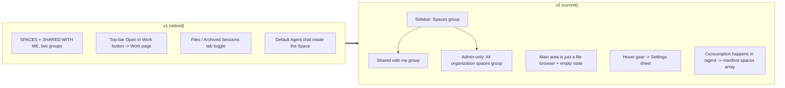

# Space — for humans

> This is the product-story version written for non-engineering readers. The full engineering contract lives in the shipped Space PRD.

---

## One-line positioning

After the pivot, **Space does exactly one thing**: it is a file container that an Agent "mounts" into its own manifest to consume.

The Space page itself **no longer hosts chat, no longer starts tasks, and no longer stores session history**. Open in Work, Default Agent, Archived Sessions, local-directory mounts — all of these v1-era entry points have been retired.

> **The scope of this PRD is NOT a "team network drive."** Readers expecting something "like Google Drive / Notion, where you can both store files and open them for collaboration directly" will be disappointed — Space behaves more like a GitHub repository pulled by CI: the **production side** is the Space page (create the container, upload files, manage collaborators), while the **consumption side** always lives over on the Agent.

---

## User problem

Riley is a non-technical Member who wants a particular published Agent on her team to be able to read a batch of materials: contract templates, SOPs, and design files.

After the pivot, there is **no "open a Space and chat directly" entry point** in the product for her. The only path she can take:

1. Create a Space under `/space` and upload the files into it
2. Switch to `/agent`, open the target Agent, and add this Space to the `spaces[]` array in the Agent manifest
3. Once the Agent goes live, it reads these files according to the Space permissions granted to the Agent creator

The old PRD treated Space as a "standalone workbench" — offering Open in Work, picking your own Default Agent to chat with, and toggling between Files / Archived Sessions tabs — **all of which conflict with the post-pivot product shape**. This version narrows Space back to a single responsibility: **providing a mountable file container for Agents**.

---

## Concept definitions

| Term                          | Definition                                                                                                                                                                                                                       |
| ----------------------------- | -------------------------------------------------------------------------------------------------------------------------------------------------------------------------------------------------------------------------------- |
| **Space**                     | A file container plus a sharing boundary. **Its only consumption path is being mounted via the `spaces[]` array in an Agent manifest.**                                                                                          |
| **Space admin**               | The highest permission within a Space. Can read/write files, change collaborators, change settings, and delete the Space. This is the Space-level `admin` role (one of `admin`, `edit`, or `read`) — **not** an Org-level admin. |
| **edit**                      | The mid-tier permission for a Space collaborator: can read/write files but cannot change collaborators.                                                                                                                          |
| **read**                      | The low-tier permission for a Space collaborator: can only list / download files.                                                                                                                                                |
| **Creator**                   | The user who created the Space. While they remain on the team, they are the sole owner of that Space's ACL (even an Org admin cannot perform destructive actions).                                                               |
| **Visibility**                | The Space's current sharing state. Derived from the collaborator list: creator only → `private`; any other user or the everyone-wildcard → `shared`.                                                                             |
| **Everyone-wildcard (`'*'`)** | A single ACL row that shares the Space with "everyone in the organization." Its role is forced to `read` and it covers every member of the Org. The copy must strictly read `Add Everyone in organization`.                      |
| **Shared with me**            | A Space where the current user is not the creator but has gained access through the ACL (an exact entry or the everyone-wildcard). Does not include private Spaces visible only through Admin governance pass-through.           |
| **All organization spaces**   | Appears only in the Owner / Admin pass-through view. Spaces where the user is neither the creator nor an ACL-matched collaborator, but which are visible because of Governance Access.                                           |
| **Mount**                     | Writing a Space id into the `spaces[]` array in an Agent manifest. This step **does not happen on the Space page.**                                                                                                              |

---

## Information architecture: v1 vs v2

**Semantics of the three sidebar groups:**

- **Spaces**: the ones you created yourself
- **Shared with me**: the ones someone invited you to, or where an everyone-wildcard matches you
- **All organization spaces**: visible only to Owner / Admin; these are the non-shared Spaces seen through "governance pass-through" and are **not mixed into Shared with me**

---

## User journey map (the single linear flow)

> After the pivot, Space has no parallel journeys. Every Member follows the same path: **create → fill → go to the Agent and mount.**

| Phase                                      | User Actions                                                                             | Touchpoint   | Pain point → opportunity                                                                                                                                                       |
| ------------------------------------------ | ---------------------------------------------------------------------------------------- | ------------ | ------------------------------------------------------------------------------------------------------------------------------------------------------------------------------ |
| 1. Create                                  | Sidebar `Spaces` group `+` → enter a name / choose visibility → Create                   | `/space`     | v1's multiple consumption entry points made people think they could chat directly → a clean sidebar with only two groups (Member) / three groups (Admin)                       |
| 2. Fill                                    | Drag files / Upload / create a new folder                                                | Main area    | v1 made people think they had to Open in Work before uploading → no prerequisite action; once you finish uploading, you're done                                                |
| 3. (Optional) Invite collaborators         | Hover the sidebar → gear → Settings sheet → add an email or Add Everyone in organization | Sheet        | v1's "workspace" copy was ambiguous → the copy strictly uses "organization"; the wildcard can only be read                                                                     |
| 4. Leave                                   | Close the page and head to `/agent`                                                      | —            | v1 implied she would "start working" on the Space page → the PRD states it plainly: **consumption happens over on the Agent.** The empty-state subcopy gives the path directly |
| 5. Mount the Space in the Agent            | Open the Agent manifest editor and add the Space you just created to `spaces[]`          | `/agent/:id` | Once mounted, it is immediately readable in the Agent's dev / preview / channel                                                                                                |
| 6. (Later) Return to Space for maintenance | Add files / change the ACL / delete old files                                            | `/space`     | Changes take effect in real time for every Agent that has mounted it                                                                                                           |

**Key design decision**: steps 4 → 5 form a **cross-page jump**, but the Space page **does not provide** a "Mount to agent" button. The reasoning: the Agent is the consumer, and the mount semantics belong to the Agent manifest editing action; offering a reverse entry point on the Space page would let the two sides' source of truth drift apart.

---

## Permission semantics (product view)

> For the complete RBAC table, see [`./rbac.md`](./rbac.md) §3.3; this section only aligns product behavior.

| Capability                                | admin      | edit | read               | Org owner / admin pass-through                   |
| ----------------------------------------- | ---------- | ---- | ------------------ | ------------------------------------------------ |
| Browse files                              | ✅         | ✅   | ✅                 | ✅ all Spaces                                    |
| Upload / create / delete files            | ✅         | ✅   | ❌                 | ✅                                               |
| Rename / download files                   | ✅         | ✅   | ✅ (download only) | ✅                                               |
| Change Space settings (name / visibility) | ✅         | ❌   | ❌                 | ✅                                               |
| View the Settings sheet                   | ✅         | ❌   | ❌                 | ✅                                               |
| Change collaborator ACL                   | ✅ Creator | ❌   | ❌                 | ✅ Creator has left ❌ Creator still on team |
| Delete the Space                          | ✅ Creator | ❌   | ❌                 | ✅ Creator has left ❌ Creator still on team |

**Two hard rules:**

- **The everyone-wildcard can only be read**: `Add Everyone in organization` is always Can view; the UI dropdown does not show edit.
- **Creator-status lock**: while the creator is still on the team, an Org Admin **cannot** touch the ACL or delete the Space; once the creator leaves, this unlocks automatically — no "claim" action is required.

---

> The full engineering contract (covering Conditional Write / Lease Lock / the Phase 1-2 implementation staging / the complete Edge Cases table) is maintained in the shipped Space PRD.
