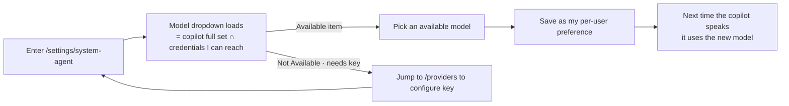

# System Agent Settings — for humans

> This is the product-story version for non-engineer readers. For the full engineering contract (field contracts / readiness behavior / self-check trail), see the shipped System Agent Settings PRD.

---

## One-line positioning

Give the "System Agent" in Mosoo — the **configuration copilot** that helps you write prompts, validate config, and recommend models — an entry point where **each person picks their own model**, located at `/settings/system-agent`.

- **This PRD delivers exactly one thing**: picking a model.
- It does **not** rework the copilot's toolset / Quickstart / prompt templates (that belongs to the System Agent M3A PRD).
- It does **not** rework the data contract for Provider / Available Models (that belongs to the Provider Runtime Models PRD).

> Analogy: like "Custom instructions" in ChatGPT or the model picker in Cursor — a **per-user preference**, not an org-wide mandate.

---

## 1. User problem

The copilot's model is currently hard-coded. **When a new organization hasn't yet configured an OpenAI / Anthropic key, the copilot returns a 401 the moment it speaks.** Even once a key is configured, everyone has different preferences for "fast / cheap / smart" — but today there is **nowhere to choose**.

What three real personas commonly say:

- **Member Wang Qiming (the 401 victim)**: "Our company pool only has an Anthropic key, but the copilot always uses OpenAI and 401s every time. I want to switch to Sonnet 4.6, but there's no entry point."
- **Member Yang Yaxin (cost-sensitive)**: "The copilot defaults to Sonnet, which I find too expensive. Personally I'd like to switch to Haiku 4.5 to save money — but I don't want it to affect my colleagues."
- **Org Admin Li Xue**: "Choosing the copilot's model is a personal preference (everyone has different sensitivities to cost / speed / privacy). As an admin, I **shouldn't** have to make that call on behalf of the whole org."

---

## 2. Goals

When this is done, every user should be able to:

- **Pick a copilot model from a dropdown** at `/settings/system-agent`, where the available range = "the full set of models the copilot can run" ∩ "the credentials I personally have access to (company pool + my personal key)".
- See "Not Available · needs key" immediately when picking a **model with no key**, and jump to `/providers` with one click to configure the key — with **absolutely no silent fallback** to a different model.
- **Reach this page in one click** from the account menu in the top-right corner.

---

## 3. Concepts

| Term                                  | Plain-language definition                                                                                                                                                                                                                                                                       |
| ------------------------------------- | ----------------------------------------------------------------------------------------------------------------------------------------------------------------------------------------------------------------------------------------------------------------------------------------------- |
| **System Agent** (the copilot)        | The assistant agent in Mosoo that helps you **draft Agent prompts / validate config / recommend models**. It is not the Agent you are configuring — it's the "configuration assistant" standing beside you, helping you.                                                                        |
| **System Agent Model · per-user**     | "Which model I want the copilot to use when answering me." **One per user, with no cross-impact** — within the same org it's allowed and expected for Wang Qiming to use Sonnet while Yang Yaxin uses Haiku.                                                                                    |
| **Available Models for System Agent** | The full set of models the copilot can run ∩ the credentials you can access. The former is a platform-technical decision (the three Cloudflare Agents SDK paths: Vercel AI SDK / Workers AI binding / AI Gateway); the latter is the company pool key + any personal key you've added yourself. |
| **Not Available · needs key**         | A model the copilot can run, but for which you **don't have** the corresponding provider's key on hand. The UI renders it grayed out, with a one-line hint and a deep link that jumps to `/providers`.                                                                                          |

---

## 4. User journey

| Stage                  | Who         | What they're doing                                                           | What they see                                                          | Mood                                      |
| ---------------------- | ----------- | ---------------------------------------------------------------------------- | ---------------------------------------------------------------------- | ----------------------------------------- |
| Hitting the wall       | Wang Qiming | The copilot suddenly 401s                                                    | Discovers a new "System Agent" link in the top account menu            | Confused → found the entry point          |
| Picking a model        | Wang Qiming | Selects `Claude Sonnet 4.6` from the dropdown → Save                         | The dropdown item is clearly marked "Available"                        | Free                                      |
| Missing-key safety net | Yang Yaxin  | Wants to pick `gemini-2.0-flash`, but the org hasn't configured a Google key | Grayed-out chip "Not Available · Configure Google key in /providers →" | Blocked → jumps over to configure the key |
| Switching back         | Wang Qiming | A week later, finds Sonnet too expensive and switches back to `Haiku 4.5`    | Same dropdown → Save                                                   | Smooth                                    |

---

> Full engineering contract + field names + change verbs + implementation boundaries (what must follow existing product patterns / what must come back for a question / what not to build even if technically more complete): see the shipped System Agent Settings PRD.
