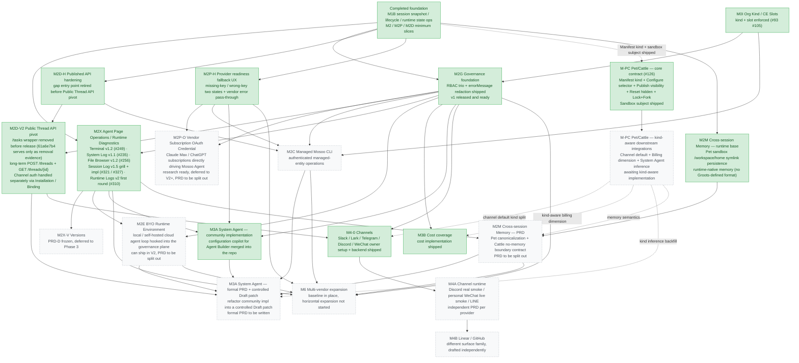

# Mosoo

Language: [English](../README.md)

Mosoo 是一个 alpha 探索期的开源 Agent Cloud 项目，基于 Cloudflare 原生架构构建，当前优先服务 OPC / 个人开发者，让个人开发者可以用较低的运维成本，在自己的 Cloudflare 账户上搭起一套轻量、可自托管、可快速迭代的 Agent Cloud。

长期来看，我们希望 Mosoo 从开源社区版生长为同时支持个人、OPC、小团队和企业级治理的 Agent 基础设施：个人开发者可以自由实验和二次开发，团队可以沉淀自己的 Agent 与 Knowledge 资产，企业可以进一步获得权限、成本、版本和运行状态管理能力。

## What Is Mosoo

Mosoo 的名字来自 Moso Bamboo，也就是毛竹。

毛竹和许多树木不同。它长高时并不是一边向上生长一边缓慢制造新细胞，而是在地下提前完成了漫长准备：

1. 地下竹鞭和根茎网络多年积累养分。
2. 竹笋出土后快速拉伸已有细胞。
3. 在短短 40-60 天内完成几乎全部高度生长。

毛竹是已知生长最快的大型木质竹之一，也常被视为垂直生长速度最快的植被代表。它从来不是孤立出现的，而是生长在竹海之中。在中文语境里，竹也常被用来表达谦逊、坚韧和长期主义。

我们希望 Mosoo 也像竹一样：先在开发者和 OPC 社区扎根，让一个轻量开源版本快速生长；随后在更长的时间里逐渐木质化成熟，帮助团队和企业在 Agent 与 Knowledge 资产快速膨胀时完成转型，最终生长出一片属于组织自己的 Agent 竹海。

## Why We Are Building It

Mosoo 最早的项目名是 Dify-Lite，初心是推出一个更轻量的 Dify 版本：整体精简功能，采用面向 2026 的新技术栈和工程取舍，并降低使用门槛。

这个阶段的价值主张不是复刻一个完整大平台，而是先把 Agent Cloud 的骨架做薄、做快、做开源，让个人开发者也能拥有一套可运行、可理解、可二次开发的基础设施。

从能力结构上看，Mosoo 仍围绕三个平面演进：

- **消费平面**：让使用者通过自然的入口使用 Agent。
- **生产平面**：让应用 / Agent 开发者更快配置、上线和分发 Agent。
- **治理平面**：让管理员能管理权限、成本、版本和运行状态。

在开源 alpha 阶段，消费、生产、治理会先以个人开发者和小规模自托管场景为主。我们会优先确保个人和 OPC 的真实需求被满足，再逐步把同一套能力延展到团队协作和企业级治理。

## Roadmap

Mosoo 所在的主线方向仍在快速变化。当前我们选择先聚焦 Cloudflare 原生开源版本，是为了用更轻、更快、更可验证的方式完成基础能力闭环：先让个人开发者和 OPC 场景真实可用，再沿着同一套架构走向团队与企业级支持。

现阶段路线图会围绕这些目标展开：

- **OPC / 个人开发者优先**：先把个人开发者部署、配置、运行、调试 Agent 的完整闭环打磨顺。
- **Cloudflare 原生运行时**：继续围绕 Workers、Durable Objects、D1、R2 等平台能力收敛架构。
- **开源社区版完整链路**：优先完成可自托管、可修改、可扩展的社区版核心能力。
- **Agent 资产管理**：把 Agent、Knowledge、Skill、MCP、Space、Credential、Channel 等能力逐步沉淀成可管理资产。
- **企业级能力延展**：在个人和 OPC 场景跑通后，继续补齐团队协作、权限、成本、版本控制和运行治理能力。

图例只有两种状态：**开工**（已经有具体产物落地——PR 已合并、main 上有代码、PRD 已冻结）和 **未开工**。原先标记"实施中"的节点，已经被拆成"真正开工的那一块"和"还没开工的那一块"，因为如果用二进制状态没法表达，就说明它拆得不够细。已移到 post-mvp-polish 或挪出本期路线图的部分不再画出。



## Vision

长期来看，Mosoo 希望从一个开源 Agent Cloud 项目，生长成更偏 management 的平台，而不是一个纯工具。这个愿景面向企业内部的 AI 治理和 Agent 基础设施管理：让应用 / Agent 开发者、管理员和使用者从不同视角参与同一套 AI 基础设施。

对生产者来说，未来的目标是在 15 分钟内完成应用配置和上线，为员工交付不同类型的 Agent Runtime，例如 Claude Code、Hermes 等；并接入 GitHub、Slack、Lark 等 channel / platform，或以 API / Skill 的形式集成进企业内部系统和应用开发流程。

对管理员来说，Mosoo 希望提供一个易用的 WebUI，用来了解企业内有哪些 Agent 正在运行、谁能访问、谁正在使用、成本如何核算、版本如何控制，从而把内部 Agent 基础设施变成 managed infrastructure。

## Project Status

Mosoo 仍处于 alpha 探索期。产品边界、数据模型、部署方式和管理体验都在快速演进中；当前仓库优先服务开源版本的快速验证和架构收敛，不承诺稳定 API 或向后兼容。

- PRD 与产品设计见 [dev/prd/README.md](../dev/prd/README.md)。
- 架构设计见 [dev/architecture.md](../dev/architecture.md)。
- 开发与贡献指南见 [CONTRIBUTING.zh-Hans.md](./CONTRIBUTING.zh-Hans.md)。

## 本地开发

完整开发流程见 [CONTRIBUTING.zh-Hans.md](./CONTRIBUTING.zh-Hans.md)。最短本地路径如下：

```bash
bun install
vp run env:init
vp exec prek -c dev/config/prek.toml install
vp run db:migrate:local
just dev
```

- Web: `http://localhost:5173`
- API: `http://localhost:8787`
- 普通邮箱登录走 OTP
- 本地输入 `@mosoo.ai` 后缀邮箱时，会跳过 OTP 直接登录
