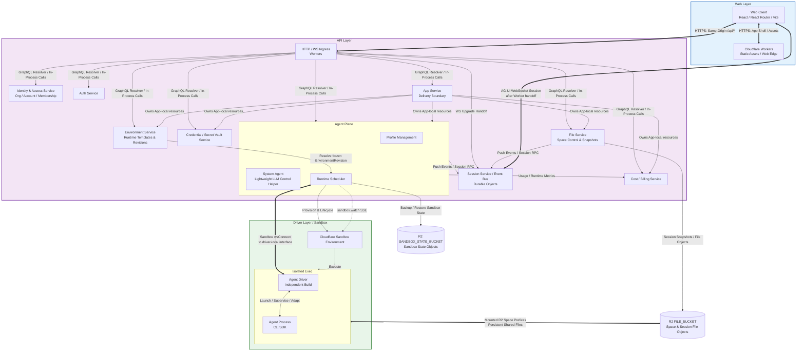
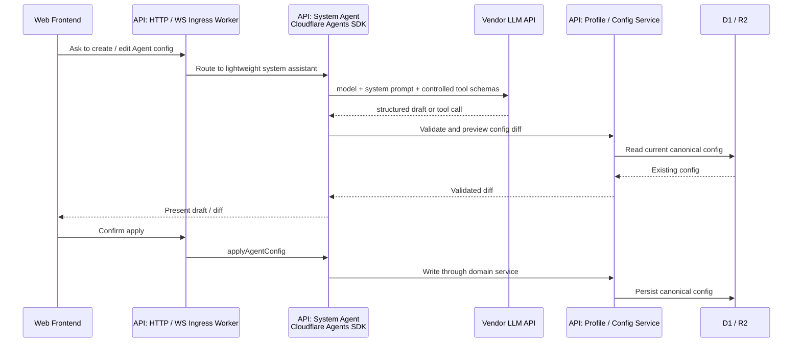
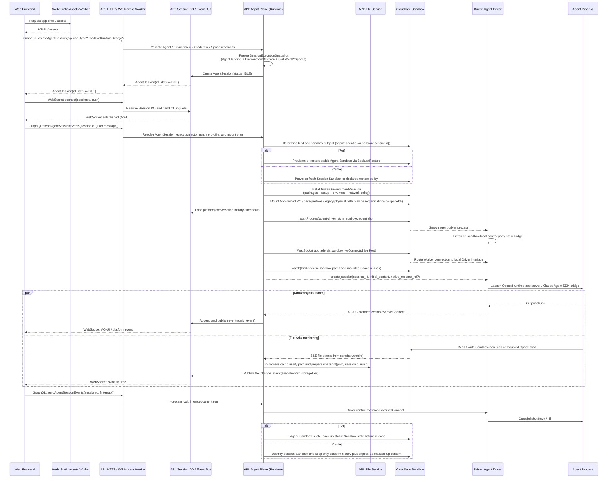

# Cloudflare-native Agent Cloud Architecture

## 1. Vision And Principles

This app provides a deliberately simple web experience for orchestrating heterogeneous Agents, including CLI tools and SDK-based runtimes.

The current priority is OPCs, personal developers, and small self-hosted deployments. A user should be able to bring `PRD.md`, invoke `@mosoo`, and get a running Agent App in their own Cloudflare account with low operational overhead. In the current construction phase, assume one human owns one Organization: Organization is the account / billing / tenant shell, App is the code and data boundary, and App is the console noun. Team collaboration, enterprise governance, cost management, and stronger compliance controls are extension paths for the same architecture, not default complexity for the current community edition.

To support lightweight deployment, fast iteration, and future governance expansion, the architecture embraces Serverless and edge computing and follows these baseline principles:

- **Vectorized API design**: Core business APIs, especially northbound GraphQL, internal Worker RPC, and data mutation surfaces, should accept arrays of target entity IDs by default where it is natural. This reduces network round trips and gives the data layer room for batch writes and deletes.
- **Single ULID business identifier system**: The control plane, execution plane, internal RPC, and public APIs use server-generated ULIDs as canonical business and protocol identifiers. At persistence boundaries, ULIDs are stored and indexed as strings to preserve distributed generation performance and time-sortability.
- **Observability native**: OpenTelemetry is a first-class concern during service initialization. Requests, Worker-to-Worker calls, database queries, and queue consumers must carry trace context. Metrics and structured logs should remain correlated with traces.
- **Minimal Web / API / Driver topology**: The system is split by build and deployment boundary into three top-level planes: Web, API, and Driver.

---

## 2. Infrastructure

The architecture is built on the Cloudflare platform and uses a Serverless shape for elastic scaling:

- **Frontend and ingress: Cloudflare Workers**. The Web Worker serves Vite-built static assets. The API Worker handles stateless GraphQL / Web API requests and WebSocket handshakes, then hands upgraded session connections to the corresponding Session Durable Object. Cloudflare routing sends `mosoo.ai/api/*` to the API Worker and all other paths to the Web Worker.
- **State and connection management: Cloudflare Durable Objects**. Durable Objects hold upgraded WebSocket connections, high-frequency Session state, and distributed coordination points that need single-instance concurrency.
- **Primary database: Cloudflare D1**. D1 stores Organization / Account / Membership records, App records, core entity configuration, and metadata.
- **Message queues: Cloudflare Queues**. Queues decouple the control plane from offline tasks. They provide consumer groups, ACK semantics, dead-letter queues, and at-least-once delivery for asynchronous work and cost log ingestion.
- **Object storage: Cloudflare R2**. R2 stores long-lived Space files, session-level file objects, sandbox state backups, and configuration attachments. User-visible Space files are mounted into the Sandbox from R2 bucket prefixes. Sandbox private state backups use a separate backup bucket and must not be mixed with user-visible file prefixes.
- **Execution sandbox: Cloudflare Sandbox / Containers**. Heterogeneous Agents run in container-image-backed isolated environments, with Sandbox APIs and Durable Object boundaries controlling runtime lifecycle.
- **System assistant framework: Cloudflare Agents SDK**. The current implementation is the `AgentBuilderSystemAgent` / agent-builder path. It provides lightweight system assistance for Agent configuration creation, prompt preparation, and control-plane operation planning. It does not enter the full Sandbox / Driver runtime path.

---

## 3. Topology

The system is split by logical and deployment boundary into three top-level domains: **Web Layer**, **API Layer**, and **Driver Layer**.

---

## 4. Layered Design

### 4.1 Web Layer

The Web layer provides the interactive client experience.

- It is built with **React / React Router / Vite** and served through Cloudflare Workers Static Assets.
- Browsers access a same-origin `/api/*` entry point. Cloudflare routes `mosoo.ai/api/*` to the API Worker and other paths to the Web Worker, preserving independent Web/API deployments while keeping a same-origin product experience.
- WebSocket, using the `AG-UI WebSocket` protocol, carries bidirectional high-frequency streaming events such as text streaming and state synchronization.

### 4.2 API Layer

The API layer contains business logic, state management, and Agent scheduling. It is the system control plane.

Except for runtime boundaries such as Session Durable Objects and Sandbox instances, the `* Service` terms below refer to domain modules inside the same API Worker codebase, not independently deployed microservices.

1. **API / WS Gateway**
   - Stateless Workers provide the shared HTTP and WebSocket ingress layer. They handle authentication, routing, GraphQL queries and mutations, and WebSocket handshakes.
   - WebSocket requests always enter the Worker first. The Worker resolves the Session key and Organization context, then hands the upgraded connection to the corresponding Session Durable Object.

2. **App Service**
   App Service owns the business, resource, operations, and export boundary for the current pivot. App is the canonical product and engineering noun. An App belongs to an Organization and is owned by the Organization owner during the single-owner phase. App has no runtime; Agent owns runtime, API endpoint exposure, and channel delivery.
   - **Default App provisioning**: Onboarding / Organization provisioning creates a default App. If the Organization has exactly one App, the console routes directly into that App instead of forcing an App picker.
   - **Resource ownership**: Agents, Threads / Sessions, Spaces, Environments, Skills, MCP servers, Provider credentials, Channels, Agent exposure state, App export, app health, logs, and app-scoped cost are App-owned resources. Organization rollups remain for billing and future governance.
   - **Access boundary**: App access maps to the single Organization owner for this phase. App members, App roles, ownership transfer, and org-wide shared resources are future extensions, not prerequisites for the first cut.

3. **Agent Plane**
   The Agent Plane unifies configuration management, lightweight system assistance, and runtime scheduling. The public data entity is the bare `Agent`. Historical terms such as `AgentService` and `PublishedAgent` have been collapsed into `Agent`, and the module name `Agent Plane` avoids a naming collision with the entity itself.
   - **Profile management**: Agent definitions are stored under App in D1 and support CRUD plus import/export flows. The Profile manages Skill availability, MCP bindings, Runtime references, and Provider references for an App-local Agent. Runtime plaintext credentials are not stored in the Profile. New flows resolve them through Credential / Vault by `(execution_actor, app, provider)`, with `(execution_actor, organization, provider)` kept only as migration fallback. In the Runtime Session Kernel, the execution actor is the Agent owner; the caller is used only for ingress context and permission response attribution.
   - **System Agent**: This path helps users create and edit Agent configuration, generate system prompts, choose models and tools, and validate configuration completeness. It uses lightweight LLM calls, does not start a Sandbox, does not launch an Agent Driver or Agent Process, and does not use Skills for dynamic expansion. It is made from model, system prompt, and controlled tool schemas, with Cloudflare Agents SDK used only as a thin session/state/RPC wrapper.
   - **Runtime**: The Runtime validates execution rights and orchestrates Cloudflare Sandbox instances. It does not wait for an in-sandbox Driver to call back to a public endpoint. Instead, it uses Sandbox SDK `wsConnect()` to reach the Driver's local WebSocket / JSON-RPC interface inside the container. It also applies Agent `kind` to choose Pet Sandbox or Cattle Session Sandbox behavior, restores platform conversation history, mounts authorized Spaces, manages Sandbox Backup/Restore and destruction policy, and consumes `sandbox.watch()` file events on the Worker side.
     - **Pet Runtime path**: A Pet Agent is bound to a stable Agent Sandbox with subject `agent:{agentId}`. Multiple Sessions for the same Pet happen inside the same Sandbox. The default initial working directory is shared, and Session-to-Session isolation is not guaranteed. Backup/Restore preserves user-visible continuity across Sandbox startup and teardown. Reset agent-state clears only this stable Sandbox state and does not delete Agent config, Space files, Session history, Cost, or logs.
     - **Cattle Runtime path**: Each Cattle Agent Session is bound to an isolated Session Sandbox with subject `session:{sessionId}`. The Sandbox is the Session boundary. It is destroyed when the run ends or the lifecycle policy triggers. Temporary files, caches, login state, and native runtime state that are not written to Space or explicitly captured by a restore policy disappear with the Sandbox.
     - **Cattle continuation**: The product still allows continuing the same Cattle Session. If the old Session Sandbox has been destroyed, the next `send events` call creates a new Session Sandbox and restores only platform-persisted conversation history, metadata, and explicit Space/Backup content. This is not Sandbox reuse and not cross-Session memory.
     - **Scaling extension point**: Runtime, Session Durable Object, and Driver contracts must not hard-code "single sandbox" as a permanent product fact. Pet may later add more stable Sandbox strategies under consistency constraints, and Cattle may later add standby pools or batch scheduling. The external API semantics remain governed by `kind`.

4. **File Service**
   The File Service combines Space logic with storage access. It is a shallow wrapper around Cloudflare R2:
   - **Abstraction and permission control**: Space is moving to a App-owned file asset for current App work. Existing Organization-owned ACL language is migration context or future multi-member governance. During the single-owner phase, Space access is derived from App owner access; `admin`, `edit`, `read`, wildcard sharing, and Organization admin reach-through remain extension points.
   - **Direct read/write data plane**: During Sandbox execution, authorized App Space R2 prefixes are mounted directly into the Sandbox. Existing `organization/sp/{spaceId}` physical prefixes are legacy storage paths, not logical ownership. This creates the real data plane `Sandbox / Agent Process <-> R2`. The File Service does not proxy runtime Space file bytes. Browser-side large uploads and downloads may use presigned URLs to avoid API memory pressure.
   - **Space version safety net**: Cloudflare R2 currently does not expose usable bucket-level Object Versioning controls. Before destructive writes such as overwrite, delete, directory delete, or Space delete, the File Service performs copy-on-write. It copies the previous object into the non-mounted `space_versions/{spaceId}/...` prefix in `FILE_BUCKET`, then writes version metadata into `space_file_version` in D1. `space/{spaceId}/...` remains the only user- and Agent-visible Space timeline. The version ledger is for operational recovery and future recovery UI.
   - **Session file resources**: Session File / Session Resource is the explicit attachment layer for files uploaded by a user or added through the Public API. The File Service stores them as `file_record(scope_kind=session, session_kind=attachment)` plus an R2 object, then injects a readable path manifest into the next Agent input. Session Files are not an automatic snapshot of the entire Session working directory, and Sandbox temporary files are not promoted into long-lived assets by default.
   - **Event flow**: `sandbox.watch()` currently watches only mounted directories for authorized Space aliases. It syncs Space mutations back to File Service / Session Durable Object. It does not archive arbitrary Session working-directory files as Session Files. Frontend file events come from explicit Session file upload/delete actions and Space write summaries, not from whole-working-directory snapshots.

5. **Environment Service**
   Environment is a first-class Agent runtime template asset. Like Agent, Space, Skill, and MCP, new App work scopes it by App boundaries first.
   - **Data model**: `environment` stores environment asset metadata, owner, fork source, App scope, and `current_revision_id`. `environment_revision` stores immutable configuration versions, including `network_policy`, `allowed_hosts_json`, `packages_json`, `setup_script`, `env_vars_json`, `allow_package_managers`, and `allow_mcp_servers`. App points to its default environment; Organization default environment is migration fallback until backfill is complete.
   - **Defaults and sharing**: Each App has a system default environment. Users can create App-local Environments. Cross-app sharing, Organization defaults, and Admin compliance override are future governance extensions. Forking creates a new Environment identity and a new revision without mutating the source Environment.
   - **Runtime freeze**: An Agent references an `environment_id`. When a Session is created, Runtime resolves the current EnvironmentRevision and writes it into `session_execution_snapshot.plan_json`. The Session then always uses the environment id/name/revision/network/packages/setup/env vars snapshot captured there. Editing an Environment affects only future Sessions.
   - **Responsibility boundary**: Environment describes rebuildable runtime templates and startup constraints. It does not contain Space files, Skill package content, MCP server definitions, or Session history. Setup scripts, packages, and package manager caches are rebuildable and are not user-visible state.
   - **Execution constraints**: Runtime provisioning installs packages, runs the setup script, injects env vars, and applies network constraints from `network_policy` and `allowed_hosts` according to the frozen snapshot. Missing required environment configuration or setup failure must fail Session startup and enter Runtime diagnostics.

6. **Identity & Access Service**
   - The current construction model is `Account -> Organization owner -> App`. Workspace and Team are not architecture concepts. For this phase, one human owns one Organization and App access maps to that owner.
   - Core identity entities remain `Account`, `Organization`, and the existing Membership machinery needed for authentication compatibility. `Invitation`, `AccessRequest`, Organization roles beyond owner/admin compatibility, and member lifecycle administration are future multi-member governance, not current App dependencies.
   - Login fallback uses `lastActiveOrgId` plus active membership fallback, then routes to the default App when the Organization has exactly one App. The system no longer maintains `account.origin_organization_id` or an "Origin Org for life" concept.

7. **Auth Service**
   - Authentication is built on Better Auth. Supported authentication methods are **Google OAuth** and **Email OTP**. Both support registration, recovery, and cross-device fallback. Passkey (WebAuthn) is a planned future option but is not enabled in the current build.
   - The same verified email across providers maps to the same Account.
   - The current version does not support passwords, magic links, enterprise SAML / OIDC, SCIM, enterprise domain discovery, invitation acceptance, or access requests. Any post-auth resolver logic for those flows is future governance or migration compatibility, not the V1 single-owner App path.

8. **Session Service**
   - The Session Service is backed by Durable Objects, which own upgraded WebSocket connections.
   - It manages the conversation context between user and Agent and acts as the high-frequency event bus. It receives events from Runtime and File Service, then broadcasts them to connected clients. Session Durable Objects do not perform gateway handshake responsibilities; ingress and handoff stay in the Worker.

9. **Credential / Secret Vault Service**
   - Provider keys, API keys, and MCP credentials are moving to App scope for new App work. Existing Company Credentials and Personal Credentials remain migration context: Company Credentials belong to an Organization, and Personal Credentials belong to `(Account, Organization)`. Runtime should converge on resolving the active key by `(execution_actor, app, provider)`, falling back to `(execution_actor, organization, provider)` only during migration. In Agent execution, the execution actor is the Agent owner; the caller is used only for ingress context.
   - API keys, provider keys, and MCP access credentials are encrypted at rest with envelope encryption. Plaintext exists only briefly in runtime memory. Profiles store provider and credential references, never plaintext secrets.
   - Credential CRUD, active key switching, and Agent / MCP binding changes are control-plane changes. High-frequency `resolveCredential()` calls are runtime reads and remain outside mutation workflows.

10. **Cost / Billing Service**
    - Cost and billing data are recorded as a usage ledger. The current schema uses `usage_event` and `usage_daily_rollup`, with dimensions such as `organization_id`, `agent_id`, `actor_user_id`, `agent_owner_user_id`, `session_id`, `session_run_id`, provider, model, runtime id, run purpose, token buckets, pricing status, and usage contract. App separation adds `app_id` as the primary business-cost dimension while preserving Organization rollups for billing and future governance.
    - Runtime model-call events are normalized before they enter the cost service. The cost service consumes already-normalized usage and does not infer provider-specific token semantics itself.
    - Cost records usage in its own ledger and does not reuse Runtime Log, traces, or structured application logs as billing data.

### 4.3 Driver Layer

The **Agent Driver** is a top-level independently built execution component because it runs inside heterogeneous Cloudflare Sandbox environments and must stay small and clean.

> **Terminology lock**: In this architecture, **`Agent Driver`** is the canonical name for the driver process, capability registration, upstream event envelopes, and downstream vendor protocol adaptation. Vendor-specific implementation inside the Driver is called **Driver backend** or **vendor-specific backend**. Historical terms such as `VendorAdapter`, `runtime adapter`, `Driver adapter`, `Provider Adapter`, and `Runtime Driver` should be normalized to `Agent Driver` or `Driver backend`. `Runtime` means API/control-plane scheduling, lifecycle, and Sandbox orchestration. `Provider` means the model and credential provider dimension.

1. **Agent Driver**
   - The Driver is a minimal independently built binary or script entry point. Runtime starts it explicitly inside the Sandbox and treats it as the long-lived control process.
   - **Current public Driver types**: Runtime Catalog exposes `openai-runtime` and `claude-agent-sdk` to users. The OpenAI runtime path uses an app-server / SDK backend. The Claude path uses the native Claude Agent SDK interface.
   - **Current internal Driver transport**: `system-agent` and `acp-fallback` exist in catalog / protocol surfaces, but are internal or disabled and are not exposed as user-selectable runtimes. New provider integrations must add vendor-specific backends and declare capabilities and gaps in Runtime Catalog.
   - **Credential and configuration injection**: Runtime injects critical configuration and one-time access credentials through standard input when starting the process.
   - **Control flow establishment**: The Driver listens on a sandbox-local port or stdio bridge. API Worker / Runtime uses Cloudflare Sandbox WebSocket connection support to route requests to that local interface. The Driver no longer owns a public API endpoint or calls back to the control plane over the public internet. Authentication, routing, Organization / Membership checks, and asset ACL boundaries stay in Worker / Runtime.
   - **Multi-Session isolation**: `AgentSession` is the product-level conversation boundary. Cloudflare Sandbox and container processes are execution resource boundaries. If multiple long-lived Driver / Agent processes in one Sandbox need stronger process, filesystem, or environment isolation, evaluate user-space container tooling such as `bubblewrap` inside the container for narrower per-session namespaces.

2. **Agent Process**
   - **Protocol adaptation**: The Driver encapsulates native integration details for OpenAI runtime app-server, Claude Agent SDK, and required vendor CLI / SDK paths. This adaptation is internal to the Driver and is not an independently deployed topology node.
   - **Target process**: The Agent Process performs model reasoning, code generation, or CLI work. The Driver launches, supervises, and reaps it.

---

### 4.4 Lightweight System Agent Path

The System Agent is a control-plane capability, not a user-publishable, shareable, long-running business Agent. It helps turn user intent into platform configuration, such as creating Agent profiles, preparing default prompts, recommending models, generating tool binding drafts, checking configuration conflicts, and applying validated configuration writes.

Design constraints:

- **No full Agent Runtime**: It does not create Runtime `AgentSession` or Sandbox execution resources, does not start Agent Driver, does not consume Pet/Cattle Sandbox paths or caches, and does not participate in Space file execution.
- **No Skill usage**: The goal is deterministic, fast, controlled assistance. Loading Skills would expand context, increase dynamic behavior, and raise cold-start cost.
- **Direct LLM API call**: Inputs include system prompt, current user context, target config draft, and controlled tool schemas. Outputs must pass structured validation before persistence.
- **Control-plane tools only**: Tools should be small and stable control-plane service functions such as `create_agent`, `patch_manifest_draft`, `apply_agent_config`, `inspect_builder_context`, and `search_builder_assets` (defined in `agent-builder-control-plane-tool-descriptor.service.ts`). Tools call existing Manifest / Vault / File / Permission services for writes and must not bypass domain services to operate directly on D1 or R2.
- **Cloudflare Agents SDK as a thin wrapper**: The SDK may provide `Agent` class state, WebSocket, and callable RPC support for short sessions and frontend interaction state. Canonical configuration remains in D1, R2, and domain services.
- **Explainable and rollback-safe failure**: LLM output creates a draft or a tool-call request. Real configuration mutation must show a diff, run permission checks, and run schema validation first. Write failures must not silently fall back.

Minimal flow:

---

### 4.5 Agent Sandbox And Persistence Layers

An Agent's runtime filesystem must not be treated as a generic workspace. The architecture first separates Sandbox lifecycle by Agent `kind`, then separates Space, platform Session history, and disposable cache. The principle is: **Space is a user-managed long-lived asset; Sandbox is an execution environment; Session history is platform data; they must not impersonate each other**.

| Layer                        | Applies To   | Lifecycle                                                                                                                                                                                                             | Typical Content                                                                                          | Canonical Owner                                                          |
| ---------------------------- | ------------ | --------------------------------------------------------------------------------------------------------------------------------------------------------------------------------------------------------------------- | -------------------------------------------------------------------------------------------------------- | ------------------------------------------------------------------------ |
| **Pet Sandbox**              | Pet          | Stable Agent-level Sandbox, subject `agent:{agentId}`. Multiple Sessions share one Sandbox by default. Startup and teardown use Backup/Restore to preserve continuity.                                                | Pet local state, login state, tool cache, vendor-native state, local files not explicitly moved to Space | Sandbox state bucket + runtime metadata                                  |
| **Cattle Session Sandbox**   | Cattle       | Isolated Session-level Sandbox, subject `session:{sessionId}`. The Sandbox is the Session boundary and is destroyed by lifecycle policy.                                                                              | Temporary files, build artifacts, caches, login state, vendor-native state for one Session               | Runtime temporary resource; not persistent by default                    |
| **Space / Knowledge**        | Pet / Cattle | Explicit long-lived user-managed file / knowledge asset. It survives across Sessions and Sandboxes according to Space permissions.                                                                                    | User uploads, shared knowledge, explicitly saved Agent outputs                                           | Space / FILE_BUCKET, R2 object + D1 metadata                             |
| **Session File / Resource**  | Pet / Cattle | Explicit attachment set for a product Session. Upload or Public API file creation keeps it on the Session. Archive makes the Session read-only. Session deletion hard-deletes file objects and control-plane records. | Files uploaded for the current Session, Public API thread attachments                                    | FILE_BUCKET + `file_record(scope_kind=session, session_kind=attachment)` |
| **Platform Session History** | Pet / Cattle | Product Session data persisted by Session Durable Object / API. Used for continuation and UI replay. It is not the Sandbox filesystem.                                                                                | Transcript, event metadata, run state, ingress context                                                   | D1 / Session storage / Runtime metadata                                  |
| **Sandbox Cache**            | Pet / Cattle | Disposable and rebuildable. Environment changes or Sandbox rebuilds rematerialize it from EnvironmentRevision.                                                                                                        | Package cache, setup script artifacts, rebuildable tool cache                                            | Environment / Runtime provisioning cache                                 |

Invariants:

- **Pet continuity comes from stable Sandbox + Backup/Restore + platform Session history**. Reset agent-state clears only the stable Sandbox state and its Backup/Restore continuity. It does not delete Agent config, Space files, Session history, Cost, or logs.
- **Cattle isolation comes from one Sandbox per Session**. Cattle has no Agent-level stable Sandbox state. When the Sandbox is destroyed, temporary files, caches, login state, and native state disappear unless they were written to Space or explicitly captured by policy.
- **Cattle continuation is not old-Sandbox reuse**. Continuing a product Session may create a fresh Sandbox and restore only platform-persisted conversation/history/metadata plus explicit Space/Backup content.
- **Space is the explicit persistence layer**. Pet and Cattle can read and write authorized Spaces. Space writes persist across Sessions and Sandboxes. Non-Space content follows Sandbox semantics.
- **Session File is the explicit Session attachment layer**. It exposes user-uploaded or API-added files to the Agent through the next input context. It does not promise to restore the whole Sandbox working directory.
- **Session history is not Space and not Sandbox backup**. Transcript and metadata are used for interaction context and UI replay. They do not automatically make Sandbox-local files long-lived assets.
- **Environment cache is not state**. It contains rebuildable packages and setup artifacts. It does not enter Space and is not a user-visible asset promise.
- **Permission checks happen on both control-plane and Driver-guard sides**. Session creation freezes alias sets, and every turn still refreshes Space permission snapshots. Recovery, mount, and continuation paths must not bypass current permissions.

---

## 5. Core Execution Flow

---

## 6. References

### Product Documents

- `Identity & Access Foundation PRD`: [`identity-access.md`](./prd/identity-access.md)
- `RBAC PRD`: [`rbac.md`](./prd/rbac.md)
- `Credentials PRD`: [`credentials.md`](./prd/credentials.md)
- `Space Interaction PRD`: [`space-interaction.md`](./prd/space-interaction.md)
- `Session Lifecycle PRD`: [`session-lifecycle.md`](./prd/session-lifecycle.md)
- `Runtime Session Kernel PRD`: [`runtime-session-kernel.md`](./prd/runtime-session-kernel.md)
- `Environment PRD`: [`environment.md`](./prd/environment.md)

### External Protocols And Platforms

- `ULID`: <https://github.com/ulid/spec>
- `GraphQL`: <https://github.com/graphql/graphql-spec>
- `AG-UI`: <https://github.com/ag-ui-protocol/ag-ui>
- `OpenTelemetry`: <https://github.com/open-telemetry/opentelemetry-specification>
- `OpenAI runtime App Server`: <https://developers.openai.com/>
- `Skill`: <https://github.com/anthropics/skills>
- `MCP`: <https://github.com/modelcontextprotocol/modelcontextprotocol>
- `Cloudflare Sandbox`: <https://developers.cloudflare.com/sandbox/llms.txt>
- `Cloudflare Sandbox WebSocket Connections`: <https://developers.cloudflare.com/sandbox/guides/websocket-connections/>
- `bubblewrap`: <https://github.com/containers/bubblewrap>
