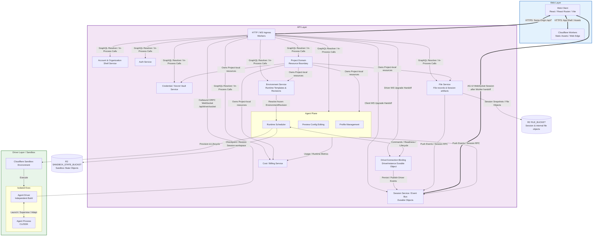

# Managed Agent Runtime Architecture

## 1. Vision And Principles

Target direction (2026-09-10): [SPEC](./SPEC.md) defines a Project-scoped managed runtime for general application-backend tasks. The September 22 owner direction makes direct invocation primary: a Project key, harness/model, instructions, input, and optional files create a durable Session. A saved Agent is an optional preset, not a prerequisite. Single-turn ghFind evaluation and multi-turn CSV analysis share this contract. New Sessions resolve one explicit configuration source, inline or a latest saved preset, and retain internal immutable snapshots; callers neither select historical versions nor deploy Workers per configuration.

Agent configuration and exports carry no execution ownership type. Legacy kind values
are confined to compatibility input validation and historical storage; they cannot
select a runtime or constrain an environment's network policy. Project Agent listings
and Agent GraphQL outputs omit the retired field. Session summaries, execution
bindings and v2 Thread responses also omit it. The v1 HTTP adapter alone returns
the historical Session row's label for wire compatibility; mutable preset labels
never determine that response. Existing execution snapshots may contain the old
field, which the current reader ignores. Session ownership and the admitted
network configuration determine execution.

The matching Driver uses boot protocol 6 without the required `sandboxKind`
marker. Older boot and control protocols are rejected before execution. New
execution snapshots also omit `binding.kind`; release and rollback candidates
must both read these snapshots and use a matching Driver. Earlier protocol-5
conversion and rollback builds remain pinned evidence for their own source,
not qualified rollback targets for this candidate. No stored rows are rewritten
by this contract removal.

Existing checkpoint and runtime primitives must support native continuation without Pet/Cattle product semantics. Persist required artifacts, events, usage, and a ready checkpoint before reporting a successful turn or reclaiming its uncommitted workspace. Follow-up uses committed state; cold continuation restores the workspace and native conversation or fails explicitly. Formal and API-used Sessions have no recurring inactivity deadline; retain their committed recovery state while they exist, including after unsuccessful follow-up. Completing a turn leaves the Session available for continuation.

The user-visible invariant is continuity of the same Session across seconds or days of idle time and runtime reclamation. Verify continuation against prior conversation context, working files, and the admitted configuration; successful backup creation is only an intermediate check. Live delayed-continuation evidence records actual elapsed time separately from deterministic tests that advance the clock.

The September 22 Preview exception applies only to Cloud debugging: an explicitly admitted Preview policy permits cleanup after 30 days without message, Run, or file activity. It does not apply to formal/API-used Sessions or silently enroll historical Previews. Derive activity from durable work records, not the Session's maintenance-updated timestamp. Admission, file upload, and cleanup must check the same policy against current D1 state; cleanup atomically claims only an idle Session with no active Run or admitted upload. Existing cleanup retry machinery owns the terminal operation and resource deletion. The console starts a new Preview after expiry. Before enrolling historical data, review candidates, backups, rollback, and the production cutover with the owner.

The final September 22 migration decision permits reviewed old Pet Sessions to become read-only after 30 days without their own calls or file activity, even when their owner remains active. Reuse the existing terminated lifecycle and direct/preset new-Session entry points, preserving history and saved files; recovery of the old native context, workspace and unrecorded configuration is excluded for that cohort. Inspect every Run outcome, file mutation and pending operation; reconcile stale markers from evidence, never from age alone. Refresh eligibility before cutover, protect active or uncertain peers, and retain production approval and rollback requirements. This is a one-time migration exception, not recurring formal-Session expiry. See [Thread Lifecycle](./prd/session-lifecycle.md#inactive-legacy-sessions-unreleased-migration-only).

The September 18 compatibility clarification keeps existing Thread routes, conversation IDs, and compatible Run result fields. Session describes the durable ownership and continuation contract; it does not mandate a new endpoint name. Changes to admission, saved/live selection, identity, or outcomes require behavior-level compatibility evidence independently of naming.

The unreleased `/api/v2` routes reuse the Public Thread services and Session kernel with explicit saved-configuration admission. They accept private Agents, optional end-user identity, and owned Sessions from other creation channels. `/api/v1` retains published/live selection and its public-channel identity boundary. Both resolve the same Session IDs and Project authorization; publication is not a read authorization boundary in v2. Every new Session, including console Preview, v1 live admission, v2 saved presets and direct Project invocation, allocates a Session-owned sandbox even when its Agent retains a legacy Pet label. Creating, importing and forking an Agent cannot opt into shared execution, and the console no longer exposes a type choice. Formal admission records no inactivity deadline and ignores historical snapshot recovery deadlines without rewriting them. Preview admission and cleanup still enforce the explicit Preview policy atomically. Ownership, terminal state, concurrency, and committed checkpoint guards remain required. This slice does not migrate shared Pet workspaces or provide platform-funded defaults.

The September 19 scope decision makes #582 a BYOK release: callers configure a Project provider before invocation. The September 22 direct-invocation decision removes the requirement to save a private Agent. Platform-owned model supply, recharge, and commercial billing remain independent #636 work; choosing a harness/model directly does not require platform funding. The later September 22 scope decision removes per-turn monetary budgets from #582 while preserving basic usage records and cost estimates.

### Direct invocation (unreleased)

The existing Session kernel owns execution for inline and saved-preset creation. The Project v2 route resolves one configuration source before admission and freezes one execution plan. Model-provider references and file ownership stay Project-scoped. Inline creation creates no synthetic Agent; Session, Run, event and Driver contracts carry null Agent provenance. Legacy non-null references remain unchanged. Frozen execution does not re-read mutable preset configuration on continuation. Legacy snapshots lacking frozen configuration retain explicit compatibility reads until their migration is verified. This source implementation still requires matched hosted acceptance and release.

Use the existing v2 Thread surface and lifecycle, with Project-level creation and upload available without an Agent. Existing Agent-scoped routes remain compatible preset adapters; v1 keeps its existing live-selection behavior. This does not claim manual-publish isolation: existing save operations can activate a new live version. Keep inline configuration and a preset reference mutually exclusive rather than inventing implicit override precedence. No new public version selector, mid-Session harness/model change, Responses/UHP compatibility layer, or commercial billing is implied. See the [implementation plan](./plans/2026-09-22-direct-session-design.md).

### Usage and retired turn-budget prototype

#582 records provider usage and correctly priced cost estimates through the existing usage pipeline. It does not expose a per-turn monetary cap, reserve model requests, settle budget counters, or block inference on a Mosoo cost threshold. BYOK credentials and Project/model authorization remain enforced; #636 commercial funding and billing remain separate.

Migration `0016_session-run-budgets.sql` has already been applied to staging. Preserve its immutable SQL, snapshots, journal, schema declaration and historical rows; the retired budget table has no active runtime readers or writers. Before deploying the removal to an environment that admitted budgeted turns, let those turns finish and verify that no active request remains. Do not silently remove an admitted spending limit mid-turn. No data deletion or migration is required for this code removal.

### Target Session ownership and Cloud transition

The following boundaries are targets for #582, not a claim that existing Pet workloads have migrated:

- Project owns authorization, optional Agent presets, provider references, and saved file records. Session execution freezes its selected configuration and source; an inline Session has no Agent reference. Authorization and execution ownership derive from Project, not the existence or current publication state of a preset.
- Session owns its writable working directory, native runtime context, serialized turn admission, and checkpoint lineage. Sandbox/Driver are replaceable execution resources bound to that Session. Reusable immutable environment/package artifacts may be shared; writable Agent memory, home directories, credentials grants, and runtime-native state may not cross Sessions. Separate directories alone do not enforce isolation when tools have full access in a shared container.
- Session maintenance uses Project authorization and an explicit Session ID, independently of optional Agent provenance. Restart/recreate reuse the existing lifecycle admission, cancellation, failure repair and execution-plane operations. Check the recorded physical subject and all workspace peers before admission, then recheck the binding under the admitted Session operation marker before dispatch. Preserve the frozen plan, public ID, committed native cursor and ready checkpoint. A pending successful-turn checkpoint prevents destructive reclamation. The Agent-scoped compatibility adapter is not the authority for direct Session maintenance.
- Cold recovery validates Project/Session ownership, the committed turn, native state, and workspace checkpoint together. It restores the same Session or returns an explicit recovery error. It must not substitute another Session's state or silently start an empty conversation.
- Session-owned execution requires native continuation whenever a native reference is supplied, including after an in-process runtime restart. A missing OpenAI rollout or unavailable ACP restore capability cannot downgrade to a new native conversation with bounded text replay. Driver protocol 5 carries this requirement and explicitly nullable Agent provenance; older Drivers are rejected at boot and new handshakes. Drain existing accepted connections during the coordinated cutover. This protects the committed state but does not repair missing legacy sources or satisfy the Cloud migration requirement by returning an error.
- Existing Cloud Pet Sandboxes can contain several Sessions and Agent-wide state. Inventory those relationships and active work before changing allocation. Preserve old IDs, history, artifacts, and delegated identity. A per-Session copy of a verified checkpoint is possible only when its ownership and native lineage are known; copying the whole shared machine into every Session is not a safe default. Unassigned shared state and process-dependent workflows need a specific transition decision.
- The September 21 owner requirement keeps existing continuable Sessions behind the same public ID, with their context, promised workspace, and admitted configuration intact. A reply within one minute and a reply seven days later use the same continuation contract. Migration and recovery must not require a replacement Session, user-supplied reconstruction, or manual recovery. An incomplete or unverified legacy restore blocks the affected cutover and #582 closure; preserve the original mapping and resources while investigating. Explicit recovery failures remain truthful operational outcomes, not successful migration evidence.
- Drain admitted work and verify backup/restore on isolated copies before releasing a shared resource. Do not change a live Pet's kind to force the new allocator, restart it for inventory, or rewrite missing historical configuration as if it were recorded. The final main branch removes active Pet/Cattle behavior and the one-time conversion machinery; inert historical columns and immutable applied migrations remain. A version-pinned conversion build and its rollback material belong to the bounded release procedure, whose completion is a prerequisite for the final deployment.

Session-owned Codex memory lives in the runtime home inside the checkpointed workspace. Provisioning preserves a restored directory instead of linking it to machine-wide `/workspace/memory`. A legacy memory symlink requires a verified conversion before isolated execution or checkpoint commit; the link alone cannot establish whether its external contents were empty or recoverable. This guard is a release precondition for affected existing Sessions, not an accepted migration outcome. Keep their original mappings and backups until the shared-memory ownership, isolated copy, and rollback have been verified. The [Session isolation transition](./session-isolation-transition.md) records source selection, canonical checkpoint preparation, concurrent-admission protection, and functional rollback requirements.

The sections below describe the Session-only runtime candidate. Its deployment is gated on the pinned Cloud conversion and customer evidence under the [migration contract](./SPEC.md#10-migration-and-breaking-change-notification); these source changes are not evidence that existing Cloud resources have been converted.

Full-access execution retains isolation and authorization. Interactive approvals and typed Git resource infrastructure remain deferred. ghFind may provide a public repository URL and exact commit for the Agent to fetch with existing tools, or optionally upload material from that commit. Record and validate the actual material identity across retries. See [remaining slices](./prd/managed-agent-v1.md). The topology and flows below describe current implementation until those slices land, including its existing checkpoint retention policy.

mosoo provides a Project-scoped control plane for configuring, publishing, running, and observing coding Agents through the console and Public Thread API.

The product boundary is managed Agent execution. Builders keep ownership of their application and end-user authentication; a trusted backend supplies an opaque `userId`, and mosoo carries that immutable `(Project, userId)` context across the public Thread, Runs, files, and delegated MCP calls. mosoo owns runtime adaptation, Sandbox lifecycle, durable Thread and Run records, managed files, credentials, events, and usage visibility. In the current construction phase, assume one human owns one Organization: Organization is the account / billing / tenant shell, and Project is the code, data, product, and console boundary. Project owns concrete resources directly; it does not introduce a generic Service entity, `services` table, or polymorphic `service.kind`. Additional operational controls are extension paths for the same architecture, not default complexity for the current community edition.

To support lightweight deployment, fast iteration, and future governance expansion, the architecture embraces Serverless and edge computing and follows these baseline principles:

- **Vectorized API design**: Core business APIs, especially northbound GraphQL, internal Worker RPC, and data mutation surfaces, should accept arrays of target entity IDs by default where it is natural. This reduces network round trips and gives the data layer room for batch writes and deletes.
- **Single ULID business identifier system**: The control plane, execution plane, internal RPC, and public APIs use server-generated ULIDs as canonical business and protocol identifiers. At persistence boundaries, ULIDs are stored and indexed as strings to preserve distributed generation performance and time-sortability.
- **Observability native**: mosoo emits Vestig structured logs and wide events, propagates W3C `traceparent` context across supported HTTP and Driver control boundaries, and enables Cloudflare Workers native logs and traces. Correlation is explicit at implemented boundaries; the architecture does not claim blanket OpenTelemetry instrumentation for database, queue, or Worker RPC calls.
- **Minimal Web / API / Driver topology**: The system is split by build and deployment boundary into three top-level planes: Web, API, and Driver.

---

## 2. Infrastructure

The architecture is built on the Cloudflare platform and uses a Serverless shape for elastic scaling:

- **Frontend and ingress: Cloudflare Workers**. The Web Worker serves Vite-built console assets. The API Worker handles stateless GraphQL / Web API requests and WebSocket handshakes, then hands upgraded session connections to the corresponding Session Durable Object. `mosoo.ai` is the marketing / landing / blog origin owned by `langgenius/mosoo-website`. Authenticated console traffic uses `cloud.mosoo.ai`, with Cloudflare routing `cloud.mosoo.ai/api/*` to the API Worker and console paths to the Web Worker. During the domain migration, console requests on `try.mosoo.ai` redirect permanently to the new host while `try.mosoo.ai/api/*` remains a direct API route for existing CLI requests.
- **State and connection management: Cloudflare Durable Objects**. Durable Objects hold upgraded WebSocket connections, high-frequency Session state, and distributed coordination points that need single-instance concurrency.
- **Primary database: Cloudflare D1**. D1 stores Account records, Organization shell records, Project records, core entity configuration, and metadata.
- **Message queues: Cloudflare Queues**. Queues decouple the control plane from offline tasks. They provide ACK semantics, dead-letter queues, and at-least-once delivery for API commands such as scheduled maintenance. Cost usage is written from normalized runtime events, not ingested through a queue.
- **Object storage: Cloudflare R2**. R2 stores session-level file objects,
  internal configuration/package uploads, any records using the reserved
  library scope, and sandbox state backups. Runtime-produced files are recorded
  as session artifacts. Sandbox private state backups use a separate backup
  bucket and must not be mixed with user-visible file prefixes.
- **Execution sandbox: Cloudflare Sandbox / Containers**. Heterogeneous Agents run in container-image-backed isolated environments, with Sandbox APIs and Durable Object boundaries controlling runtime lifecycle.
- **Configuration editing**. Owner-side Agent configuration is currently edited through Preview, which combines the writable configuration form with in-context test chat. There is no dedicated `AgentBuilderSystemAgent` topology in the current codebase. Future configuration assistance must remain a control-plane feature and must not enter the full Sandbox / Driver runtime path.

---

## 3. Topology

The system is split by logical and deployment boundary into three top-level domains: **Web Layer**, **API Layer**, and **Driver Layer**.

```mermaid
graph TD
    subgraph Web_Layer [Web Layer]
        Client[Web Client<br/>React / React Router / Vite]
        WebWorker[Cloudflare Workers<br/>Static Assets / Web Edge]
    end

    subgraph API_Layer [API Layer]
        Ingress[HTTP / WS Ingress<br/>Workers]

        Identity[Account & Organization Shell Service]
        Auth[Auth Service]
        Project[Project Domain<br/>Resource Boundary]
        Session[Session Service / Event Bus<br/>Durable Objects]
        DriverConnection[DriverConnection Binding<br/>DriverInstance Durable Object]
        Vault[Credential / Secret Vault Service]
        File[File Service<br/>File records & Session artifacts]
        Env[Environment Service<br/>Runtime Templates & Revisions]
        Cost[Cost / Billing Service]

        subgraph Agent_Plane [Agent Plane]
            Profile[Profile Management]
            PreviewConfig[Preview Config Editing]
            Runtime[Runtime Scheduler]
        end

        Ingress --> |GraphQL Resolver / In-Process Calls| Identity & Auth & Project & Vault & File & Env & Agent_Plane & Cost
        Ingress --> |Client WS Upgrade Handoff| Session
        Ingress --> |Driver WS Upgrade Handoff| DriverConnection
        Runtime <--> |Commands / Readiness / Lifecycle| DriverConnection
        DriverConnection --> |Persist / Publish Driver Events| Session
        Project --> |Owns Project-local resources| Agent_Plane & Vault & File & Env & Cost
        File & Agent_Plane --> |Push Events / Session RPC| Session
        Env --> |Resolve frozen EnvironmentRevision| Runtime
        Agent_Plane --> |Usage / Runtime Metrics| Cost
    end

    subgraph Driver_Layer [Driver Layer / Sandbox]
        CF_Sandbox[Cloudflare Sandbox Environment]

        subgraph Isolated_Process [Isolated Exec]
            AgentDriver[Agent Driver<br/>Independent Build]
            AgentProc[Agent Process<br/>CLI/SDK]

            AgentDriver <--> |Launch / Supervise / Adapt| AgentProc
        end

        CF_Sandbox --> |Execute| Isolated_Process
    end

    FileBucket[(R2 FILE_BUCKET<br/>Session & internal file objects)]
    SandboxStateBucket[(R2 SANDBOX_STATE_BUCKET<br/>Sandbox State Objects)]

    Client <==> |HTTPS: App Shell / Assets| WebWorker
    Client <==> |HTTPS: Same-Origin /api/*| Ingress
    Client <==> |AG-UI WebSocket Session<br/>after Worker handoff| Session
    Runtime --> |Provision & Lifecycle| CF_Sandbox
    AgentDriver --> |Outbound ORPC WebSocket<br/>/api/driver/socket| Ingress
    Runtime --> |Checkpoint / Restore Session workspace| SandboxStateBucket
    File --> |Session Snapshots / File Objects| FileBucket

    classDef web fill:#e3f2fd,stroke:#1565c0,stroke-width:2px;
    classDef api fill:#f3e5f5,stroke:#6a1b9a,stroke-width:2px;
    classDef driver fill:#e8f5e9,stroke:#2e7d32,stroke-width:2px;

    class Web_Layer web;
    class API_Layer api;
    class Driver_Layer driver;
```

---

## 4. Layered Design

### 4.1 Web Layer

The Web layer provides the interactive client experience.

- It is built with **React / React Router / Vite** and served through Cloudflare Workers Static Assets on `cloud.mosoo.ai`.
- Browsers access a same-origin `/api/*` entry point from the console origin. Cloudflare routes `cloud.mosoo.ai/api/*` to the API Worker and console paths on `cloud.mosoo.ai` to the Web Worker, preserving independent Web/API deployments while keeping a same-origin product experience. `mosoo.ai` remains the marketing / landing / blog origin in the private website repository and sends login intent to the console origin. The legacy Web host preserves paths and query strings when redirecting; its `/api/*` route does not redirect across hosts because clients may drop authorization headers.
- WebSocket, using the `AG-UI WebSocket` protocol, carries bidirectional high-frequency streaming events such as text streaming and state synchronization.

### 4.2 API Layer

The API layer contains business logic, state management, and Agent scheduling. It is the system control plane.

Except for runtime boundaries such as Session Durable Objects and Sandbox instances, the API-layer `* Service` terms below refer to domain modules inside the same API Worker codebase, not independently deployed microservices. Product-level Project resources are concrete nouns such as Agent, Environment, Skill, MCP server, file record, and Provider credential. V1 does not add a generic Service entity, `services` table, or polymorphic `service.kind`.

1. **API / WS Gateway**
   - Stateless Workers provide the shared HTTP and WebSocket ingress layer. They handle authentication, routing, GraphQL queries and mutations, and WebSocket handshakes.
   - WebSocket requests always enter the Worker first. Client session upgrades are handed to the corresponding Session Durable Object. An Agent Driver dials `/api/driver/socket` with its Driver instance id, one-time boot token, and trace context; the Worker validates and hands that upgrade to the `DriverConnection` binding backed by the matching `DriverInstance` Durable Object.

2. **Project Domain**
   Project Domain owns the business, resource, and operations boundary for the current pivot. Project is the canonical product and engineering noun. A Project belongs to an Organization and is owned by the Organization owner during the single-owner phase. Project owns provider credentials, API keys, optional Agent presets, and Threads / Sessions. A Session owns its admitted execution configuration and isolated runtime; an Agent is not required for execution.
   - **Default Project provisioning**: Onboarding / Organization provisioning creates a default Project. If the Organization has exactly one Project, the console routes directly into that Project instead of forcing a Project picker.
   - **Agent and resource ownership**: Agents, Threads / Sessions, Environments, Skills, MCP servers, Provider credentials, file records, Agent exposure state, Agent runtime logs/state, and project-scoped cost are Project-owned resources. Session records expose execution history and Session-scoped runtime operations, including direct Sessions without an Agent. Project Usage remains under Project Settings; there is no generic Project health/log console.
   - **No generic Service entity**: Do not add a unified `services` table, polymorphic `service.kind`, or generic Service CRUD for concrete Project resources. If a future Web/API runtime, database service, worker process, or scheduled job is needed, model it with an explicit noun and lifecycle.
   - **Access boundary**: Project access maps to the single Organization owner for this phase. No secondary principal model is part of the first cut.

3. **Agent Plane**
   The Agent Plane unifies configuration management, Preview configuration editing, and runtime scheduling. The public data entity is the bare `Agent`. Historical terms such as `AgentService` and `PublishedAgent` have been collapsed into `Agent`, and the module name `Agent Plane` avoids a naming collision with the entity itself.
   - **Profile management**: Agent definitions are stored under Project in D1 and support CRUD plus import/export flows. The Profile manages Skill availability, MCP bindings, Runtime references, and Provider references for a Project-local Agent. Runtime plaintext credentials are not stored in the Profile. New flows resolve them through Credential / Vault by `(execution_actor, project, provider)` and fail closed when Project ownership cannot be proven. In the Runtime Session Kernel, the execution actor is the Project owner; the caller is used only for ingress context and permission response attribution.
   - **Preview configuration editing**: Owner-side editing currently happens in Preview. The surface auto-saves Agent preset configuration without interrupting existing Sessions. A Preview retains its admitted configuration and offers an explicit new Preview to test later edits; failed saves can be retried. It is a user-facing edit/test surface, not a separate publishable Agent or system-assistant topology.
   - **Session configuration**: New `session_execution_snapshot.plan_json` records retain the admitted inline configuration or optional Agent preset, including its `configJson`. Cold hydration and warm cache refresh use it for provider options and package readiness; credentials and resource access are revalidated. Pre-existing snapshots retain their legacy configuration lookup until an explicit cutover, so an old unpublished Session is not claimed to have an immutable initial configuration.
   - **Runtime**: The Runtime validates execution rights and orchestrates Cloudflare Sandbox instances. It writes a private Driver boot payload file, passes its path through `MOSOO_DRIVER_BOOT_PAYLOAD_FILE`, and starts `agent-driver`. The payload contains the API control URL, one-time boot token, trace context, Driver identity, frozen execution spec, and resolved Environment artifact paths. The Driver reads and removes that file, then actively dials the API control URL. The API's `DriverConnection` / `DriverInstance` Durable Object owns the authenticated ORPC WebSocket, command delivery, readiness, heartbeats, and Driver event ingestion. Runtime allocates by Session identity and chooses the Sandbox image from the frozen harness. It restores the exact ready Environment artifact when configured, resumes the original native conversation, materializes ready attachment ids explicitly submitted with the current message, records Session artifacts, and applies the checkpoint/restore policy below. Historical `kind` labels do not select a runtime path.
     - **Execution ownership**: Allocation, activation, checkpointing, and maintenance require an exclusive `session:{sessionId}` binding to the recorded Project and its execution owner. Shared, ambiguous, foreign, or unconverted bindings are preserved and cannot silently allocate an empty replacement. Closed peer Sessions still count as shared ownership. Only the reviewed pinned conversion can establish a new binding for existing Cloud resources.
     - **Container startup admission**: Runtime applies network constraints and confirms container port readiness before filesystem preparation. Each startup attempt has a 15-second cancellation signal. A cold subject without live Drivers may retry one transient startup failure only after the prior attempt has settled and container destruction is confirmed; warm subjects and existing Drivers cannot use this recovery. The outer 60-second RPC guard does not grant another retry. Cancellation must drain before teardown can advertise a cold subject; uncertain teardown remains `destroying` for lifecycle repair. This recovery precedes Driver creation and never replays Run input or tools. Keep-alive, startup, and individual directory operations emit separate phase timings.
     - **Session runtime**: Each Session uses the isolated runtime subject `session:{sessionId}`. Its Session Sandbox can remain warm during the idle grace and is otherwise disposable. When a Run completes successfully, Runtime removes current-message attachment mounts and short-lived boot/provider credentials, then checkpoints the complete Session working directory. A ready backup row bound to that Run is required before a follow-up can be admitted or the idle Sandbox can be recycled. Failed and cancelled Runs do not replace the last successful commit. The checkpoint is Session-scoped and never becomes Agent-level shared state.
     - **Session continuation**: A warm `send events` Run uses the committed resident workspace; a cold Run restores the latest ready checkpoint for that exact Session before accepting new input. The checkpoint includes the working directory, Driver-local provider state, and native resume cursor; the frozen `session_execution_snapshot`, platform events, and `file_record` manifest remain control-plane data. Credentials are resolved from Vault again, and only ready attachment ids referenced by the new message are mounted. A missing or failed restore is actionable startup failure, never an empty-workspace fallback. Backup records use the existing Sandbox Backup store, remain restorable for at least 20 days while the Session exists, and are deleted with the Session.
     - **Scaling extension point**: Runtime, Session Durable Object, and Driver contracts must not hard-code "single sandbox" as a permanent product fact. Standby pools and batch scheduling may change physical placement while preserving the same Session identity, configuration, native context, and workspace contract. There is no product-level Pet/Cattle switch.

4. **File Service**
   The File Service is the storage boundary for shipped Session attachments/artifacts and internal file scopes. `library` exists as a Project-scoped record type, but no current user-facing create/upload path makes it a shipped Files Library product:
   - **Abstraction and permission control**: Session, account, Agent-package, and Public API draft records are scoped implementation records. The reserved library scope is not an App source tree and does not revive the retired App Builder concept.
   - **Upload/download data plane**: Browser-side large uploads and downloads may use presigned URLs to avoid API memory pressure. Current user upload targets reject `library`; the Files page lists/downloads accessible records and runtime gets no shared writable library mount.
   - **Dormant library versioning**: Copy-on-write and `file_version` primitives exist for a future library write path, but no production UI/API currently reaches destructive library overwrite or move-overwrite. They are plumbing, not a shipped recovery guarantee.
   - **Session file resources**: Session File / Session Resource is the explicit attachment layer for files uploaded by a user or added through the Public API. The File Service stores them as `file_record(scope_kind=session, session_kind=attachment)` plus an R2 object, then injects a readable path manifest into the next Agent input. Session Files are not an automatic snapshot of the entire Session working directory, and Sandbox temporary files are not promoted into long-lived assets by default.
   - **Event flow**: Runtime-produced files are recorded as `file_record(scope_kind=session, session_kind=artifact)`. Frontend file events come from explicit Session file upload/delete actions and artifact updates, not from whole-working-directory snapshots.

5. **Environment Service**
   Environment is a first-class Agent runtime template asset. Like Agent, Skill, and MCP, new Project work scopes it by Project boundaries first.
   - **Data model**: `environment` stores environment asset metadata, owner, fork source, Project scope, and `current_revision_id`. `environment_revision` stores immutable configuration versions, including `network_policy`, `allowed_hosts_json`, `packages_json`, `setup_script`, `env_vars_json`, `allow_package_managers`, and `allow_mcp_servers`. Project points to its default environment; Organization does not provide a current runtime default.
   - **Defaults and reuse**: Each Project has a system default environment. Users can create Project-local Environments. Cross-Project reuse is not part of the current control plane. Forking creates a new Environment identity and a new revision without mutating the source Environment.
   - **Runtime freeze**: An Agent references an `environment_id`. When a Session is created, Runtime resolves the current EnvironmentRevision and writes it into `session_execution_snapshot.plan_json`. The Session then always uses the environment id/name/revision/network/packages/setup/env vars snapshot captured there. Editing an Environment affects only future Sessions.
   - **Responsibility boundary**: Environment describes rebuildable runtime templates and startup constraints. It does not contain file records, Skill package content, MCP server definitions, or Session history. Exact `npm` and `pip` declarations are prepared asynchronously into Project-scoped Cloudflare Sandbox Backups; custom setup scripts remain per-Sandbox actions. Historical `apt`, `cargo`, `gem`, and `go` values remain readable but cannot be written into a new revision or provisioned; owners receive an actionable migration error.
   - **Execution constraints (partial)**: Runtime restores and verifies the package Backup, exposes its executable/Python/Node paths to custom setup and Driver, then runs the custom setup script and injects env vars. The writable manager set is shared by Contracts, API validation, and Web, and is checked against the Driver image capability manifest. OS dependencies belong in the platform Driver image. `network_policy` and `allowed_hosts_json` are carried into `DriverProfileConfig.network`. `limited` is enforced for exclusive Session-owned Sandbox subjects. Shared or mismatched legacy bindings must pass verified conversion before provisioning; a historical Agent label cannot bypass ownership or network admission. For an admitted Session subject, Runtime persists a policy that is immutable for the subject lifetime before the container starts, disables direct container internet (`enableInternet=false`), and installs a deny-by-default allowlist containing the Environment hosts plus the control origin (Driver, MCP, and model-provider proxies) and R2 backup endpoint. The allowlist is evaluated at outbound HTTP/HTTPS interception, while direct non-HTTP egress remains disabled. Ordinary `HTTP_PROXY`, `HTTPS_PROXY`, and `ALL_PROXY` variables are rejected, and host-wide Runtime proxy bindings are not injected into `limited` sessions. A warm subject with unknown prior constraints fails closed and is destroyed rather than retaining broader raw TCP access; a different recorded policy fails closed even after a container restart. `full` keeps the Sandbox network defaults. Production pins HTTPS interception on; local workerd keeps it off for CA compatibility, so `limited` fails closed locally. `allow_package_managers` and `allow_mcp_servers` remain saved intent without runtime enforcement. Restore or setup failure must fail Session startup and enter Runtime diagnostics.

6. **Account & Organization Shell Service**
   - The current construction model is `Account -> Organization owner -> Project`. Project and Team are not architecture concepts. For this phase, one human owns one Organization and Project access maps to that owner.
   - Core identity entities remain `Account` and `Organization`; Organization is the account / billing / tenant shell for this cut. No invitation, request, role matrix, or lifecycle administration flow is part of the current Project dependency graph.
   - Login selects the account's Organization shell, then routes to the default Project when the Organization has exactly one Project. The system no longer maintains `account.origin_organization_id` or an "Origin Org for life" concept.

7. **Auth Service**
   - Authentication is built on Better Auth. Supported authentication methods are **Google OAuth** and **Email OTP**. Both can create or sign in to the same email-backed Account; Email OTP is the fallback when Google is unavailable. mosoo has no password or password-recovery flow. Passkey (WebAuthn) is a planned future option but is not enabled in the current build.
   - The same verified email across providers maps to the same Account.
   - CLI and other programmatic clients authenticate through a device authorization flow, not a separate login method. `POST /api/auth/cli/start` returns a `device_code`, a short `user_code`, and a `/cli-auth` verification URI; the user confirms inside an authenticated web session via `POST /api/auth/cli/confirm`, and the client polls `POST /api/auth/cli/token` until it receives a one-time `Bearer` token. The issued token is a Personal Access Token, so CLI access reuses the Account identity already established by Google OAuth or Email OTP rather than introducing a new credential type.
   - The current version does not support passwords, magic links, federated identity, directory sync, domain-based routing, or invite/request flows. Post-auth resolver logic outside the single-owner Project path is not part of V1.

8. **Session Service**
   - The Session Service is backed by Durable Objects, which own upgraded WebSocket connections.
   - It manages the conversation context between user and Agent and acts as the high-frequency event bus. It receives events from Runtime and File Service, then broadcasts them to connected clients. Session Durable Objects do not perform gateway handshake responsibilities; ingress and handoff stay in the Worker.

9. **Credential / Secret Vault Service**
   - Provider keys, API keys, and MCP credentials are Project-scoped for current Project work. Runtime resolves the active key by `(execution_actor, project, provider)` and fails closed when the Project-scoped credential cannot be proven. In Agent execution, the execution actor is the Project owner; the caller is used only for ingress context.
   - API keys, provider keys, and MCP access credentials are encrypted at rest with envelope encryption. Plaintext exists only briefly in runtime memory. Profiles store provider and credential references, never plaintext secrets.
   - Provider model calls authenticate through the Worker-side LLM proxy (`/api/driver/llm/proxy/:credentialId/*`). The Sandbox receives only an expiring, driver-generation- and model-bound `llm_proxy` grant in the vendor key env var and the proxy endpoint in the vendor base-URL env var (or rendered OpenCode config); the Worker verifies the active driver generation, admits only the model protocol's required endpoints, reads the vault secret per forwarded request, and injects the vendor auth header upstream. Raw provider keys never enter the Sandbox boot payload, process environment, or setup script environment.
   - Credential CRUD, active key switching, and Agent / MCP binding changes are control-plane changes. High-frequency `resolveCredential()` calls are runtime reads and remain outside mutation workflows.

10. **Cost / Billing Service**
    - Cost and billing data are recorded as a usage ledger. The current schema uses `usage_event` and `usage_daily_rollup`, with dimensions such as `organization_id`, `project_id`, `agent_id`, `actor_user_id`, `agent_owner_user_id`, `session_id`, `session_run_id`, provider, model, runtime id, run purpose, token buckets, pricing status, and usage contract. Project is the primary business-cost dimension; Organization remains the billing rollup.
    - Runtime model-call events are normalized before they enter the cost service. The cost service consumes already-normalized usage and does not infer provider-specific token semantics itself.
    - Cost records usage in its own ledger and does not reuse Runtime Log, traces, or structured application logs as billing data.

### Project Key Authorization

Browser sessions and CLI login credentials authorize the account control plane. Application keys resolve both the account and a single Project. Account-only routes reject Project principals; the GraphQL adapter explicitly admits reviewed Agent operations with a matching Project argument. Public Agent/Thread admission and file storage enforce the same Project on every resource access. Runtime delegation may use the owner only after admission has established the resource boundary.

New application keys use `msp_`; completed CLI login mints distinct `mcli_` credentials. Old `mst_` and `grt_pat_` hashes remain inert historical records. Key management requires account login. Project-key rate limits and idempotency receipts share the Project boundary, so rotation cannot create duplicate work or reset the limit. Request logs record Project and key IDs without key secrets. Each Run persists `created_by_key_id`; usage joins through `usage_event.session_run_id` to attribute each turn, including turns started with a replacement key. Browser-created Runs have no key ID.

### 4.3 Driver Layer

The **Agent Driver** is a top-level independently built execution component because it runs inside heterogeneous Cloudflare Sandbox environments and must stay small and clean.

> **Terminology lock**: In this architecture, **`Agent Driver`** is the canonical name for the driver process, capability registration, upstream event envelopes, and downstream vendor protocol adaptation. Vendor-specific implementation inside the Driver is called **Driver backend** or **vendor-specific backend**. Historical terms such as `VendorAdapter`, `runtime adapter`, `Driver adapter`, `Provider Adapter`, and `Runtime Driver` should be normalized to `Agent Driver` or `Driver backend`. `Runtime` means API/control-plane scheduling, lifecycle, and Sandbox orchestration. `Provider` means the model and credential provider dimension.

1. **Agent Driver**
   - The Driver is a minimal independently built binary or script entry point. Runtime starts it explicitly inside the Sandbox and treats it as the long-lived control process.
   - **Current public Driver types**: The API/Web Runtime Catalog exposes `openai-runtime`, `claude-agent-sdk`, and the `acp-fallback` transport (labeled `OpenCode`) to users. The standalone Driver registry independently maps those runtime/transport pairs to executable backends and advertised capabilities; the main repository's cross-submodule test requires both registries to match. The OpenAI runtime path uses an app-server / SDK backend. The Claude path uses the native Claude Agent SDK interface. The `acp-fallback` path serves OpenCode and DeepSeek configurations through ACP.
   - **Current internal catalog placeholder**: `system-agent` exists only as an
     internal/disabled Runtime Catalog entry. It is not Driver-admitted, not a
     Driver protocol runtime, and not user-selectable. New provider integrations
     must add a real Driver backend and declare capabilities and gaps in Runtime
     Catalog before admission.
   - **Boot configuration injection**: Runtime writes the complete boot payload to a private Sandbox file and passes the file path through `MOSOO_DRIVER_BOOT_PAYLOAD_FILE`. The payload carries `controlUrl`, a one-time boot token, `traceparent`, Driver identity, and the frozen execution spec. The Driver removes the file after reading it. mosoo's runtime path does not send this configuration through standard input.
   - **Control flow establishment**: The Driver does not listen on a sandbox-local control port. It actively opens an authenticated WebSocket to the payload's `controlUrl`, currently `/api/driver/socket`. The API Worker hands the upgrade to the `DriverConnection` binding, whose `DriverInstance` Durable Object owns the socket and ORPC command/event lifecycle. Runtime talks to that Durable Object for readiness, commands, status, and cleanup. Protocol v1 still carries a required `driverControlPort` field for legacy diagnostics, but neither side binds that port and new integrations must not depend on it; removal needs a versioned API/Driver rollout. Authentication, routing, Project access checks, and asset boundaries remain in Worker / Runtime.
   - **Multi-Session isolation**: `AgentSession` is the product-level conversation boundary. Cloudflare Sandbox and container processes are execution resource boundaries. If multiple long-lived Driver / Agent processes in one Sandbox need stronger process, filesystem, or environment isolation, evaluate user-space container tooling such as `bubblewrap` inside the container for narrower per-session namespaces.

   - **Runtime images**: After enabling `MOSOO_RUNTIME_IMAGES_ENABLED`, a newly allocated Cattle (Session-scoped) Sandbox records its physical `sandbox_binding` once, from the admitted runtime: Claude, OpenAI, or OpenCode/ACP. Each image preinstalls only that native runtime on the same Bun, Node, Python, npm, and pip base. Creation, continuation, backup, restore, retirement, and deletion resolve that recorded binding, including after a Worker restart; changing an Agent does not redirect an existing workspace. Pet workspaces can serve different frozen Session runtimes after a draft edit or unpublish, so they deliberately retain the union image; removing that capability is not part of image optimization. Existing rows default to the legacy `Sandbox` binding and retain its all-runtime image. Unknown or missing bindings fail closed. Environment artifact builders keep the legacy image and the same package ABI; no runtime installation is added to the Task path. D1 admission retains one 50-subject deployment ceiling across the image classes in addition to the per-account quota. Image size is a distribution/storage concern; TTFT improvements require separate measurement.

   - **Integration gate**: New runtimes extend the Driver protocol/backend registry and `runtime-images.json` together. The image manifest drives Driver CI builds, CLI isolation checks, and native tool-result round trips. Mosoo's `RUNTIME_SANDBOX_IMAGES` mapping is exhaustive over the pinned Driver runtime type; API contract tests compare it with the public Runtime Catalog, the pinned image manifest, every Wrangler environment, and the Sandbox SDK base-image version. Add the DO export, binding, image build argument, and append-only migration before admitting the new runtime. Preserve existing subject namespaces; use the [two-phase rollout](production-deploy-verification.md#runtime-image-namespace-compatibility) for new allocations.

2. **Agent Process**
   - **Protocol adaptation**: The Driver encapsulates native integration details for OpenAI runtime app-server, Claude Agent SDK, and required vendor CLI / SDK paths. This adaptation is internal to the Driver and is not an independently deployed topology node.
   - **Target process**: The Agent Process performs model reasoning, code generation, or CLI work. The Driver launches, supervises, and reaps it.

---

### 4.4 Configuration Assistance Boundary

The current product does not ship a dedicated lightweight System Agent or Agent Builder system-assistant topology. Owner editing starts from a blank Agent when needed, opens Preview, and uses the same Preview form/test surface to configure and validate behavior.

Future configuration assistance is allowed only as a control-plane capability layered over Project / Agent form state. It must not be modeled as a user-publishable, shareable, long-running business Agent, and it must not enter the full Sandbox / Driver runtime path.

Design constraints for any future assistant:

- **No full Agent Runtime**: It must not create Runtime `AgentSession` or Sandbox execution resources, start Agent Driver, consume Pet/Cattle Sandbox paths or caches, or write Session artifacts.
- **Form-visible writes**: Generated changes must be represented as visible form values or reviewable diffs before persistence.
- **Control-plane tools only**: Tools should call existing Project, Agent profile/configuration, Vault, File, Environment, and Permission services. They must not bypass domain services to operate directly on D1 or R2.
- **Canonical configuration stays in domain storage**: Project and Agent configuration remains in D1, R2, and domain services. Any assistant state is context, not the source of truth.
- **Explainable and rollback-safe failure**: Real configuration mutation must show a diff, run permission checks, and run schema validation first. Write failures must not silently fall back.

---

### 4.5 Agent Sandbox And Persistence Layers

An Agent's runtime filesystem must not be treated as a generic workspace. New admission uses Session-owned Sandboxes; existing shared bindings retain their legacy lifecycle until verified migration. The compatibility labels in the table and execution diagrams below distinguish those stored bindings, not a new Agent type choice. The architecture separates the reserved Project library scope, platform Session history, Session artifacts, and disposable cache. The principle is: **file records are control-plane data; Sandbox is an execution environment; Session history/artifacts are session data; they must not impersonate each other**.

| Layer                        | Applies To   | Lifecycle                                                                                                                                                                                                                                                                                                                                                                                                                                                         | Typical Content                                                                                 | Canonical Owner                                                              |
| ---------------------------- | ------------ | ----------------------------------------------------------------------------------------------------------------------------------------------------------------------------------------------------------------------------------------------------------------------------------------------------------------------------------------------------------------------------------------------------------------------------------------------------------------- | ----------------------------------------------------------------------------------------------- | ---------------------------------------------------------------------------- |
| **Pet Sandbox**              | Pet          | Stable Agent-level Sandbox, subject `agent:{agentId}`. Multiple Sessions share one Sandbox by default. Restart retains the container; recreate/hibernate checkpoints only `/workspace/memory` and eligible Session workspaces.                                                                                                                                                                                                                                    | Container-local login/cache/native/files; only selected memory/workspace paths are checkpointed | Live Sandbox container + selected backup paths + runtime metadata            |
| **Cattle Session Sandbox**   | Cattle       | Isolated Sandbox addressed by the Session-level subject `session:{sessionId}`. It can remain warm for an idle grace. Every successfully completed Run atomically checkpoints the Session working directory; a cold later Run restores the latest ready checkpoint before accepting input.                                                                                                                                                                         | Thread workspace, Git and dependency state, Driver-local native resume state                    | Live Sandbox plus Session-scoped Sandbox Backup                              |
| **Reserved library scope**   | Pet / Cattle | Project-scoped `library` record/versioning plumbing. The current HTTP API rejects library upload and the Files page has no create/upload action, so it is not yet a user-managed product surface or runtime input.                                                                                                                                                                                                                                                | No shipped user-created content path                                                            | Reserved `file_record(scope_kind=library, scope_id=projectId)` + FILE_BUCKET |
| **Session File / Resource**  | Pet / Cattle | Explicit attachment set for a product Session. Web Session upload creates it directly; Public API Agent upload first creates an internal Project draft, then a Thread resource reference claims it into the Session. Public claim and delete/remove enforce the same writable-lifecycle projection: archived, rescheduling, and terminal Sessions remain readable but reject file mutation. Session deletion hard-deletes file objects and control-plane records. | Files uploaded for the current Session, Public API Thread attachments                           | FILE_BUCKET + `file_record(scope_kind=session, session_kind=attachment)`     |
| **Platform Session History** | Pet / Cattle | Product Session data persisted by Session Durable Object / API for control records, UI replay, and recovery after a committed provider-native boundary. It is not the Sandbox filesystem.                                                                                                                                                                                                                                                                         | Transcript, event metadata, run state, ingress context                                          | D1 / Session storage / Runtime metadata                                      |
| **Sandbox Cache**            | Pet / Cattle | Disposable and rebuildable. Environment changes or Sandbox rebuilds rematerialize it from EnvironmentRevision.                                                                                                                                                                                                                                                                                                                                                    | Package cache, setup script artifacts, rebuildable tool cache                                   | Environment / Runtime provisioning cache                                     |

Invariants:

- **Pet continuity is bounded**. The live container survives restart, while
  recreate/hibernate restores only `/workspace/memory` and eligible Session
  workspaces. Reset destroys container state. Agent config, control-plane file
  records, Session history, Cost, and logs remain control-plane data.
- **Cattle isolation is Session-scoped**. Cattle has no Agent-level stable Sandbox state. A fresh Sandbox may serve each Run, but its latest committed working-directory checkpoint belongs to one Session and can never be selected for another Session or tenant.
- **Cattle continuation has one committed boundary whether warm or cold**. After execution ends, Runtime excludes attachment mounts and transient credentials and prepares a Sandbox Backup of the complete Session workspace. One guarded D1 batch records the ready backup, captured provider-native cursor, and completed Run status. Normal completion events and terminal Driver RPCs both wait for this boundary; pending or failed checkpoint work cannot publish success. The cursor must be observed for this Run or already committed by a prior successful turn of the same runtime. A concurrent cancellation or changed native cursor cannot commit the candidate checkpoint. Follow-up admission and idle reclamation also require completion history, persisted after the canonical final message; replay repairs these projections without replacing the committed backup. Cold continuation restores the checkpoint and provider-native cursor before new input; warm continuation uses the equivalent resident state. If checkpoint creation fails, the previous ready checkpoint remains authoritative and the idle sweep cannot recycle the uncommitted subject; missing or corrupt restore state fails explicitly. Live processes, sockets, kernels, and machine-wide temporary state are not persisted.
- **Cattle checkpoints are retained with the Session**. Ready backups are restorable for at least 20 days and survive archive. Permanent Session deletion removes their records and objects. Restore and checkpoint retries are idempotent; the ready-record transition is the atomic durability boundary.
- **The library scope is not shipped as a write surface**. Current user uploads
  cannot target it, and runtime output becomes a Session artifact instead.
- **Session File is the explicit Session attachment layer**. A ready file is exposed to the Agent only when its id is included with the current input. It does not promise automatic injection of all linked files or restoration of the whole Sandbox working directory.
- **Session history is not file storage or Sandbox backup**. Transcript and metadata are used for interaction context and UI replay. They do not automatically make Sandbox-local files long-lived assets.
- **Terminal Run observations follow the persisted outcome**. When interrupted finalization leaves a terminal Run without its matching history event, API, Driver, and maintenance retries repair the event and emit `session.run.terminal` with the Run's original runtime, error, source, and completion time. Event persistence closes the replay obligation; concurrent observations are deduplicated by Run id by health consumers. Driver finalization must still find an already terminal linked Run to finish its event and lease cleanup. Repair never changes the historical Run outcome or counts it on the repair date.
- **Console delivery is not a durable receipt**. The observation is emitted before the terminal history event is persisted. Repair covers missing history events, but cannot detect a lost console/Tail observation after that history event exists. Such gaps require an explicit health reconciliation or controlled replay; this path does not automatically backfill history.
- **Terminal event time is not repair time**. Reconstructed terminal history uses the persisted Run's `completed_at` (or `updated_at` if completion time is absent) for `occurred_at` and `ended_at`, matching the terminal observation's business time. `session_event.created_at` records when that history row was written, including a later repair. Repair does not update the historical Run row.
- **Environment cache is not state**. It contains rebuildable packages and setup artifacts. It does not create durable file records and is not a user-visible asset promise.
- **Permission checks happen on both control-plane and Driver-guard sides**. Session creation freezes runtime profile inputs, and recovery/continuation paths must not bypass current permissions.

---

## 5. Core Execution Flow

```mermaid
sequenceDiagram
    participant Client as Web Frontend
    participant Web as Web: Static Assets Worker
    participant Ingress as API: HTTP / WS Ingress Worker
    participant Session as API: Session DO / Event Bus
    participant AS as API: Agent Plane (Runtime)
    participant DriverDO as API: DriverConnection / DriverInstance DO
    participant FS as API: File Service
    participant Sandbox as Cloudflare Sandbox
    participant Driver as Driver: Agent Driver
    participant AgentProc as Agent Process

    Client->>Web: Request app shell / assets
    Web-->>Client: HTML / assets

    Client->>Ingress: GraphQL: createAgentSession(agentId, type?, waitForRuntimeReady?)
    Ingress->>AS: Validate Agent / Environment / Credential readiness
    AS->>AS: Freeze SessionExecutionSnapshot<br/>(Agent binding + EnvironmentRevision + Skills/MCP)
    AS->>Session: Create AgentSession(status=IDLE)
    Session-->>Ingress: AgentSession(id, status=IDLE)
    Ingress-->>Client: AgentSession(id, status=IDLE)

    Client->>Ingress: WebSocket connect(sessionId, auth)
    Ingress->>Session: Resolve Session DO and hand off upgrade
    Session-->>Client: WebSocket established (AG-UI)

    Client->>Ingress: GraphQL: sendAgentSessionEvents(sessionId, [user.message])
    Ingress->>AS: Resolve AgentSession, execution actor, runtime profile, and Session files

    AS->>Sandbox: Determine kind and sandbox subject (agent:{agentId} or session:{sessionId})
    AS->>Sandbox: Configure immutable Environment network policy<br/>(before first container-starting RPC)
    alt Existing shared binding
        AS->>Sandbox: Provision stable Agent Sandbox<br/>restore selected checkpoint paths when present
    else Session-owned binding
        AS->>Sandbox: Ensure Session-scoped Sandbox for this Run
        AS->>Sandbox: Restore latest ready Session workspace checkpoint<br/>including Driver-local resume state
    end
    AS->>Sandbox: Restore and verify pinned Environment package artifact<br/>(no Task-path package manager)
    AS->>Sandbox: Run custom setup script with artifact paths<br/>inject env vars
    AS->>Sandbox: Materialize current-message ready attachment ids read-only
    AS->>Session: Load platform conversation history / metadata
    AS->>Sandbox: Write private boot payload JSON<br/>(controlUrl + token + traceparent + execution spec)
    AS->>Sandbox: startProcess(agent-driver,<br/>MOSOO_DRIVER_BOOT_PAYLOAD_FILE=path)
    Sandbox-->>Driver: Spawn agent-driver process
    Driver->>Ingress: Outbound WebSocket upgrade<br/>/api/driver/socket?driverInstanceId&token&traceparent
    Ingress->>DriverDO: Hand off authenticated upgrade
    DriverDO-->>Driver: Accept ORPC WebSocket
    Driver->>DriverDO: hello
    Driver->>AgentProc: Load/start selected provider backend
    Driver->>DriverDO: ready
    AS->>DriverDO: Wait for Driver ready

    AS->>DriverDO: Enqueue input.start command
    DriverDO-->>Driver: ORPC nextCommand polling

    Driver->>AgentProc: Dispatch input to the started backend

    par Driver event return
        AgentProc-->>Driver: Output chunk
        Driver->>DriverDO: Driver event batch over ORPC WebSocket
        DriverDO->>Session: Persist and publish projected session events
        Session-->>Client: WebSocket: AG-UI / platform event
    and File artifact handling
        AgentProc->>Sandbox: Read Session attachments / write Sandbox-local files
        AgentProc-->>Driver: Native file change event
        Driver->>DriverDO: file.changed / file.change.updated
        DriverDO->>FS: Read declared output and record Session artifact
        FS->>Session: Publish session.files.updated
        Session-->>Client: WebSocket: refresh Thread files
    end

    Client->>Ingress: GraphQL: sendAgentSessionEvents(sessionId, [interrupt])
    Ingress->>AS: In-process call: interrupt current run
    AS->>DriverDO: Enqueue turn.cancel / session.stop command
    DriverDO-->>Driver: ORPC nextCommand polling
    Driver->>AgentProc: Graceful shutdown / kill
    alt Existing shared binding
        AS->>Sandbox: If policy requires, checkpoint selected memory/workspace paths
    else Session-owned binding
        AS->>Sandbox: On successful completion, exclude attachment mount<br/>and transient credentials; checkpoint complete workspace
        AS->>AS: Admit follow-up / idle recycle only after<br/>Run-bound checkpoint is ready
    end
```

---

## 6. References

### Product Documents

- `Credentials PRD`: [`credentials.md`](./prd/credentials.md)
- `Files API PRD`: [`files-api-contract.md`](./prd/files-api-contract.md)
- `Public Thread API`: [`public-thread-api-surface.md`](./prd/public-thread-api-surface.md)
- `Thread Files`: [`session-files.md`](./prd/session-files.md)
- `Thread Continuation`: [`thread-continuation.md`](./prd/thread-continuation.md)
- `Session Lifecycle PRD`: [`session-lifecycle.md`](./prd/session-lifecycle.md)
- `Runtime Session Kernel PRD`: [`runtime-session-kernel.md`](./prd/runtime-session-kernel.md)
- `Environment PRD`: [`environment.md`](./prd/environment.md)

### External Protocols And Platforms

- `ULID`: <https://github.com/ulid/spec>
- `GraphQL`: <https://github.com/graphql/graphql-spec>
- `AG-UI`: <https://github.com/ag-ui-protocol/ag-ui>
- `OpenAI runtime App Server`: <https://developers.openai.com/>
- `Skill`: <https://github.com/anthropics/skills>
- `MCP`: <https://github.com/modelcontextprotocol/modelcontextprotocol>
- `Cloudflare Sandbox`: <https://developers.cloudflare.com/sandbox/llms.txt>
- `bubblewrap`: <https://github.com/containers/bubblewrap>
