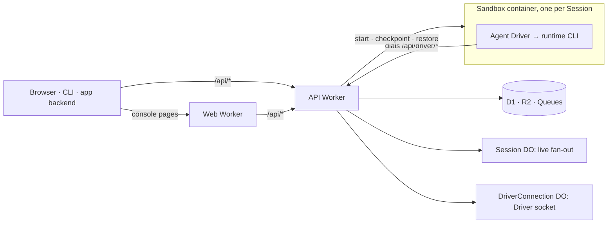

# Architecture

This file holds the engineering invariants that span modules or repositories, and says where each part of the system lives. Product promises live in [SPEC](./SPEC.md), user-visible behavior and limits in the [product notes](./prd/README.md), operator procedures in the [runbook](./production-deploy-verification.md), and exact shapes in code: the D1 schema (`pkgs/db/src/schema`), the console GraphQL schema (`apps/api/src/adapters/graphql/schema.generated.graphql`) and the Public Thread API documents (`apps/api/openapi/`). Release status and decisions belong in issues and PRs.

## 1. Boundaries and invariants

- **The application owns its users.** It keeps business logic and end-user authentication; mosoo runs the Agent. A Public API caller labels a Thread with an opaque `userId` (required on `/api/v1`, optional on `/api/v2`), which is fixed at creation and reaches MCP servers only as delegation context (section 4).
- **Project is the tenant.** Agent presets, Sessions, Skills, MCP servers, provider credentials and Environments each belong to one Project, and a Project key reaches only its own Project. A Project has one owner account, which is the execution owner of all its Sessions. An Organization is a one-per-account shell.
- **A Session freezes its configuration.** Creation takes exactly one source: inline harness, provider, model and instructions; the latest saved Agent preset; or a published Agent's live version. The result, including the EnvironmentRevision and the model protocol, is written to `session_execution_snapshot.plan_json`, and continuation never re-reads the mutable preset (the one exception is the compatibility read in section 8). An inline Session has no Agent: `agent_id` is null on its Session, Run, event and usage rows.
- **A Session owns its execution state.** Its working directory, native conversation and checkpoint lineage live on one Sandbox subject (a `sandbox` row with `subject_kind` `session` and the Session ID as `subject_id`), bound to the Session's Project and owner with no other Session attached. Any other binding fails closed and is never replaced by an empty Sandbox. The Sandbox and Driver are replaceable; the Session ID, frozen configuration and committed state are not.
- **Turns are serialized and durable.** One turn runs at a time. A turn succeeds only through the commit gate (section 5), and continuation restores committed state or fails explicitly.
- **Only Previews expire.** Formal and API Sessions keep their committed state until deleted. Console Previews whose plan records `previewRetentionMs` expire after `PREVIEW_RETENTION_MS` without message, Run or file activity; admission, upload and cleanup evaluate the same D1 predicate.
- **API and Driver are a matched pair.** The boot payload and the `hello` handshake must carry exactly `DRIVER_PROTOCOL_VERSION`, so the API and its pinned `apps/driver` submodule (`langgenius/mosoo-agent-driver`) ship and roll back together.
- **Execution is `full_access`.** There are no interactive approvals; isolation comes from the Session's own Sandbox, its network policy and the Worker-side proxies.
- **Validate untrusted input once, at its edge.** Untrusted sources are API callers, browsers, and everything from a Sandbox or Driver. Their edges are the HTTP routes and the GraphQL adapter (`apps/api/src/adapters`) and, for Driver traffic, the `DriverConnection` Durable Object; code behind an edge trusts its types.
- IDs are server-generated ULIDs, stored as checked text.

## 2. Platform and routing

```mermaid
flowchart LR
  clients["Browser · CLI · app backend"] -- "/api/*" --> api["API Worker"]
  clients -- "console pages" --> web["Web Worker"]
  web -- "/api/*" --> api
  api --> state[("D1 · R2 · Queues")]
  api --> sdo["Session DO: live fan-out"]
  api --> ddo["DriverConnection DO: Driver socket"]
  api -- "start · checkpoint · restore" --> sbx
  subgraph sbx ["Sandbox container, one per Session"]
    driver["Agent Driver → runtime CLI"]
  end
  driver -- "dials /api/driver/*" --> api
```

- **Web Worker** (`apps/web`): the console SPA, its client-side route fallback, and the `/.well-known/oauth-*` discovery documents that point API clients to Project keys. It forwards `/api/*` to the API Worker through its `API` service binding.
- **API Worker** (`apps/api`): console GraphQL, the Public Thread API (`/api/v1`, `/api/v2`), auth, files, skills, MCP OAuth, the browser viewer socket and the Driver routes (`/api/driver/*`). It also runs the one-minute cron and the Queue consumers.
- **Durable Objects:** `Session`, one per Session, holds live sockets (browser viewers and public SSE wakeups) and keeps no event history. `DriverConnection`, one per Driver instance, owns that Driver's socket. `Sandbox` and one subclass per runtime image wrap Cloudflare Sandbox containers and enforce their network policy.
- **D1** is the system of record: accounts, Projects, presets, Sessions, Runs, `session_event`, Sandbox subjects, checkpoint records, the `api_command` outbox and usage.
- **R2:** `FILE_BUCKET` holds `file_record` objects, including Session attachments and artifacts, and Skill packages. A separate sandbox-state bucket holds checkpoints and Environment package artifacts; containers transfer those directly through presigned URLs.
- **Queues:** `api-command` (with its dead-letter queue) delivers `api_command` rows such as Run dispatch; `environment-artifact-build` delivers Environment package builds.
- **Stage** mirrors production with its own Workers, D1, buckets and queues (`[env.stage]` in each `wrangler.toml`).
- **Routing:** `cloud.mosoo.ai/api/*` routes to the API Worker and the `cloud.mosoo.ai` custom domain to the Web Worker. The Web Worker answers `try.mosoo.ai` requests with a 308 to `cloud.mosoo.ai` that keeps path and query, while `try.mosoo.ai/api/*` stays a direct API route. `mosoo.ai` is the marketing / landing / blog origin, served from the separate `langgenius/mosoo-website` repository.

## 3. Request paths and module ownership

- **Console:** GraphQL at `/api/graphql`, declared in `apps/api/src/adapters/graphql/graphql-module-specs.ts` and resolved in `apps/api/src/modules/*`. The schema is internal: the console client and the first-party CLI are generated from it. A Project key may call only the operations in `PROJECT_KEY_OPERATIONS`, and only for its own Project.
- **Public Thread API:** `/api/v1` and `/api/v2` live in `modules/public-api`, a thin adapter over the same Session services as the console; there is no second execution path. It is the external contract: `public-api:contract:check` keeps both generated OpenAPI documents current and rejects breaking `/api/v1` changes.
- **Live events:** the browser viewer socket (`/api/ag-ui/session/:sessionId/ws`) is authorized in the Worker, handed to the Session DO, and only delivers events. Public SSE streams read persisted events from D1 and hold a wakeup socket to the Session DO, falling back to polling. Input always arrives through GraphQL or the Public Thread API.
- **Driver:** the Driver talks to the API only through `/api/driver/*`: the control socket, the LLM and MCP proxies, and skill package downloads. The socket accepts a one-time boot token (section 5); every other Driver route requires an expiring grant, HMAC-signed with `RUNTIME_ACTION_TOKEN_SECRET`, that names one action, one resource and the Driver instance.
- **Background work:** Run dispatch and Environment package builds are `api_command` rows in D1 delivered through Queues; the cron starts maintenance (section 7).
- **Module owners** whose scope is not obvious from the name: `runtime` (Sandbox subjects, Driver, checkpoints, dispatch), `sessions` (Session records, events, lifecycle and the Session DO), `public-api` (Public API admission, idempotency, rate limits and presentation; no execution logic), `agents` (presets, publish and live versions, package import, export and fork), `vault` and `vendor-credentials` (secrets), `api-command` (the outbox).

## 4. Identity, secrets and network

- **Auth** is Better Auth: Email OTP, plus Google when its OAuth secrets are set; no passwords, one account per email. The OTP-free development login for `@mosoo.ai` addresses is registered only when `WEB_ORIGIN` is a loopback origin. The CLI device flow (`/api/auth/cli/{start,confirm,token}` with the console's `/cli-auth` page) is a cross-repository contract with the CLI.
- **Principals:** a browser session or a CLI login token (`mcli_`) acts as the account; a Project key (`msp_`) acts as the account inside one Project. Account-only operations, including key management, reject Project keys. For Project keys, Public API rate limits and idempotency are keyed by the Project, so rotating a key neither resets them nor repeats work; each Run records `created_by_key_id`.
- **Secrets:** provider keys, MCP credentials and Environment secrets are envelope-encrypted in `vault_secret` under `VAULT_ROOT_SECRET`; API keys are stored only as SHA-256 hashes. Credentials resolve inside the Session's Project and fail closed.
- **Raw provider keys never enter a Sandbox.** The Driver gets an expiring grant bound to one credential, model, model protocol and Driver generation, and calls the Worker's LLM proxy (`/api/driver/llm/proxy/:credentialId/*`), which reads the vault on each request and adds the upstream auth. Environment variables cannot override the vendor variables mosoo sets for that proxy.
- **MCP** traffic goes through the Worker's MCP proxy, which holds the upstream credential and adds a delegation token carrying the end-user `userId` only when the Session has one.
- **Model protocol:** one protocol is resolved from the preset provider/model or from the custom credential's declared protocol, checked against the runtime, and frozen into the Session plan. Continuation fails if the credential's protocol later changes.
- **Network:** an Environment is `full` (container defaults) or `limited`: no direct internet, and a deny-by-default HTTP(S) allowlist of the Environment's hosts, the API control origin and the R2 endpoint, checked on every outbound request including each redirect hop. The policy is applied before the container starts and is fixed for the subject's lifetime: a different policy fails closed. A `limited` Environment rejects proxy variables. Where `limited` cannot be enforced (local workerd), startup fails closed.

## 5. Runtime: subjects, Driver and checkpoints

- **Capacity:** cold activation claims its subject atomically in D1 against a deployment-wide ceiling across all image classes (`RUNTIME_SUBJECT_DEPLOYMENT_SANDBOX_LIMIT`) and a per-account limit (`ACCOUNT_CONCURRENT_SANDBOX_LIMIT`). A refused claim fails the turn with retryable `runtime.capacity_exhausted`; nothing queues.
- **Lifetime:** Sandboxes run with keep-alive and never sleep on their own; maintenance bounds them. It reclaims a subject idle past `SESSION_RUNTIME_IDLE_GRACE_MS` once its last successful turn is committed, and cancels a turn older than `SESSION_RUN_TIME_LIMIT_MS` with `run.time_limit_exceeded`. Both run first in every maintenance pass, so a failing bookkeeping sweep cannot block them.
- **Images:** a subject records its `sandbox_binding` at allocation and is always resolved through it; a binding is never redirected, and an unknown one fails closed. `MOSOO_RUNTIME_IMAGES_ENABLED` is off unless set to `"true"`, and every environment in `apps/api/wrangler.toml` sets `"false"`, so new subjects get the union `Sandbox` image. Turning it on is a staged, separately reviewed deploy ([runbook](./production-deploy-verification.md#runtime-image-namespace-compatibility)). Environment package builds always use the union image, and every runtime image shares its package base.
- **Boot:** Runtime writes the boot payload to a file in the Session's runtime home directory and passes its path in `MOSOO_DRIVER_BOOT_PAYLOAD_FILE`; the Driver reads and then deletes it, and checkpoints remove any leftover. The Driver binds no port: it dials `/api/driver/socket` with its `driverInstanceId`, a one-time boot token and a `traceparent`. The Worker only routes the upgrade; the `DriverConnection` DO verifies the token and owns readiness, commands, heartbeats and event ingestion.
- **Environment:** the frozen EnvironmentRevision is restored before the Driver starts. npm and pip packages come from a Project-scoped artifact built off the hot path, and a Session cannot be created until that artifact is ready; then the setup script runs with the Environment's variables. Any failure blocks startup.
- **Attachments:** during a turn whose input carries attachments, the Session's whole attachment prefix in `FILE_BUCKET` is mounted read-only into that Session's Sandbox and no other, and the mount is removed before every checkpoint.
- **Commit gate (its only home):** when a turn ends successfully, Runtime removes the attachment mount and transient credentials, checkpoints the complete Session working directory (which also holds the runtime's native state) to the sandbox-state bucket, then commits the Run's completion, a `ready` `sandbox_backup` row bound to that Run and the native resume cursor in one guarded D1 batch. Until that batch lands, the turn is not successful and its Sandbox is not reclaimed. Failed and cancelled Runs never replace the last commit. Follow-up admission, idle reclamation and per-Session maintenance all wait for the Run-bound checkpoint and the Run's `run.completed` event.
- **Retention:** the latest committed checkpoint is kept while the Session exists (`SANDBOX_BACKUP_TTL_SECONDS`), survives archive, and is deleted with the Session.
- **Continuation is native only:** a cold start restores the latest committed checkpoint and resumes the runtime's own conversation from the committed cursor. There is no transcript replay, and `session_event` history is never a recovery input. A missing or failed restore is an explicit error, never an empty workspace. Credentials and MCP authorization are resolved again on every activation.
- **Per-Session maintenance:** Restart Driver and Recreate Sandbox act on one Session and keep its ID, frozen configuration, committed workspace and native cursor.
- **Prewarm:** reading history or opening a viewer never starts a Sandbox. Creating a Session without input, and composer activity in the console, schedule a best-effort prewarm that runs the same activation path without admitting a turn and skips a Session with an active Run.
- **Adding a runtime:** runtimes are defined in `pkgs/runtime-catalog`. A new one lands together with its Driver backend (`SUPPORTED_DRIVER_RUNTIMES` and `apps/driver/runtime-images.json`), a `RUNTIME_SANDBOX_IMAGES` entry, and a container class, Durable Object binding and append-only `new_sqlite_classes` migration in every Wrangler environment. `apps/api/tests/runtime-sandbox-images.test.ts` and `apps/api/tests/preview-runtime-release-gate.test.ts` enforce this.

## 6. Turn flow

1. **Admit.** Authorize the Project, then record the Run, the input message and a `session_run_dispatch` command in one guarded D1 batch. It succeeds only if the Session is idle, unarchived and unexpired, has no active Run, and its last successful turn is committed.
2. **Dispatch.** Dispatch is attempted inline and through the queue; the Run's `queued` to `booting` compare-and-set lets exactly one attempt proceed. It hydrates the frozen plan, resolves credentials and resolves the Session's subject.
3. **Activate.** On a cold start: claim capacity, apply the network policy, restore the checkpoint, mount attachments, restore the Environment and run its setup script.
4. **Start the Driver.** Write the boot file and start the Driver. It dials back, and `DriverConnection` verifies its token and protocol version, then sends the input.
5. **Stream.** Driver events are written to D1 first, then fanned out by the Session DO to viewers and SSE wakeups. Files written under `outputs/` in the working directory become Session artifacts, and each model call records usage.
6. **Finish.** Success runs the commit gate. Failure and cancellation keep their outcome and leave the last commit untouched.
7. **Reclaim.** After the idle grace, maintenance removes the Sandbox; the next input restores it.

## 7. Data, usage and observability

- **D1 schema** lives in `pkgs/db/src/schema`. Migrations are append-only: follow [CONTRIBUTING](../CONTRIBUTING.md#database-and-migrations).
- **Events:** every Session event is written to `session_event` with a per-Session `seq`, deduplicated by its source event ID, before any live delivery. Live delivery is best effort; history reads and SSE streams serve the persisted record.
- **Background work:** an `api_command` row is written to D1 before delivery (for Run dispatch, in the same batch as the Run). Queues deliver it at least once, consumers claim it idempotently, and the one-minute cron redrives commands that were never delivered or whose consumer stopped, then starts maintenance.
- **Usage:** each model call writes a `session_model_call` row and its `usage_event` in one batch. A daily rollup folds `usage_event` rows older than `DETAIL_RETENTION_DAYS` into `usage_daily_rollup`. Costs are estimates from a recorded price snapshot (`pricing_status` may be `unknown`); there is no billing or settlement.
- **Logs and traces:** Vestig structured logs and wide events, W3C `traceparent` across HTTP requests and the Driver socket, and Workers Logs and Traces in every environment. There is no blanket OpenTelemetry instrumentation.
- **Status page (cross-repo contract):** production names `mosoo-website-prod` as its Tail consumer, which builds mosoo.ai/status from Worker invocation outcomes and two log events. `session.run.terminal` is logged when a Run's terminal transition commits and carries `runId`, `runtimeId`, `sessionType`, `status`, `durationMs` and `errorCode`; its log timestamp is the Run's completion time. Repair logs it again with the same payload until the Run's terminal history event exists, so consumers deduplicate by `runId`. `runtime.sandbox.egress.http_error` (`httpStatus`) marks a Sandbox's outbound response of 500 or more, including allowlist denials, so it is not counted as an API failure. Keep these names and fields, and never add prompts, model output, user IDs or account IDs.
- **Container monitor:** `.github/workflows/container-runtime-alert.yml` derives every Sandbox container application from `apps/api/wrangler.toml`, fails when one is missing from Cloudflare, and opens a GitHub issue when production or stage holds too many containers or one that runs too long. It never stops containers.
- **Product analytics (PostHog)** is off without a project key, and a failed capture never fails a business operation. Events never carry email, prompts, credentials, task content or model output; the browser's `$identify` sends the account display name. `session_type: "ui"` includes Public API Sessions.

## 8. Compatibility surfaces

Each stays only while stored data or a client still needs it; remove one only with evidence that nothing does.

- The `/api/v1` wire shape, including the `kind` field, which echoes the stored Session value and selects nothing (guarded by `public-api:contract:check`).
- Execution snapshots without `configJson`, which read the configuration of the Agent or live version they recorded.
- Environment revisions with `apt`, `cargo`, `gem` or `go` packages, which stay readable but cannot be saved or provisioned; only `WRITABLE_ENVIRONMENT_PACKAGE_MANAGERS` are.
- Custom credentials and older custom Session snapshots without a declared model protocol, which keep their runtime's historical protocol: Responses for `openai-runtime`, Chat Completions otherwise.
- Sessions whose successful turns all predate the commit gate keep `workspace_checkpoint_required` false and may continue from their saved artifacts without a workspace checkpoint.
