# Console Sidebar

Status: implemented design record for the console shell sidebar
([langgenius/mosoo#600](https://github.com/langgenius/mosoo/issues/600)). It
documents the layout logic, the row grammar, the state matrix, the resource icon
family, and the review gate that keeps them from drifting. Product behaviour,
routes, and permissions are unchanged; this page only governs how the sidebar
looks and how it is reviewed.

## 1. Layout logic

The sidebar is three zones. The split is structural (flex sizing), not a
decorative divider, so it holds however long the work list grows or however
short the viewport is.

| Zone                  | Sizing                           | Contents (Project layer)                                                                                        |
| --------------------- | -------------------------------- | --------------------------------------------------------------------------------------------------------------- |
| Identity (fixed)      | `shrink-0`                       | Brand row (wordmark, collapse toggle) and the Project switcher row.                                             |
| Work (scrolls)        | `min-h-0 flex-1 overflow-y-auto` | Create agent; Overview, Runs, Agents, Files; **Resources**: Skills, MCP servers, Providers, Environments.       |
| Persistent (anchored) | `shrink-0`, hairline top border  | Project settings, Help & docs, Language, then the account row (Account settings and Sign out live in its menu). |

Rules that follow from the split:

- Frequent work sits in the upper zone; account, settings, help, and language
  sit in the lower zone. The lower zone never shrinks, so it stays reachable
  when the upper zone scrolls (verified at 1280 x 560 by `just e2e ui sidebar`).
- Boundaries come from whitespace and two hairlines: a permanent
  `--border-soft` line above the persistent zone, and a scroll-driven
  `--border-default` line under the identity zone that only appears once the
  work list has scrolled (pure CSS, `@supports (animation-timeline: scroll())`,
  no line in browsers without it).
- The sidebar sits on `--paper-200` while the canvas stays on `--paper-100`, so
  the two surfaces separate by tone as well as by the hairline; in the dark theme
  the same step is `ink-950` against `ink-900`.
- The Org layer keeps its horizontal header (that is what tells the account
  layer apart from a Project) but shares the width, the row recipe, the sidebar
  surface (the header's left cell carries it too), and the persistent footer.

Decisions worth restating because they change what people see:

| Before                                                                                               | After                                                                                          | Why                                                                                                                          |
| ---------------------------------------------------------------------------------------------------- | ---------------------------------------------------------------------------------------------- | ---------------------------------------------------------------------------------------------------------------------------- |
| "Config" disclosure group hiding Skills, MCP servers, Providers, Environments as unlabelled children | Flat **Resources** section, four rows, each with its own glyph                                 | The group's own path redirected to its first child; the four entry points are peers and need to be recognisable in the rail. |
| Full-width black "Create agent" button                                                               | Quiet first row of the work list (`text-fg-1`, plus glyph); disabled row when no Project       | A quick action, not a destination; a filled button in the rail competed with the page's real primary actions.                |
| Bordered "PROJECT / name" card plus a tiny "Back to org" link above it                               | One identity row (monogram tile, name, chevrons); "Back to {org}" moved into the switcher menu | One anchor for "where am I"; returning to the account layer is rare and now sits with the other Project-level choices.       |
| "Settings" (Project) in the list and "Settings" (account) in the menu                                | "Project settings" row in the persistent zone; "Account settings" in the account menu          | Two identical labels a few rows apart were ambiguous in every locale.                                                        |
| Collapsed rail showed one "sliders" icon with a menu for the four resources                          | Four rows with the resource glyphs; project monogram tile; brand mark on top                   | Recognisability in the icon-only state was the issue's core complaint.                                                       |
| Sidebar and canvas shared `#fbfbfc`                                                                  | Sidebar on `--paper-200` (`#f4f6f8`), canvas on `--paper-100` (`#fbfbfc`)                      | Two surfaces that only differ by a hairline read as one; a one-step tonal drop makes the navigation a place, not a column.   |
| Mobile drawer anchored left but animated in from the right                                           | `SheetContent side="left"` picks position and direction together                               | Class merging cannot reconcile two enter animations; the primitive now owns the pairing.                                     |

Naming: the section is **Resources**, not "Tools". An Agent's tools (MCP tools and skills exposed to the model) already own that word in the console, so a navigation group called Tools would collide with it; "Resources" is the noun the Spec and the PRD index use for Project-owned Skills, MCP servers, credentials, and Environments.

## 2. Row grammar

One recipe (`apps/web/src/shared/ui/sidebar.tsx`) serves navigation links,
quick actions, menu triggers, and inert rows in both layers and in the mobile
drawer.

| Measure         | Value                                                                              |
| --------------- | ---------------------------------------------------------------------------------- |
| Sidebar width   | 240 px expanded, 64 px rail; 12 px horizontal padding                              |
| Row             | 32 px tall, 6 px radius, 10 px horizontal padding, 2 px between rows               |
| Icon            | 16 px, 1.5 stroke, same colour as the label                                        |
| Label           | 13 px / weight 500; weight 600 when selected; truncates, never wraps               |
| Section eyebrow | 11 px / weight 600, uppercase, 0.06 em tracking, `--fg-3`, 16 px above, 4 px below |
| Identity row    | 36 px; 20 px monogram tile (24 px in the rail)                                     |
| Account row     | 44 px; 26 px avatar, name 13 px / 600, email 11.5 px `--fg-3`                      |
| Rail rows       | 32 x 32 centred; tooltip on the right                                              |
| Mobile drawer   | Same components, rows forced to a 44 px minimum height                             |

Colour comes from tokens only:

| Token                                | Light                 | Dark                    | Used for                                                |
| ------------------------------------ | --------------------- | ----------------------- | ------------------------------------------------------- |
| `--sidebar-row-hover`                | `rgba(28,32,36,.045)` | `rgba(244,246,248,.06)` | hover fill (fine pointers only)                         |
| `--sidebar-row-active`               | `rgba(28,32,36,.065)` | `rgba(244,246,248,.10)` | selected row, open menu trigger, pressed, monogram tile |
| `--border-soft` / `--border-default` | existing hairlines    | existing hairlines      | zone separators                                         |
| `--accent-ring`                      | brand green           | brand green             | keyboard focus ring, nothing else                       |
| `--fg-2` / `--fg-1` / `--fg-muted`   | existing text ramp    | existing text ramp      | rest / hover+selected / disabled text                   |

Selection is neutral on purpose: the brand green stays reserved for the focus
ring, so "where am I" and "what has keyboard focus" never look alike.

## 3. State matrix

| Row kind                                   | rest                     | hover (fine pointer) | pressed     | keyboard focus                    | selected                                                 | open                                      | disabled                                                            |
| ------------------------------------------ | ------------------------ | -------------------- | ----------- | --------------------------------- | -------------------------------------------------------- | ----------------------------------------- | ------------------------------------------------------------------- |
| Navigation link                            | `--fg-2`, no fill        | hover fill, `--fg-1` | active fill | 2 px `--accent-ring`, 1 px offset | active fill, `--fg-1`, weight 600, `aria-current="page"` | n/a                                       | n/a                                                                 |
| Quick action (Create agent)                | `--fg-1`, no fill        | hover fill           | active fill | ring                              | n/a                                                      | n/a                                       | `--fg-muted`, `cursor-not-allowed`, `aria-disabled`, still labelled |
| Menu trigger (switcher, language, account) | as link                  | hover fill           | active fill | ring                              | n/a                                                      | active fill, `--fg-1` (`data-popup-open`) | n/a                                                                 |
| Inert row (Usage, Billing "Soon")          | `--fg-muted` + SOON pill | none                 | none        | not focusable                     | n/a                                                      | n/a                                       | always                                                              |
| Collapse toggle                            | `--fg-3`                 | hover fill, `--fg-1` | none        | ring                              | n/a                                                      | n/a                                       | n/a                                                                 |

Transitions are targeted (`background-color, color`, 150 ms, ease-out); there is
no `transition-all` and no press-scale. `prefers-reduced-motion` already
disables the label fade and applies here unchanged.

## 4. Resource icon family

Skills, MCP servers, Providers, and Environments are the modules an Agent is
assembled from, so they carry one original family rather than four unrelated
stock glyphs.

| Entry point  | Glyph                          | Reading                                         |
| ------------ | ------------------------------ | ----------------------------------------------- |
| Skills       | puzzle piece                   | a reusable capability that slots into the Agent |
| MCP servers  | plug with two prongs and cable | an external capability the Agent connects to    |
| Providers    | horizontal key                 | the credential that unlocks a model provider    |
| Environments | isometric cube                 | the sandbox image the Agent runs inside         |

Construction contract (source of truth: `apps/web/src/shared/ui/resource-icons.tsx`;
standalone copies in [`assets/resource-icons/`](./assets/resource-icons/)):

- 24-unit grid, 1.5 stroke, round caps and joins, silhouettes spanning 16 to 19
  units and centred on (12, 12), matching the Hugeicons neighbours.
- Exactly one duotone plane per glyph: `currentColor` at 12 % opacity on the
  part that attaches to the Agent. It is what makes the group readable in the
  rail without adding colour.
- Everything renders from `currentColor`; states and themes are decided by the
  row.
- Mosoo Computer consumes the SVG files, not the React components. Any change
  to a path is made in both places in the same PR.

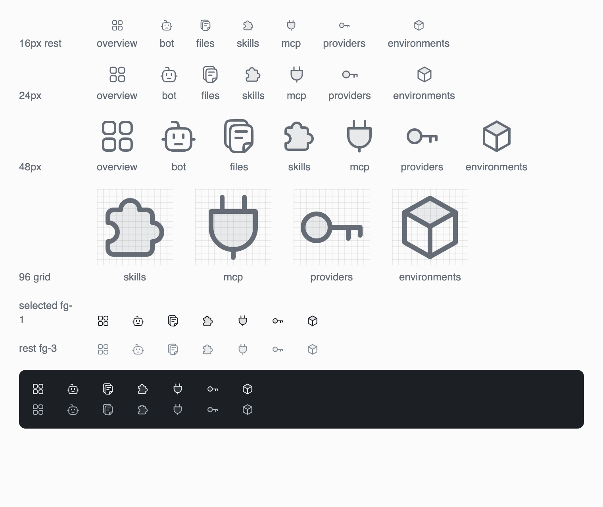

## 5. Review gate

The checks below run before a change is reviewed, not after it ships.

Automated (part of `just test` and the E2E harness):

- `apps/web/tests/sidebar-hierarchy-boundary.test.ts`: zone structure, resource
  icons bound to their rows, icon construction contract, no emoji or raw hex
  colours in sidebar sources, one row recipe with focus / selected / open /
  disabled states, tokens defined for both themes, distinct "Project settings"
  and "Account settings" copy in every locale.
- `apps/web/tests/i18n-catalog-parity.test.ts`: every locale carries the same
  keys and placeholders.
- `just e2e ui sidebar`: fixture-backed browser run covering the expanded
  sidebar, short viewports, the collapsed rail with tooltips, keyboard focus,
  zh-CN labels, the no-Project state, the mobile drawer, and the Org layer. It
  asserts no horizontal overflow and writes the screenshots in section 6.

Human, before opening the PR (mirrored in the pull request template):

1. Look at the screenshots in every state before reading the diff. Anything you
   would not ship from a designer's Figma file is not shipped from a diff either.
2. Icons: Hugeicons or this family. No emoji, no one-off "close enough" glyph.
3. Copy: read each label in context and in all four locales; two rows with the
   same word must be resolved, not tolerated.
4. Tokens: colours, radii, and spacing come from `app.css` tokens or the recipe;
   a new raw value needs a sentence explaining why.
5. Nothing decorative without an interaction purpose. A gradient, badge, or
   animation must answer "what does the user learn from this?"

## 6. Evidence

Captured by `just e2e ui sidebar` with non-production fixture data.

| State                                                            | Screenshot                                        |
| ---------------------------------------------------------------- | ------------------------------------------------- |
| Expanded, 1440 x 900, Files selected                             | 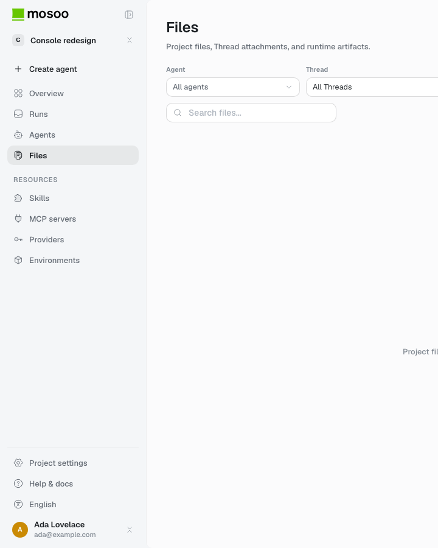       |
| Hover on Agents                                                  | 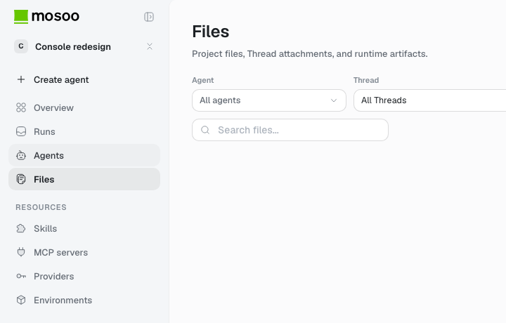             |
| Project switcher menu with back-to-org                           | 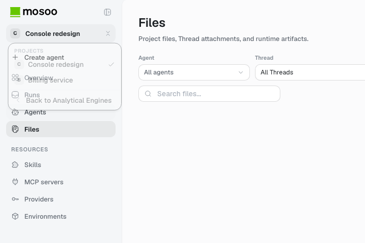   |
| Short viewport, 1280 x 560, footer anchored, scroll edge visible | 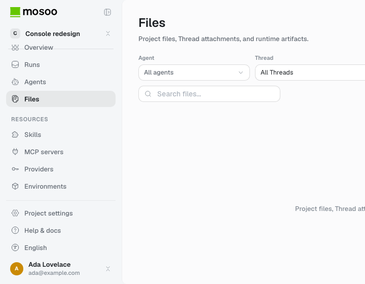 |
| Collapsed rail with tooltip, Skills selected                     | 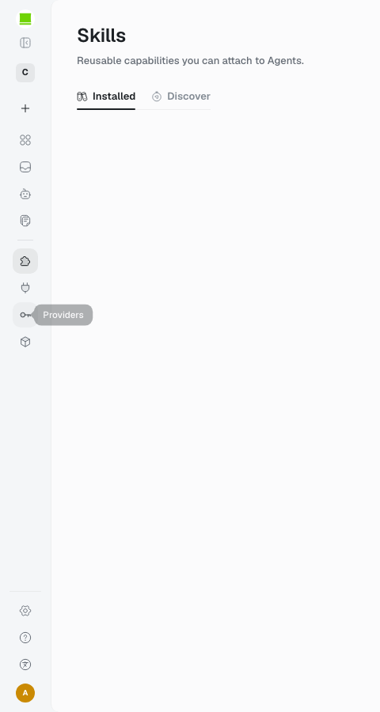      |
| Keyboard focus on Runs, Files selected                           | 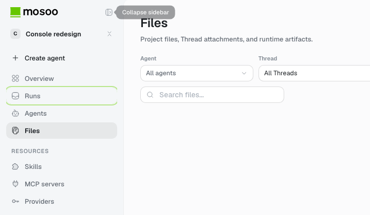          |
| zh-CN labels                                                     | 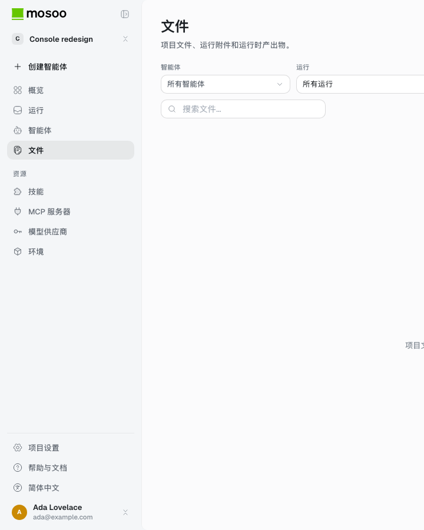          |
| No Project: creation disabled                                    | 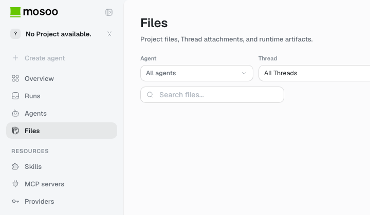     |
| Mobile drawer, 390 x 844                                         | 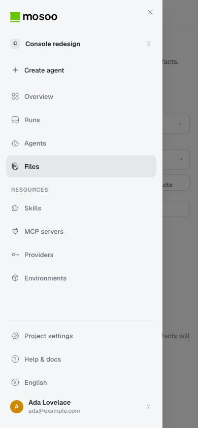   |
| Org layer                                                        | 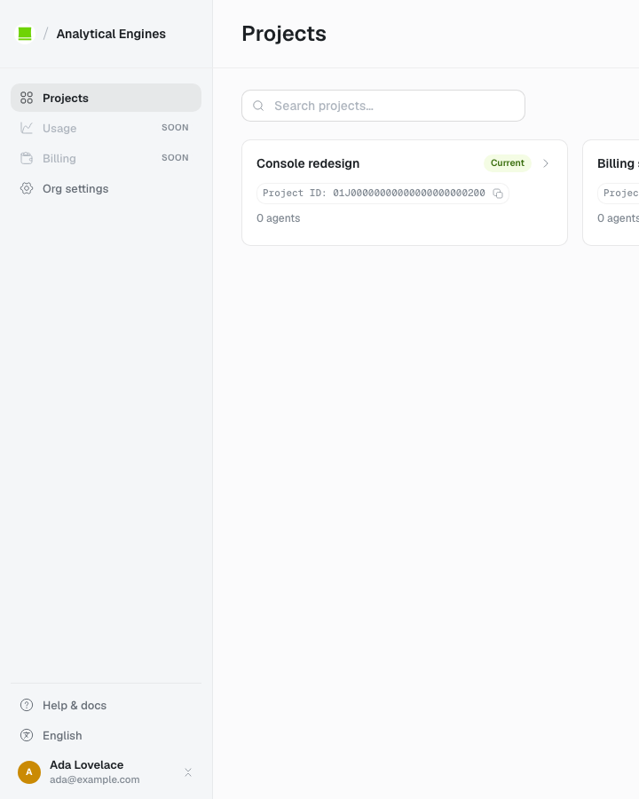      |

## 7. Follow-ups

- Mosoo Computer lives in its own repository; it adopts the icon assets and the
  zone/row grammar from this page, adapted to its window sizes.
- The dark-theme token values are defined but the console has no theme toggle
  yet; the first dark pass should start from this matrix.
- Base UI's tooltip popup does not expose `role="tooltip"`; rail rows are named
  through `aria-label`, so nothing is lost, but the primitive is worth a look
  when it is next touched.
