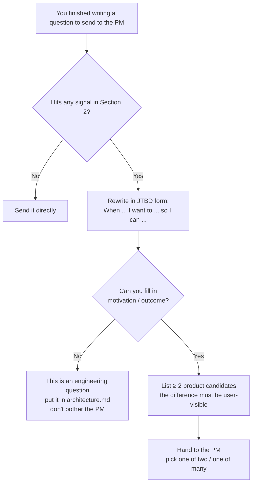

# Reverse Interview: When You (the Engineer) Drill Too Deep, Come Back Up to the Product Layer and Align with the PM

> **Status**: Living document · **Maintainer**: Product Team · **Last updated**: 2026-04-29
>
> **Audience**: Engineers implementing a PRD.
> **When to use it**: When you are about to go back to the PM to align, but realize your phrasing has already dropped down into implementation detail, leaving the PM unable to make a product-level judgment from it.
> **Companion**: [`good-prd.md`](./good-prd.md) is the writing constraint for PM → engineer; this document is the questioning constraint for engineer → PM. The two are mirror images of each other.

---

## 1. Why This Protocol Exists

When a PM writes a PRD, they are using **product language** to express "what the user should experience."
Once engineers pick it up, they think harder and deeper — which is a good thing. **The problem is that you are still using engineering language when you come back to align.**
A PM handed an engineering-language question cannot make a product judgment; all they can say is "I don't quite follow," and the alignment deadlocks.

### 1.1 A Historical Anti-pattern: Q12

> **Historical Q12 phrasing (not a current mosoo contract)**: For the list of env var keys that affect PATH / auth (e.g. `OPENAI_API_KEY`), are they hard-coded by the platform or self-reported by the Driver? This determines the source of truth for deciding when a maintenance restart is triggered. The scope is a "field name → restart kind" mapping table in the Driver protocol layer, so the PRD does not need to choose the implementation owner. The product layer only needs to define which configuration changes interrupt the user's active work and what recovery they see.

This example preserves the questioning mistake, not its old implementation
details. Do not infer a runtime state-directory layout or a currently open mosoo
decision from it; those contracts must come from the current architecture and
code.

**The PM's reaction**: "I don't quite follow — can you align with me at the product level?"

Notice the double affliction in this question:

1. The nouns are all engineering entities (`envVarRestartKinds` / Driver registry / mapping table) — the PM has no anchor for judgment;
2. **The engineer has already written down "this PRD does not need to resolve it," yet is still asking the PM** — which means you already know the PM should not be the one to decide, but you tossed the question over anyway.

This is the flare that signals it is time for a reverse interview.

---

## 2. Trigger Conditions: What Counts as "Drilling Too Deep"

If any one of these is true, **stop first and enter reverse-interview mode**:

| Signal                                                                                                                              | Example                                                                                  |
| ----------------------------------------------------------------------------------------------------------------------------------- | ---------------------------------------------------------------------------------------- |
| References an engineering entity / field / protocol name that the PRD never defined                                                 | `envVarRestartKinds`, Driver registry, static mapping table                              |
| You are comparing option (a) vs option (b), but the behavior the user can perceive is identical                                     | "Driver self-reports vs platform hard-codes"                                             |
| You are already describing a schema / mapping / protocol field                                                                      | "the field name → restart kind mapping table"                                            |
| You have declared "this PRD does not need to resolve it," yet are still asking the PM                                               | Then don't ask the PM — **you haven't found the real product question yet**              |
| A single sentence runs past 80 characters, mixes Chinese and English technical terms, and the PM has to read it twice to understand | Self-check by reading it aloud; if you run out of breath before finishing, it's too long |
| The question has no user / persona / scenario in it                                                                                 | A question without a user is not a product question                                      |

---

## 3. Decision Flow



---

## 4. Tool One: Jobs to Be Done (What Is the User Doing)

Source: JTBD (Christensen et al.). The core sentence pattern:

> **When** [situation], **I want to** [motivation], **so I can** [outcome].

How to use it: take the engineering question you want to ask and **work it backward into "in what situation does the user want to do what, to achieve what result."**

- If you can derive it → the question has a tangible presence at the product layer; proceed to Tool Two.
- If you can't derive it → the user is indifferent to this question, so **decide it yourself, put it in `architecture.md`, and don't waste the PM's judgment.**

> **The killer move of JTBD**: it is the **filter** between engineering questions and product questions. If you can't fill in the motivation, you shouldn't be asking the PM.

---

## 5. Tool Two: The Five Steps of Design Thinking (Product-Candidate Generator)

Source: Design Thinking (IDEO). The point is not to make the PM run through all five steps with you — rather, you (the engineer) **self-check once first**, then hand the "remaining real question" to the PM:

| Step      | What you do yourself                                                                               | Output                                                               |
| --------- | -------------------------------------------------------------------------------------------------- | -------------------------------------------------------------------- |
| Empathize | Which persona does this decision affect? What are they doing right now?                            | A one-sentence user scenario                                         |
| Define    | Write out the user's job using the JTBD sentence pattern                                           | One Job statement                                                    |
| Ideate    | List ≥ 2 **product-behavior** options (not engineering options), describing what the user **sees** | Candidate A / B / C                                                  |
| Prototype | Use words / sketches to describe the experience under each option                                  | A three-part description                                             |
| Test      | Hand the candidates to the PM: "Which of these is the one you want?"                               | The PM picks one, and the engineering question converges accordingly |

**The key**: the Ideate step must write candidates from the **user's perspective**. If the candidates you write differ along the lines of "polling vs webhook" or "Driver self-reports vs platform hard-codes," those are engineering candidates — rewrite them.

---

## 6. Translation Template: Implementation Q → Product Q

The output of every reverse interview should be **a structured set of product candidates**, not an engineering this-or-that.

### 6.1 Template

```markdown
## What I originally wanted to ask (engineering layer, PM may skip)

{The original question, kept so you and your future self have a record}

## What is the user doing (JTBD)

When {situation}, the user wants to {motivation}, so that {outcome}.

## Candidate product behaviors (user perspective)

A. What the user sees: ……
B. What the user sees: ……
C. What the user sees: …… (optional)

## Differences between candidates

- A vs B: ……
- B vs C: ……

## Which one do you (the PM) pick

A / B / C / other (please describe)
```

### 6.2 A Worked Example Using Q12

> **What I originally wanted to ask (engineering layer)**
> Is the list of env var keys hard-coded by the platform or self-reported by the Driver? This determines the source-of-truth for deciding when a maintenance restart is triggered.
>
> **What is the user doing (JTBD)**
> When the user changes an env var such as `OPENAI_API_KEY` that might affect auth / PATH, and an Agent is running mid-session,
> the user wants to keep working,
> so that they don't lose context and don't get their train of thought interrupted.
>
> **Candidate product behaviors**
>
> - **A. Silently keep running**: the current session finishes with the old key; the new key takes effect only the next time a session is created. The user notices nothing throughout.
> - **B. Proactive prompt**: a banner pops up — "A key change was detected. Pause / restart now / remind me later" — a choice of three.
> - **C. Seamless hot swap**: the Agent automatically switches to the new key, with a single-line toast at the top saying "Switched." In-flight calls already in progress continue with the old key.
>
> **Differences between candidates**
>
> - A vs B: A doesn't interrupt, but the user may have changed the key precisely because the old one stopped working (A would keep erroring); B lets the user actively choose.
> - B vs C: B explicitly interrupts the flow; C swaps without the user noticing but carries a "mid-flight switch" risk (the user may still think the old key is in use).
>
> **Which one do you (the PM) pick?** A / B / C / other

Once the PM picks A, the engineering question (Driver self-reports vs platform hard-codes) **converges automatically** at the engineering layer — because A doesn't need any maintenance-restart decision, so the entire mapping table becomes unnecessary. This is the compounding payoff of the reverse interview: **ask the right product question, and half the engineering questions disappear on the spot.**

---

## 7. When **Not** to Use a Reverse Interview

| Scenario                                                                                                  | What to do                                                                                                                        |
| --------------------------------------------------------------------------------------------------------- | --------------------------------------------------------------------------------------------------------------------------------- |
| The question has no tangible presence at the product layer at all (deployment / infra / compiler options) | Decide it yourself, put it in `architecture.md`, **don't bother the PM**                                                          |
| The question is already clearly written in the PRD                                                        | Go back and read the PRD; **don't ask twice**                                                                                     |
| The product answer to the question is obvious (non-controversial)                                         | Write down your judgment and let the PM veto it during review                                                                     |
| The question affects ≥ 2 core user paths                                                                  | This is one of the "must come back and ask" cases in `good-prd.md` §6.3; run a normal alignment — no need to follow this protocol |
| You only want to confirm the PM agrees with a solution you've already chosen                              | That's a review, not an interview; just say "I plan to do it this way, speak up if you object"                                    |

---

## 8. Anti-Patterns

| Anti-pattern                                                                                                  | Why it doesn't work                                                                                    |
| ------------------------------------------------------------------------------------------------------------- | ------------------------------------------------------------------------------------------------------ |
| Disguising an engineering this-or-that as a product question ("a or b?" where the user is indifferent to a/b) | Wastes the PM's judgment; the right answer is to decide it yourself                                    |
| Listing only 1 candidate during the reverse interview                                                         | That's not an interview, it's a confirmation; the PM has no "alternative possibility" to align against |
| Candidate differences expressed in engineering terms ("polling or webhook")                                   | Only the user's perspective counts as a candidate — rewrite                                            |
| Forcing in a JTBD motivation / outcome you can't actually fill                                                | It means this isn't a JTBD, it's an engineering question — withdraw it                                 |
| Cramming 5 unrelated questions into one interview                                                             | One at a time; PMs aren't good at batch context-switching                                              |
| Writing "this PRD does not need to resolve it" yourself and still handing the question to the PM              | A self-contradictory meta-signal — you already know the answer isn't with the PM                       |
| Letting implementation nouns (mapping / registry / hook) leak into the candidates                             | The user doesn't know these words, and the PM doesn't need to either                                   |

---

## 9. Self-Check List

Before you send out a reverse interview, check each box:

- [ ] My JTBD sentence pattern has a fillable motivation and outcome
- [ ] There are at least 2 candidates, and the difference is **user-visible**
- [ ] The candidate descriptions contain **no** entity names / field names / protocol fields / mapping tables
- [ ] There is no engineering this-or-that of the form "pick a/b/c, I'll handle the rest myself later"
- [ ] I'm asking about only one thing at a time
- [ ] I haven't simultaneously declared "the PRD doesn't need to resolve it" and tossed the question to the PM
- [ ] Read-through: read the candidates aloud to a non-engineer — they can restate the difference

---

## 10. Relationship to `good-prd.md`

| Document                                  | Direction     | What it locks down                                              |
| ----------------------------------------- | ------------- | --------------------------------------------------------------- |
| [`good-prd.md`](./good-prd.md)            | PM → engineer | The PM should not stuff engineering detail into the PRD         |
| `pm-reverse-interview.md` (this document) | engineer → PM | The engineer should not stuff engineering detail into alignment |

The two are a mirror-image protocol. When one side writes too much detail, the other side gets a headache reading it; when one side asks in too much detail, the other side can't answer.
**Product and engineering align using the same "what the user can see" language** — everything else is each side's own implementation freedom.
