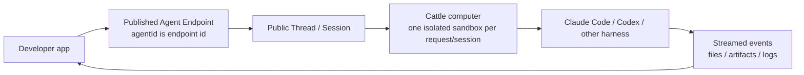

# Agent Endpoint MVP - for humans

> This PRD records the MVP boundary for the Mosoo Agent Endpoint product.
> It responds to the current codebase gap memo and the subsequent product
> decisions: no super manifest, no local Claude/Codex profile import, no Agent
> Builder in Console, no public session identity beyond `end_user_id`, published
> Cattle endpoints run with full access inside an isolated session computer, and
> runtime-private knobs are configured through runtime-scoped advanced settings
> rather than the primary Agent Manifest.

---

## One-line positioning

A Mosoo Agent Endpoint lets a vibecoding developer declare one Agent and expose
it as an API: every end-user request is handed to an isolated Cattle computer
where Mosoo loads the environment, starts Claude Code / Codex / another harness,
streams events back, manages files and artifacts, and owns sandbox lifecycle.

The developer should not write an agent loop, deploy a worker, enumerate vendor
permission flags, or manage cloud computer lifecycle.

---

## 1. User and job

### Primary user

The MVP user is a vibecoding developer building or retrofitting a web app with a
coding agent.

They do not begin by listing Claude Code or Codex capabilities. Their real prompt
to a coding agent is closer to:

> "Use Mosoo CLI to create an Agent Endpoint for this app. Connect my current
> web app to it."

The product contract must therefore be small enough for a coding agent to create
correctly from app context.

### Job to be done

The developer wants one public endpoint that can answer app requests through an
isolated cloud computer:

1. Declare the Agent.
2. Publish it.
3. Send an end-user request.
4. Receive streamed runtime events and artifacts.
5. Avoid owning runtime permission prompts, harness loops, or sandbox lifecycle.

---

## 2. MVP mental model



The endpoint is not a new lifecycle object in MVP. A published Agent is the
endpoint, and `agentId` is the endpoint id.

---

## 3. Product decisions

### Decision 1: Published Cattle endpoints default to full access

`full_access` is the default execution mode for Published Cattle Agent
Endpoints.

Product meaning:

- No runtime permission approval is shown during public endpoint execution.
- The Agent can execute commands, edit files, request runtime permissions, and
  produce artifacts inside its session computer.
- The security boundary is the Mosoo Cattle sandbox and session isolation, not a
  real-time end-user approval prompt.
- Full access does not break out of the session computer. It does not grant
  access to other sessions, other users, host state, unmounted secrets, or
  unauthorized external resources.

Runtime mapping:

| Runtime | Full access mapping |
| --- | --- |
| Claude Code / Claude Agent SDK | `permissionMode: "bypassPermissions"` |
| Codex / OpenAI Runtime | `sandbox: "danger-full-access"` and `approvalPolicy: "never"` |

Current codebase gap:

- Claude currently routes tool approvals through Mosoo permission review and
  defaults to `permissionMode: "default"`, with override support through
  provider options.
- OpenAI Runtime currently starts with `sandbox: "danger-full-access"` but still
  uses `approvalPolicy: "on-request"`.

MVP implication:

- Public Published Cattle execution must map to the full access runtime settings
  above.
- Console preview/debug may still keep guarded approval behavior, but public
  endpoint execution must not require the developer or end user to approve each
  tool call.

### Decision 2: Public identity is `end_user_id` only

Public endpoint creation accepts the developer app's terminal user id:

```json
{
  "input": {
    "type": "text",
    "content": { "type": "text", "text": "Improve this resume" }
  },
  "files": [],
  "end_user_id": "user_123"
}
```

Remove from the public contract:

- `client_external_ref`
- public `attributed_user`
- `external_session_id`
- arbitrary public metadata
- public idempotency fields

The Access Token caller remains internal provenance and audit state. It is not
the developer app's end user and should not be presented as one.

MVP implication:

- The Public API should store `end_user_id` as endpoint metadata for ownership
  correlation, filtering, logs, and support.
- Mosoo does not own the developer app's user management or user/session binding
  state.
- If a developer needs their own session id or idempotency, they keep it in their
  app and map it to Mosoo's public Thread id.

### Decision 3: Console is a management surface, not Agent Builder

Remove Agent Builder from the MVP Console surface.

Console keeps three areas:

1. Agent form
   - `name`
   - `description`
   - `runtime`
   - `model`
   - `prompt`
   - `env`
   - `skills`
   - `mcp`
   - `kind`
   - runtime-specific `Advanced runtime settings` as a collapsed subsection
2. Publish
   - draft vs live
   - publish / republish
   - live version readiness
3. API access
   - endpoint URL
   - Access Token guidance
   - `curl` and JavaScript examples
   - event stream and file/artifact entry points

CLI and coding agents are the creation path. Console is the visual management
surface. It should not compete with a future App Builder.

### Decision 4: Capability matrix tells the truth

Mosoo normalizes the endpoint contract and the session sandbox. It does not
claim every harness is normalized to the same internal interface.

Public MVP capabilities:

- text stream
- tool stream
- file changes / artifacts
- MCP execution
- session files
- full-access endpoint execution
- native resume only when the selected runtime truly supports it

Do not promise in MVP:

- lossless Claude/Codex runtime migration
- a unified abstraction for all subagents, background tasks, effort levels, or
  permission knobs
- user-editable `providerOptions` in the normal manifest
- a super `agent.yaml` that models every vendor parameter

Copy should say:

> Mosoo normalizes the endpoint contract and session sandbox. Runtime-private
> behavior stays inside each driver.

It should not say:

> Every harness is normalized to the same interface.

### Decision 5: Advanced runtime settings are second-class but supported

Some runtime controls are important without being universal product semantics.
Examples include Codex `model_reasoning_effort`, Codex `model_verbosity`,
Claude effort / thinking controls, web-search toggles, and other vendor-native
configuration keys.

These controls must not become first-class Manifest fields unless Mosoo gives
them a stable cross-runtime product meaning. They also cannot disappear into an
unsupported escape hatch forever. The MVP product rule is:

- Primary Agent Manifest remains small and runtime-neutral.
- Runtime-specific advanced settings are supported as a runtime-scoped layer.
- Settings are versioned with the Agent draft / live deployment.
- Settings are not portable across runtimes.
- Settings are not accepted per public end-user request.
- Settings are not part of the public capability matrix.
- Secrets stay credential handles and must not be embedded in runtime settings.
- Platform security policy such as Cattle full access and sandbox lifecycle is
  not overridable through runtime settings.

Console should expose this layer as `Advanced runtime settings`, not
`providerOptions`.

For Codex, the page may show a Codex-specific settings editor:

```toml
model_reasoning_effort = "high"
model_verbosity = "medium"
```

For Claude, the page may show Claude-specific controls. Switching runtime does
not translate these settings. If the selected runtime changes, the old
runtime-specific settings are either archived with the old draft version or must
be explicitly replaced by settings for the new runtime.

Implementation may initially store this layer through the existing
`providerOptions` plumbing, but the product surface must not call it
`providerOptions`. That name is implementation detail, not a developer-facing
contract.

---

## 4. Small manifest boundary

The MVP Agent Manifest contains only:

```yaml
name: Resume Optimizer
description: Improves resumes for a hiring workflow.
runtime: claude-agent-sdk
model: claude-sonnet-4-5
prompt: |
  You improve resumes for a recruiting app.
kind: cattle
env:
  id: env_default
skills: []
mcp: []
```

Fields deliberately excluded from the MVP manifest:

- `endpoint`
- `permission`
- `permission_policy`
- `file_policy`
- `providerOptions`
- runtime-specific advanced settings
- `input_schema`
- `external_session_id`
- `idempotency_key`
- native Claude/Codex config import

`permission_profile = full_access` is not a developer-facing manifest field in
MVP. It is the default for Published Cattle Agent Endpoint execution.

Runtime-specific advanced settings are attached to the Agent draft / live
version as a separate runtime-scoped config layer. They are not part of the
small Manifest and are not sent by public endpoint callers.

---

## 5. CLI contract

The CLI mirrors the product lifecycle without inventing `apply`.

Create a draft Agent in an App:

```bash
mosoo agent create --app app_xxx --file mosoo.agent.yaml
```

Create and immediately publish:

```bash
mosoo agent create --app app_xxx --file mosoo.agent.yaml --publish
```

Create with runtime-specific advanced settings:

```bash
mosoo agent create \
  --app app_xxx \
  --file mosoo.agent.yaml \
  --runtime-config codex.runtime.toml \
  --publish
```

Update an existing Agent draft:

```bash
mosoo agent update --agent ag_xxx --file mosoo.agent.yaml
```

Update only the draft, including runtime-specific advanced settings:

```bash
mosoo agent update \
  --agent ag_xxx \
  --file mosoo.agent.yaml \
  --runtime-config codex.runtime.toml
```

Publish the current draft:

```bash
mosoo agent publish --agent ag_xxx
```

Rules:

- `update` always saves draft only.
- `publish` creates the live version used by new endpoint requests.
- Updating a published Agent does not affect the current live version.
- `--agent` is explicit for updates; no name guessing and no local implicit
  binding.
- `--app` is explicit for creation.
- `--runtime-config` is runtime-specific. The CLI validates the selected runtime
  accepts that config shape and stores it with the draft.
- CLI users should keep the main manifest small and put Codex / Claude native
  settings in the runtime config sidecar.

---

## 6. Public endpoint request contract

The public create request should be reduced to the app-facing inputs:

| Field | Required | Meaning |
| --- | --- | --- |
| `input` | optional | Initial user message. Omit to create an idle Thread. |
| `files` | optional | Existing file handles to attach to the Thread. |
| `end_user_id` | optional for platform, recommended for apps | Developer app's terminal user id. |

Public endpoint callers cannot pass runtime-specific settings such as effort,
verbosity, web search, sandbox mode, approval policy, or provider options. Those
settings belong to the published Agent version.

The public response should not expose Mosoo account attribution as if it were the
developer app's user. PAT caller, App owner, Agent owner, and audit provenance
remain internal or admin-facing concepts.

API-created sessions should be distinguishable from Console preview sessions
inside internal metadata. Public API should not reuse UI semantics as the source
of truth for product behavior.

---

## 7. Codebase gap closure

The earlier gap memo said the codebase was not missing the foundation; it was
missing a developer-facing hard contract. That is still the core diagnosis. The
MVP closes each gap as follows:

| Earlier observation | MVP answer |
| --- | --- |
| Public API exists, but the contract is not yet an Agent Endpoint product API. | Treat Published Agent as the endpoint. Keep `agentId` as endpoint id. Public create request becomes `input`, `files`, and `end_user_id`. |
| Cattle isolation exists, but defaults still lean Pet/preview. | Published Agent Endpoint should be Cattle-first. Pet remains an explicit advanced runtime continuity option. |
| Driver boot profile exists, but local Claude/Codex profile import was unclear. | Delete this direction. No user imports local Codex or Claude Code config into Mosoo MVP. Coding agents write the small Mosoo manifest instead. |
| External user/session binding is weak and `client_external_ref` is vague. | Replace it with `end_user_id` only. No `external_session_id`, idempotency key, or arbitrary public metadata in MVP. |
| Public API sessions currently blur UI and API semantics. | Internal metadata should mark public endpoint sessions as public API / endpoint-originated. No new public field is needed. |
| Runtime capability matrix can overstate support. | Only present public endpoint capabilities. Runtime-private behavior stays in the driver and is not promised as cross-runtime portable. |
| Landing copy promises too much normalization. | Change copy to endpoint contract + sandbox normalization, not full harness normalization. |
| Manifest direction is small, but endpoint initialization is not pinned. | The manifest is exactly `name`, `description`, `runtime`, `model`, `prompt`, `env`, `skills`, `mcp`, `kind`. Permission and file policy stay out. |
| Runtime-private fields such as effort are useful but not universal. | Add a second-class, supported runtime-scoped advanced settings layer for Console and CLI. Do not promote those fields into the primary Manifest or public request contract. |

---

## 8. Evidence snapshot

Current foundation already present:

- Public route family exists in
  [`public-api-route.ts`](../../apps/api/src/adapters/http/routes/public-api-route.ts).
- Current create request still accepts `client_external_ref` in
  [`public-thread-api-request.ts`](../../apps/api/src/adapters/http/routes/public-thread-api-request.ts).
- Cattle policy is session-scoped and closes terminal lease in
  [`runtime-kind-policy.ts`](../../apps/api/src/modules/runtime/domain/runtime-kind-policy.ts).
- Runtime sandbox subject already resolves to Agent or Session depending on kind
  in
  [`runtime-sandbox-subject.ts`](../../apps/api/src/modules/runtime/domain/runtime-sandbox-subject.ts).
- Agent DB default is still `pet` in
  [`agent.schema.ts`](../../pkgs/db/src/schema/agent.schema.ts).
- New Agent UI currently creates `kind: "pet"` in
  [`create-agent-launcher.tsx`](../../apps/web/src/routes/agent/components/create-agent-launcher.tsx).
- Claude runtime currently has a Mosoo permission bridge in
  [`agent-sdk-query-options.ts`](../../apps/driver/src/runtimes/claude/agent-sdk-query-options.ts).
- OpenAI Runtime currently uses `danger-full-access` sandbox in
  [`app-server-env.ts`](../../apps/driver/src/runtimes/openai/app-server-env.ts)
  but `on-request` approval in
  [`app-server-driver-backend.ts`](../../apps/driver/src/runtimes/openai/app-server-driver-backend.ts).
- Runtime catalog currently marks `permission_request` as a public capability in
  [`runtime-catalog.ts`](../../pkgs/runtime-catalog/src/runtime-catalog.ts).
- Agent Manifest currently still has an implementation-level
  `runtime.providerOptions` field in
  [`agent-manifest.contract.ts`](../../pkgs/contracts/src/agent/agent-manifest.contract.ts),
  and Codex / OpenAI runtime config materialization currently merges provider
  options into generated config in
  [`auth-state.ts`](../../apps/driver/src/runtimes/openai/auth-state.ts).

---

## 9. Non-goals

MVP does not include:

- Cloudflare full-stack app generation with R2 / D1 / KV / Workers.
- A separate Endpoint database object or endpoint lifecycle.
- Agent Builder inside Console.
- Local Claude Code / Codex config import.
- A super manifest for all runtime parameters.
- Developer-managed permission prompt design for public endpoint requests.
- Mosoo-owned end-user/session identity management.
- Per-request runtime overrides from public endpoint callers.
- Cross-runtime translation of runtime-private settings such as Codex effort to
  Claude effort.

---

## 10. Implementation checklist

Contracts and API:

- Replace public `client_external_ref` with `end_user_id`.
- Remove public `attributed_user` from endpoint responses.
- Keep PAT caller and Mosoo account provenance internal/admin-facing.
- Mark public endpoint sessions as public API originated internally.

Runtime:

- For Published Cattle endpoint execution, set Claude `permissionMode` to
  `bypassPermissions`.
- For Published Cattle endpoint execution, set OpenAI approval policy to
  `never` while preserving `danger-full-access` sandbox.
- Keep guarded permission review available for Console preview/debug if needed.

Product defaults:

- Make Agent Endpoint creation Cattle-first.
- Keep Pet as an explicit advanced option.
- Remove Agent Builder from Console.
- Console keeps Agent form, Publish, and API access.
- Console shows runtime-specific Advanced runtime settings only after runtime
  selection, with runtime-native field names and clear non-portability copy.

CLI:

- Implement `agent create`, `agent update`, and `agent publish`.
- Do not add `agent apply`.
- Keep `--app` explicit for create and `--agent` explicit for update/publish.
- Add `--runtime-config <file>` for runtime-specific advanced settings.
- Validate runtime config against the selected runtime before saving the draft.

Docs and copy:

- Update public API examples to use `end_user_id`.
- Update capability copy to say endpoint contract and sandbox are normalized.
- Remove wording that implies full harness internals are normalized.
- Document that `providerOptions` is implementation plumbing and the product
  term is Advanced runtime settings.
