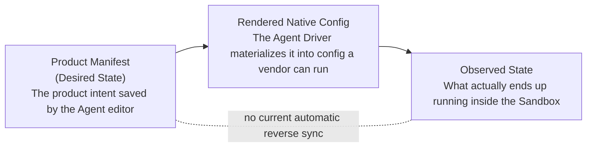
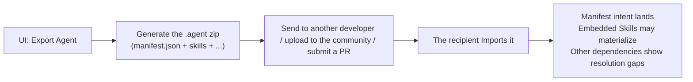
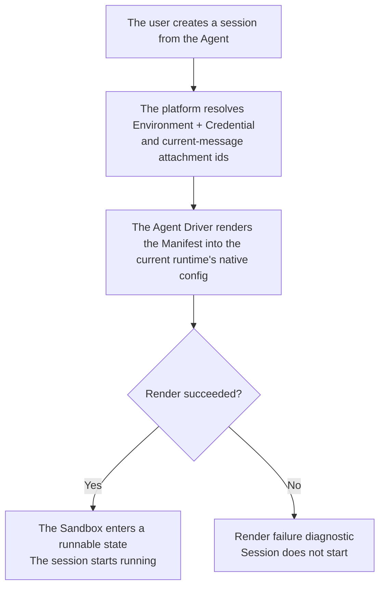

# Agent Manifest — for humans

Status: active for the field/ownership contract. Native-config drift detection,
Re-render / Keep runtime state, and Import / Adopt UX are not implemented and are
not product promises.

> This is the product-narrative version written for non-engineer readers. For the field-level types, see `pkgs/contracts/src/agent/agent-manifest.contract.ts` — the manifest contract source is the de-facto engineering reference.
>
> **Contract status (2026-06-24, Advanced runtime settings)**: the product surface exposes a small runtime-scoped allowlist as `Advanced runtime settings`. OpenAI exposes `model_reasoning_effort` / `model_verbosity`; Claude Agent SDK exposes its own `effort` / `maxTurns` fields without cross-runtime translation. Exported agent YAML and package `manifest.json` use `runtime.settings` / `settings`; legacy `providerOptions` remains readable for compatibility. The TypeScript contract and stored config still keep the internal field as `runtime.providerOptions: JsonObject` so existing driver plumbing can materialize runtime-native config, but the Console and public artifacts must not call this layer `providerOptions`. Settings are validated against the selected runtime allowlist before new values are stored; platform security, sandbox, credential, MCP, env, and provider/base-url boundaries cannot be overridden here.
>
> **Built-in tools status (2026-06-24)**: the tool names/contracts are runtime-neutral and live in a separate Agent capability section, not Advanced runtime settings. The current curated set is `bash`, `read`, `write`, `edit`, `glob`, `grep`, `web_fetch`, and `web_search`. The Web editor and Driver currently enforce these toggles only for the Claude Agent SDK backend; OpenAI and ACP do not apply them. They do not expose permission policy, approval mode, sandbox mode, or raw vendor tool configuration.
>
> **Current App boundary note**: Agent Manifest is still the App-local Agent runtime/config contract. It should not absorb App metadata, Provider key ownership, deployment health, App Overview state, or app-scoped cost. App owns those boundaries and references Agent Manifests as resources. See [App Boundary](./app-boundary.md).

---

## Positioning in one sentence

The Agent Manifest is the **declarative product configuration** of a Mosoo Agent:

- It uses **a small set of stable fields** to spell out who an Agent is, which runtime it runs on, which model it uses, which system prompt it follows, and which Skills / MCP / Environment it has installed.
- Upstream: the Agent owner edits it through the Agent editor / Preview form. (A natural-language configuration assistant — the former **Agent Builder** — is not part of the current product; see [architecture.md §4.4 Configuration Assistance Boundary](../architecture.md).)
- Downstream: export/import use the `.agent` archive format. Same-App Fork
  reuses the Manifest schema through a direct draft service without transporting
  an `.agent` archive. This does not promise a current IDE plugin or lossless
  cross-instance dependency restoration.

It is **not** a "super `agent.yaml`" that unifies the vendor configuration files of OpenAI runtime, Claude Agent SDK, OpenCode, Cursor, and so on. Those vendors have their own full-featured configuration formats, and we do not try to swallow them.

> Analogy:
> The Manifest is to an Agent what `package.json` is to a frontend app — it pins down "which framework this app uses, which packages it depends on, and where the entry point is." But it does **not** write every webpack plugin option for you, and it does **not** manage the internal config of each dependency inside `node_modules`.

---

## Breaking it down in one sentence

> The Agent Manifest is mostly about **defining a problem**, not enumerating a field table.

The core points it solves are:

1. **Shared by current Mosoo flows** — the editor, export/import, and same-App
   Fork use the same Manifest schema to understand who the Agent is and what it
   needs. Third-party compatibility requires a separately published, versioned
   contract plus conformance tests; this document does not promise it.
2. **Making `.agent` files portable within their implemented boundary** — a
   `.zip` contains `manifest.json`, valid embedded Skill files, MCP intent, and
   partial Environment sidecar metadata. Import materializes valid embedded
   Skills; other dependencies follow the resolution report and may remain
   unbound.
3. **Declarative** — the user expresses "what I want," and the platform renders it into something a concrete runtime can run. The user does **not** write startup commands, does not maintain a vendor `.toml`, and does not toggle dozens of advanced switches in a UI form.

---

## 1. The user problem

Mosoo currently supports three runtime paths: `openai-runtime`,
`claude-agent-sdk`, and `acp-fallback` (the current OpenCode path). The
architecture is designed to admit more heterogeneous runtimes only after they
join Runtime Catalog and Driver checks. Each supported path has its own:

- Vendor-native configuration files (for example OpenAI `config.toml` and the
  supported Claude/OpenCode configuration surfaces)
- Startup parameters, login state, and cache directories
- Way of wiring up MCP
- Prompting conventions
- Vendor-native session state

If we stuffed all of this into one big, all-encompassing `agent.yaml`:

- Users would see a pile of fields they **don't understand**, **can't migrate**, and **shouldn't be responsible for** in the first place.
- The Manifest would look like a vendor adapter spec rather than a product configuration.

If we built only the lowest common denominator:

- The Agent would become an "anemic wrapper" that cannot retain the supported
  runtime-native capabilities of its selected backend.
- Advanced users would go into the Terminal to change the vendor config, only to have the UI silently overwrite it again.

The real problem is not "how do we merge every vendor's fields into one," but rather:

- **Agent authors need a readable, editable, publishable entry point for product configuration.**
- **The platform needs a stable contract** that current Mosoo editor,
  export/import, and Fork flows reuse to create, start, diagnose, and recover
  Agents. Third-party consumption still requires a separately published,
  versioned contract and conformance suite.
- **Each Agent's runtime environment** must retain its supported runtime-native
  capabilities within Mosoo's policy and Sandbox boundaries.
- **When the UI, the Sandbox, and the vendor-native config disagree**, the user must clearly understand who is the source of truth and what to do next.

---

## 2. Goals

### What Agent authors can do

- Define a long-lived Agent with a small set of stable fields: `kind`, runtime, model, system prompt, Skills, MCP, Environment.
- Edit the Manifest directly through the Agent editor / Preview form. (A natural-language authoring assistant that turns "give me an agent that can read Linear tickets" into a Manifest patch — the former Agent Builder — is **not** part of the current product; any future configuration assistance is constrained by [architecture.md §4.4 Configuration Assistance Boundary](../architecture.md).)
- Export the Agent as a **`.agent` package** to send to another developer or import into another App. Fork itself creates a draft in the same App.
- Import a `.agent` package: the portable Manifest intent lands, valid embedded
  Skills can be materialized, MCP remains reconnect intent, Environment remains
  unbound today and may resolve to the target App default at Session start; only
  Environment secret names produce repair issues. **Credentials / tokens are
  not carried along with it.**

### What the UI makes clear

- Whether saved config passes current readiness and whether a platform-managed apply/recreate operation succeeded. This is not proof that arbitrary native Sandbox state still matches the saved Manifest.
- Preview/Publish readiness blocks unavailable required dependencies and explains
  the reason. Runtime/model selectors expose explicit unavailable states; only
  implemented blocker types provide a direct repair/navigation action.
- The current UI does not detect or display native Sandbox config drift. Saved
  Agent config remains authoritative for platform-managed apply/recreate flows.

### What advanced users can do

- A Pet owner can open the owner-debug Terminal and inspect or edit files that
  actually exist in that Sandbox. Cattle has no Terminal entry.
- Know that Sandbox-local changes are not reverse-written into the Manifest,
  are not a supported replacement for the Agent editor, and are not guaranteed
  across Sandbox recreation. There is no current Import / Adopt action.
- Fork the Agent to get a clean copy: the Manifest is copied over, while runtime state / login state / historical sessions are left behind.

---

## 3. The relationship lock: a three-layer mental model

The key to understanding the Manifest is not to confuse these three layers:

| Layer                      | What it is                                                                                                                                    | Is it the source of truth?                    |
| -------------------------- | --------------------------------------------------------------------------------------------------------------------------------------------- | --------------------------------------------- |
| **Product Manifest**       | Agent-editor input and the persisted manifest; users can export its YAML projection, but there is no current advanced YAML editor             | ✅ Yes. This is what the UI displays.         |
| **Rendered Native Config** | The vendor config file / startup parameters the Agent Driver renders from the Manifest                                                        | ❌ No. It is a materialized result.           |
| **Observed State**         | Runtime and diagnostic facts that the current implementation records. It does not expose a general native-config drift hash or adoption flow. | ❌ No. Used for implemented diagnostics only. |

**Rules**:

- Editing saved Agent config in the UI uses the current change-plan flow to save,
  restart the Driver, or recreate the Sandbox according to the changed fields.
- Editing the Sandbox in the Terminal does **not** change the Manifest.
- The current product has no general native-config drift indicator and no
  Re-render / Keep runtime state / Import / Adopt actions.

---

## 4. The minimal common set and Sandbox-local state

What we are building is the **overall unification of heterogeneous vendors** — so at the product layer the Manifest only ever appears as a **"minimal common set"**: runtime / model / system prompt / Skills / MCP / Environment.

For runtime-specific configuration outside the common product fields, the
current boundary is:

### Principle 1 · Support is bounded by the current runtime and Sandbox

The Driver renders the supported native configuration and starts the supported
backend. A Pet owner-debug Terminal exposes the actual Sandbox shell, but Mosoo
does not promise a particular config path, resident service command, package
manager, source checkout, or every capability of a self-managed VPS.

### Principle 2 · Balance "presentation" against "parameterized configuration"

Not every piece of configuration should surface in front of the user.

- **What belongs to product semantics** — long-term stable, common across runtimes, the user's responsibility — goes into the Manifest form.
- **What belongs to vendor-private parameters** — things like reasoning effort /
  thinking level / fallback strategy / startup flags — stays out of the primary
  Manifest unless it is in the runtime-owned Advanced settings allowlist.
  Unsupported private parameters are not implicitly promised through Terminal.

> In one sentence:
> Runtime-specific behavior is available only where the current Driver backend,
> policy, credentials, network, and Sandbox actually support it.

### Principle 3 · No promise of lossless cross-vendor migration

The Manifest is a minimal common set → it is impossible to move all of the OpenAI runtime's private fields 1:1 onto the Claude Agent SDK. Switching runtime = **Fork Agent / migration**, and we only promise to migrate the main Manifest fields; vendor-private native state does not migrate.

---

## 5. Concept definitions

| Term                       | Plain-language definition                                                                                                                                                                                                                     |
| -------------------------- | --------------------------------------------------------------------------------------------------------------------------------------------------------------------------------------------------------------------------------------------- |
| **Agent Manifest**         | An Agent's declarative product configuration: the **minimal common set** + user intent + platform governance fields used by current Mosoo editor, export/import, and Fork flows. It is not an unversioned third-party compatibility contract. |
| **`.agent` package**       | A distributable zip containing `manifest.json`, embedded Skill files, MCP intent, and partial Environment sidecar metadata. MCP/Environment are not automatically recreated; avatar packaging is not wired; credentials never travel.         |
| **`kind: pet \| cattle`**  | Pet = a stable Sandbox scoped to the Agent. Cattle = an independent Sandbox per Session. Kind is locked after first Publish; switching requires a same-App Fork.                                                                              |
| **Sandbox**                | The execution environment in which the Agent runs. Pet uses an Agent Sandbox; Cattle uses a Session Sandbox. Supported runtime-native behavior remains constrained by Mosoo policy, credentials, network, file, and Driver capabilities.      |
| **Rendered Native Config** | The vendor config file / startup parameters the Agent Driver renders from the Manifest. **A materialized result, not the truth.**                                                                                                             |
| **Owner-debug Terminal**   | Pet-only shell access to the current Sandbox for diagnosis. It is not an advanced Manifest editor, persistence guarantee, or general VPS compatibility promise.                                                                               |
| **Fork Agent**             | Take a same-App draft copy of the portable Manifest. Accessible Skill references can be reused; other dependencies follow the resolution report. Runtime/login state, Session history, and cost stay behind.                                  |
| **Readiness**              | Missing required dependencies block Preview/Publish with a reason. Runtime/model can show explicit unavailable states; some blocker types provide direct repair actions. The platform does not silently swap runtime or model.                |
| **Unavailable Model**      | A model that was selected before but is no longer in the dynamic model list. The Manifest still keeps it, the UI marks it Unavailable, and the user switches it manually.                                                                     |

---

## 6. What is and isn't in the Manifest

| Section                                                    | User mental model                                                  |                                                                                                 In the Manifest? |
| ---------------------------------------------------------- | ------------------------------------------------------------------ | ---------------------------------------------------------------------------------------------------------------: |
| Name / Description                                         | Who this Agent is                                                  |                                                                                                               ✅ |
| Runtime                                                    | Which Agent runtime it runs on                                     |                                                                              ✅ (switching after publish = Fork) |
| Model                                                      | Which provider / model is the default                              |                                                                                           ✅ (can be grayed out) |
| System Prompt                                              | The Agent's role, boundaries, and answering style                  |                                                                                                               ✅ |
| Skills                                                     | Reusable skill packages                                            |                                                                                                               ✅ |
| Built-in tools                                             | Runtime-neutral names; currently enforced by Claude Agent SDK only |                                                                                                               ✅ |
| MCP Servers                                                | External tool / connector bindings                                 |                                                                                                               ✅ |
| Environment                                                | Reference to a runtime container template                          |                                                                                                               ✅ |
| Files (uploads / session attachments / artifacts)          | Files an Agent reads or produces at run time                       | ❌ → scoped at upload / session time, not a Manifest binding (see [Files API contract](./files-api-contract.md)) |
| Vendor native config (`config.toml` / `settings.json` / …) | Vendor-private                                                     |                                                 ❌ → Sandbox-local; Pet owner may inspect through debug Terminal |
| Login state / CLI cache / vendor session state             | Runtime-internal state                                             |                                                            ❌ → Pet Sandbox state / Cattle Session Sandbox state |
| Performance / auto-switching / reasoning effort            | Runtime-specific preferences                                       |                                                                Small typed allowlist → Advanced runtime settings |

---

## 7. User journeys

### Owner creates an Agent (through the Agent editor)

| Stage                     | Action                                            | Experience                                                                    |
| ------------------------- | ------------------------------------------------- | ----------------------------------------------------------------------------- |
| 1. Getting started        | Fill in name, description                         | The form shows only stable product semantics                                  |
| 2. Choose runtime / model | Pick from dropdowns                               | See the list of runtimes + models available to the current App                |
| 3. Write the prompt       | Fill in the system prompt                         | The platform stores the prompt as part of the Manifest                        |
| 4. Attach capabilities    | Skills / MCP / Environment, each in its own group | Clear section boundaries, no nesting into each other                          |
| 5. Check readiness        | The UI validates automatically                    | Blocking dependencies show a reason; supported blockers offer a repair action |
| 6. Save / Publish         | One click                                         | Enters the Manifest state machine: draft / preview / live                     |

### Owner distributes the Agent

### A user enters the Terminal to edit vendor-native state

The Pet owner can edit Sandbox-local native state through Terminal. Those edits
do not update the saved Agent Manifest, and the current UI does not offer a
general drift comparison or Adopt flow. A later platform-managed config apply or
Sandbox recreate follows the saved Agent config and its runtime-state operation
contract.

### Session startup

---

> Field-level types and the manifest schema live in `pkgs/contracts/src/agent/agent-manifest.contract.ts` — the contract source is the de-facto engineering reference.
