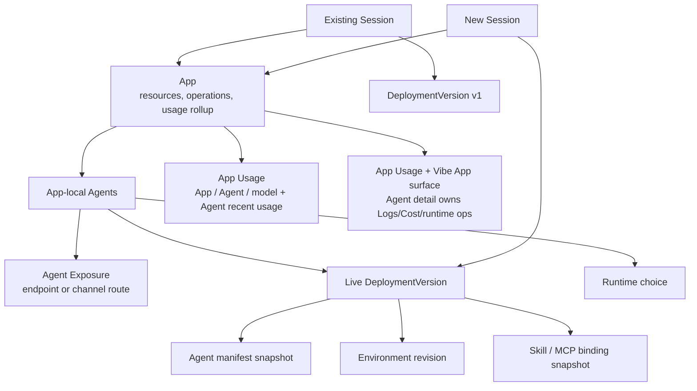
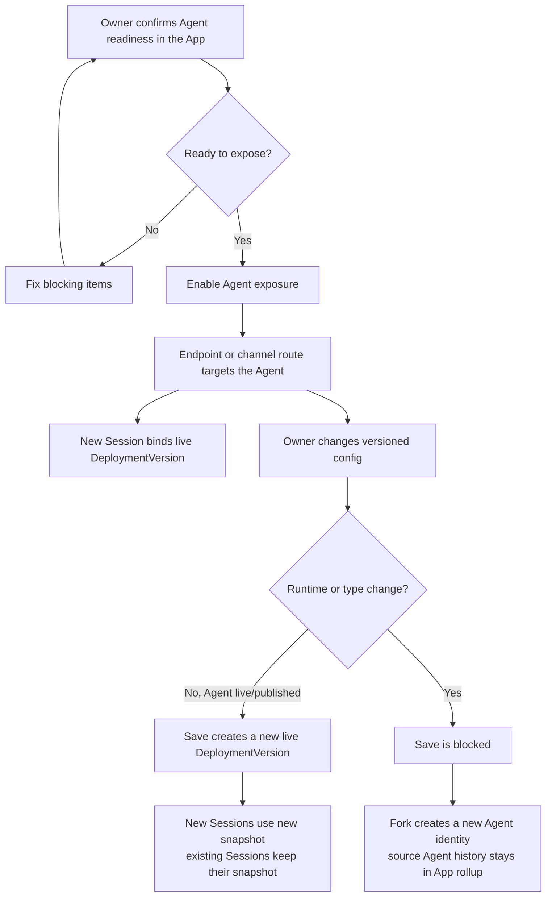

# Agent Exposure Identity & Deployment Version - for humans

Status: active and shipped for Agent exposure identity and version snapshots.

> This is the product-story version for non-engineer readers. Exact state and
> scope behavior lives in the Agent contracts, exposure/version services, and
> [Runtime State Operations](./runtime-state-operations.md).
>
> This document covers two boundaries: **App-scoped operations identity** and **Agent-owned exposure/versioning**. How Apply Changes works, how the driver restarts, and how agent-state resets live in [`./runtime-state-operations.md`](./runtime-state-operations.md).
>
> **Current App boundary note**: App is the V1 boundary. The App owns product navigation, resources, the Vibe App, operations visibility, and usage/cost rollups. An App-local Agent owns runtime execution, Agent API Endpoint exposure, channel delivery, DeploymentVersions, and Sessions. See [App Boundary](./app-boundary.md) and [`../SPEC.md`](../SPEC.md).

---

## One-line positioning

An owner creates an App, runs an App-local Agent, and can expose that Agent through an Agent-owned endpoint or channel route. The App remains the visible operations and cost boundary; the Agent keeps a stable exposure identity inside that App; saving versioned config on a live/published Agent creates a DeploymentVersion snapshot for new Sessions, while a draft save updates the draft without creating one; existing Sessions keep the snapshot they started with; runtime or type changes require Fork.

The product promise is:

> The App is the ownership and rollup boundary. App Usage shows spend; Agent detail owns Logs/Cost/runtime operations; App Overview owns the Vibe App surface. An exposed Agent is the callable unit inside that App. Changing prompt/model/tool bindings creates a new runnable snapshot for future Sessions; it does not rewrite running or historical Sessions. Changing runtime identity creates a new Agent.

---

## 1. User Problem

After an owner exposes an Agent, they need concrete answers to a few operational questions:

- **"Will changing the prompt interrupt Sessions that are currently running?"** A customer is chatting with the Agent right now; editing a model option must not silently swap that Session to a different behavior.
- **"Why did this later Thread use a newer prompt?"** A user starts or continues work after an owner change; the owner needs to explain which DeploymentVersion was selected at Session creation.
- **"Why does switching from OpenAI Runtime to Claude Agent SDK require Fork?"** Swapping runtime changes native state, resume behavior, tool behavior, logs, and cost attribution. It is not a field edit on the same running subject.
- **"Which version are endpoint or channel callers using?"** External callers target the Agent exposure identity; each new Session binds the live DeploymentVersion at creation time.
- **"Which config produced this charge?"** Usage facts may retain Agent, DeploymentVersion, Session, and Run attribution, while the current App Usage UI exposes App/Agent/model views and Agent-scoped recent usage/model-call events rather than every stored dimension.

What the owner actually wants to do:

1. Create an App and confirm an App-local Agent runs.
2. Expose that Agent through an Agent API Endpoint or channel route without creating another product boundary.
3. Change prompt/model/tool bindings so new Sessions pick up the new DeploymentVersion while existing Sessions keep their own snapshot.
4. Try to change runtime/type and get a clear Fork path instead of an in-place save.
5. Review App Usage and historical Sessions with enough Agent/version/run attribution to explain what happened.

---

## 2. Goals

When this is done, the owner should be able to:

- Understand that App is the product and operations boundary, while Agent exposure is the callable delivery promise inside that App.
- See the current live DeploymentVersion and historical DeploymentVersions from the Agent detail surface. App Overview owns the Vibe App build/preview/publish surface; it does not replace Agent logs, health, or per-binding detail.
- Save prompt/model/Skill/MCP/Environment and other versioned Agent config
  changes, and understand that future Sessions use the new snapshot while
  existing Sessions keep the snapshot they started with.
- Be blocked when changing runtime or Agent type in place, with copy that says Fork creates a new Agent identity and leaves existing Sessions, logs, usage, and agent-state attached to the original Agent.
- Read App Usage as the primary cost view, drill into Agent/model attribution, and inspect recent usage in the Agent Cost tab. A full DeploymentVersion/Run explorer is not shipped.

What external callers experience:

- **The Agent-owned endpoint or channel route stays stable.** Config changes do not change the address or provider route; runtime/type changes require the owner to create a new Agent identity.
- **Running Sessions are not silently reconfigured.** Any reconnect/update behavior belongs to the runtime operations model, but the execution snapshot for a started Session stays fixed.

---

## 3. Concept Definitions

| Term                           | Plain-language explanation                                                                                                                                                                                   |
| ------------------------------ | ------------------------------------------------------------------------------------------------------------------------------------------------------------------------------------------------------------ |
| **App**                        | The V1 product, resource, operations, Deployment, and usage/cost boundary. App is the user-facing and engineering name.                                                                                      |
| **Agent**                      | An App-local execution and delivery unit. It owns runtime execution, endpoint exposure, channel delivery, DeploymentVersions, and V1 Sessions.                                                               |
| **Agent Exposure**             | The fact that one Agent is callable through an Agent API Endpoint or channel route. The App summarizes exposure and operations; it does not become the runtime subject.                                      |
| **Exposure Identity**          | The stable delivery promise for a single Agent inside an App: callers keep targeting the same Agent-owned endpoint or channel route while config versions change underneath new Session creation.            |
| **DeploymentVersion**          | An immutable snapshot of runnable Agent configuration created for a live/published Agent: kind, runtime, provider/model, prompt, config, Environment reference, Skill references, and MCP binding snapshots. |
| **Live DeploymentVersion**     | The DeploymentVersion selected for new Sessions at the moment they are created. There is exactly one live DeploymentVersion for an exposed Agent at a time.                                                  |
| **Versioned Config**           | Runnable Agent fields that create a new DeploymentVersion when saved on a live/published Agent. The same edits on a draft update the draft only.                                                             |
| **Metadata-only Config**       | Fields that do not create a DeploymentVersion when changed, such as display name or description.                                                                                                             |
| **Runtime choice**             | The Agent runtime id, for example `openai-runtime` or `claude-agent-sdk`. After exposure/live-version lock, it cannot be swapped in place.                                                                   |
| **Fork Agent**                 | Creates a new Agent identity from the migratable intent of the source Agent. The source Agent keeps its Sessions, logs, usage, agent-state, endpoint identity, and channel route history.                    |
| **Session Execution Snapshot** | The frozen execution context selected when a Session starts: Agent id, App id, DeploymentVersion, Environment revision, resource bindings, provider/model references, and channel metadata if present.       |
| **New Session**                | A Session created after a config change. It uses the live DeploymentVersion at creation time.                                                                                                                |

---

## 4. Relationship Lock

**Three rules for the relationship:**

- **The App is the business boundary** - resources, the Vibe App, operations visibility, and usage/cost roll up there.
- **The Agent is the delivery/runtime subject** - its endpoint or channel route stays stable while DeploymentVersions change for new Sessions.
- **Runtime/type changes require Fork** - Fork creates a new Agent identity; the original Agent keeps its Sessions, logs, usage attribution, endpoint history, and agent-state.

---

## 5. Fail-closed Invariants

- Session creation must prove the Agent belongs to the requested App before any runtime snapshot is created.
- Endpoint tokens, channel provider metadata, runtime ids, historical package ids, or Session snapshots cannot prove App ownership by themselves.
- A cost or usage event without App proof is rejected instead of attributed through an inferred owner.
- A runtime/type change after exposure/live-version lock is rejected in place; the only current path is Fork.
- A channel event that cannot resolve to one AgentChannelBinding inside one App is rejected instead of routed through a default.
- App Overview may summarize exposure and Deployment state, but it does not own Agent logs/health or create an App-owned runtime endpoint.

---

## 6. User Journey Map

| Stage                   | What the owner is doing                            | Touchpoint                    | Product rule                                                                            |
| ----------------------- | -------------------------------------------------- | ----------------------------- | --------------------------------------------------------------------------------------- |
| Preview succeeds        | Confirming the Agent runs inside the App           | Agent detail / Preview        | No exposure required yet                                                                |
| First exposure          | Enabling endpoint or channel delivery              | Preview Publish menu          | Agent exposure is created inside the App boundary                                       |
| Being consumed          | Callers create Threads/Sessions                    | Agent API Endpoint / Channel  | Each Session binds the live DeploymentVersion                                           |
| Changing live config    | Editing prompt/model/Skills/MCP/Environment/config | Agent editor / Versions Sheet | Save on a live/published Agent creates a new DeploymentVersion for future Sessions      |
| Changing draft config   | Editing a not-yet-published Agent                  | Agent editor                  | Save updates the draft; it does not create a DeploymentVersion                          |
| Reviewing operations    | Explaining a historical issue or charge            | App Usage / Agent Cost        | Current UI exposes App/Agent/model attribution and Agent recent usage/model-call events |
| Wanting to swap runtime | Switching runtime choice or Agent type             | Runtime picker                | In-place save is blocked; Fork creates a new Agent identity                             |

---

> Agent contracts and services own the exact state machine; this document owns
> the product semantics for App-scoped operations identity plus Agent-owned
> exposure and DeploymentVersion behavior.
