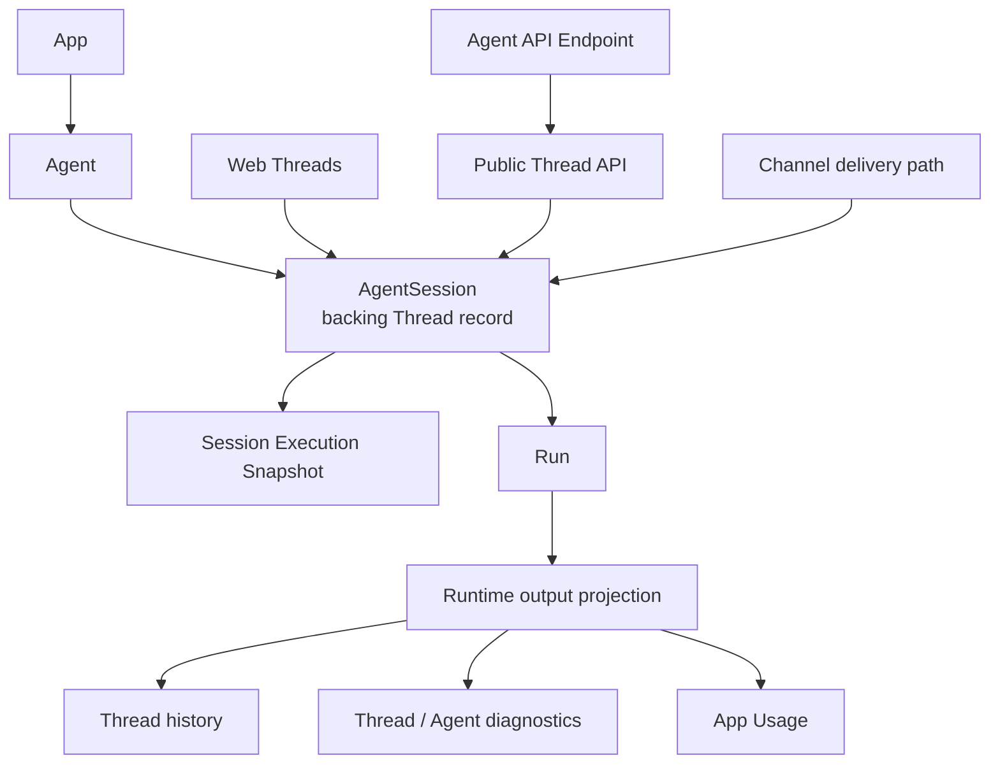
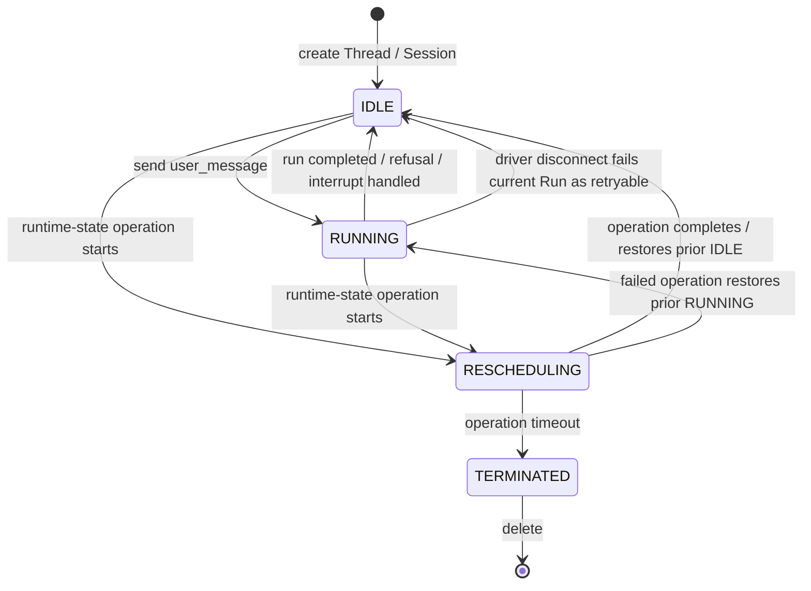

# Agent Session Contract - For-Human PRD

Status: active current-state implementation contract behind Threads.

> **Purpose**: This is the human-readable version for PMs, designers, GTM, and reviewers. It explains the implementation-layer AgentSession contract behind Mosoo Threads.
>
> **Current App boundary note**: Thread is the V1 product name for the same backing AgentSession record; there is no separate Thread table or id. An AgentSession always belongs to one Agent, inherits App through that Agent, and freezes the Agent execution snapshot when it is created. App Usage rolls up cost; Thread/Agent surfaces own history and diagnostics. Public developer docs should say Thread and Agent API Endpoint, not Session-first product language.
>
> **Related docs**: [SPEC](../SPEC.md), [App Boundary](./app-boundary.md), [Agent Exposure Identity](./agent-service-identity.md), [Public API Surface](./public-thread-api-surface.md), [Session Files](./session-files.md), and [Runtime State Operations](./runtime-state-operations.md).

---

## 1. TL;DR

Mosoo has three V1 ways to start or continue Agent work:

1. **Web Threads** inside the active App.
2. **Public Thread API** calls against one Agent API Endpoint.
3. **Channel delivery** through an App-owned Channel bound to one Agent.

All three create or continue a backing AgentSession for one Agent. The backing Session is where the runtime snapshot, status, Runs, messages, files, process events, and diagnostics live. The public product language remains Thread.

The contract is:

```text
App
  -> Agent
    -> AgentSession record (product name: Thread)
      -> Run
        -> runtime projection
```

The AgentSession contract answers only **how one Agent execution is tracked**. It does not decide API endpoint exposure, Channel installation, provider signing, or external delivery. Those entry points normalize their caller context, then create or continue the Session with explicit App proof.

---

## 2. User Problem

The owner needs one reliable Agent execution model across Web Threads, Agent API Endpoint requests, and Channel delivery:

- A Web Thread should behave like the same kind of Agent work as an API-created Thread.
- A public API caller should receive Thread responses without learning Mosoo runtime internals.
- A Channel event should map to the correct Agent and external thread without becoming a public API caller.
- A running Session must keep the DeploymentVersion, Environment revision,
  provider/model references, Skill/MCP snapshots, and channel metadata selected
  at creation time. Thread files follow the Session file contract instead of an
  Agent version binding.
- App Usage must show App-level rollups while preserving Agent, DeploymentVersion, Session, Run, model, provider, and trigger attribution.

The failure modes to avoid:

- Public API responses expose vendor-native resume pointers or raw runtime event grammar.
- Channel provider payloads become first-class Session API objects.
- A caller can choose runtime credentials just by creating a Thread.
- A Session can be created from a runtime id, old package id, channel metadata, or snapshot without proving the Agent's App.
- Unknown event types are accepted because a channel or runtime already knows how to handle them.

---

## 3. Goals

After this round, Mosoo should be able to clearly articulate:

- Thread is the user-facing product object; AgentSession is the backing implementation object.
- A Session belongs to one Agent and inherits App from that Agent.
- A Session freezes the Agent execution snapshot when it is created.
- Web Threads, Public Thread API, and Channel delivery use the same Session lifecycle and Run semantics without using the same public route shape.
- Public Thread API responses are Thread-first and hide runtime internals.
- Channel delivery owns provider signing, external thread mapping, and reply writeback outside the Public Thread API.
- Caller attribution is distinct from execution owner: the caller explains who triggered input; the Agent owner controls runtime identity and App-owned credential/resource resolution.
- Native runtime pointers exist only as internal recovery or diagnostics records.
- Usage rolls up to App Usage; process events and diagnostics remain on the
  admitted Thread/Agent surfaces rather than a generic App operations console.

---

## 4. Concept Definitions

| Term                           | Product definition                                                                                                                                                             |
| ------------------------------ | ------------------------------------------------------------------------------------------------------------------------------------------------------------------------------ |
| **App**                        | The V1 product, resource, configuration, deployment, and usage/cost boundary.                                                                                                  |
| **Agent**                      | The App-local runtime and delivery subject. It owns runtime execution, endpoint exposure, channel delivery, DeploymentVersions, and Sessions.                                  |
| **Thread**                     | The V1 product name for an Agent interaction. Web and public API surfaces should center this noun.                                                                             |
| **AgentSession**               | The implementation/runtime record behind a Thread. Code, database, and contracts may use this name.                                                                            |
| **Session Execution Snapshot** | The frozen execution context selected when a Session starts: Agent id, App id, DeploymentVersion, Environment revision, bindings, and metadata.                                |
| **Run**                        | One execution attempt inside a Session. Current trigger values are `user_prompt`, `retry`, `resume`, and `system`; permission decisions and interrupts act on an existing Run. |
| **SessionMessage**             | Durable transcript projection for a Session. It is not a transient runtime delta.                                                                                              |
| **SessionFile**                | User-provided material linked to one Session/Thread. A turn receives only ready attachment ids explicitly included with that message.                                          |
| **Agent API Endpoint**         | The Agent-owned public HTTPS endpoint. It creates or continues Threads through the Public Thread API.                                                                          |
| **Public Thread API**          | The external developer contract for creating, reading, continuing, archiving, deleting, streaming, and attaching files to Threads.                                             |
| **Channel delivery path**      | An App-owned Channel plus Agent binding that converts provider events into Agent Sessions and writes output back to the provider.                                              |
| **Caller**                     | The account, Access Token, Web user, or external provider user context that triggered input.                                                                                   |
| **Execution owner**            | The Agent owner whose App-local credentials, Environment, Skills, MCP, and runtime identity are used.                                                                          |
| **Native resume pointer**      | The vendor runtime's own resume handle, such as a runtime thread or vendor session id. It is internal recovery data, not a public id.                                          |
| **Runtime output projection**  | The normalization layer that turns runtime output into text, tools, permissions, files, usage, status, process events, and diagnostics.                                        |

---

## 5. Layering Relationships



Decisions:

- Web Threads are first-party App UI over Agent Sessions.
- Public Thread API is the external HTTPS contract for Agent API Endpoints.
- Channel delivery is a provider-specific path that may reuse Session services but does not become a Public Thread API caller.
- The runtime never receives raw Slack/Lark/GitHub provider payloads as a Session object; provider input is normalized first.
- No entry point may bypass App ownership proof before creating, reading, or mutating a Session.

---

## 6. Resource Model

### 6.1 Product and public resources

| Resource         | Created by                                          | Lifecycle                                                  | Invariants                                                                                               |
| ---------------- | --------------------------------------------------- | ---------------------------------------------------------- | -------------------------------------------------------------------------------------------------------- |
| **Thread**       | Web Threads, Public Thread API, or Channel delivery | create -> continue -> archive/unarchive/delete             | User-facing product record. In V1 it targets one Agent.                                                  |
| **Run**          | Session event handling                              | started -> completed/failed/canceled                       | Interrupt cancels the active Run but does not delete the Thread.                                         |
| **Thread event** | Public Thread API or Web/Channel event path         | accepted -> projected                                      | Unknown event types are rejected by default.                                                             |
| **Thread file**  | Web or Public Thread API                            | add -> available -> remove under Thread writable lifecycle | Add/claim uses the admitted Session's App; archived, rescheduling, and terminal Threads reject mutation. |

### 6.2 Implementation-only resources

| Resource                   | Purpose                                            | Must never leak as                                          |
| -------------------------- | -------------------------------------------------- | ----------------------------------------------------------- |
| **AgentSession**           | Runtime and persistence record behind a Thread     | First-screen public API noun                                |
| **DeploymentVersion link** | The Agent config snapshot frozen into the Session  | A mutable pointer changed under existing Sessions           |
| **Environment revision**   | Immutable Environment snapshot used by the Session | A live App default that silently rewrites the Session       |
| **Native resume pointer**  | Vendor-native recovery handle                      | URL, public id, Manifest field, Channel key, or owner proof |
| **Runtime diagnostics**    | Redacted execution facts for debugging             | Secret dump or ordinary caller response                     |

---

## 7. Session Lifecycle

The public lifecycle still uses the four Session states from the Runtime Session Kernel:

| Status         | Meaning                                                                       | API behavior                                                                                                                                  |
| -------------- | ----------------------------------------------------------------------------- | --------------------------------------------------------------------------------------------------------------------------------------------- |
| `IDLE`         | The Session can accept new input; runtime may be warm or cold                 | Sending events can start a new Run.                                                                                                           |
| `RUNNING`      | At least one Run is executing                                                 | Another user message is rejected; pending permission decisions remain available, and an interrupt cancels only the current Run.               |
| `RESCHEDULING` | A restart/recreate/reset runtime-state operation temporarily owns the Session | New input is rejected; completion returns to `IDLE`, failure restores the previous status, and operation timeout transitions to `TERMINATED`. |
| `TERMINATED`   | Unrecoverable runtime/lifecycle failure                                       | Transcript/process/diagnostics can be read; continuing work requires a new Session.                                                           |

Non-status expressions:

| Concept                                           | How it is expressed                                                      |
| ------------------------------------------------- | ------------------------------------------------------------------------ |
| archived                                          | Nullable `archivedAt`; archived Sessions are read-only until unarchived. |
| deleted                                           | Delete operation/tombstone, not an interactive status.                   |
| creating / resuming / checkpointing / hibernating | Internal phase or UI subtitle, not a public status.                      |
| needs approval                                    | Permission event plus UI affordance; the Session remains `RUNNING`.      |



---

## 8. Input Categories

| Input category          | Entry points                                 | Product semantics                                                                                                     |
| ----------------------- | -------------------------------------------- | --------------------------------------------------------------------------------------------------------------------- |
| User message            | Web Threads, Public Thread API, Channel path | Natural-language or structured work; when admitted on an idle Session it creates a `user_prompt` Run.                 |
| Permission decision     | Web runtime UI, Public Thread API            | Allow once or reject once for a pending request in the current Run.                                                   |
| User interrupt          | Web runtime UI, Public Thread API            | Cancels the current Run while keeping the Thread resumable.                                                           |
| Reserved resume trigger | No shipped caller entry point                | The run-trigger type reserves `resume`, but the current driver-reclaim path does not enqueue an automatic resume Run. |

Input event rules:

- Every input is admitted against the Session/App boundary. A user message may start a Run only from `IDLE`; permission decisions and interrupts target the current `RUNNING` Run and do not create a new one.
- Public send-events preflights the complete request against that state contract
  before claiming draft files. Referenced drafts are then claimed in request
  order before runtime event execution. Claims and events are not one
  transaction; a later failure does not roll back an earlier claim or event.
- Every input carries caller attribution, but credential/resource resolution follows the execution owner and the Agent's App.
- Permission decisions must reference the original permission request.
- Provider-native payloads must be normalized before they enter the Session.
- Unknown consumer events are rejected by default.
- On each user message, the platform materializes only the ready SessionFile ids
  carried by that message's `attachmentIds`. Other linked files are not
  automatically injected into the turn. The caller does not handwrite runtime
  paths for the accepted ids.

---

## 9. Runtime Output Projection

Runtime output projection is an internal normalization layer. Output from the Driver, file service, and diagnostics path is projected onto four product surfaces:

- Thread history: durable transcript, message, Run, and file facts.
- Live viewer state: frames needed by the current Web/stream view.
- Thread/Agent diagnostics: process events, health signals, and redacted diagnostics.
- App Usage: cost and usage rollups.

| Projection family                                  | Default visibility                     | Purpose                                                                                                                         |
| -------------------------------------------------- | -------------------------------------- | ------------------------------------------------------------------------------------------------------------------------------- |
| `session.status`                                   | Admitted viewers/callers               | Synchronizes `IDLE`, `RUNNING`, `RESCHEDULING`, and `TERMINATED`.                                                               |
| `run.started`                                      | Admitted viewers/callers               | Creates one unit of work.                                                                                                       |
| `run.completed`                                    | Admitted viewers/callers               | Wraps final output, usage, and artifact pointers.                                                                               |
| `run.failed`                                       | Admitted viewers/callers               | Displays errors and the retry/new-thread decision.                                                                              |
| `agent.message.delta`                              | Admitted viewers/callers               | Streaming assistant text output.                                                                                                |
| `agent.thinking.delta`                             | Product-controlled                     | Optional thinking/planning output, gated by product policy.                                                                     |
| `tool.use.started`                                 | Admitted viewers/callers               | Tool-call cards and host activity.                                                                                              |
| `tool.use.completed`                               | Admitted viewers/callers               | Bounded tool-name completion/failure summary; raw result/output stays private.                                                  |
| `tool.confirmation.required`                       | Supervised permission profile only     | Projects Needs approval when supervised mode is enabled; current production `full_access` profiles do not emit it.              |
| `file.changed`                                     | Admitted viewers/callers if subscribed | Updates runtime-written file activity.                                                                                          |
| `session.files.updated` -> `session_files.updated` | Admitted viewers/callers if subscribed | The runtime fact projects to the stable process-event type; file panels or public file reads refresh from the SessionFile list. |
| `usage.updated`                                    | App Usage and allowed callers          | Cost and usage projection.                                                                                                      |

Projection contract:

- Within one driver ingestion, projection order follows received order.
- Public callers read stable event projection, Thread summary, files, and stream output; they do not depend on raw runtime event grammar.
- Diagnostics may retain redacted native summaries, but must not expose secrets or raw NativeRuntimeRef values to ordinary callers.
- Vendor-native facts may be retained in dedicated redacted diagnostics, but they are not Session process-event types.

---

## 10. Entry Point Behavior

### 10.1 Web Threads

Web Threads is first-party App UI:

1. The active App provides App context.
2. The user selects or creates a Thread for one Agent.
3. Web creates or retrieves the backing AgentSession with `appId`.
4. Follow-up input sends Session events.
5. The Thread view reads messages, process events, files, capabilities, and live state through generated first-party clients.

### 10.2 Public Thread API

The Public Thread API is the external HTTPS contract:

1. The caller authenticates with an Access Token.
2. The target Agent must be exposed as an active Agent API Endpoint.
3. The caller must own the App that owns the Agent.
4. Creating a Thread creates a backing AgentSession for that Agent and may queue the first Run.
5. Later public reads and mutations must prove caller/thread/Agent/App consistency.

### 10.3 Channel Delivery

Channel delivery is not a public API caller:

1. The App owns the Channel setup and provider credentials.
2. One Agent owns the Channel binding and delivery behavior.
3. Provider events are verified, normalized, and resolved to exactly one binding.
4. The channel path creates or continues an AgentSession for that Agent.
5. Output is written back through provider-specific reply handling.

---

## 11. Fail-closed Invariants

- Session creation must prove the Agent belongs to the requested App.
- A Session inherits App from Agent; it does not accept an independent owner picker.
- Runtime ids, native resume pointers, old package ids, provider user ids, channel metadata, and historical snapshots cannot prove ownership.
- Public API callers must be admitted through Access Token plus Agent API Endpoint ownership checks.
- Channel events must resolve to one App-owned Channel and one Agent binding.
- Unknown input events are rejected until explicitly added to the contract.
- Runtime credentials resolve through the execution owner and App-owned resources, not through the caller by default.
- Existing Sessions keep their execution snapshot when Agent config changes.
- Usage events without App proof are rejected instead of inferred.

---

## 12. What This PRD Does Not Define

- App-level API endpoints.
- Runtime process owned by App.
- Web deployment owned by App.
- Multi-Agent Threads.
- Raw provider event schemas.
- Public access from tenant people state.
- Runtime-specific public event grammar.
- Public exposure of native resume pointers.

---

> This PRD defines the backing Session contract. Public docs and UI should lead with Threads, Agent API Endpoints, Agent diagnostics, and App Usage unless they are explicitly explaining implementation details.
