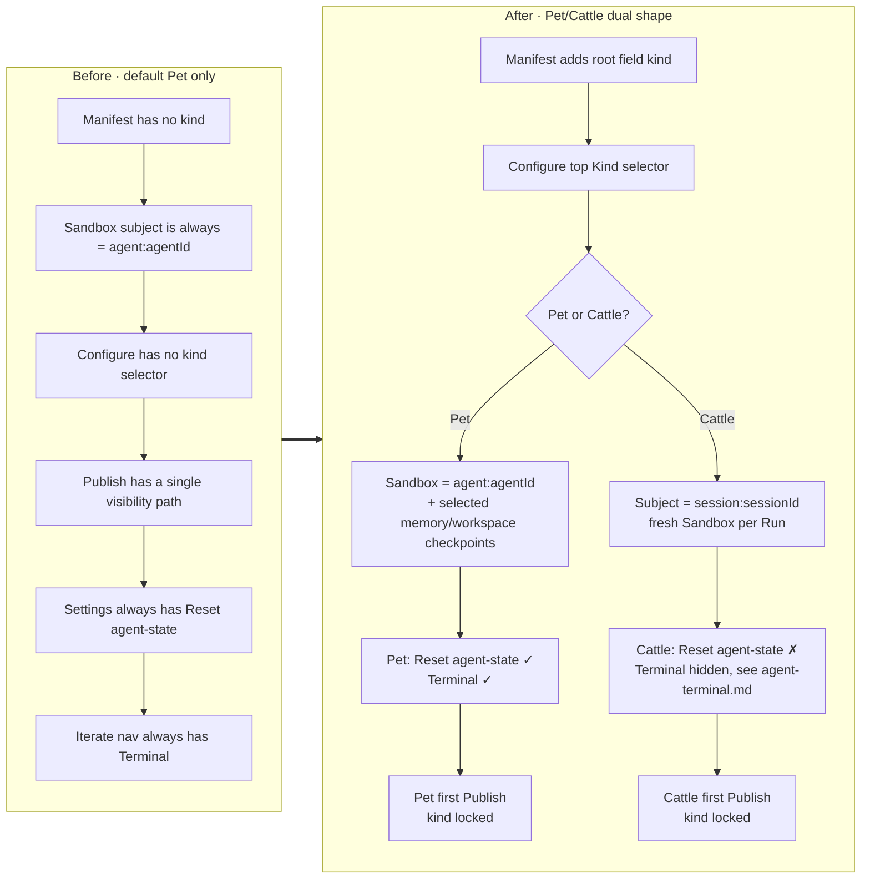
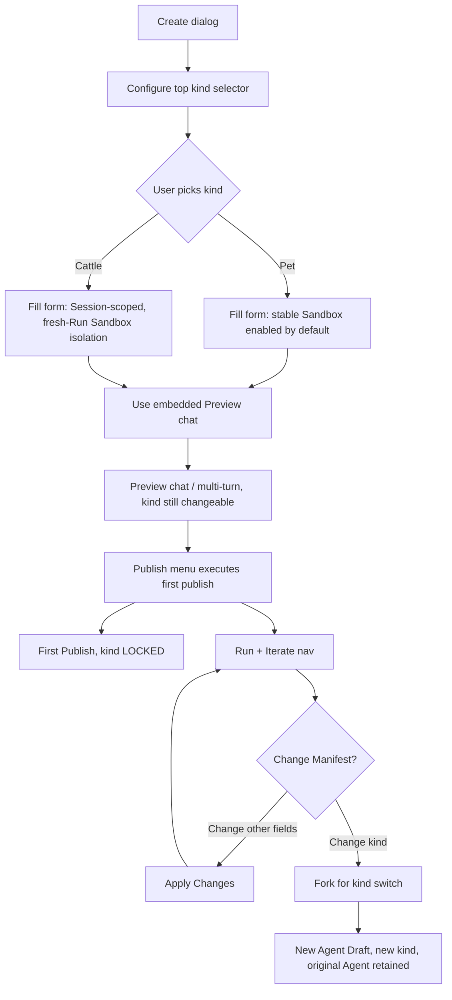
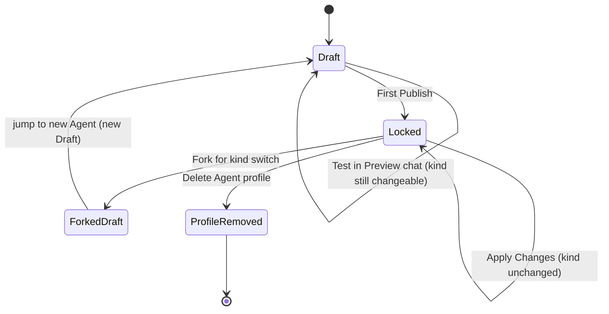

# Agent Type (Pet vs Cattle) — for humans

Status: active and shipped for kind selection, locking, and runtime mapping.
Continuity is bounded by the checkpoint and attachment rules below.

> This is the product-story version written for non-engineer readers.

> **UI status (2026-06-10)**: the user-facing labels in the Agent editor and the kind-fork dialog are **Assistant Agent** (kind = `pet`) and **Task Agent** (kind = `cattle`); the on-screen control is now a single-row segmented switch tab with hover tooltips, not the previous "two stacked cards / either-or toggle." The engineering-contract kind keys (`pet` / `cattle`) and the doc / API language below are unchanged. When this PRD says "Pet" or "Cattle," that is the contract term — the UI shows it as "Assistant Agent" / "Task Agent."

> **UI status (2026-06-24, creation flow)**: the `+ New agent` primary CTA opens a **New Agent** dialog (`create-agent-launcher.tsx`) that collects a required name and runtime, then creates a Pet Agent and navigates to **Preview** (`/agent/{id}?tab=preview`). Preview combines the configuration form and test surface; the owner can change kind there before first Publish. The removed Agent Builder path, first-message intake, templates row, and `Start from blank` flow are not part of current creation — see [architecture.md §4.4 Configuration Assistance Boundary](../architecture.md).

---

## In one sentence

Mosoo splits Agents into two **kinds**:

- **Pet** (UI label: **Assistant Agent**) — a companion-style agent whose
  Sessions share one live Sandbox and whose conversation history persists. A
  rebuild restores only selected memory/workspace paths, not every setup detail.
- **Cattle** (UI label: **Task Agent**) — an industrial, task-style agent: "like a disposable worker" whose Session-scoped runtime subject provisions a fresh Sandbox for a Run and releases it when that Run becomes terminal.

Agent creation defaults to Pet. The owner can explicitly choose Pet or Cattle in
the Preview configuration form before first Publish. **The kind is locked after
the first Publish**; to switch, Fork into a new Agent.

> This is a product-shape decision, not an internal engineering toggle. Pet / Cattle is the single engineering-contract naming scheme; the user-facing surface today re-labels them as "Assistant Agent" / "Task Agent" but the contract keys are unchanged — analogous to Dify's "Workflow vs Chatflow".

---

## The user problem

Mosoo defaults new Agents to a long-lived Sandbox (the Pet shape). That fits
"personal assistant / knowledge keeper / co-pilot" scenarios where the Agent
provides ongoing continuity, but a shared resident Sandbox has different
isolation and scaling trade-offs from short-task scenarios such as "PR
auto-review / Linear assign / batch jobs":

- Concurrent work shares one runtime subject and is bounded by that runtime's
  actual capacity; Mosoo does not claim a universal requests-per-second ceiling
  without a measured environment and workload.
- Runs can observe the same Sandbox-local state, so this shape does not provide
  independent per-task state isolation.
- A long-lived runtime is a poor fit for bursty, isolated invocations whose state should not be shared.

But switching exclusively to Cattle (a fresh short-lived Sandbox for each Run,
addressed through the Session-scoped runtime subject) would lose the shared
Sandbox continuity behind "the agent is like my coworker and remembers that we
discussed X." Platform conversation history can still continue the same Cattle
Session, but the old Sandbox is not reused.

**The real problem**: the Builder needs to distinguish these two shapes while
configuring the draft before first Publish. A later wrong choice cannot be
switched in place, because the Sandbox lifecycle boundary is both an engineering
and product decision, so it must go through a Fork.

---

## Goals

When this is done, the Builder should be able to:

- **U1**: clearly distinguish a "resident coworker" (Pet) from a "task worker"
  (Cattle) while configuring the draft before first Publish.
- **U2**: see the kind selector in the Preview configuration form, alongside a
  one-line scenario description and comparison table.
- **U3**: switch the kind freely before the first Publish; after Publish the kind is locked and switching requires a Fork.
- **U4**: see the Locked state and the Fork path after Agent Exposure, feeling exactly consistent with the runtime/status lock behavior.
- **U5**: see kind-aware reset guidance in Settings and kind-aware Terminal
  visibility in the Iterate phase. Logs and Cost remain shared Agent detail
  surfaces for both kinds.
- **U6**: have API consumers consume both kinds through the same session product semantics; the only difference shows up in sandbox lifecycle and state continuity.

---

## Concepts

| Term                       | Meaning                                                                                                                                                                                                                                                                             |
| -------------------------- | ----------------------------------------------------------------------------------------------------------------------------------------------------------------------------------------------------------------------------------------------------------------------------------- |
| **Agent**                  | The bare name for Mosoo's outward-facing product entity. draft / published are states of an Agent, not separate entities.                                                                                                                                                           |
| **Kind**                   | The product shape of an Agent: `pet` / `cattle`. Creation defaults to Pet; the owner can change it in Preview before first Publish, after which it is locked.                                                                                                                       |
| **Pet**                    | A companion-style Agent. Multiple Sessions reuse one Agent Sandbox while that container lives; restart retains it, while recreate/hibernate restores only selected memory and eligible Session workspace paths.                                                                     |
| **Cattle**                 | An industrialized, session-style Agent. Runtime identity is scoped to `session:{sessionId}`; each Run provisions a fresh Sandbox, which is released at terminal Run status. A later Run gets the new input and explicit attachments, not a transcript replay or prior native state. |
| **Files**                  | The App Files page is a read-only record view; its reserved library scope has no current create/upload path and is not mounted into runtime. A ready Thread attachment can be read when its id is explicitly included with the current message.                                     |
| **Container-local state**  | Pet retains it only while the same container lives; recreate/hibernate restores the selected checkpoint paths and reset discards the container. Cattle releases its Sandbox at terminal Run status, so container-local state does not carry into the next Run.                      |
| **Cattle continuation**    | A user can send another input to an old Cattle Session; the next Run creates a fresh Sandbox with that input and explicit ready attachments. Platform history remains readable in UI/DB but is not replayed to Driver; prior artifacts stay downloadable records.                   |
| **Kind lock**              | The first Publish makes the kind field immutable; during the Draft phase (including after using the embedded Preview chat) the kind can be switched freely; after that, switching the kind requires a Fork.                                                                         |
| **Fork (for kind switch)** | Creates a new Agent identity (with the new kind). The original Agent's sessions / cost / logs stay on the original Agent and are not migrated.                                                                                                                                      |
| **Lock banner**            | A yellow inline banner that mirrors the Agent Exposure runtime lock, telling the user "Agent type is locked, Fork to switch".                                                                                                                                                       |

---

## User journey

| Stage                                   | What the Builder is doing                                                                             | What they see                                                                                                                                                           | Mood         |
| --------------------------------------- | ----------------------------------------------------------------------------------------------------- | ----------------------------------------------------------------------------------------------------------------------------------------------------------------------- | ------------ |
| Create                                  | Click "+ New agent" → enter Name + pick Runtime                                                       | New Agent dialog (name + runtime; **does not expose kind**, to avoid an entry barrier)                                                                                  | Anticipation |
| Pick kind                               | Open Preview and use the Assistant Agent (Pet) / Task Agent (Cattle) switch in the configuration form | A segmented switch with hover tooltips (tagline + description + examples) per option + comparison table                                                                 | Learning     |
| Configure                               | Fill in Identity / Model / System Prompt / Skills / MCP in Preview                                    | Shared configuration/test surface for Pet and Cattle                                                                                                                    | Smooth       |
| Test                                    | Use the embedded chat in Preview                                                                      | Multi-turn conversation; **kind can still be switched freely during Draft**, with no side effects                                                                       | Anticipation |
| Publish                                 | Click "Publish" from the Publish menu                                                                 | First publish runs directly; the draft kind selector already explains the lock, and the published menu exposes API, Thread, instruction, and configured Channel actions | Decisive     |
| Run                                     | View Runs / Preview / Logs / Cost / Terminal                                                          | Agent detail shows Preview / Logs / Cost; Terminal is shown for Pet but hidden for Cattle — see [`./agent-terminal.md`](./agent-terminal.md)                            | In control   |
| Discover a wrong choice                 | Click the locked kind card                                                                            | Fork confirmation: clearly lists ✓ what carries over / ✗ what is lost / ⓘ what stays in place                                                                           | Alert        |
| Change your mind (before first Publish) | Switch the kind directly                                                                              | No confirmation, free switch, including after using Preview chat                                                                                                        | Smooth       |

---

## Information architecture (Before / After)

---

## Product flow from creation to lock

---

## Lifecycle states of the kind

**Things to remember**:

- The kind can be changed at will during the Draft phase (including after a Preview chat test).
- The first Publish is the decision point (the kind gets locked).
- After Locked, there is only one way to switch the kind: Fork.
- A Fork produces a **new Agent identity**; the original Agent's sessions / cost / logs are **not migrated** and stay in place.
- Delete removes the editable Agent profile plus its configured Skill and MCP bindings. It does **not** purge historical Threads, deployment versions, usage, or runtime records; those records follow their own lifecycle.
