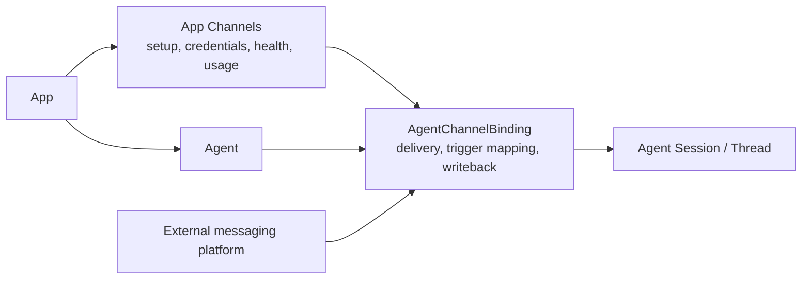

# Channels - for human

> The Channels product story for non-engineers. This document follows
> [SPEC](../SPEC.md) and [App Boundary](./app-boundary.md).
>
> **Boundary lock (2026-06-14)**: Channel setup, credentials, connection
> state, provider metadata, health, and usage visibility belong to App.
> Agent owns runtime delivery through an AgentChannelBinding. App has no runtime,
> no App-level channel bot, and no App-level public endpoint.
>
> **Current UI status**: the App-level Channels surface is not exposed in the
> main Web console yet. The gated Agent channels settings dialog renders
> unsupported Channel providers as `Coming soon`; provider setup widgets exist
> behind gated Agent screens and are implementation slices, not the committed
> V1 IA.

---

## One-line positioning

Let an App owner configure an external messaging connection at App scope, then
bind an App-local Agent so the Agent can respond as a bot in Slack, Lark /
Feishu, Telegram, Discord, or personal WeChat.

External platform users can mention or DM the bot and receive the answer back in
the same external thread. They do not sign in to Mosoo, do not become Mosoo
accounts, and do not enter any private Web Thread.

`Functional` in this document means the product and backend path exists in code
or tests. It is not live-provider proof. Until a real external account smoke
test is recorded for a provider, mocked provider APIs, relay fixtures, and QR
fixtures are not enough to claim live delivery.

---

## 1. The User Problem

After an App owner has an Agent ready to expose, common requests are:

- "Can this Agent answer when someone mentions our bot in Slack?"
- "Can I paste the platform app credentials once and see whether the connection
  is healthy?"
- "Can I bind a different Agent without turning the platform credential into a
  broad account-shell resource?"

External platform users expect:

- A quick working indicator or native platform reply after mentioning the bot.
- The full answer in the same external thread.
- Follow-up questions in that external thread to continue the same Mosoo Thread.
- No private App data or Web Thread content leaking into the external platform.

---

## 2. Goals

### What the App owner can do

- Configure Slack, Lark / Feishu, Telegram, Discord, or personal WeChat as an
  App-scoped Channel connection.
- Store provider credentials in the secret vault with App and Agent
  binding proof.
- Bind one Agent to the Channel for delivery.
- See connection state, last error, last triggered time, and recent session count
  at App scope.
- Remove a binding so future external events are acknowledged and dropped; the
  existing Mosoo Sessions keep source metadata only.

### What external platform users can do

- Trigger the bound Agent inside an external platform thread.
- See the reply in the same external platform thread.
- Ask follow-ups that continue the same Mosoo Session behind that thread.
- Remain external provider identities recorded in trigger metadata, never Mosoo
  access identities.

### Provider status

- Slack, Lark / Feishu, Telegram, Discord, and personal WeChat are the current
  setup providers.
- Slack, Lark / Feishu, and Telegram use webhook delivery paths.
- Discord has a setup form, backend relay path, Gateway connection scaffold,
  runtime-state lease, owner harness, and `ChannelConnection` Durable Object
  boundary.
- Personal WeChat has QR setup, backend pairing registration, encrypted account
  and context persistence, scheduled poll-once lifecycle, and stored-context
  final delivery.
- Discord and personal WeChat still need real external-account smoke tests
  before being called live-verified.

---

## 3. Concepts And Locks

| Term                       | Plain-language definition                                                                                                                                 |
| -------------------------- | --------------------------------------------------------------------------------------------------------------------------------------------------------- |
| Channel                    | An App-owned external delivery connection. It stores provider identity, credentials, connection state, health metadata, and usage visibility.             |
| AgentChannelBinding        | The Agent-owned delivery link from one App-local Agent to one Channel. It owns trigger matching, external-thread-to-Session mapping, and reply writeback. |
| External provider identity | The provider-side user, channel, tenant, message, and event identifiers recorded in trigger metadata. These identifiers do not grant Mosoo access.        |
| Binding status             | `Active` or `Error`. There is no pause state. Remove means future external events are acknowledged and dropped until a new binding exists.                |

Relationship locks:

- Channel belongs to one App.
- Agent belongs to the same App before it can bind the Channel.
- Agent owns runtime execution and channel delivery.
- App aggregates Channel health, Threads, usage, and logs from its Agents.
- Organization remains a tenant and billing shell, not a V1 channel product
  surface.

---

## 4. Runtime Invariants

1. Channel setup mutations require explicit App context.
2. Agent binding mutations require both `appId` and `agentId`.
3. The selected Agent must belong to the same App as the Channel.
4. Channel credentials must be stored with binding proof that includes
   `appId`, `agentId`, and provider.
5. Credential reads fail closed when the binding, provider, App, Agent,
   or secret kind does not match.
6. Inbound external events without an active matching binding do not create a
   Mosoo Session.
7. External thread IDs map only through the AgentChannelBinding to Agent
   Sessions.
8. Unresolved events are rejected instead of being routed to a default
   App, broad credential pool, historical runtime id, or provider
   metadata guess.

---

## 5. User Journeys

### Owner setup

| Stage                     | V1 experience                                                                                                       |
| ------------------------- | ------------------------------------------------------------------------------------------------------------------- |
| Decide to connect         | Open the App's Channel area or the Agent delivery area and choose a provider.                                       |
| Save provider credentials | Paste the provider credentials or complete QR pairing. Mosoo validates provider identity before storing the secret. |
| Bind Agent                | Select the App-local Agent that will answer through this Channel.                                                   |
| Day-to-day upkeep         | Review status, last error, last triggered time, and recent external-session count.                                  |
| Failure                   | Remove the binding, fix provider credentials, and create a new binding.                                             |
| Change Agent              | Create a new binding for the intended Agent; do not infer ownership from old runtime ids or external provider ids.  |

### External usage

| Stage                    | User experience                                                     |
| ------------------------ | ------------------------------------------------------------------- |
| First mention or DM      | The external platform receives a working indicator or native reply. |
| Waiting for the answer   | The answer appears in the same external thread.                     |
| Follow-up in same thread | The bot continues the same Mosoo Session.                           |
| New external thread      | The bot starts a new Mosoo Session for the bound Agent.             |

---

## 6. Information Architecture

Target V1:

Current shipping state:

- No top-level `/channels` route is exposed in the Web console.
- Main navigation does not show Channels.
- App Settings does not show Channels.
- The gated Agent channels settings dialog treats unsupported Channel providers as `Coming soon`.
- Provider setup components exist, but their current gated Agent-screen location
  is implementation scaffolding until the App-level Channel surface ships.

---

## 7. Out Of Scope For V1

- Account-shell channel control panel.
- Multi-user permission matrices for Channels.
- Cross-App channel catalogs.
- Provider credential pools outside the App boundary.
- Reconstructing ownership from historical runtime ids, external provider ids,
  or old resource snapshots.
- App-owned process, App-level bot process, or App-level public endpoint.
- Live-provider claims without real external-account smoke evidence.
