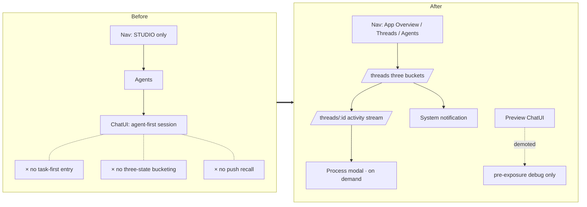
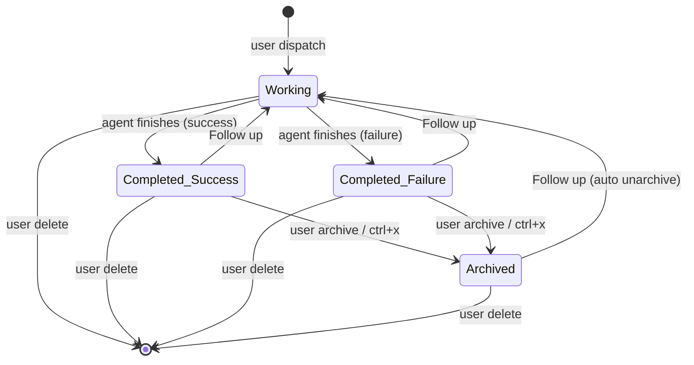

# Default Consumption Surface (Threads) — for humans

> A product-narrative version for non-engineer readers.
>
> This describes Mosoo WebUI's default consumption surface for App-local Agents: the UI page is called **Threads**, and a single instance is a **Thread**. In V1, Threads creates or resumes Agent-owned Sessions inside the active App; Agent API Endpoints and Channels are separate Agent Exposure surfaces.

> **UI status (2026-06-10)**: the sidebar no longer carries a `+ New thread` primary CTA — the prominent button now reads `+ New agent` and points at `/agent?create=1`. Threads is still in the sidebar as a regular nav item alongside Agents / Files / Environments / Integrations / Providers (the previous `Work` / `Studio` section headers were collapsed into a single flat list). The `+ New thread` compose dialog itself is unchanged; the standard entry is now the **`New thread` button on the `/threads` page header / empty state**, and the locked-agent variant is still reachable from an Agent's Settings → Distribution → `Threads` row (`/threads?compose=1&agent=…&lock=1`). The diagrams and prose below that still position `+ New thread` as the sidebar primary CTA are historical IA notes, not the current V1 console IA.
>
> **Current App boundary note**: Threads are App-local consumption resources. New routing and data modeling should make Threads / Sessions inherit App from the selected Agent/App rather than treating `/threads` as a global Organization root. See [App Boundary](./app-boundary.md).

---

## 0. One-line positioning

Threads is Mosoo's built-in **asynchronous consumption plane**: on a single page, the user completes the full loop of "dispatch a task → wait for the result → review the result → follow up." It works **like writing email to an AI** — you write a structured brief, close your laptop, and get pulled back by a notification once the agent finishes.

### Why "email-style" rather than chat-style

In the long run, the conversation surfaces on the market will converge into two camps:

1. **IM / Channel model** — Slack / Lark / GitHub Issues / Linear. Conversations are organized around "topic streams" and "groups of people."
2. **ChatGPT model** — ChatGPT / Codex / Claude Code. Conversations are organized around "a single Q&A" or "a single task run."

People who work inside a company don't need 1,000 also-ran apps stacked on top of each other doing the same thing. Threads doesn't invent yet another chat paradigm; instead it **picks the right container for the "20-minute to 3-hour asynchronous task."** That container is closer to a hybrid of a Linear ticket and Gmail than to an IM window.

That's why the v1 investment is deliberately restrained: don't fight for the synchronous chat market, don't build LLM-decoration features, don't build a team-collaboration board. A single-field compose + a three-state machine + notification recall is enough.

> **TL;DR** — Threads is Mosoo's built-in "write email to an AI" asynchronous task plane. It is a deliberately restrained product form that doesn't take ChatGPT or IM head-on.

---

## 1. User problem

The reader: an **App owner / operator** — someone who has configured one or more Agents inside an App, may expose an Agent through an Agent API Endpoint or Channel, and needs to continuously dispatch tasks and review Thread results from the web client.

Current pain points:

- **Entry-point mismatch** — the existing ChatUI is _agent-first_ (you pick an agent first, then open a session), but the user's mental subject is the _task_ ("how did last week's codec-fix run go?"), not the _agent_ ("where did I leave off chatting with codec-fixer?").
- **Form-factor mismatch** — ChatUI uses a synchronous IM metaphor to carry long-running tasks that take 20 minutes to 3 hours; the narrow composer implies "type a line or two and send," which is the opposite of the "write a structured brief" that an asynchronous task needs.
- **Status blind spot** — completed / working / failed are not visually distinguished in ChatUI; the user can't tell at a glance whether an agent has finished, failed, or is still running.
- **Process black box** — the user doesn't know what the agent is doing and can only guess intuitively at "whether it's stuck."
- **No cross-channel fallback** — when external channels such as Slack / Linear / GitHub aren't connected, the user has no self-contained consumption entry point.

The result is that when the user returns to Mosoo, they don't know where to look for their own work, and Agent reuse inside the active App is held back by UX.

> **TL;DR** — Mosoo lacks a task-first, three-state, notification-recallable private consumption surface. ChatUI is not the answer.

---

## 2. Goals

The user can complete the full loop of **dispatch → wait → consume → follow up** on a single page at `/threads`, without depending on any external channel:

- Start a thread from one prominent entry point (`+ New thread`), write a structured brief, and know which agent it was dispatched to.
- See all of their tasks bucketed into three states (Working / Completed / Archived), with failed tasks folded into Completed but instantly recognizable by a `✗`.
- On any thread, expand the agent's working process (Process) — **collapsed by default, expanded on demand** — to build trust.
- Post a comment on a Completed or Archived thread as a **Follow up** — automatically re-dispatching to the original agent, without introducing an extra button.
- After the user leaves Mosoo, be pulled back via at least one push channel when an agent completes or fails, without relying on daily-open.

> **TL;DR** — One page (`/threads`) + three-state bucketing + single-field thread creation + Follow up + push notifications = the full loop.

---

## 3. Concept definitions

| Term                     | Plain-language explanation                                                                                                                                                                                                                                                                     |
| ------------------------ | ---------------------------------------------------------------------------------------------------------------------------------------------------------------------------------------------------------------------------------------------------------------------------------------------- |
| **Thread**               | The full lifecycle container for one task. 1 task = 1 thread; a new task starts a new thread. A short kebab-case slug is used as the title. Under the hood it is a product projection of AgentSession; it does not introduce a new API id space.                                               |
| **State**                | A thread's three states: `working` / `completed` / `archived`.                                                                                                                                                                                                                                 |
| **Outcome**              | Exists only when state = `completed`: `success` or `failure`. `failure` is shown in the UI with a `✗` but still lives in the Completed bucket.                                                                                                                                                 |
| **User dispatch**        | The first message the user sends when starting a thread — the thread's brief.                                                                                                                                                                                                                  |
| **User comment**         | An additional message the user posts inside the thread detail page. On a working thread it's a follow-up question; on a completed / archived thread it is a Follow up.                                                                                                                         |
| **Agent reply**          | The agent's reply — at the product layer, both process-type events (thinking / tool calls / file changes) and final-type events are uniformly labeled `agent reply`, with details exposed through the Process modal.                                                                           |
| **Process**              | The event sequence behind a single agent reply (thinking / tool use / file changed / run.\*, etc.), expandable on demand to view the timeline.                                                                                                                                                 |
| **Slug**                 | A short name (e.g. `auth-token-migration`), derived server-side by ellipsis-truncating the first paragraph of the brief. **Does not go through an LLM**, and there is no separate title input.                                                                                                 |
| **Follow up**            | Posting a user comment on a completed or archived thread: the thread's state returns to `working`, and that comment is sent to the same agent as a new round of message. The name captures the mental action of "just adding one more thing," not the engineering action of a "ticket reopen." |
| **statusLine**           | A one-line context text on the thread row — a productized summary of the most recent agent activity.                                                                                                                                                                                           |
| **Pin**                  | The user marks this thread to pin it to the top; a personal preference that doesn't affect others.                                                                                                                                                                                             |
| **Locked-agent compose** | A variant of the New thread dialog: the agent is locked via a query param and the picker can't be changed. Used for the "start a thread directly from a given agent's Settings" entry point.                                                                                                   |

> **TL;DR** — A Thread is a task container; the three states + outcome describe its progress; Follow up means saying one more thing on an already-completed thread; Process is an on-demand process-transparency layer.

---

## 4. Information architecture (Before / After)

The core changes:

- **Entry point** — from "pick an agent first" to "look at Threads first." The standard New thread action lives on `/threads`; the primary console CTA can remain App-building oriented.
- **Form factor** — from "IM metaphor" to "Inbox + ticket detail." The three-state buckets make working / completed / archived recognizable at a glance.
- **Recall** — add a push channel (v1 = browser system notifications), so the user no longer needs daily-open.
- **ChatUI doesn't disappear** — it is merely demoted from the "default consumption surface" to a "pre-exposure debug" tool, kept inside Studio Preview.

> **TL;DR** — Threads becomes an App-level consumption view; ChatUI is demoted to Studio Preview; we add three layers — Threads list / Thread detail / Process modal — plus push notifications.

---

## 5. Global state machine

A few rules worth spelling out:

- **The state machine is intentionally simple** — three stable states + one "say one more thing" return path. The user doesn't need to learn shared-board semantics like Open / In Review / Resolved.
- **Follow up is a return path** — posting a comment on a completed / archived thread means "automatically re-dispatch," and an archived thread is unarchived first; no separate reopen / resume button is exposed.
- **Failure is not its own bucket** — `failure` is folded into Completed and marked with a `✗`. A separate Failed bucket would give users the illusion that "this is a different kind of problem," when it's really just an outcome dimension.
- **Delete is a hard delete** — it goes through a `window.confirm` secondary confirmation and is irreversible.

> **TL;DR** — A three-state machine: `working` ↔ `completed` ↔ `archived`, where Follow up is the return path and failures are folded into the Completed bucket.

---

## 6. Chapter map (web UI form factor)

The full PRD breaks the product behavior into 4 chapters in outside-in order. Here is a quick tour for non-engineers:

### 6.1 Chapter 1 · Threads list

The `/threads` page: a top-of-page count `N working · N completed · (N archived)` + filter chips (All / Unread / Pinned / Failed) + three buckets. Hovering a row reveals `Pin · Archive · Delete` on its right side.

Personal-inbox-style affordances: Pin to top, an unread blue dot, filter chips, ctrl+x to archive. The v1 push channel is browser system notifications; clicking a notification deep-links back to `/threads/<id>`.

> **TL;DR** — A Gmail-style Inbox, split into three sections, with on-demand unread / pin / notification recall.

### 6.2 Chapter 2 · New thread compose

A single-field compose dialog: a body textarea + an Assign-to agent picker + attachments + a character count. **There is no separate title field**; the slug is derived server-side by ellipsis-truncating the first paragraph of the body, without going through an LLM.

Two entry points:

- The `New thread` button on the `/threads` page header / empty state — the standard variant, where you freely pick an agent. (Originally framed as a sidebar `+ New thread` primary CTA; the sidebar primary CTA was reassigned to `+ New agent`, but the compose dialog itself is unchanged.)
- An Agent's Settings → Distribution → `Threads` row — the locked-agent variant, where the Agent is already locked.

> **TL;DR** — A single-field brief + pick an agent + ⌘↵ to send. No title field, no AI polishing.

### 6.3 Chapter 3 · Thread detail

The `/threads/:threadId` page: breadcrumb + status pill + Archive button + title + slug + the user's original brief + the activity stream (collapsible CommentCards) + a minimal composer at the bottom.

The composer has two forms determined by the thread state:

- On a working thread = `↑` to post a comment, state unchanged.
- On a completed / archived thread = `↻` Follow up, state returns to working, and an archived thread is unarchived first.

When you enter the detail page, any new activity is automatically marked as read, and the unread blue dot disappears once you return to the list.

> **TL;DR** — Like a GitHub Issue detail page: read the brief, view the activity stream, and "say one more thing" at the bottom.

### 6.4 Chapter 4 · Process modal

Below each agent reply there is a "Show process · N events" button; clicking it opens a centered modal:

- Top stats (duration / event count / tokens)
- A horizontal timeline bar (one segment per event, width proportional to duration)
- An event list, where clicking expands `input:` / `output:` mono blocks

It's used to answer "what exactly did the agent do this round, and how long did it take?" **Collapsed by default, expanded on demand** — it is not the mainstream of consumption.

> **TL;DR** — An on-demand "process-transparency layer," used to build the user's trust in the agent, not the default consumption form.

---
