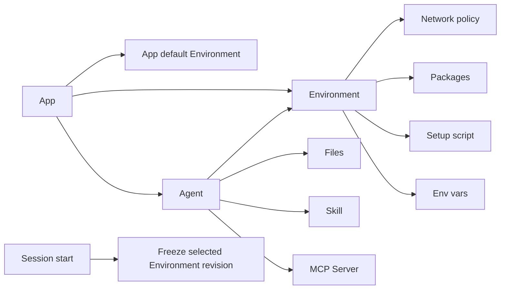

# Environment - for humans

> This is the product-story version for non-engineer readers. The complete engineering contract for revisions, lifecycle, and execution snapshots lives in the shipped Environment PRD.
>
> **Current App boundary note**: Environment is an App-local runtime template. It belongs to one App, Agents in that App can select it, and Session start freezes the selected revision into the execution snapshot. Tenant-wide defaults, tenant policy controls, and cross-App copies are future governance or migration concerns. Preserve EnvironmentRevision freeze semantics. See [App Boundary](./app-boundary.md).

---

## One-line positioning

**An Environment is the operating manual for the runtime an Agent runs inside**: which packages are installed, whether setup code runs before launch, which network policy applies, which hosts are allowed, and which env vars are injected.

An Environment is not an access model. It is an App-owned runtime template that one or more Agents in the same App can select by reference.

Analogy:

> Think of Vercel App Settings for runtime variables, build setup, and network policy, but as an App-owned template that Agents in the same App can reuse.

It sits alongside the other App-owned resources:

| Asset           | In one line                                         |
| --------------- | --------------------------------------------------- |
| **Agent**       | App-local execution and delivery unit               |
| **Files**       | Uploaded files an Agent can read, scoped per upload/session |
| **Skill**       | App-local capability package                        |
| **MCP Server**  | App-local tool connector definition                 |
| **Environment** | App-local runtime template an Agent executes inside |

---

## 1. Problem

Alex is an App owner building a data-analysis Agent that needs `pandas`, `numpy`, and `scikit-learn`.

Without Environment, he has only bad choices:

- Ask the Agent to install packages during each Session
- Spend extra cold-start time in every run
- Lose package/version clarity when a downstream run breaks
- Hide runtime dependencies in prompt text instead of App configuration

With Environment, Alex creates one App-local runtime template, selects it on the Agent, and lets every new Session freeze the selected Environment revision at start.

Riley is configuring a second Agent in the same App. She should not need to understand package managers or network policies. The Agent form should already resolve the App default Environment, while still letting her pick another Environment from the same App when needed.

---

## 2. Goals

When this is done, an App owner should be able to:

- Create a named Environment inside the active App with network policy, allowed hosts, packages, setup script, and env vars
- Mark one Environment as the App default so new Agents in that App preselect it
- Pick an Environment from the Agent config page
- Create a new Environment from the Agent form without leaving the configuration flow
- Copy an App-local Environment when they need an independent runtime template
- See that each Session freezes the selected Environment revision at Session start
- Delete or change an Environment only with explicit affected-Agent feedback; missing or cross-App references must surface as errors instead of silently resolving through tenant state

---

## 3. Concept definitions

| Term                           | Plain-language definition                                                                                                                                                |
| ------------------------------ | ------------------------------------------------------------------------------------------------------------------------------------------------------------------------ |
| **Environment**                | App-owned runtime template containing network policy, packages, setup script, env vars, and metadata. It does not contain Files, Skills, or MCP servers.                 |
| **App default Environment**    | The Environment preselected for new Agents in one App. It is scoped to that App and does not apply tenant-wide.                                                          |
| **Network - Full**             | The sandbox can reach external domains without an explicit allowlist.                                                                                                    |
| **Network - Limited**          | The sandbox can reach only Allowed Hosts plus any explicitly permitted platform dependencies.                                                                            |
| **Allowed Hosts**              | Outbound allowlist under the Limited policy, written as bare domains such as `api.githubcopilot.com` or `mcp.linear.app`.                                                |
| **Packages**                   | Dependencies installed before Agent execution, such as pip / npm / apt packages. Versions can be pinned.                                                                 |
| **Setup Script**               | Shell snippet that runs before the Agent process starts. If it fails, the Session fails to start.                                                                        |
| **Env Vars**                   | Plain key/value inputs submitted through masked UI and encrypted at rest by the backend. Reusing a token across resources requires entering it separately in each place. |
| **Environment Revision**       | Immutable saved version of an Environment configuration.                                                                                                                 |
| **Session execution snapshot** | Runtime copy of the selected Environment revision. Editing the Environment later does not affect an already-started Session.                                             |
| **Copy**                       | Independent duplicate inside the same App. The copy does not sync with the source.                                                                                       |

---

## 4. Relationship rule: Environment does not nest other assets

Environment is orthogonal to the other App-owned resources. An Agent references Environment, Skill, and MCP bindings separately, and reads Files. The Environment itself does not contain those resources.

Why no nesting: Files are uploaded data inputs, MCP and Skill are Agent capability inputs, and Environment is runtime shape. Keeping those concepts separate prevents a runtime template from becoming a "manages everything" container.

---

## 5. V1 ownership and revision semantics

Environment has one current ownership model:

| Capability                             | V1 behavior                                                                                          |
| -------------------------------------- | ---------------------------------------------------------------------------------------------------- |
| Create Environment                     | App owner only, inside the active App                                                                |
| Read / edit / delete Environment       | App owner only                                                                                       |
| Select Environment on an Agent         | App owner only, and only for Agents in the same App                                                  |
| Set App default Environment            | App owner only, scoped to one App                                                                    |
| Copy Environment                       | App owner only, producing a new independent Environment in the same App                              |
| Start Session                          | Runtime freezes the selected Environment revision into the Session execution snapshot                |
| Cross-App or legacy Environment id use | Fail closed; do not infer access from tenant state, package metadata, snapshots, or a tenant default |

Hard rules:

- Environment belongs to one App.
- Agent configuration is the only V1 consumption path for Environment.
- App default Environment is scoped to one App.
- Environment edits affect only future Sessions.
- Missing or mismatched App proof must become an explicit UI/runtime error, not a compatibility path.

---

## 6. Journeys

### App owner creates a runtime template and sets it as App default

| Stage          | Experience                                                                                  | Result                                                                          |
| -------------- | ------------------------------------------------------------------------------------------- | ------------------------------------------------------------------------------- |
| Discover       | Alex opens the active App's Environments surface                                            | The list shows App-local runtime templates only                                 |
| Create         | He creates `data-analysis`, pins packages, sets network mode, adds Allowed Hosts, and saves | A new Environment revision is available in the same App                         |
| Set as default | He marks `data-analysis` as the App default                                                 | New Agents in this App preselect it; existing Agents keep their current setting |
| Run            | A Session starts from an Agent that selected `data-analysis`                                | Runtime freezes the selected revision into that Session's execution snapshot    |

### App owner configures a second Agent

| Stage            | Experience                                           | Result                                                     |
| ---------------- | ---------------------------------------------------- | ---------------------------------------------------------- |
| Open Agent form  | Riley opens an Agent in the same App                 | The picker resolves the App default Environment            |
| Needs variation  | She needs one extra package                          | She creates or copies an Environment inside the same App   |
| Continue editing | She selects the copied Environment in the Agent form | The Agent now has an explicit App-local runtime dependency |

### Runtime rejects stale or cross-App references

| Stage       | Experience                                                              | Result                                                               |
| ----------- | ----------------------------------------------------------------------- | -------------------------------------------------------------------- |
| Import      | A package references an Environment id that does not belong to this App | The import path asks for reconnection instead of trusting the id     |
| Run         | A Session starts with an Agent / Environment App mismatch           | Runtime fails closed with an explicit Environment resolution error   |
| Maintenance | An Environment is deleted while Agents still reference it               | The affected Agent config or runtime path shows a missing dependency |

---

## Future governance, not V1

The following topics can be revisited only after the V1 App boundary is stable:

- Tenant-wide Environment defaults
- Tenant policy controls for runtime network settings
- Multi-account access to an Environment
- Human role matrices for Environments
- Cross-App copy and transfer flows
- Audit and review surfaces

Do not keep dormant routes, schema fields, or tests for these topics in the current V1 surface.

---

> Full engineering contract details for change-impact behavior, revision lifecycle, and execution snapshot protocol are covered in the shipped Environment PRD.
