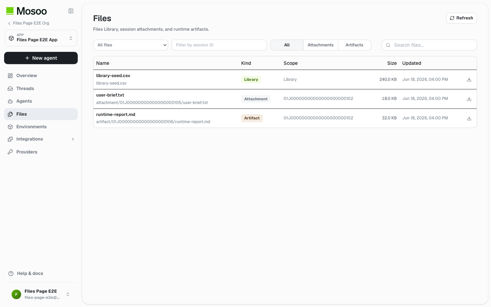

# Files Refactor - For-Human PRD

> **Status (2026-06-21): ARCHIVED FUTURE PROPOSAL.** This document is retained as a future Disk/Thread-files product proposal. It is not the current mainline Files contract.
>
> **Current mainline note:** `upstream/main` now follows the scoped Files model introduced by `feat(files)!: replace spaces with scoped files` (#64): Files Library plus session-scoped attachments/artifacts. Space was removed, Files are not Agent Manifest bindings, and runtime outputs are stored as session artifacts. Use [Files API - Library And Session Artifacts Contract](./files-api-contract.md) for the active contract.
>
> **Purpose**: This document consolidates Mosoo file ownership after the Storage/Disk refactor. It replaces the three-way product confusion between Thread files, Space files, and draft files with two user-facing file classes: Thread files and Disks.
>
> **Current App boundary note**: App remains the V1 resource boundary. Thread files belong to one backing Session. Disks are App-owned reusable storage containers mounted by Agents. Draft uploads remain an internal staging state and must not become a user-facing file category.
>
> **Related docs**: [Thread Files](./session-files.md), [Space](./space-interaction.md), [Public Thread API Surface](./public-thread-api-surface.md), [Runtime State Operations](./runtime-state-operations.md), and [Architecture](../architecture.md).

---

## Current Mainline Files UI Snapshot



This screenshot captures the current `/files` page after the scoped Files refactor. It is included here to preserve the active baseline while this Disk proposal stays archived for future evaluation.

---

## 1. TL;DR

Mosoo should expose only two product file classes:

| Product file class | Ownership                    | Product promise                                                                                             |
| ------------------ | ---------------------------- | ----------------------------------------------------------------------------------------------------------- |
| **Thread files**   | One Thread / backing Session | Files uploaded to a Thread and files produced by the Agent inside that Thread stay with that Thread.        |
| **Disks**          | One App                      | Reusable App storage that Agents can mount and use across Threads, public API runs, and channel deliveries. |

Everything else is implementation detail:

- Draft uploads are temporary staging handles before a file is claimed into a Thread.
- Sandbox temp files are runtime internals.
- Skill packages and Agent packages have their own package lifecycles.

The key policy is:

```text
All user-visible Thread uploads and Thread outputs are persisted.
Persisted does not mean App-wide.
Thread files persist inside the Thread.
Disk files persist inside the App Disk.
```

Therefore Agent artifacts must not be stored in Disk by default. A Thread file or artifact enters a Disk only through an explicit copy action.

Pet and Cattle runtime modes do not add a third product file class. They only affect the lifetime of runtime-local sandbox state that has not been captured as a Thread file or written to a Disk.

---

## 2. User Problem

Mosoo currently has several overlapping file notions:

- files uploaded to a Thread;
- files produced by the Agent during runtime;
- Space files that are mounted into the runtime;
- app draft files used before a Thread exists;
- runtime sandbox files that may or may not be product assets.

This creates three product failures:

- Users cannot tell whether a file belongs only to the current Thread or to the whole App.
- Runtime artifacts can look like Thread files while being persisted as Space files.
- Draft uploads risk becoming a visible file category even though users do not need to manage them directly.

The expected model is simpler:

> "Files in a Thread stay in that Thread. Files in a Disk are reusable App storage."

---

## 3. Goals

- Make Thread files and Disks the only user-facing file classes.
- Persist Thread uploads and Thread artifacts under the backing Session, not under Disk.
- Keep Disk as App-owned reusable storage that Agents can mount.
- Rename product copy from Space to Disk / Storage without forcing an immediate storage-schema migration.
- Hide draft uploads from the Storage information architecture.
- Keep explicit transfer between scopes: Thread file to Disk is a copy, not a silent move or implicit promotion.
- Preserve App boundary checks for Disk access and Session/App proof for Thread files.
- Keep runtime temp/internal files out of product Files unless they are explicitly promoted to Thread artifacts or written under a Disk mount.

---

## 4. Non-Goals

- Do not delete the existing Space capability. It becomes the internal backing model for Disk during the migration.
- Do not make Thread files reusable across Threads by default.
- Do not automatically put Agent artifacts into Disk.
- Do not expose Drafts as a Storage tab, folder, or primary resource.
- Do not build shared-drive governance, cross-App file sharing, resource transfer, or multi-user role matrices in V1.
- Do not make the sandbox working directory a product file tree.
- Do not expose Pet or Cattle runtime mode as a Storage category or file ownership dimension.

---

## 5. Concept Definitions

| Term                  | Product definition                                                                                | Implementation direction                                                                    |
| --------------------- | ------------------------------------------------------------------------------------------------- | ------------------------------------------------------------------------------------------- |
| **Thread file**       | Any user-visible file belonging to one Thread. Includes caller uploads and Agent outputs.         | `file_record(scope_kind=session)`                                                           |
| **Thread attachment** | A file uploaded by a user, Web client, or Public API caller for one Thread.                       | `purpose=session_attachment`, `session_kind=attachment`                                     |
| **Thread artifact**   | A file produced by the Agent inside one Thread.                                                   | Add `purpose=session_artifact`, use `session_kind=artifact`                                 |
| **Disk**              | App-owned reusable storage container that Agents can mount. This replaces the product term Space. | Phase 1 keeps `spacesTable`, `SpaceId`, `scope_kind=space`, `purpose=space_file` internally |
| **Draft upload**      | Temporary pre-claim upload handle before a Thread ownership target exists.                        | `scope_kind=app_draft`, hidden from Storage UI, TTL cleanup                                 |
| **Sandbox temp file** | Runtime-local file, cache, or tool output that is not a product asset.                            | Sandbox filesystem or backup bucket only; no product `file_record`                          |
| **Copy to Disk**      | Explicit action that copies a Thread file into a Disk for App-wide reuse.                         | Creates a new Disk file record; source Thread file remains                                  |

---

## 6. Information Architecture

The Storage page should have two first-level entries.

```text
Storage

[ Thread files ]
Files uploaded to threads and files produced by agents.

[ Disks ]
Reusable app storage mounted by agents.
```

### 6.1 Thread Files Capsule

The Thread files capsule summarizes files across Threads inside the current App.

Suggested metrics:

- total file count;
- storage used;
- number of Threads with files;
- latest updated time.

Primary action:

- Open Thread files.

Inside Thread files, users can browse by Thread or by file list. Each file must make its source clear:

- uploaded file;
- Agent artifact;
- originating Thread;
- created time;
- size;
- action: Copy to Disk.

Thread files are not App-wide reusable material until copied to Disk.

### 6.2 Disks Capsule

The Disks capsule summarizes App-level reusable storage.

Suggested metrics:

- disk count;
- storage used;
- mounted Agents count or recently mounted count;
- latest updated time.

Primary actions:

- New disk;
- Open Disks.

Inside Disks, users manage App storage containers and their files. Disk files are the only files that Agents can mount as reusable App material through Agent configuration.

### 6.3 Drafts Are Hidden

Drafts must not appear as:

- a capsule;
- a tab;
- a folder;
- a root entry;
- a normal file category.

Draft state is visible only in local flow context:

- upload progress;
- retry after claim failure;
- error recovery for the operation that created it.

Unclaimed draft uploads expire and are cleaned up by the system.

---

## 7. Ownership And Storage Matrix

| File kind                  | User-facing?   | Stored object location                | Record shape                                                                             | Lifecycle                                                                                                                                 | Cross-Thread reuse              |
| -------------------------- | -------------- | ------------------------------------- | ---------------------------------------------------------------------------------------- | ----------------------------------------------------------------------------------------------------------------------------------------- | ------------------------------- |
| Thread attachment          | Yes            | `FILE_BUCKET` session prefix          | `scope=session`, `owner=session`, `purpose=session_attachment`, `sessionKind=attachment` | Thread / Session lifecycle                                                                                                                | No                              |
| Thread artifact            | Yes            | `FILE_BUCKET` session artifact prefix | `scope=session`, `owner=session`, `purpose=session_artifact`, `sessionKind=artifact`     | Thread / Session lifecycle                                                                                                                | No, unless copied to Disk       |
| Disk file                  | Yes            | `FILE_BUCKET` disk/space prefix       | Phase 1: `scope=space`, `owner=space`, `purpose=space_file`, `sessionKind=null`          | Disk lifecycle                                                                                                                            | Yes, through Agent Disk binding |
| Draft upload               | No             | staging/app draft prefix              | `scope=app_draft`, `owner=app`, `purpose=app_draft`                                      | Short TTL until claim or cleanup                                                                                                          | No                              |
| Agent package              | Not Storage UI | package prefix                        | `scope=agent_package`, `purpose=agent_package` or `agent_asset`                          | Import/export lifecycle                                                                                                                   | No                              |
| Skill package blob         | Not Storage UI | skill blob key                        | skill snapshot tables, no `file_record`                                                  | Skill snapshot lifecycle                                                                                                                  | No                              |
| Sandbox temp/internal file | No             | sandbox filesystem or backup bucket   | no product `file_record`                                                                 | Runtime-local lifecycle. Pet may preserve/backup/restore local state; Cattle normally loses it when the session/run sandbox is destroyed. | No                              |

---

## 8. Runtime File Semantics

Runtime file handling must distinguish three cases.

| Runtime path                                            | Target behavior                                                     |
| ------------------------------------------------------- | ------------------------------------------------------------------- |
| Agent writes under an authorized Disk mount path        | Sync to Disk file. This is App storage, not a Thread artifact.      |
| Agent produces an output intended for the Thread        | Persist as Thread artifact under the current Session.               |
| Agent writes ordinary sandbox temp/cache/internal files | Keep as runtime internal state; do not create product file records. |

The current implementation has a semantic mismatch: runtime Space sync can persist a file as `scope=space` / `purpose=space_file` while emitting a `sessionFilesUpdated` event with an artifact-shaped payload. The refactor must split these concepts.

Target event behavior:

- Thread artifact creation emits a Thread/session file update.
- Disk file changes emit Disk/Storage-specific update signals if needed.
- A Disk file change must not be represented as a Thread artifact.

### 8.1 Pet And Cattle Runtime Lifecycle

Pet and Cattle are sandbox lifecycle modes, not product file ownership modes.

| Runtime mode | Product file behavior                                                                     | Runtime-local behavior                                                                                                                                                                                         |
| ------------ | ----------------------------------------------------------------------------------------- | -------------------------------------------------------------------------------------------------------------------------------------------------------------------------------------------------------------- |
| Pet          | Thread files and Disk files use the same ownership, persistence, and API rules as Cattle. | Local sandbox state may be preserved, backed up, or restored according to Pet sandbox policy. This can include cache, tool output, native app state, or agent-local memory that has not become a product file. |
| Cattle       | Thread files and Disk files use the same ownership, persistence, and API rules as Pet.    | Local sandbox state is expected to disappear when the session/run sandbox is destroyed, unless it was explicitly persisted as a Thread artifact or written under an authorized Disk mount.                     |

The implementation rule is:

```text
Pet/Cattle decides what happens to uncaptured sandbox-local state.
Thread/Disk ownership decides what becomes a product file.
```

Therefore:

- A file uploaded to a Thread is a Thread attachment in both Pet and Cattle.
- A file produced for the Thread is a Thread artifact in both Pet and Cattle.
- A file written under an authorized Disk mount is a Disk file in both Pet and Cattle.
- A file written only into ordinary sandbox paths is not a product file in either mode.

---

## 9. Copy To Disk

Because Thread files are already persisted, the cross-scope action must not be called Save.

Use one of:

- Copy to Disk;
- Add to Disk;
- Make available in Disk.

The first implementation should support copy only:

```text
Thread file or artifact
  -> copy bytes server-side
  -> create new Disk file
  -> preserve source Thread file
```

Do not implement move as the default behavior. Moving a file out of a Thread can break Thread history and confuse ownership. Linking can be evaluated later, but it adds delete, permission, and versioning complexity.

---

## 10. API And Contract Requirements

### 10.1 Thread Artifacts

Add a first-class file purpose:

```ts
"session_artifact";
```

Thread artifact records should use:

```text
scopeKind = "session"
ownerKind = "session"
purpose = "session_artifact"
sessionKind = "artifact"
```

Thread artifact records must be loaded when rebuilding Session live state, included in Thread file views, and deleted by Session/Thread cleanup.

### 10.2 Disk Compatibility Layer

Product copy should say Disk / Storage. Internal implementation may keep the current names in the first phase:

- `spacesTable`;
- `SpaceId`;
- `space_file`;
- `scopeKind="space"`;
- `spaceAliases`;
- `spaces[]` in Agent manifest.

Add facade naming at product/API boundaries only when it does not force a breaking migration:

- Web route: `/storage`;
- UI label: Storage / Disks;
- action copy: New disk;
- optional GraphQL aliases: `diskList`, `diskFiles`, `createDisk`.

The internal rename to `DiskId`, `disksTable`, `disk_file`, and `diskAliases` can be a later mechanical migration.

### 10.3 Draft Uploads

Draft uploads remain supported as staging handles.

Required behavior:

- They are not listed in Storage.
- They have a TTL.
- Unclaimed drafts are cleaned up automatically.
- Claiming a draft into a Thread changes ownership to Session.
- Public API docs describe draft file handles as temporary, not browsable assets.

### 10.4 File Transfer Layer

Introduce a reusable server-side file transfer service for cross-scope copy.

First supported transfer:

```text
Thread file/artifact -> Disk file
```

Required checks:

- source file belongs to the admitted Thread/Session;
- target Disk belongs to the same App;
- caller has write access to the target Disk;
- destination path and overwrite policy are explicit;
- source file remains intact;
- lineage metadata should be recorded when available.

---

## 11. Product Surface Rules

| Surface           | Rule                                                                                    |
| ----------------- | --------------------------------------------------------------------------------------- |
| Storage home      | Show two capsules: Thread files and Disks.                                              |
| Thread detail     | Show files for this Thread only. Include attachments and artifacts.                     |
| Disk detail       | Show files inside one App Disk. Do not show Thread artifacts unless copied.             |
| Agent editor      | Bind Disks to Agent configuration. Do not bind Thread files.                            |
| Public Thread API | List and mutate Thread files only for the admitted Thread.                              |
| File search       | Search may span Thread files and Disk files, but results must show ownership and scope. |
| Draft recovery    | Keep contextual to failed upload/claim flows; do not add a global Drafts browser.       |

---

## 12. Migration Plan

### Phase 1: Product Semantics

- Rename visible Space copy to Disk / Storage.
- Build Storage home with Thread files and Disks capsules.
- Keep internal `space` identifiers and database tables.
- Remove or avoid Drafts as a visible Storage category.
- Rename misleading actions such as Save to Disk to Copy to Disk.

### Phase 2: Thread Artifact Storage

- Add `session_artifact` to contracts and generated API schema.
- Implement Session artifact write service.
- Persist runtime Thread artifacts as Session-scoped file records.
- Ensure Thread artifact records survive reload and are removed by Thread cleanup.

### Phase 3: Runtime Disk Boundary

- Rename runtime Space sync payloads so Disk writes are not called artifacts.
- Ensure only authorized Disk mount paths create Disk file records.
- Emit separate Disk/Storage file update events when needed.
- Keep ordinary sandbox files out of product Files.

### Phase 4: Copy To Disk

- Implement server-side Thread file/artifact to Disk copy.
- Expose Copy to Disk action in Thread file views.
- Add overwrite, path, and lineage handling.
- Keep source Thread file unchanged.

### Phase 5: Optional Internal Rename

Only after product behavior is stable, evaluate internal mechanical renames:

- `SpaceId` -> `DiskId`;
- `spacesTable` -> `disksTable`;
- `space_file` -> `disk_file`;
- `spaceAliases` -> `diskAliases`;
- Agent manifest `spaces[]` -> `disks[]`.

This phase is not required for the product refactor.

---

## 13. Acceptance Criteria

- Storage home exposes exactly two primary file areas: Thread files and Disks.
- Draft uploads are not visible as a normal Storage category.
- A file uploaded to one Thread cannot be used by another Thread unless copied to Disk or re-uploaded.
- Agent-produced Thread artifacts persist under the Thread and survive reload.
- Thread deletion cleans up Thread attachments and artifacts.
- Disk files remain App-owned reusable files and can be mounted by Agents.
- Runtime writes under Disk mounts update Disk files, not Thread artifacts.
- Runtime writes outside Disk mounts do not become Disk files by accident.
- Pet and Cattle do not change Thread file or Disk ownership semantics; they only change runtime-local sandbox state lifetime.
- Copy to Disk creates a new Disk file and preserves the source Thread file.
- Public API responses do not expose runtime mount paths, object keys, or draft internals.

---

## 14. Copy Rules

- Say **Thread files** for files scoped to one Thread.
- Say **attachments** only for user/caller-provided Thread input files.
- Say **artifacts** only for Agent-produced Thread files.
- Say **Disks** for App-owned reusable storage.
- Say **Copy to Disk**, not Save to Disk, when the source file is already persisted in a Thread.
- Do not say Draft files in product navigation.
- Do not call a Disk file an artifact just because it was written by runtime.
