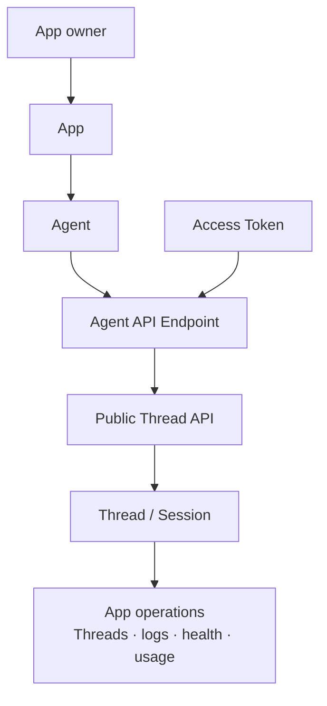

# Public Thread API Surface - for humans

> This is the product-story version for non-engineering readers. The engineering
> contract is the checked-in Public Thread API, OpenAPI document, token admission
> path, event projection, receive-window behavior, and Thread file surface.
>
> Current boundary: an Agent owns endpoint exposure and runtime; the active App
> owns the product/API/resource/usage context around that Agent. Organization is
> not a public API access boundary in V1.

---

## One-line positioning

An exposed Agent gets an Agent API Endpoint: a public HTTPS surface that lets the
App owner create, read, continue, archive, stream, and attach files to Threads for
that Agent.

The public product promise is simple: call one active Agent API Endpoint with an
Access Token, get Thread semantics back, and let usage/operations roll up to the
App that owns the Agent.

---

## 1. User problems

### App owner / builder

The owner can configure an Agent inside an App and expose it as an API endpoint.
They need the API Access surface to answer:

> "Is this Agent actually exposed as an active API endpoint?"
>
> "What request creates a Thread for this Agent?"
>
> "How do I continue, interrupt, archive, inspect, or stream that Thread?"
>
> "Will this request run inside the same App boundary as the Agent and its
> resources?"

### API consumer

The consumer should not learn Mosoo runtime internals. They need one stable
conversation contract:

> "Create a Thread for an Agent API Endpoint."
>
> "Retrieve the Thread later by Thread ID."
>
> "Post events to continue it, answer permission requests, or interrupt a Run."
>
> "Attach files to this Thread without learning the internal file/resource model."

### First-party channel adapters

Slack, Lark, Telegram, Discord, WeChat, and similar adapters are delivery paths
for Agents, but they are not the host of this public API surface. They own channel
installation, signing, thread binding, and reply write-back. They can reuse Agent
Session semantics, but they do not become Agent API Endpoint callers.

---

## 2. Current V1 access model

V1 has one admitted public API caller shape:

1. The caller authenticates with an Access Token.
2. The Agent must be exposed as an active API endpoint.
3. The caller must own the App that owns the Agent.
4. The Agent owner must match the App owner.
5. The resulting Thread is a Session for that Agent and inherits App from
   the Agent.

Anything else fails closed. Tenant-level people records and legacy collaboration
records do not grant API access in V1.

---

## 3. Concept definitions

| Term                         | Plain-language explanation                                                                                                                 |
| ---------------------------- | ------------------------------------------------------------------------------------------------------------------------------------------ |
| **Agent API Endpoint**       | The public HTTPS endpoint exposed by one Agent. Agent owns runtime, endpoint exposure, and delivery.                                       |
| **App boundary**             | The product/API/resource/usage context that owns the Agent and receives Thread history, logs, health, and usage rollups.                   |
| **Public Thread API**        | The external API contract for creating, reading, continuing, archiving, deleting, streaming, and attaching files to Threads.               |
| **Thread**                   | The product name for an Agent Session in V1. A Thread can be created empty or with an initial user message that queues the first Run.      |
| **Run**                      | One execution attempt inside a Thread. Public responses expose a compact Run summary, not raw runtime internals.                           |
| **Access Token**             | The caller credential. In V1, it must belong to the App owner for the target Agent API Endpoint.                                           |
| **Caller**                   | The token-authenticated account that issues the API request and receives Thread attribution.                                               |
| **Execution owner**          | The Agent owner whose App-local resources, credentials, Environment, Skills, Storage, MCP, and Channel bindings the runtime uses.          |
| **Thread file**              | Material attached to one Thread. The public list is the API truth for that Thread's file surface.                                          |
| **Event projection**         | The stable public view of runtime events. It hides raw runtime payloads, vendor-native pointers, transcripts, and diagnostics.             |
| **Receive window / stream**  | The read model for event history and server-sent event streaming from a Thread.                                                            |
| **Pet / Cattle Agent kinds** | Runtime continuity modes. They may affect sandbox lifecycle, but they do not create separate public API contracts or alternate URL shapes. |

---

## 4. Information architecture

### App-owned Agent API Endpoint



Key points:

- API Access is a real developer entry point for one Agent API Endpoint.
- Thread is the public axis; Session remains the backing runtime record.
- App ownership is checked before creating or reading Threads.
- Tenant-level people state and legacy collaboration records are not V1 API
  authorization inputs.

---

## 5. Public Thread API shape

The current route family is:

| Capability                  | Route shape                                     | Product meaning                              |
| --------------------------- | ----------------------------------------------- | -------------------------------------------- |
| Create Thread               | `POST /api/v1/agents/{agentId}/threads`         | Create a Thread for one Agent API Endpoint.  |
| List endpoint Threads       | `GET /api/v1/agents/{agentId}/threads`          | List Threads for that endpoint and caller.   |
| Retrieve Thread             | `GET /api/v1/threads/{threadId}`                | Read one Thread by public Thread ID.         |
| List Thread events          | `GET /api/v1/threads/{threadId}/events`         | Read public event projections.               |
| Stream Thread events        | `GET /api/v1/threads/{threadId}/events/stream`  | Stream public event projections.             |
| Post Thread events          | `POST /api/v1/threads/{threadId}/events`        | Continue, interrupt, or answer permissions.  |
| Archive / unarchive Thread  | `POST /api/v1/threads/{threadId}/archive`       | Hide or restore a Thread for the caller.     |
| Delete Thread               | `DELETE /api/v1/threads/{threadId}`             | Delete the Thread through the public API.    |
| List Thread files           | `GET /api/v1/threads/{threadId}/files`          | List files attached to the Thread.           |
| Create Thread file upload   | `POST /api/v1/threads/{threadId}/files/uploads` | Open a Thread-scoped upload for raw bytes.   |
| Upload Thread file bytes    | `PUT /api/v1/files/{fileId}/content`            | Send the file bytes for a pending upload.    |
| Complete Thread file upload | `POST /api/v1/files/{fileId}/complete`          | Finalize a pending upload into a ready file. |
| Attach Thread file          | `POST /api/v1/threads/{threadId}/files`         | Claim a ready file handle into the Thread.   |
| Delete Thread file          | `DELETE /api/v1/threads/{threadId}/files/{id}`  | Remove a file from the Thread.               |
| Machine-readable API schema | `GET /api/v1/openapi.json`                      | Describe the Public Thread API for tooling.  |

Attaching a file is a two-stage flow: upload the bytes through the files data
plane first (create upload → `PUT` content → complete), then claim the resulting
`fileId` into the Thread. MVP public uploads are single `PUT` and size-capped.

The public schema should keep runtime implementation details out of responses:
driver ids, deployment internals, trace ids, vendor resume pointers, raw event
payloads, and sandbox paths are not part of the public contract.

---

## 6. Contract notes

- Public identifiers are bare ULIDs in V1.
- A public `threadId` maps directly to the backing Session ID.
- Create Thread callers must use `response.thread.id` as the Thread ID for every
  later retrieve, events, stream, file, archive, and delete request.
- Creating a Thread may omit `input`; that creates an idle Thread with no Run.
- Thread creation accepts only the public input fields: initial input, file
  handles, and caller external reference.
- Thread events accept only user messages, permission decisions, and user
  interrupts.
- Public event reads expose the stable `ThreadEventLogEntry` projection only; raw
  runtime payloads and debug internals stay private.
- `GET /threads/{threadId}/events` returns events in chronological order within
  the returned window. If older public entries are omitted because the requested
  limit was reached, `truncated` is `true`.
- `GET /threads/{threadId}/events/stream` emits `thread.event` SSE messages whose
  `data` payload is the same `ThreadEventLogEntry` shape returned by list-events.
  Event IDs are stable; polling or reconnecting must not treat the same event ID
  as new output.
- Public Run terminal statuses are `completed`, `failed`, `cancelled`, and
  `expired`. Active statuses are `queued`, `booting`, `running`, and
  `waiting_input`.
- Public Run summaries include `error` and `finalOutput`. Failed runs expose
  structured `error.code`, `error.message`, `error.details`, and
  `error.retryable`.
- `run.finalOutput.text` is the stable Agent final answer for a completed run.
  Mosoo reconstructs it from that run's public `agent.message.delta` events in
  chronological order. If a caller needs to reconstruct it from events, filter to
  the current `runId`, keep only `type === "agent.message.delta"` events with
  `status === "available"`, and concatenate `content` in event order.
- Machine-readable error codes can preserve stable historical values, but product
  copy must describe an Agent that is not exposed as an active API endpoint.
- Non-2xx responses use the stable error envelope
  `{ "error": { "code": "...", "message": "..." } }`. Client code should branch
  on `error.code`; current public codes include `unauthenticated`, `forbidden`,
  `not_found`, `rate_limited`, and `idempotency_conflict`.
- Old task-shaped public routes are not part of this surface.

### Raw API example

```ts
const createResponse = await fetch(`${baseUrl}/api/v1/agents/${agentId}/threads`, {
  body: JSON.stringify({
    input: {
      content: [{ text: "Say hello from the API.", type: "text" }],
      type: "user.message",
    },
  }),
  headers: {
    Authorization: `Bearer ${process.env.MOSOO_API_TOKEN}`,
    "Content-Type": "application/json",
    "Idempotency-Key": idempotencyKey,
  },
  method: "POST",
});
const created = await createResponse.json();
const threadId = created.thread.id;
```

### Typed client workflow

The CLI is for local smoke tests and debugging. Real application integrations
should use the typed backend client or an equivalent server-side helper so app
code does not duplicate polling and final-output parsing.

```ts
import { MosooPublicThreadClient } from "@mosoo/public-api-client";

const client = new MosooPublicThreadClient({
  baseUrl,
  token: process.env.MOSOO_API_TOKEN,
});
const result = await client.createThreadAndWait({
  agentId,
  idempotencyKey,
  input: "Say hello from the API.",
  timeoutMs: 60_000,
});

console.log(result.finalOutput?.text);
```

`MOSOO_API_TOKEN` is a backend secret. Do not expose it in browser bundles,
frontend environment variables, static pages, or mobile clients that cannot keep
secrets. Route frontend requests through your own backend or Worker and call the
Public Thread API from there.

---

## 7. Admission and attribution

### Create Thread

Creating a Thread first admits the caller against the target Agent API Endpoint.
If admitted, the new Session is created with:

- `appId` from the Agent's App;
- `agentId` from the route;
- public API metadata identifying the Access Token caller;
- attribution to the caller account;
- execution owner from the Agent owner.

### Read and mutate Thread

Reading or mutating an existing Thread must prove both:

- the caller created or is attributed to the Thread; and
- the target Agent still belongs to the same App as the backing Session.

If either check fails, the public API returns not-found or forbidden. It must not
fall back to tenant-level people records or historical access data.

### Files

Thread files follow the backing Session's App. File operations use the
admitted Thread's session app when listing, claiming, and deleting files.

---

## 8. Channel relationship

Channels are App-owned delivery resources that bind to Agents when configured.
They can create or continue Agent Sessions through their own adapter path, but
they are not callers of the public HTTPS Agent API Endpoint.

This keeps channel signing, installation state, external thread mapping, and
reply write-back outside the public Thread API while preserving the same App usage
and Thread history rollup.

---

## 9. Pet / Cattle are not separate APIs

Pet and Cattle are Agent runtime continuity modes:

- Pet: multiple Sessions can share a stable Agent sandbox.
- Cattle: each Session uses an independent sandbox and restores only persisted
  conversation history, metadata, and explicit App resources.

The public API URL shape, token admission, Thread event model, and file model are
identical for both kinds.

---

## 10. Future governance

Future governance may add App API tokens, service accounts, delegated callers,
domain controls, or external customer access. Those additions must extend the
App-owned Agent API Endpoint model. They must not make tenant people
state or legacy collaboration records part of V1 API authorization.
