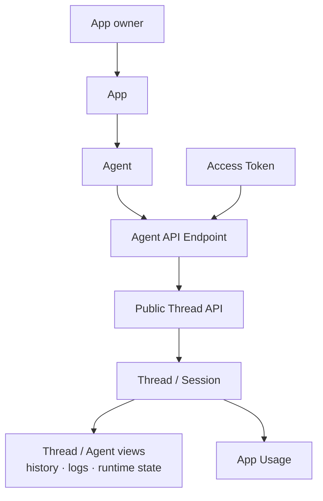

# Public Thread API Surface - for humans

Status: canonical product contract. `GET /api/v1/openapi.json` is the exact HTTP
schema; this document explains its product semantics without defining a second
wire contract.

> This is the product-story version for non-engineering readers. The engineering
> contract is the checked-in Public Thread API, OpenAPI document, token admission
> path, event projection, receive-window behavior, and Thread file surface.
>
> Current boundary: an Agent owns endpoint exposure and runtime; the active App
> owns the product/API/resource/usage context around that Agent. Organization is
> not a public API access boundary in V1.

---

## One-line positioning

An exposed Agent gets an Agent API Endpoint: a public HTTPS surface that lets the
App owner create, read, continue, archive, stream, and upload or reference files
for Threads on that Agent.

The public product promise is simple: call one active Agent API Endpoint with an
Access Token, get Thread semantics back, and let usage/operations roll up to the
App that owns the Agent.

---

## 1. User problems

### App owner / builder

The owner can configure an Agent inside an App and expose it as an API endpoint.
They need the API Access surface to answer:

> "Is this Agent actually exposed as an active API endpoint?"
>
> "What request creates a Thread for this Agent?"
>
> "How do I continue, interrupt, archive, inspect, or stream that Thread?"
>
> "Will this request run inside the same App boundary as the Agent and its
> resources?"

### API consumer

The consumer should not learn Mosoo runtime internals. They need one stable
conversation contract:

> "Create a Thread for an Agent API Endpoint."
>
> "Retrieve the Thread later by Thread ID."
>
> "Post events to continue it, answer permission requests, or interrupt a Run."
>
> "Upload files and reference them from this Thread without learning the internal
> file/resource model."

### First-party channel adapters

Slack, Lark, Telegram, Discord, WeChat, and similar adapters are delivery paths
for Agents, but they are not the host of this public API surface. They own channel
installation, signing, thread binding, and reply write-back. They can reuse Agent
Session semantics, but they do not become Agent API Endpoint callers.

---

## 2. Current V1 access model

V1 has one admitted public API caller shape:

1. The caller authenticates with an Access Token.
2. The Agent must be exposed as an active API endpoint.
3. The caller must own the App that owns the Agent.
4. The Agent owner must match the App owner.
5. The resulting Thread is a Session for that Agent and inherits App from
   the Agent.

Anything else fails closed. Tenant-level people records and legacy collaboration
records do not grant API access in V1.

---

## 3. Concept definitions

| Term                         | Plain-language explanation                                                                                                                                    |
| ---------------------------- | ------------------------------------------------------------------------------------------------------------------------------------------------------------- |
| **Agent API Endpoint**       | The public HTTPS endpoint exposed by one Agent. Agent owns runtime, endpoint exposure, and delivery.                                                          |
| **App boundary**             | The product/API/resource context that owns the Agent and supplies the App Usage rollup; Thread history and runtime diagnostics stay on Thread/Agent surfaces. |
| **Public Thread API**        | The external API contract for creating, reading, continuing, archiving, deleting, streaming, and using files with Threads.                                    |
| **Thread**                   | The product name for an Agent Session in V1. A Thread can be created empty or with an initial user message that queues the first Run.                         |
| **Run**                      | One execution attempt inside a Thread. Public responses expose a compact Run summary, not raw runtime internals.                                              |
| **Access Token**             | The caller credential. In V1, it must belong to the App owner for the target Agent API Endpoint.                                                              |
| **Caller**                   | The token-authenticated account that issues the API request and receives Thread attribution.                                                                  |
| **Execution owner**          | The Agent owner whose App-local credentials, Environment, Skills, MCP, runtime identity, and Channel bindings the runtime uses.                               |
| **Thread file**              | Material attached to one Thread. The public list is the API truth for that Thread's file surface.                                                             |
| **Event projection**         | The stable public view of runtime events. It hides raw runtime payloads, vendor-native pointers, transcripts, and diagnostics.                                |
| **Receive window / stream**  | The read model for event history and server-sent event streaming from a Thread.                                                                               |
| **Pet / Cattle Agent kinds** | Runtime continuity modes. They may affect sandbox lifecycle, but they do not create separate public API contracts or alternate URL shapes.                    |

---

## 4. Information architecture

### App-owned Agent API Endpoint



Key points:

- API Access is a real developer entry point for one Agent API Endpoint.
- Thread is the public axis; Session remains the backing runtime record.
- App ownership is checked before creating or reading Threads.
- Tenant-level people state and legacy collaboration records are not V1 API
  authorization inputs.

---

## 5. Public Thread API shape

The current route family is:

| Capability                  | Route shape                                        | Product meaning                                                                                                                                                                           |
| --------------------------- | -------------------------------------------------- | ----------------------------------------------------------------------------------------------------------------------------------------------------------------------------------------- |
| Upload Agent file           | `POST /api/v1/agents/{agentId}/files`              | Upload a ready file before a Thread exists.                                                                                                                                               |
| Create Thread               | `POST /api/v1/agents/{agentId}/threads`            | Create a Thread for one Agent API Endpoint.                                                                                                                                               |
| List endpoint Threads       | `GET /api/v1/agents/{agentId}/threads`             | List Threads for that endpoint and caller.                                                                                                                                                |
| Retrieve Thread             | `GET /api/v1/threads/{threadId}`                   | Read one Thread by public Thread ID.                                                                                                                                                      |
| List Thread events          | `GET /api/v1/threads/{threadId}/events`            | Read public event projections.                                                                                                                                                            |
| Stream Thread events        | `GET /api/v1/threads/{threadId}/events/stream`     | Stream public event projections.                                                                                                                                                          |
| Post Thread events          | `POST /api/v1/threads/{threadId}/events`           | Continue, interrupt, or answer permissions.                                                                                                                                               |
| Archive Thread              | `POST /api/v1/threads/{threadId}/archive`          | Set the archive marker and block event/file mutations; retrieve, list, and permanent delete remain available as documented. Current endpoint list does not hide archived rows by default. |
| Unarchive Thread            | `POST /api/v1/threads/{threadId}/unarchive`        | Restore an archived Thread for the caller.                                                                                                                                                |
| Delete Thread               | `DELETE /api/v1/threads/{threadId}`                | Delete the Thread through the public API.                                                                                                                                                 |
| List Thread files           | `GET /api/v1/threads/{threadId}/files`             | List files attached to the Thread.                                                                                                                                                        |
| Retrieve file metadata      | `GET /api/v1/files/{fileId}`                       | Read public metadata for a draft or Thread file.                                                                                                                                          |
| Download Thread file bytes  | `GET /api/v1/files/{fileId}/content`               | Read the bytes of a ready Thread file.                                                                                                                                                    |
| Delete file                 | `DELETE /api/v1/files/{fileId}`                    | Delete a pre-Thread draft file or Thread file.                                                                                                                                            |
| Delete Thread file          | `DELETE /api/v1/threads/{threadId}/files/{fileId}` | Remove a file from the Thread.                                                                                                                                                            |
| Machine-readable API schema | `GET /api/v1/openapi.json`                         | Describe the Public Thread API for tooling.                                                                                                                                               |

Using an input file is a single public upload plus a later reference: upload bytes
to the Agent endpoint with `multipart/form-data` field `file`, read the ready ID
from `response.file.id`, then pass it as
`resources: [{ type: "file", file_id: response.file.id }]` when creating the
Thread or posting a `user_message` event. The API service claims the draft file
into the Thread before queueing the run. The old public create-upload →
`PUT` content → complete state machine is not part of this contract.

The public schema should keep runtime implementation details out of responses:
driver ids, deployment internals, trace ids, vendor resume pointers, raw event
payloads, and sandbox paths are not part of the public contract.

---

## 6. Contract notes

- Public identifiers are bare ULIDs in V1.
- `thread.created_by.id` is the creator Account id even though
  `created_by.kind` is `access_token`; token id/label stay in internal metadata.
- `links.thread` is currently a relative `/api/v1/...` path, not an absolute URL.
- A public `threadId` maps directly to the backing Session ID.
- Create Thread callers must use `response.thread.id` as the Thread ID for every
  later retrieve, events, stream, file, archive, and delete request.
- Creating a Thread may omit `input`; that creates an idle Thread with no Run.
- Thread creation accepts only `input`, file-only `resources`, and optional
  `client_external_ref`. Unknown fields are rejected.
- A follow-up `user_message` event uses `type`, `text`, optional file-only
  `resources`, and optional `clientRequestId`. `client_external_ref` belongs only
  to Thread creation; it is attribution metadata, not identity, authorization, or
  an idempotency key.
- `Idempotency-Key` is unique within the authenticated Access Token. Method,
  route, and parsed body form the stored request fingerprint; reusing the same
  scoped key with a different fingerprint returns `idempotency_conflict`.
  The received key must contain a non-whitespace character and be at most 128
  Unicode characters; Mosoo does not perform additional application-level
  trimming after standard HTTP header parsing.
  A matching key replays a completed create/send response for 24 hours from
  its last update. After that window the same key can execute again. An
  incomplete processing reservation expires after 10 minutes so a stuck request
  can be attempted again. Create Thread persists a rendered error response once
  its operation begins; send-events instead releases its reservation when the
  operation throws. Parse/admission/rate-limit failures before the operation are
  not persisted. Only a known completed response is safe to replay. In particular, callers
  must not automatically retry an ambiguous send-events failure as though the
  action were guaranteed side-effect-free: inspect the Thread/events first,
  then issue a reconciled command with a new key when needed.
- Each Thread events request accepts exactly one user message, permission
  decision, or user interrupt. Use separate idempotency keys to sequence
  multiple actions. The action is preflighted against the current lifecycle
  before draft files are claimed: `user_message` is available only in `IDLE`,
  while permission decisions and interrupts require an active `RUNNING` Run.
  These are state-gated actions: each action is accepted only in the Thread/Run
  state where it is meaningful. They are variants of one API schema, not
  competing contracts. Unknown fields are rejected. After preflight, unique
  referenced drafts are claimed as one all-or-none set before runtime event
  execution. File claim and Run/event creation are not one transaction: if the
  latter fails, claimed attachments remain on the Thread for explicit reuse or
  removal.
- Public event reads expose the stable `ThreadEventLogEntry` projection only; raw
  runtime payloads and debug internals stay private.
- `GET /threads/{threadId}/events` returns events in chronological order within
  the returned window. If older public entries are omitted because the requested
  limit or the 4 MiB serialized event-payload budget was reached, `truncated`
  is `true`.
- `GET /threads/{threadId}/events/stream` emits `thread.event` SSE messages whose
  `data` payload is the same `ThreadEventLogEntry` shape returned by list-events.
  Events advance in backing Session sequence order. At most four streams per
  Access Token may be open concurrently; each stream closes after at most five
  minutes with a reconnect comment. Event IDs are stable, but reconnecting
  clients must reconcile against list-events rather than assuming an
  exactly-once transport.
- Public Run terminal statuses are `completed`, `failed`, `cancelled`, and
  `expired`. Active statuses are `queued`, `booting`, `running`, and
  `waiting_input`.
- Public Run summaries include `error` and `finalOutput`. Failed runs expose
  structured `error.code`, `error.message`, and `error.retryable`; internal
  runtime/provider/tool/debug details are not part of the public contract.
- `run.finalOutput.text` is the bounded Agent final answer for a completed run.
  Mosoo reconstructs at most 1 MiB / 4,096 rows from that run's public
  `agent.message.delta` events in chronological order and sets
  `run.finalOutput.truncated` when more source output exists. If a caller needs
  to reconstruct it from events, filter to
  the current `runId`, keep only `type === "agent.message.delta"` events with
  `status === "available"`, and concatenate `content` in event order.
- Machine-readable error codes can preserve stable historical values, but product
  copy must describe an Agent that is not exposed as an active API endpoint.
- Non-2xx responses use the stable error envelope
  `{ "error": { "code": "...", "message": "..." } }`. Client code should branch
  on `error.code`; current public codes include `unauthenticated`, `forbidden`,
  `not_found`, `rate_limited`, `idempotency_conflict`, `thread_read_only`, and
  `thread_action_unavailable`.
- Old task-shaped public routes are not part of this surface.

Current request/lifecycle limits that callers must not mistake for stronger
guarantees:

- the shared token limiter is 120 admitted requests per 60-second window;
- Thread create and send-events use a 40,192-byte JSON body cap. Send-events
  accepts exactly one event per request, at most 32 file resources on a user
  message, and at most 32,000 characters of user-message text. Sequence actions
  as separate idempotent requests;
- a token may hold at most four concurrent SSE leases. Each stream advances by
  session sequence (no accumulating dedupe set), polls every two seconds, and
  closes after at most five minutes so clients reconnect and reconcile through
  the stable snapshot endpoint;
- multipart upload is authenticated and rate-limited before parsing, has an
  8 MiB file / bounded-envelope limit, requires exactly one `file` field, and
  rejects duplicate or unrelated fields;
- archived, `RESCHEDULING`, and `TERMINATED` Threads reject event/file mutation
  with a stable 409 error. A lifecycle-incompatible event action is rejected
  with `thread_action_unavailable` before referenced drafts are claimed;
- public file claim and DELETE/remove use the same writable-lifecycle guard.

### Raw API example

```ts
const uploadBody = new FormData();
uploadBody.append("file", file);

const uploadResponse = await fetch(`${baseUrl}/api/v1/agents/${agentId}/files`, {
  body: uploadBody,
  headers: { Authorization: `Bearer ${process.env.MOSOO_API_TOKEN}` },
  method: "POST",
});
const uploaded = await uploadResponse.json();

const createResponse = await fetch(`${baseUrl}/api/v1/agents/${agentId}/threads`, {
  body: JSON.stringify({
    input: {
      content: [{ text: "Say hello from the API.", type: "text" }],
      type: "user.message",
    },
    resources: [{ file_id: uploaded.file.id, type: "file" }],
  }),
  headers: {
    Authorization: `Bearer ${process.env.MOSOO_API_TOKEN}`,
    "Content-Type": "application/json",
    "Idempotency-Key": idempotencyKey,
  },
  method: "POST",
});
const created = await createResponse.json();
const threadId = created.thread.id;
```

### Typed client workflow

The CLI is for local smoke tests and debugging. Real application integrations
should use a typed backend client or an equivalent server-side helper so app code
does not duplicate polling and final-output parsing.

This repository currently includes `@mosoo/public-api-client` as a private
workspace helper and planned SDK reference; it is not published as an external
npm package yet. Use it from this workspace, vendor the same server-side pattern,
or wait for a published SDK before adding it as an external dependency.

```ts
import { MosooPublicThreadClient } from "@mosoo/public-api-client";

const client = new MosooPublicThreadClient({
  baseUrl,
  token: process.env.MOSOO_API_TOKEN,
});
const result = await client.createThreadAndWait({
  agentId,
  idempotencyKey,
  input: "Say hello from the API.",
  timeoutMs: 60_000,
});

console.log(result.finalOutput.text);
```

`createThreadAndWait` throws a structured terminal-run error by default when the
Run reaches `failed`, `cancelled`, or `expired`. Use lower-level `waitForRun` or
`throwOnFailedRun: false` only when the integration deliberately handles all
terminal statuses itself.

`MOSOO_API_TOKEN` is a backend secret. Do not expose it in browser bundles,
frontend environment variables, static pages, or mobile clients that cannot keep
secrets. Route frontend requests through your own backend or Worker and call the
Public Thread API from there.

---

## 7. Admission and attribution

### Create Thread

Creating a Thread first admits the caller against the target Agent API Endpoint.
If admitted, the new Session is created with:

- `appId` from the Agent's App;
- `agentId` from the route;
- public API metadata identifying the Access Token caller;
- attribution to the caller account;
- execution owner from the Agent owner.

### Read and mutate Thread

Reading or mutating an existing Thread must prove both:

- the caller created or is attributed to the Thread; and
- the target Agent still belongs to the same App as the backing Session.

If either check fails, the public API returns not-found or forbidden. It must not
fall back to tenant-level people records or historical access data.

### Files

Thread files follow the backing Session's App. File operations use the
Agent/App admission when uploading before a Thread exists. Referencing, claiming,
listing, downloading, and removing use the admitted Thread and its backing
Session App. Draft claiming is an internal service step, not a separate public
route.

See [Thread Files](./session-files.md) for lifecycle semantics and
[Files API Contract](./files-api-contract.md) for the internal Files service
boundary.

---

## 8. Channel relationship

Channels are App-owned delivery resources that bind to Agents when configured.
They can create or continue Agent Sessions through their own adapter path, but
they are not callers of the public HTTPS Agent API Endpoint.

This keeps channel signing, installation state, external thread mapping, and
reply write-back outside the public Thread API while preserving the same App usage
and Thread history rollup.

---

## 9. Pet / Cattle are not separate APIs

Pet and Cattle are Agent runtime continuity modes:

- Pet: multiple Sessions can share a stable Agent sandbox.
- Cattle: each Run uses a fresh sandbox. Platform history remains readable
  through the API/UI, but the new Driver receives only the new input and
  explicit ready attachments; it does not receive a transcript replay or prior
  native state.

The public API URL shape, token admission, Thread event model, and file model are
identical for both kinds.

---

## 10. Future governance

Future governance may add App API tokens, service accounts, delegated callers,
domain controls, or external customer access. Those additions must extend the
App-owned Agent API Endpoint model. They must not make tenant people
state or legacy collaboration records part of V1 API authorization.
