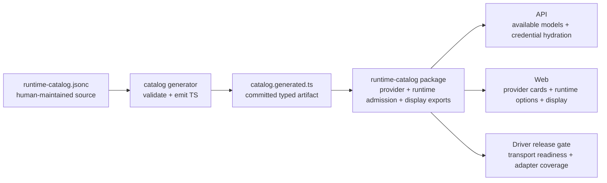

# Runtime Catalog Extension PRD

> Status: implementation guide for runtime expansion
> Adjacent docs: [Architecture](../architecture.md), [Runtime Session Kernel](./runtime-session-kernel.md), [Credentials](./credentials.md)

## One-Line Positioning

Add or change an Agent runtime, Provider, model source, or display surface by editing one catalog source, regenerating the typed catalog, and letting API, Web, and Driver release checks consume the same runtime and provider identity.

## 1. User Problem

Mosoo users see runtime and Provider availability in several places: Agent creation, model selection, Provider setup, and the landing page. Before this catalog boundary, those surfaces could drift because runtime/model allowlists, display names, icon mapping, Provider cards, custom model entry points, and "coming soon" rows lived in separate handwritten code paths.

The person extending Mosoo needs a predictable answer to one question:

> "What must change when we add a runtime or Provider, and how do we prove every surface saw the same change?"

## 2. Goal

When a maintainer adds a runtime, they should be able to:

- Declare runtime identity, transport, visibility, providers, defaults, supported models, and display metadata in the runtime catalog source.
- Declare first-class Provider identity, credential environment, default endpoint, auth shape, icon key, model source, and runtime adapter profile in the same source.
- Keep Mosoo product-facing Provider ids under Mosoo control, even when upstream model metadata comes from another registry name such as `models.dev`.
- Generate a typed catalog artifact consumed by API and Web code.
- Keep planned display-only runtimes separate from public runtime release gates.
- Validate that runtime admission, available model calculation, Provider card rendering, icon rendering, custom model entry points, and coming-soon display do not drift.

## 3. In Scope

- One canonical runtime catalog source for runtime, Provider, model, model-source, adapter, and display metadata.
- Generated TypeScript constants committed with the repository.
- API model availability uses the generated Provider model catalog plus runtime allowlists and App-level Provider credentials.
- Web runtime options, default runtime selection, brand icon lookup, Provider cards, custom OpenAI-compatible entry point, landing showcase, and Provider coming-soon rows consume runtime catalog exports.
- OpenCode model availability is the union of compatible models from configured first-class Providers, OpenCode Zen, and App-defined OpenAI-compatible custom credentials.
- Planned runtimes may appear in display surfaces without becoming launchable runtimes.
- A repeatable extension checklist for adding a new runtime.

## 4. Out Of Scope

- Pricing catalog migration. Model pricing remains in the cost domain until cost reporting needs the same generator boundary.
- Real-time model discovery from external model databases or Provider `/models` endpoints on every model picker render.
- Remote runtime marketplace or user-installed runtime definitions.
- Runtime-specific Driver implementation details. A catalog entry can expose a runtime only after the Driver path exists and is release-gated.
- Per-App custom runtime definitions.

## 5. Concept Definitions

| Concept                    | Product definition                                                                                                               |
| -------------------------- | -------------------------------------------------------------------------------------------------------------------------------- |
| Runtime                    | A launchable Agent driver choice shown to users, such as Claude Agent SDK, OpenAI Runtime, or OpenCode.                          |
| Transport                  | The control path Runtime uses to talk to the Driver backend, such as `claude-agent-sdk`, `openai-app-server`, or `acp-fallback`. |
| Provider                   | A Mosoo product-facing credential provider that can back one or more runtimes. Its id is chosen by Mosoo, not by an upstream registry. |
| Adapter profile            | The provider-specific protocol shape a runtime backend must render, such as OpenAI Responses API, Anthropic Messages, or OpenAI-compatible base URL. |
| Provider model source      | Metadata describing where Mosoo can import or refresh a Provider's model list, such as a `models.dev` provider id or a Provider `/models` endpoint. |
| Provider model             | A known model option shipped by Mosoo for a first-class Provider.                                                                |
| Custom OpenAI-compatible   | App-defined credentials with user-provided Base URL and Model IDs. It is an action entry point, not a fixed Provider card.       |
| Public runtime             | A runtime visible and selectable in Agent creation.                                                                              |
| Internal runtime           | A cataloged runtime that is not user-selectable.                                                                                 |
| Planned runtime            | Display-only roadmap metadata. It must not affect runtime admission or launchability.                                            |
| Icon key                   | A catalog-owned symbolic key that Web maps to an imported brand asset.                                                           |

## 6. Relationship Lock

Key decisions:

- Display-only planned runtimes sit beside public runtime display entries, but they do not enter runtime admission.
- Mosoo Provider ids are product identities. For example, Mosoo may use `gemini`, `qwen`, `kimi`, `zhipu`, and `minimax` even when an upstream registry uses `google`, `alibaba`, `moonshotai`, `zai`, or regional variants as source ids.
- Upstream source names belong in catalog metadata such as `modelSource`, not in API/Web/Driver branching logic.

## 7. Extension Flow

1. Add or edit vendors, models, runtime entries, and planned display entries in `pkgs/runtime-catalog/catalog/runtime-catalog.jsonc`.
2. If adding a Provider, choose the Mosoo product-facing `vendorId`, set the Provider card label/icon, declare credential env vars, default endpoint, auth header shape, optional `modelSource`, and any runtime-specific adapter profile.
3. If the runtime is launchable, set `visibility` to `public`, choose a supported `transport`, declare `vendorIds`, `defaultIdentity`, `supportedModels`, and whether App-defined OpenAI-compatible custom credentials are admitted.
4. If the runtime is only roadmap display, add it to `plannedRuntimes` with explicit `surfaces`.
5. Add an icon asset only if the catalog `iconKey` is new. Prefer existing `@lobehub/icons-static-svg` assets before adding local SVGs.
6. Run `vp run --filter @mosoo/runtime-catalog catalog:generate`.
7. Run `vp run --filter @mosoo/runtime-catalog test` and the affected API/Web type checks.
8. Confirm the Driver transport and adapter profile path exists before making a runtime/provider combination public.

## 7.1 Provider Identity And Model Source Rule

Provider ids are Mosoo product ids. They should be stable, readable, and aligned with what users expect to see in Provider setup. Mosoo does not need to mirror an upstream registry's provider id when that id is more implementation-oriented than product-oriented.

Examples:

| Mosoo Provider id | User-facing label | Possible upstream model source |
| ----------------- | ----------------- | ------------------------------ |
| `gemini`          | Gemini            | `models.dev` provider `google` |
| `qwen`            | Qwen              | `models.dev` provider `alibaba` or regional Alibaba variants |
| `kimi`            | Kimi              | `models.dev` provider `moonshotai` |
| `zhipu`           | Zhipu             | `models.dev` provider `zai` or `zhipuai` |
| `minimax`         | MiniMax           | `models.dev` provider `minimax` or regional MiniMax variants |

This is not a runtime mapping layer. The catalog generator may use `modelSource` to import or refresh Provider model metadata, but generated Mosoo artifacts should expose Mosoo Provider ids to API, Web, and Driver code.

## 7.2 Provider Cards And Custom Provider Entry

First-class Provider cards should be rendered from catalog metadata and treated equally in the Providers page. The initial public set is expected to include Anthropic, OpenAI, DeepSeek, Gemini, Qwen, Kimi, Zhipu, MiniMax, and OpenCode Zen, each with an icon key and Provider credential affordance.

OpenAI-compatible custom credentials are different:

- They are created from a top-level action such as "Add custom model" or "Add OpenAI-compatible provider".
- They require Name, API key, Base URL, and at least one Model ID.
- They should not appear as a fixed `openai-compatible` Provider card.
- Their models are App-defined and should be included only for runtimes that explicitly accept custom OpenAI-compatible credentials.

## 7.3 Runtime Model Availability Rule

Available models are computed by runtime, not by Web UI components. The Web model picker asks the API for `availableAgentModels`; the API resolves that list from:

1. Generated Provider model catalog entries.
2. App-level Provider credentials.
3. Runtime provider/model admission rules.
4. App-defined OpenAI-compatible custom credential model IDs when the runtime accepts them.

The availability key is `(providerId, modelId)`, not only `modelId`, because the same upstream model id may be reachable through multiple credentials, billing paths, or endpoints.

For OpenCode (`acp-fallback`), the model list should be the union of:

- Compatible models from configured first-class Providers.
- Models from configured OpenCode Zen.
- Models from configured custom OpenAI-compatible credentials.

OpenCode must therefore declare `acceptsCustomProvider: true` only when API hydration can render custom OpenAI-compatible credentials into a valid OpenCode provider config, including package and Base URL settings such as `@ai-sdk/openai-compatible` and `baseURL`.

## 7.1 Provider And Adapter Decision Rule

When adding a model source, first decide the identity boundary:

- Add a new **Vendor** when credentials, billing, model ownership, or user-facing provider identity differ. DeepSeek is a vendor because it uses `DEEPSEEK_API_KEY`, DeepSeek-owned models, and a DeepSeek API base.
- Add or reuse an **Adapter profile** when the same runtime transport must render a different protocol config for that vendor. If OpenCode already ships a native provider such as DeepSeek, Mosoo should use the native provider shape and avoid an adapter shim.
- Do not encode a vendor as another vendor's model prefix. `opencode/deepseek-v4-pro` means OpenCode Zen owns the credential and endpoint; `deepseek/deepseek-v4-pro` means DeepSeek owns them, even if OpenCode launches the ACP process.
- OpenAI can have multiple adapter profiles across runtimes: the OpenAI Runtime path uses the OpenAI runtime / Responses-style backend contract, while ACP fallback may use OpenCode-native or OpenAI-compatible config. The provider id remains `openai`; the adapter profile changes by runtime path.

## 8. Acceptance Criteria

- Changing a runtime label, Provider card label, icon key, planned surface, default model, Provider model source, adapter profile, or supported model list requires one source edit plus regeneration.
- A planned runtime can appear on landing or Provider settings without becoming selectable in Agent creation.
- A public runtime appears in Agent runtime options and API available-model calculations from the same catalog entry.
- First-class Provider cards render from catalog metadata, with icons, without Web-only hard-coded Provider lists.
- The fixed `openai-compatible` Provider card is absent; custom OpenAI-compatible credentials are reachable from a top-level custom model/provider action.
- OpenCode availability reflects all configured compatible Provider credentials, not only the first Provider listed on the runtime.
- OpenCode model picker entries include the union of compatible first-class Provider models, OpenCode Zen models, and custom OpenAI-compatible model IDs.
- OpenCode is represented as the public runtime `acp-fallback`, not as a separate planned `opencode` runtime id.
- Generated catalog checks fail when the committed artifact is stale.

## 9. Reasoning Review

The deleted assumption is that each surface can safely hard-code runtime or Provider metadata because the list is small. That did not hold once OpenCode became partially public while roadmap displays still existed and Provider cards expanded beyond OpenAI and Anthropic.

The MVP should not perform live external model discovery during normal UI rendering. It can, however, use external sources such as `models.dev` or Provider `/models` endpoints as catalog import inputs. Mosoo only needs the models and providers it can actually admit, credential, price, and run. Pricing migration is deferred because cost semantics have separate accounting risks and should move only when the cost domain is ready to consume the same source boundary.
