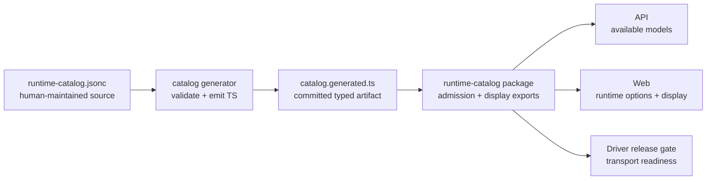

# Runtime Catalog Extension PRD

> Status: implementation guide for runtime expansion
> Adjacent docs: [Architecture](../architecture.md), [Runtime Session Kernel](./runtime-session-kernel.md), [Credentials](./credentials.md)

## One-Line Positioning

Add or change an Agent runtime by editing one catalog source, regenerating the typed catalog, and letting API, Web, and Driver release checks consume the same runtime identity.

## 1. User Problem

Mosoo users see runtime availability in several places: Agent creation, model selection, Provider setup, and the landing page. Before this catalog boundary, those surfaces could drift because runtime/model allowlists, display names, icon mapping, and "coming soon" rows lived in separate handwritten code paths.

The person extending Mosoo needs a predictable answer to one question:

> "What must change when we add a runtime, and how do we prove every surface saw the same change?"

## 2. Goal

When a maintainer adds a runtime, they should be able to:

- Declare runtime identity, transport, visibility, providers, defaults, supported models, and display metadata in the runtime catalog source.
- Generate a typed catalog artifact consumed by API and Web code.
- Keep planned display-only runtimes separate from public runtime release gates.
- Validate that runtime admission, available model calculation, icon rendering, and coming-soon display do not drift.

## 3. In Scope

- One canonical runtime catalog source for runtime, vendor, model, and display metadata.
- Generated TypeScript constants committed with the repository.
- API model availability uses the generated preset model catalog plus runtime allowlists.
- Web runtime options, default runtime selection, brand icon lookup, landing showcase, and Provider coming-soon rows consume runtime catalog exports.
- Planned runtimes may appear in display surfaces without becoming launchable runtimes.
- A repeatable extension checklist for adding a new runtime.

## 4. Out Of Scope

- Pricing catalog migration. Model pricing remains in the cost domain until cost reporting needs the same generator boundary.
- Automatic import from external model databases such as `models.dev`.
- Remote runtime marketplace or user-installed runtime definitions.
- Runtime-specific Driver implementation details. A catalog entry can expose a runtime only after the Driver path exists and is release-gated.
- Per-App custom runtime definitions.

## 5. Concept Definitions

| Concept          | Product definition                                                                                                               |
| ---------------- | -------------------------------------------------------------------------------------------------------------------------------- |
| Runtime          | A launchable Agent driver choice shown to users, such as Claude Agent SDK, OpenAI Runtime, or OpenCode.                          |
| Transport        | The control path Runtime uses to talk to the Driver backend, such as `claude-agent-sdk`, `openai-app-server`, or `acp-fallback`. |
| Vendor           | A credential provider that can back one or more runtimes.                                                                        |
| Adapter profile  | The provider-specific protocol shape a runtime backend must render, such as OpenAI Responses API or OpenAI-compatible base URL.  |
| Preset model     | A known model option shipped by Mosoo for a preset vendor.                                                                       |
| Public runtime   | A runtime visible and selectable in Agent creation.                                                                              |
| Internal runtime | A cataloged runtime that is not user-selectable.                                                                                 |
| Planned runtime  | Display-only roadmap metadata. It must not affect runtime admission or launchability.                                            |
| Icon key         | A catalog-owned symbolic key that Web maps to an imported brand asset.                                                           |

## 6. Relationship Lock

Key decision: display-only planned runtimes sit beside public runtime display entries, but they do not enter runtime admission.

## 7. Extension Flow

1. Add or edit vendors, models, runtime entries, and planned display entries in `pkgs/runtime-catalog/catalog/runtime-catalog.jsonc`.
2. If the runtime is launchable, set `visibility` to `public`, choose a supported `transport`, declare `vendorIds`, `defaultIdentity`, and `supportedModels`.
3. If the runtime is only roadmap display, add it to `plannedRuntimes` with explicit `surfaces`.
4. Add an icon asset only if the catalog `iconKey` is new.
5. Run `vp run --filter @mosoo/runtime-catalog catalog:generate`.
6. Run `vp run --filter @mosoo/runtime-catalog test` and the affected API/Web type checks.
7. Confirm the Driver transport path exists before making a runtime public.

## 7.1 Provider And Adapter Decision Rule

When adding a model source, first decide the identity boundary:

- Add a new **Vendor** when credentials, billing, model ownership, or user-facing provider identity differ. DeepSeek is a vendor because it uses `DEEPSEEK_API_KEY`, DeepSeek-owned models, and a DeepSeek API base.
- Add or reuse an **Adapter profile** when the same runtime transport must render a different protocol config for that vendor. DeepSeek on OpenCode reuses the OpenAI-compatible profile by emitting an OpenCode provider config with `npm: "@ai-sdk/openai-compatible"` and `baseURL`.
- Do not encode a vendor as another vendor's model prefix. `opencode/deepseek-v4-pro` means OpenCode Zen owns the credential and endpoint; `deepseek/deepseek-v4-pro` means DeepSeek owns them, even if OpenCode launches the ACP process.
- OpenAI can have multiple adapter profiles across runtimes: the OpenAI Runtime path uses the OpenAI runtime / Responses-style backend contract, while ACP fallback may use OpenCode-native or OpenAI-compatible config. The provider id remains `openai`; the adapter profile changes by runtime path.

## 8. Acceptance Criteria

- Changing a runtime label, icon key, planned surface, default model, or supported model list requires one source edit plus regeneration.
- A planned runtime can appear on landing or Provider settings without becoming selectable in Agent creation.
- A public runtime appears in Agent runtime options and API available-model calculations from the same catalog entry.
- OpenCode is represented as the public runtime `acp-fallback`, not as a separate planned `opencode` runtime id.
- Generated catalog checks fail when the committed artifact is stale.

## 9. Reasoning Review

The deleted assumption is that each surface can safely hard-code runtime metadata because the list is small. That did not hold once OpenCode became partially public while roadmap displays still existed. The MVP deliberately avoids syncing a full external model database; Mosoo only needs the models and providers it can actually admit, price, and run. Pricing migration is deferred because cost semantics have separate accounting risks and should move only when the cost domain is ready to consume the same source boundary.
