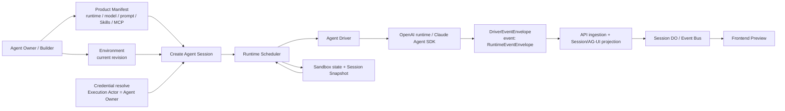
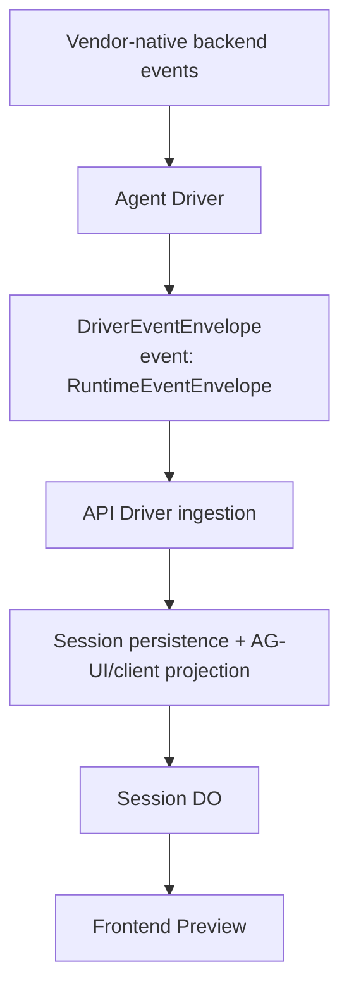
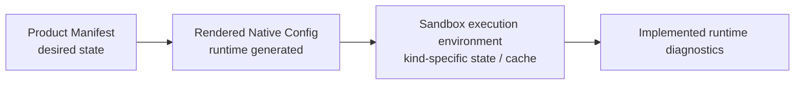
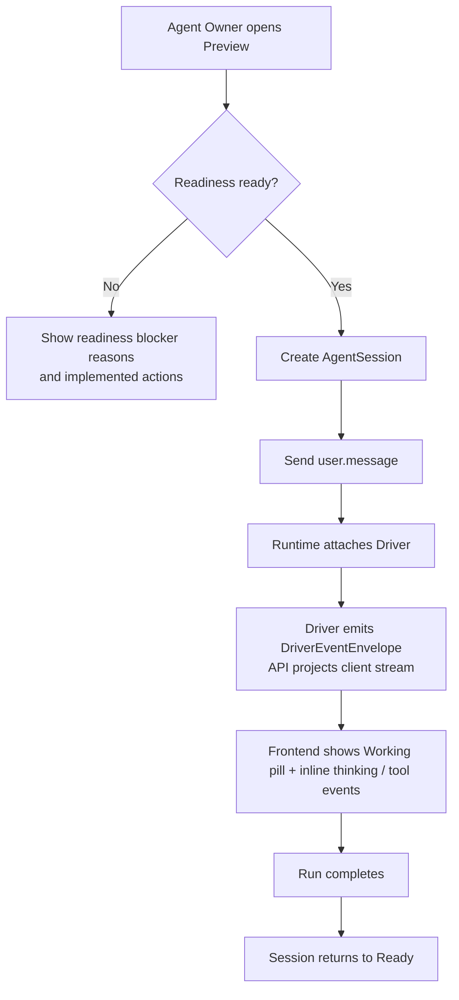
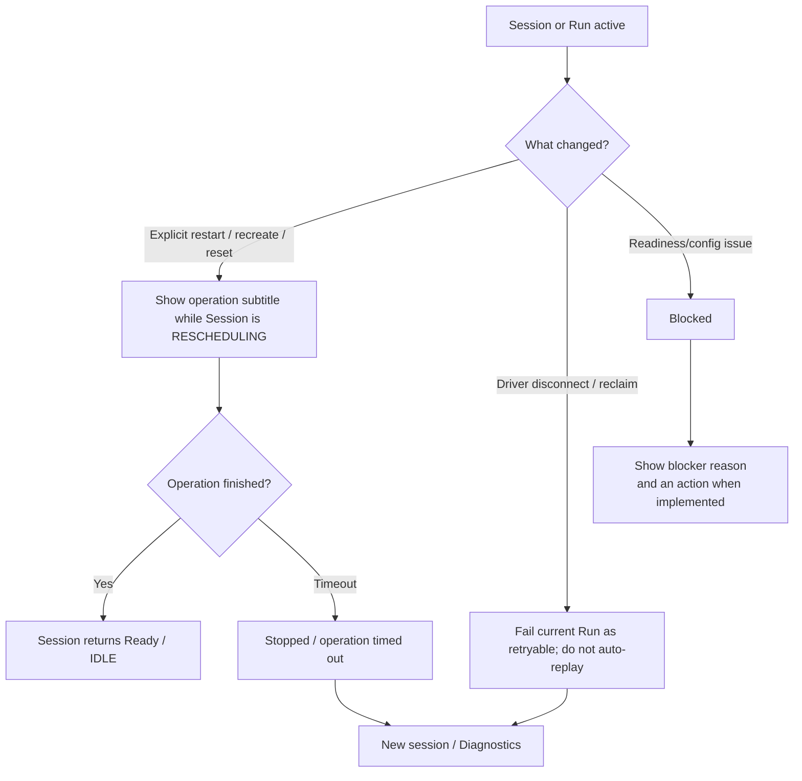

# Runtime Session Kernel — for humans

Status: active semantic overview. [Architecture](../architecture.md), Runtime
Catalog, and code own exact topology and supported runtimes.

> This is the product-story version written for non-engineering readers.

---

## One-line positioning

The current end-to-end Mosoo Runtime Session Kernel lets a configured Agent start
in Preview, pass Driver runtime events through the API's Session projection, and expose readiness,
running, recovering, failed, and diagnostic states.

---

## 1. The user's problem

Mosoo has configuration surfaces for Agent Manifest, Environment, Credentials,
Files, Skills, and MCP, plus Preview, Runs, Logs, Cost, and the Pet Terminal. The
kernel contract must let the user confirm:

- Whether this hand-configured Agent can actually start at all.
- When startup fails, whether the cause is missing Product Manifest configuration, an unavailable Credential, a non-executable Environment, or a Driver / native runtime incident.
- Whether the current `openai-runtime`, `claude-agent-sdk`, and `acp-fallback`
  paths share the same product Session mental model. Any later runtime must join
  that contract before it can be documented as supported.
- How native backend events become Driver runtime events and then the API's Session/AG-UI projection used by Preview.
- Where supported runtime-native configuration belongs: the stable Product Manifest, runtime-rendered config, or diagnostic/Sandbox-local state.

The job the user actually needs to get done:

1. Create a long-lived Agent.
2. Tell it, using a small set of understandable fields, which runtime / model / prompt / Skills / MCP / Environment to use.
3. Materialize runtime-native configuration in the Pet Agent Sandbox or Cattle Session Sandbox, with persistence limited by the current runtime-kind checkpoint policy.
4. Be able to copy, publish, recover, and review this Agent.
5. When something goes wrong, know whether the product configuration is wrong or the machine / native runtime had an incident.

So the core of the Runtime Session Kernel is not "unify every vendor schema," but rather:

> Keep the Product Manifest small and stable; run each supported backend in its kind-specific Sandbox; have the Driver normalize vendor output into Mosoo runtime events; have the API project those events into the Session/AG-UI surface; and have the frontend present runtime states the user can understand in Preview.

---

## 2. Goals

After this round, an Agent Owner / Builder should be able to:

- Start a hand-configured Agent from the Preview panel in Agent Detail and see a real running stream, not a mock conversation.
- See readiness blockers before startup: missing Provider Credential, unavailable Environment, unavailable MCP binding, and so on.
- See the currently reachable Preview states: Setup required, Ready, Working, Updating runtime, and Stopped. `Needs approval` and permission cards exist as dormant supervised-mode UI/protocol capability; current production profiles use `full_access` and do not trigger them.
- Render text, tools, file changes, run status, and diagnostic signals after Driver events pass through the API's Session projection. Permission confirmation projection is implemented but currently unreachable under production profiles.
- Know the next step when a runtime-state operation or Run fails: wait for an explicit restart/recreate/reset operation to finish, retry or resend an interrupted request, start a new Session, fix configuration, or open Diagnostics.
- Understand the persistence boundary: a Pet restart retains its current container, while recreate/hibernate checkpoints `/workspace/memory` and eligible Session workspaces only. A Cattle Sandbox is transient. Login/cache/native files outside checkpoint targets are not promised across recreation.

Platform-side goals:

- Treat the Mosoo Session as the source of truth for the Runtime Session, without turning a vendor's native session id into a public id.
- Have the OpenAI runtime and Claude default to their respective vendor-native paths; any new runtime must provide an explicit vendor-specific backend.
- Keep the Driver-to-API `DriverEventEnvelope` contract, whose `event` field is a
  normalized `RuntimeEventEnvelope`, distinct from the API-to-client
  Session/AG-UI projection.
- Fix the Execution Actor explicitly as the Agent Owner; the Caller is whoever triggered the event and does not by default determine the Agent's Provider Credential, Sandbox state, or runtime identity.

---

## 3. Concept definitions

| Term                     | Product definition                                                                                                                                                                                                                                                                                                                                                                    |
| ------------------------ | ------------------------------------------------------------------------------------------------------------------------------------------------------------------------------------------------------------------------------------------------------------------------------------------------------------------------------------------------------------------------------------- |
| Runtime Session Kernel   | The minimal kernel that takes an Agent from configuration to real execution: it resolves Manifest / Environment / Credential, creates a Session, drives the Driver, ingests Driver runtime events, and projects the client stream.                                                                                                                                                    |
| Agent Session            | The business conversation a user opens with a given Agent within a given EnvironmentRevision. The Mosoo Session is the source of truth.                                                                                                                                                                                                                                               |
| Run                      | One execution of a user message / job within a Session. What the user sees is a single "working" turn.                                                                                                                                                                                                                                                                                |
| Driver runtime event     | A `DriverEventEnvelope` (`eventId`, optional `occurredAt`, and normalized `event: RuntimeEventEnvelope`) emitted by the Driver. This is the Driver-to-API wire contract, not AG-UI.                                                                                                                                                                                                   |
| Session/AG-UI projection | The API-side client projection derived from admitted Driver events and persisted Session state.                                                                                                                                                                                                                                                                                       |
| Execution Actor          | The Agent's execution identity. Locked this round to the Agent Owner, used for Provider Credential resolve, Sandbox state ownership, and runtime identity.                                                                                                                                                                                                                            |
| Caller                   | The person or surface that triggered this session/event, for example a Builder, API caller, or Channel adapter. The Caller affects entry context but does not by default determine the Provider Credential.                                                                                                                                                                           |
| Product Manifest         | The user-understandable desired state of an Agent: runtime, model, prompt, Skills, MCP, Environment.                                                                                                                                                                                                                                                                                  |
| Rendered Native Config   | The local configuration or startup parameters the Agent Driver backend generates for the vendor runtime from the Product Manifest. Diagnosable, but not the source of truth.                                                                                                                                                                                                          |
| Agent kind               | `pet \| cattle`. Pet uses a stable Agent Sandbox; Cattle uses a dedicated Session Sandbox.                                                                                                                                                                                                                                                                                            |
| Pet Sandbox              | A stable Agent Sandbox with subject = `agent:{agentId}`. Multiple Sessions share it; restart retains the container, while recreate/hibernate checkpoints only policy-selected memory and Session workspace paths.                                                                                                                                                                     |
| Cattle Session Sandbox   | A Sandbox addressed by the Session-scoped subject `session:{sessionId}`. The current policy closes its runtime conversation and immediately recycles the Sandbox when a Run becomes terminal. A later Run may continue the same product Session, but provisions a fresh Sandbox and restores platform conversation history rather than reusing the old container.                     |
| Sandbox state            | Files and runtime-native state inside a Sandbox. Pet container state remains while that container lives, but only `/workspace/memory` and eligible Session workspaces are checkpointed by current policy; Cattle state is destroyed with its Session Sandbox.                                                                                                                         |
| Sandbox workspace        | The `/workspace` skeleton the Runtime provisions inside the Sandbox before any session run or Owner debug terminal opens. It contains three subdirectories: `/workspace/cache` (rebuildable cache for Environment packages and setup artifacts), `/workspace/memory` (persistent agent state survived across runs), and `/workspace/se` (per-session execution scratch space).        |
| NativeRuntimeRef         | The vendor's own recovery pointer, such as an OpenAI runtime thread or a Claude session. It enters internal runtime state only and is never exposed as a public id.                                                                                                                                                                                                                   |
| Diagnostics              | The current diagnostic projection for the App owner: Session/execution facts, native runtime reference presence/preview, pending permission count, and implemented runtime errors. It does not compute native-config drift.                                                                                                                                                           |
| Readiness                | The runnability check before Preview / Publish. Missing requirements produce blocker reasons; only blockers with an implemented destination provide a direct fix action.                                                                                                                                                                                                              |
| Runtime catalog          | The generated API/Web product registry for current `openai-runtime`, `claude-agent-sdk`, and `acp-fallback` paths. The standalone Driver owns a separate executable provider registry; a cross-submodule test requires every public catalog runtime to match it by runtime id, transport, and capabilities. Future runtimes are unsupported until both registries and the gate agree. |

---

## 4. Current relationship locks

### 4.1 Overall loop

### 4.2 Driver events and client projection are separate contracts

Decisions:

- The Driver wraps each normalized Mosoo `RuntimeEventEnvelope` in a
  `DriverEventEnvelope` for idempotent Driver-to-API ingestion; it does not emit
  AG-UI directly.
- The API parses and admits those events, applies permissions/attribution/persistence, and creates the Session/AG-UI client projection.
- Vendor-native events are not leaked directly to the frontend.
- Vendor-native payloads are not exposed. Diagnostics shows only the implemented, redacted execution facts and native-runtime-reference presence/preview.

### 4.3 Product Manifest and Runtime State

Decisions:

- Terminal or native runtime changes are not written back into the Product Manifest.
- The current product has no general native-config drift comparison or manual
  reconcile/adopt flow.
- `native.overlay` does not enter the main YAML.
- Advanced native config belongs to Advanced / Diagnostics / Sandbox state, not to the ordinary Agent Manifest editing surface.

---

## 5. User journey map

| Phase                         | User Actions                                                     | Touchpoints                                        | Emotion       | Pain point                                              | Opportunity                                                                                     |
| ----------------------------- | ---------------------------------------------------------------- | -------------------------------------------------- | ------------- | ------------------------------------------------------- | ----------------------------------------------------------------------------------------------- |
| Configure Agent               | Builder fills in runtime / model / prompt / Environment          | Agent Manifest form                                | Medium        | Unsure whether the configuration is enough to start     | Readiness gives a clear result before Preview                                                   |
| Start Preview                 | Builder clicks Preview / Start session                           | Preview panel                                      | High          | Worried it is still a mock                              | A real Session backed by Driver events and API projection                                       |
| Observe the run               | Builder watches the Working pill + inline thinking / tool events | Chat stream / tool cards                           | High          | Unsure whether the agent is stuck                       | Status language like the OpenAI runtime / Claude Code                                           |
| Supervised approval (dormant) | A future supervised production profile requests permission       | Approval card                                      | Medium        | Current production profiles cannot reach this path      | Keep the implemented protocol/UI gated until a supervised profile is deliberately enabled       |
| Runtime operation             | Owner applies restart/recreate/reset                             | Updating runtime pill + runtime-operation subtitle | Low to medium | Afraid the Session was lost                             | Show the bounded operation window; reserve reconnecting for a real connection state             |
| Failure block                 | The run is unrecoverable or configuration is missing             | Error banner / Diagnostics                         | Low           | Unsure whether it is a config error or a broken runtime | Show a reason, plus Fix/New session/Diagnostics only where that action exists                   |
| Diagnose                      | App owner opens Agent Logs and selects a Session                 | Session Diagnostics                                | Medium        | Native state is a black box                             | Show the implemented execution facts, native runtime reference summary, permissions, and errors |

### 5.1 Preview happy path

### 5.2 Failure and recovery path

