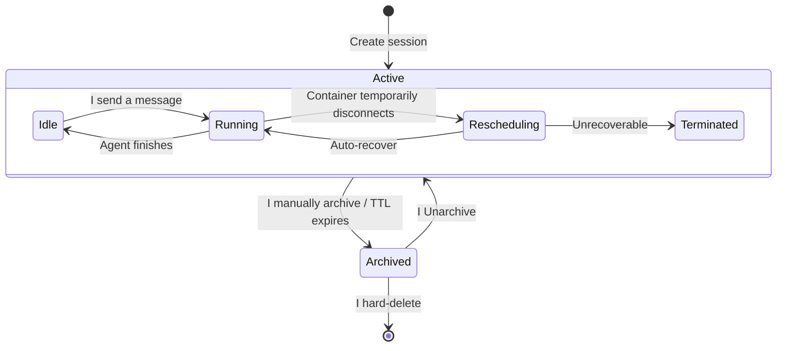

# Session Lifecycle — for humans

> This is the product-story version written for non-engineering readers. For the full engineering contract (state-machine details, sequence diagrams, edge-case matrix, implementation boundaries, and reasoning review), see the shipped engineering PRD.

## One-line positioning

Give an AgentSession well-defined intermediate states between **alive → dozing → asleep → buried → deleted**. Users can predict "what happens when I come back N minutes after I leave," the platform can serve as many active users as possible within the physical constraints of containers, and Agent authors can publish a new version without disrupting users who are still running on the old one.

This was called out at the 4-26 architecture review: a session has no defined intermediate state between "alive" and "dead," which is one of the biggest unsolved business problems Mosoo has had to date. This PRD is what solves it.

---

## 1. The user problem

| Persona                                 | Real-world scenario                                                                                                                                                      | What happens when it's undefined                                                                     |
| --------------------------------------- | ------------------------------------------------------------------------------------------------------------------------------------------------------------------------ | ---------------------------------------------------------------------------------------------------- |
| Riley (Web UI design intern)            | She's halfway through a conversation with the "Weekly Report Assistant" when she's pulled into a meeting; she comes back 45 minutes later wanting to continue            | The system doesn't know how long to keep the session; she may return to find the conversation gone   |
| Jordan (API caller / heavy Linear user) | Linear assigns an issue to an agent, which finishes and writes a PR in 8 minutes; the next day there's a follow-up in the comments, and he expects the agent to remember | There's no agreed-upon point at which the caller should archive, and the default behavior is unclear |
| Lark group member (Channel user)        | Six days ago they @-mentioned the agent in a group chat; today they @ it again and want the agent to know the plan from last time                                        | It's unclear how long a channel session can be kept, or what cross-week memory should rely on        |
| Alex (Agent author)                     | He published an agent, 5 sessions are running, and he changes the system prompt and re-publishes                                                                         | Are the old sessions killed, or do they keep running the old prompt? The user experience differs     |

All four scenarios share the same root cause: **a session has no intermediate state between "alive" and "dead."**

---

## 2. Goal: the product semantics of five states

| State       | User's view                                                           | Platform's promise                                                                                                            |
| ----------- | --------------------------------------------------------------------- | ----------------------------------------------------------------------------------------------------------------------------- |
| **Alive**   | I just sent a message and the agent is running                        | RUNNING, with events streaming back to the screen                                                                             |
| **Dozing**  | I stepped away for a bit; I can still pick up where I left off        | Still IDLE to the outside world; internally the sandbox is released. The next message triggers a 5-second cold-start recovery |
| **Asleep**  | I've been away too long, but nothing was lost                         | Archived; new messages can't be sent, history is still readable, and it can be Unarchived back to IDLE                        |
| **Buried**  | The agent errored out or the environment broke and can't be recovered | TERMINATED, with a "New session" button; the old transcript is read-only                                                      |
| **Deleted** | I've confirmed I no longer need it                                    | Hard delete; the container backup, events, and records are all cleaned up together. Irreversible                              |

Success criterion ≈ at every point in time, the user can say "which state I'm in right now, and what will happen next."

---

## 3. Core concepts

| Term                           | Plain-language explanation                                                                                                                                |
| ------------------------------ | --------------------------------------------------------------------------------------------------------------------------------------------------------- |
| **AgentSession**               | One business conversation between a user and an Agent; what the user sees as "this conversation" is exactly this                                          |
| **Pet Agent**                  | All sessions of the same Agent share one stable working environment; it backs up when you leave and restores when you return (like keeping a pet)         |
| **Cattle Agent**               | Each session gets its own isolated environment that is destroyed when it ends; continuing the chat spins up a brand-new environment (like herding cattle) |
| **Archive**                    | A semi-terminal state. After archiving, no new messages can be sent, history is preserved, and you can Unarchive to continue at any time                  |
| **Deployment Version**         | A specific version of the Agent's configuration (prompt / model / skills / environment are all frozen into it)                                            |
| **Session Execution Snapshot** | The configuration frozen at the moment a session is created; from then on, this session always runs against that snapshot                                 |
| **Continuation**               | The process by which the platform automatically restores the conversation when you come back from dozing / asleep / a closed browser tab                  |
| **Reset agent-state**          | Pet Agent only. Clears local state in the sandbox (logins, caches, etc.) without deleting the transcript or any Files                               |

---

## 4. Pet vs Cattle: one table to make it clear

| Dimension                    | Pet Agent                                                                                          | Cattle Agent                                                                                  |
| ---------------------------- | -------------------------------------------------------------------------------------------------- | --------------------------------------------------------------------------------------------- |
| Across multiple sessions     | Share one stable environment                                                                       | Each runs on its own, fully isolated                                                          |
| After being away for a while | Backs up local state, Restores next time                                                           | Destroys the environment outright                                                             |
| Continuing the next day      | Local files and login state are still there                                                        | The platform preserves the conversation history and Files; the environment is brand new |
| Reset agent-state            | Has this action (clears local state)                                                               | Not shown (there's no cross-session state to begin with)                                      |
| Best suited for              | Agents that live long-term alongside the same working environment (IDE, long-lived account logins) | One-off tasks, concurrent execution, and isolated batch calls                                 |

> Pet vs Cattle is decided by the Agent author at publish time; ordinary users never see this switch, but they can sense the difference in the "continuation experience."

---

## 5. User journeys

### Journey 1: Riley — away from the Web UI for 30 minutes

> Create a session → send a message → get pulled into a meeting → refresh the page 45 minutes later → the UI shows "Restored, last active 45 minutes ago" → after a 5-second cold start, continue chatting.

She never sees terms like "dozing" or "released"; she only sees a brief loading state and a single lightweight notice.

### Journey 2: Jordan — Linear follow-up the next day

> Linear assigns the agent for the first time and it finishes the PR in 8 minutes → the next day the conversation continues in the comments → the platform matches the same session and continues automatically.

If the agent is a Cattle agent, the old environment has already been destroyed; the new environment only inherits the conversation history the platform saved plus anything explicitly persisted (Files / Backup), and temporary caches are not restored. This is documented in the agent's product description so callers know what to expect.

### Journey 3: continuing a Lark group chat 6 days later

> The group @-mentions the same agent → it matches the session from 6 days ago (Channel TTL of 90 days) → the agent sees the full transcript and answers with coherent context.

> Coworker B also @-joins → it matches the same session → the agent sees A's conversation plus B's new message, labeled "from: @B". This is the coworker's real perspective in the group: shared context, knowing who's asking.

Long-term memory as a fallback: the agent can proactively write Files during the conversation; even if the transcript is compacted, the agent can read its own Files to pick up the thread.

### Journey 4: Alex — re-publish

> Agent v3 is running with 5 sessions still alive → Alex changes the prompt and adds a skill, then publishes v4 → the 5 old sessions keep running on v3, while new incoming sessions default to v4.

Once an old session ends naturally (the user archives it or it times out from idle), v3 is not deleted right away; it's retained for reviewing old conversations.

> If what Alex changes is the **runtime** (for example, switching from the OpenAI runtime to Claude), the platform does not allow an in-place upgrade; he must Fork the Agent, and the original Agent and all its sessions remain unchanged.

---

## 6. State-machine sketch (user's view)

The platform also has an internal "release sandbox" state that is **invisible to users**: in the UI it's equivalent to IDLE, except the next message incurs one extra 5-second cold-start loading state. This is intentional — in the user's mental model there are only 4 states.

During `RESCHEDULING`, no separate pill is shown; instead, a "· reconnecting" subtitle is attached next to the current state, the input box still accepts typing, and the text is buffered into a queue. The reconnect window is 120 seconds, after which it escalates to TERMINATED.

---

## 7. TTL tiers

| Source                                | Default idle TTL (how long with no activity before "dozing") | Default archive TTL (how long with no activity before auto-archive) |
| ------------------------------------- | ------------------------------------------------------------ | ------------------------------------------------------------------- |
| Web UI                                | 30 minutes                                                   | 7 days                                                              |
| API                                   | 60 minutes                                                   | 30 days                                                             |
| Channel (Slack / Linear / Lark, etc.) | 24 hours                                                     | 90 days                                                             |

> Agent authors can override the defaults within the Runtime bounds (idle: 1 minute – 7 days; archive: 1 day – 365 days). The intuition behind the three tiers of defaults: Web is at the scale of "this conversation," API is at the scale of "this day's work," and Channel is at the scale of "cross-week collaboration."

We don't do a per-timezone daily reset; TTL is the only time axis a user can predict.

---

## 8. The promise about configuration / environment

The session's product promise is not "always try to recover the Agent's latest configuration." Instead, it is: **a snapshot is frozen at creation time, and every continuation thereafter is built around that snapshot.**

| Question a user might ask                                                                                                | Answer                                                                                                 |
| ------------------------------------------------------------------------------------------------------------------------ | ------------------------------------------------------------------------------------------------------ |
| I opened this session half an hour ago, the author just changed the prompt — which version am I using now that I'm back? | Still the version you created with (v3); it won't switch silently                                      |
| The environment my old session used has already been deleted by the author or can't be recovered — what happens?         | This session goes to TERMINATED, with a "New session" button                                           |
| What about Files that were changed or App owner access that no longer proves out?                                  | Every continuation re-validates current App proof; it won't use an old snapshot to bypass owner access |
| Can I have the platform upgrade me to the latest version?                                                                | No. To upgrade, create a new session; this is the "no silent config swap" promise                      |
| I'm the owner of a Pet Agent and want to clear leftover login state in the sandbox — what do I do?                       | Reset agent-state; this clears only sandbox state and doesn't touch the transcript / Files / cost      |

---

> For the full engineering contract, see the shipped engineering PRD.
