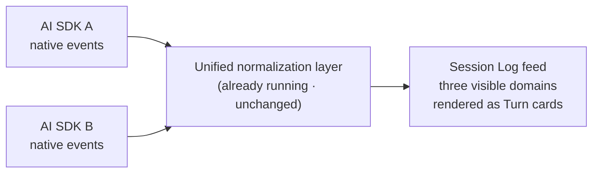
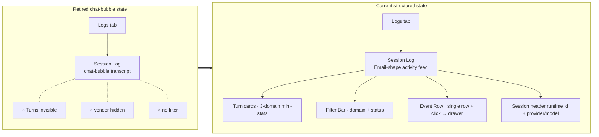

# Session Log — for humans

Status: active product story for the current structured Session Log surface.

> This is the product-story version for non-engineer readers. Exact event
> projection and UI behavior live in the runtime-event contracts and current Web
> Session Log implementation.

## One-line positioning

The current "Logs → Session Log" view on the Agent page uses a **structured
event stream** like a **Linear activity feed / GitHub PR conversation**, rather
than the retired chat-bubble layout:

- One card per run-oriented Turn group; events without a `run.started` boundary can form a provisional pending Turn
- One row per visible process event (user input / agent reply / tool call / state change). `usage.updated` remains internally classified as span data and may contribute the Drawer token total, but it has no visible event row.
- Click a single row → open the Turn Drawer and inspect the persisted event `content` projection

Analogy: Linear's issue activity feed — every comment, status change, and assignee change is a row, and you click to see the detail. Our Session Log has this same shape, but "comment" becomes "agent event".

---

## 1. Historical problem

Before the current structured view shipped, an App owner opening Session Log to
debug Preview or troubleshoot Production saw:

- **Shape mismatch**: chat bubbles mimic an IM conversation, but the builder is not "chatting" — they want to scan horizontally to spot "which turns failed".
- **Turn boundaries are invisible**: in a long, multi-turn session the bubbles cascade in one continuous stream, making it impossible to see "how the thinking in turn 3 relates to the tool choices in turn 4".
- **Runtime is invisible**: without header metadata, events from different runtime paths are easy to misread.
- **No filtering**: with hundreds of events, wanting to "see only errors" or "see only agent output" means scrolling to find them yourself.
- **Drill-down is hard**: viewing each event's details requires opening the right-hand diagnostics panel and cross-referencing, which is clumsy.

---

## 2. Current shipped behavior

The current Agent Log lets the Agent owner:

- Open the Session Log and see the selected session grouped into **Turn cards**. A card normally follows one Run from `run.started` to a terminal event; unmatched leading/trailing events can form a pending card.
- See the current **runtime id** in the session header, with provider/model and version metadata alongside it.
- See a **single-row event list** in each Turn body. The three visible domains
  use the current Web tones: user = sky, agent = green, and session = ink/gray.
  Domain color appears in the filter/summary swatch, timeline bar, and row hover
  state; the event-shape chip has its own type/status tone. The internal
  `usage.updated` span event can contribute the Drawer token total, but is not
  rendered as a row, filter, mini-stat, timeline segment, or Drawer event.
- **Click a single row → open the centered Turn Drawer**: a horizontal timeline bar + the same visibility-filtered event list + bidirectional highlighting (click a bar segment ↔ click a row) + the selected event's persisted `content` projection expanded. Hidden `usage.updated` events are not added back in the Drawer.
- Use the **Filter Bar** at the top: three domain chips to toggle (user / agent /
  session, all selected by default) + an "All" / "Errors only" toggle. Despite
  that compact label, the latter uses the code's attention-worthy predicate: it
  includes error/unsupported events, `run.failed`, and rescheduling or
  terminated lifecycle signals.

---

## 3. Concepts

| Term               | Meaning                                                                                                                                                                          |
| ------------------ | -------------------------------------------------------------------------------------------------------------------------------------------------------------------------------- |
| **Session Log**    | The session-detail mode inside the Agent Page's Logs tab. Shows the event timeline for a **single session**.                                                                     |
| **Turn**           | A run-oriented event group. It may be completed, failed, running, rescheduling, terminated, or a provisional pending group when no Run boundary has arrived.                     |
| **Visible domain** | A Mosoo Web UI taxonomy for user (input), agent (output), and session (lifecycle). Span remains an internal classification for hidden usage events, not a visible filter domain. |
| **Email-shape**    | The "one event per row" structured shape of a Linear activity feed / GitHub PR review, rather than chat bubbles.                                                                 |
| **Turn Drawer**    | The centered Dialog that opens after clicking an event row, showing that Turn's horizontal timeline bar + event list and the selected event's persisted `content`.               |
| **Runtime chip**   | The header chip displaying the Session's `runtimeId`; provider/model and version are separate metadata.                                                                          |

---

## 4. Data flow (how heterogeneous vendors are normalized)

**Key points**:

- **Do not invent new event types.** The backend's existing events are sufficient; the frontend classifies visible rows into user, agent, and session domains while keeping `usage.updated` hidden.
- **Do not change the normalization layer.** Each SDK's adapter is already running; the frontend only adds chrome (colors, icons, labels) on top in the UI.
- **Vendor heterogeneity is shown in the session header metadata.** The runtime appears as a chip, while provider, model, and version are separate fields; these values are not repeated in every event row.
- **The visible-domain split is a UI classification convention, not a protocol.** The frontend maps backend events through one domain table, then exposes only the three entries in `SESSION_EVENT_FILTER_DOMAINS`.

---

## 5. User journey map

| Stage       | What the builder is doing              | What they see                                                                                                  | Mood      |
| ----------- | -------------------------------------- | -------------------------------------------------------------------------------------------------------------- | --------- |
| Enter       | Agent Page → Logs tab → select session | The list view is replaced by a detail view with a Back control, central feed, and right-hand diagnostics panel | Neutral   |
| Overview    | Scroll through Turn cards              | Each Turn has mini-stats such as "2 user · 5 agent · 3 session" so visible event volume is clear at a glance   | Confident |
| Find errors | Click "Errors only" in the Filter Bar  | The feed shows error/unsupported events plus rescheduling and terminated lifecycle signals                     | Efficient |
| Deep dive   | Click a suspicious row                 | The central Drawer opens, with the timeline bar + that event's persisted `content` projection expanded         | Satisfied |
| Close       | ESC                                    | Return to the original position in the feed                                                                    | Smooth    |
| Anomaly     | Read runtime/provider/model metadata   | Identify which configured runtime path produced the Session before comparing supported behavior                | Informed  |

---

## 6. Information architecture (Before / After)

**Current navigation and rendering**:

- The Logs tab starts with the Session list.
- The current Web query shows at most the 100 most recently updated Sessions and
  has no pagination control; its count is the number shown, not an all-time
  total.
- Selecting a Session replaces that list with a detail view and a Back control.
- The detail view contains the activity feed and right-hand diagnostics panel.
- The header carries the vendor/runtime metadata, and the transcript uses the structured activity-feed form.
