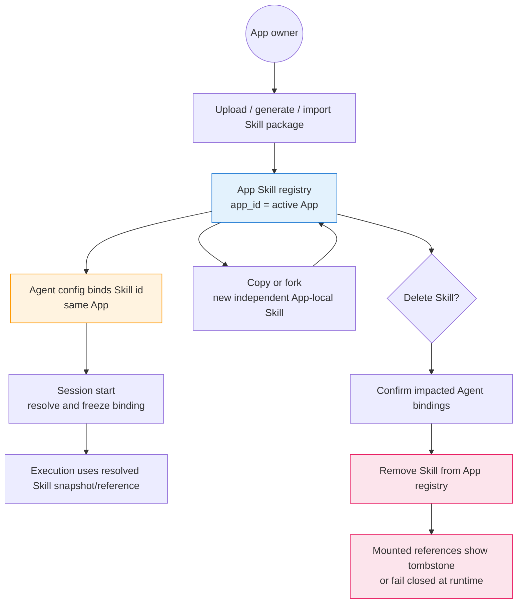

# Skill — for humans

> This is the product-story version of Skill, written for non-engineering readers. The **complete engineering contract** (file/directory layout, frontmatter fields, acceptance criteria, explicit Upgrade flow, and open questions) lives in the full PRD.

---

## Calibrate your mental model first (drift note)

The product described in §1 / §11 / §13 of the full PRD looks like this:

- An account-level **Default Agent** automatically picks Skills on the Work page.
- Each user controls "does my Default Agent automatically invoke a given Skill" through a **per-user toggle**.
- Skill sharing is a visible collaboration model with separate user-owned and received groups.

After the App pivot, all of these are retired for V1: the Work page and Default Agent concept have been removed, the per-user toggle has neither UI nor persistence in the mainline code, and user-visible Skill sharing is future governance. The **only** Skill consumption path in the current product is:

> **Explicitly bind an App-owned Skill to an Agent inside the same App.**

The App owner controls Agent bindings. End-user Skill toggles, cross-account sharing, shared catalogs, and cascade-fork collaboration are not V1 behavior. Whether to bring any of them back will be decided in a future governance phase. See [App Boundary](./app-boundary.md).

Where legacy words such as Workspace, Organization, team, or sharing appear in older source material, treat them as historical or future-governance context unless the section explicitly says App-owned V1. The term still follows external naming only when referring to a workspace on an external platform (Slack / Lark / Linear, etc.).

---

## One-line positioning

A Skill is a **stateless capability unit** (a prompt plus optional scripts / reference material) that an Agent invokes on demand.

The registry entrypoint is the active App's Skills surface. Skills are App-owned resources alongside Agents, Spaces, MCP servers, Environments, Providers, and Channels.

By analogy:

> Like a capability package stored in an App and explicitly bound by one or more Agents in that App. A Session resolves the Agent's configured Skill references through the same App boundary at execution time.

---

## 1. User problems

Sentences Agent owners / configurators often say:

- "I have a few prompts I've tuned. I want to bundle them into a reusable 'skill' so I can just attach it the next time I configure a new Agent."
- "I imported an Agent package. Which Skills are now App-local and safe to mount?"
- "I want to change a couple of lines without affecting the original package." — Copy it into a separate App-local Skill.
- "If I delete that Skill, I need every affected Agent reference to become visible instead of silently falling back."
- "A packaged Skill id from another App should not prove access here." — Reject it.
- "Why is there no icon / avatar on the skill card?" — Intentional. A Skill is a tool, not a person.

---

## 2. Goals

When this is done, an Agent owner should be able to:

- Upload a `.md` / `.zip` / `.skill` file into the active App's Skill registry
- Open an App-local Skill detail view to read `SKILL.md` or download the `.skill` archive
- Mount App-local Skills in an Agent configuration
- Copy or fork an App-local Skill when they want an independent package to edit
- Delete an App-local Skill after confirmation, with no cross-user cascade; affected Agent references must show an explicit tombstone or fail closed at runtime
- Import package Skills only after reconnecting them to the active App; legacy runtime ids from another ownership boundary are not enough

---

## 3. V1 access model: owner-only App resources

| Actor             | What I can do                                                                                                      |
| ----------------- | ------------------------------------------------------------------------------------------------------------------ |
| **App owner**     | Create, read, download, re-upload, copy/fork, delete, and mount Skills on Agents inside the same App               |
| **Everyone else** | Not a V1 access class for Skills; there is no received-Skill registry and no cross-account Skill permission matrix |

We deliberately do **not** reuse Space's old three-tier admin / edit / read model. V1 Skill access is App-owner access only. Additional human roles belong to future governance.

---

## 4. Registry: App-owned Skills

The current registry has one product group:

| Group          | Who's in it                                                                                                       |
| -------------- | ----------------------------------------------------------------------------------------------------------------- |
| **App Skills** | Skills whose `app_id` is the active App, including uploaded, generated, imported, and copied packages |

Future multi-user governance may add additional views, but V1 should not expose them or keep dormant route/API entrypoints for them.

---

## 5. Ownership model (core semantics)

### 5.1 Upload/import: visible inside the active App

- The App owner uploads a `.md`, `.zip`, or `.skill` package, or imports one from an Agent package
- The Skill row belongs to the active App
- The Skill appears in the active App's Skill registry and nowhere else

### 5.2 Agent binding: reference by id, resolved by App boundary

- What an Agent stores is an explicit Skill id reference
- At Session start, runtime resolves that reference through the Agent's App
- Cross-App, legacy package, or missing ownership proof fails closed instead of deriving access from Organization state or package metadata
- There is no upstream contribution workflow in V1; to edit, create an independent App-local copy

### 5.3 Copy/fork: deliberately independent

The App owner can copy or fork a Skill:

- Copies the current package into a new App-local Skill row
- The copy is independent from the source
- The UI may show "Forked from X @ {time}" as a provenance hint, but this is not a sync indicator

### 5.4 Delete: explicit fallout, no cascade

When the App owner deletes a Skill:

1. A confirmation dialog shows the impacted Agent bindings when they are known
2. The owner confirms and the Skill disappears from the active App registry
3. Any mounted Agent reference becomes an explicit deleted/missing reference or fails closed at runtime

The effect: nothing invents ownership for another user or App, and no compatibility layer silently recreates the deleted package.

### 5.5 Who can do what

| Action                             | App owner  | Other user |
| ---------------------------------- | ---------- | ---------- |
| View / preview / download `.skill` | Yes        | No V1 path |
| Edit by re-uploading               | Yes        | No V1 path |
| Copy/fork                          | Yes        | No V1 path |
| Mount on an Agent                  | Yes        | No V1 path |
| Delete                             | Yes        | No V1 path |
| Manage collaborators               | No V1 path | No V1 path |

---

## 6. What a Skill looks like: the special thing about the editing flow

### 6.1 No in-app editor

**App owners edit locally and re-upload.** This path is simple enough and avoids the awkwardness of "the product has an editor, but a weak one."

A Skill's contents include at least one `SKILL.md` (with frontmatter). It can be packaged as a `.zip` / `.skill` (synonyms) together with scripts, reference material, and assets. The detail dialog only renders `SKILL.md`; the other assets come bundled with the download.

### 6.2 The intended primary update path (drift: depends on the Default Agent, removed by the pivot)

The update mechanism locked in by §10.1 of the full PRD was: the Owner opens a Session with their own **Default Agent** on the Work page and updates the skill file "within the conversation that uses the skill" — making "editing" a byproduct of "using."

This path depends on the Default Agent. After the pivot, the Default Agent has been removed, so this editing flow does not exist for now. The viable way for an Owner to update a skill today is:

- Edit `SKILL.md` locally and go through the `Upload Skill` flow again (per the default behavior in §15 Q1 of the full PRD, this creates a new skill; the explicit "Upgrade" entrypoint that overwrites the same UUID, §10.2, has not yet been built)

Whether to reconnect "in-conversation editing" will be decided if and when the Default Agent concept returns.

---

## 8. The relationship between Skill and Agent

What's mounted in an Agent's configuration is an **App-owned Skill id reference**, not a copy of the content:

- The Agent config stores explicit references to Skills in the same App
- At Session start, runtime resolves and freezes the configured Skill bindings through the Agent's App
- Legacy package runtime ids or cross-App references fail closed instead of deriving ownership from snapshots or Organization membership
- If a Skill is deleted or unavailable, the UI/runtime must surface a tombstone or explicit failure; no shared-owner fallback is allowed

### 8.1 User-level "toggle" vs Agent mounting (drift)

What §11.1 of the full PRD intended to express: when a user toggles a skill OFF in the Skills list, it **only affects whether that user's Default Agent automatically invokes it**; it does not affect an Agent's `skills[]` ("the creator says this skill is required for it to work").

| Invocation method                               | Does the per-user toggle take effect?    |
| ----------------------------------------------- | ---------------------------------------- |
| Auto-selected within the Default Agent          | Yes in the old model                     |
| `@mention`-ed within the Default Agent          | Explicit use won in the old model        |
| **Explicitly mounted in an Agent's `skills[]`** | No; the Agent owner's configuration wins |

But the Default Agent has been retired, so neither of the first two rows currently exists; today, **explicit mounting in an Agent** is the only real path. This actually makes it simpler to reason about:

> Whether a Skill can be reached through Web Threads, an Agent API Endpoint, or a Channel delivery path depends on whether the Agent has mounted an App-local Skill and whether runtime can resolve that Skill through the Agent's App. It has nothing to do with end-user toggles.

---

## 9. Lifecycle diagram

---

## Related

- **Complete engineering contract**: the full Skill PRD
- **How a Skill is mounted in an Agent's configuration**: [`./agent-manifest.md`](./agent-manifest.md)
- **Adjacent assets**: [Space](./space-interaction.md) · [MCP](./mcp-interaction.md) · [Environment](./environment.md)
