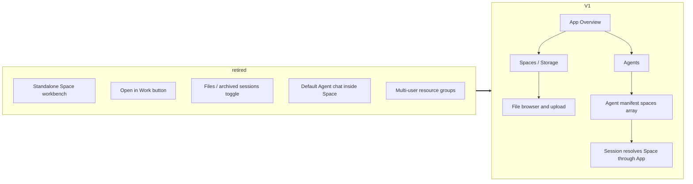

# Space - for humans

> This is the product-story version written for non-engineering readers. The full engineering contract lives in the shipped Space PRD.
>
> **Current App boundary note**: Space is the current UI name for App-owned Storage. It belongs to one App, and Agents in that App bind it through their manifest. Multi-user resource access, global catalogs, and resource transfer are future governance, not V1 behavior. Preserve the mountable file-container model. See [App Boundary](./app-boundary.md).

---

## One-line positioning

After the pivot, **Space does exactly one thing**: it is persistent App-local file storage that an Agent mounts into its own manifest to consume.

The Space page itself **does not host chat, start tasks, or store session history**. Work-page entry points, Default Agent chat, archived Space sessions, and local-directory mounts are retired product shapes.

> **The scope of this PRD is not a shared drive.** Space behaves more like a repository of files that an execution target can read: the production side is the Space page, where the App owner creates the container and manages files; the consumption side is always the Agent, where the App owner binds the Space in `spaces[]`.

---

## User problem

Riley is an App owner/operator who wants a particular Agent API Endpoint in her App to read a batch of materials: contract templates, SOPs, and design files.

After the pivot, there is **no "open a Space and chat directly" entry point** in the product for her. The only path she can take:

1. Create a Space in the active App and upload files into it
2. Open an Agent in the same App and add this Space to the Agent manifest's `spaces[]`
3. When that Agent runs through Web Threads, an Agent API Endpoint, or a Channel delivery path, runtime resolves the Space through the Agent's App

The old PRD treated Space as an independent work surface. This version narrows Space back to a single responsibility: **providing an App-owned, mountable file container for Agents**.

---

## Concept definitions

| Term                      | Definition                                                                                                                       |
| ------------------------- | -------------------------------------------------------------------------------------------------------------------------------- |
| **Space / Storage**       | Persistent files and directories owned by one App. Existing UI may say Space; the boundary is App Storage.                       |
| **App owner**             | The V1 actor who can create, read, update, delete, and mount Spaces in the App.                                                  |
| **Mount**                 | Writing a Space id into the `spaces[]` array in an Agent manifest. This step belongs to Agent configuration, not Space setup.    |
| **Runtime resolution**    | Session execution resolves the mounted Space through the Agent's App and fails closed if ownership proof is missing.             |
| **Runtime file activity** | Files written or summarized by execution can be attached back to App-owned Storage when the runtime path explicitly supports it. |

---

## Information architecture: retired vs current

**Current sidebar semantics:**

- **Spaces**: App-owned Storage containers in the active App
- No received-resource group in V1
- No governance pass-through group in V1

---

## User journey map

> After the pivot, Space has one path: **create in App -> fill with files -> mount on an Agent in the same App**.

| Phase       | User actions                                                                     | Touchpoint      | Design consequence                                                                                                                   |
| ----------- | -------------------------------------------------------------------------------- | --------------- | ------------------------------------------------------------------------------------------------------------------------------------ |
| 1. Create   | Open the active App's Spaces surface, enter a name, and create the container     | App Spaces      | Creation always has App context; no Organization-level default bucket is implied                                                     |
| 2. Fill     | Drag files, upload files, create folders, rename or delete files                 | Space file view | File work stays on Space; no chat or task entry point appears here                                                                   |
| 3. Mount    | Open an Agent in the same App and add the Space to `spaces[]`                    | Agent editor    | The Agent is the consumer, so the mount action stays in Agent configuration                                                          |
| 4. Run      | Use Web Threads, an Agent API Endpoint, or a Channel path that targets the Agent | Agent runtime   | Runtime resolves Space through the Agent's App and rejects cross-App or legacy ownership gaps                                        |
| 5. Maintain | Return to Space for file updates or deletion                                     | App Spaces      | Mounted Agents see current file contents when runtime resolves the Space; missing Spaces must be explicit rather than silently fixed |

**Key design decision**: the Space page does **not** provide a reverse "mount this to an Agent" shortcut. The Agent manifest remains the source of truth for runtime dependencies.

---

## V1 access semantics

> For current implementation details, use App owner access checks. Older permission tables are future-governance context only.

| Capability                       | V1 behavior                                                                                                   |
| -------------------------------- | ------------------------------------------------------------------------------------------------------------- |
| Browse Space files               | App owner only                                                                                                |
| Upload / create / delete files   | App owner only                                                                                                |
| Rename / download files          | App owner only                                                                                                |
| Change Space settings            | App owner only                                                                                                |
| Bind Space to Agent              | App owner only, and only for Agents in the same App                                                           |
| Runtime reads mounted Space      | Allowed only when Agent and Space resolve to the same App                                                     |
| Cross-App or legacy Space id use | Fail closed; do not infer access from snapshots, package metadata, historical tenant rows, or old access rows |

**Hard rules:**

- Space belongs to one App. Organization is not a runtime resource bucket.
- Agent configuration is the only V1 consumption path for Space.
- Any missing or mismatched App proof must become an explicit UI/runtime error, not a compatibility fallback.

---

## Future governance, not V1

The following topics can be revisited only after the V1 App boundary is stable:

- Multi-user access to a Space
- Global resource catalogs
- Human role matrices for Storage
- Resource transfer
- Enterprise governance views

Do not keep dormant routes, schema fields, or tests for these topics in the current V1 surface.

---

> The full engineering contract (covering Conditional Write / Lease Lock / the Phase 1-2 implementation staging / the complete Edge Cases table) is maintained in the shipped Space PRD.
