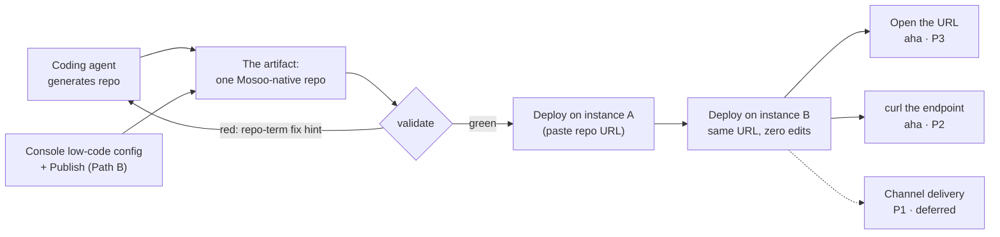
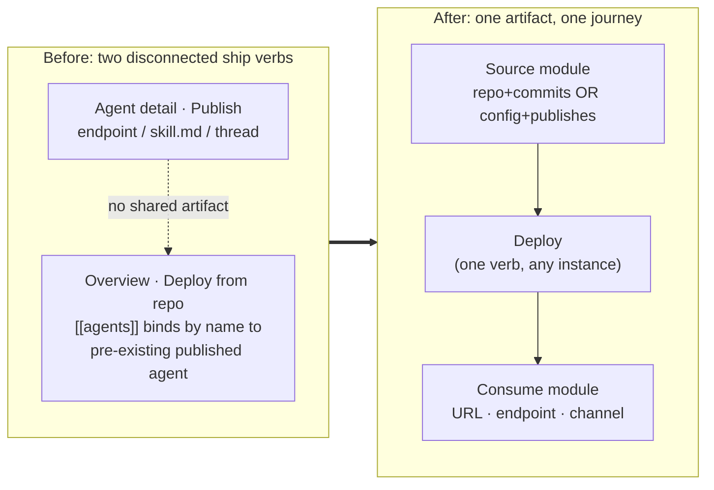

# Native Deployment Happy Path — Demo Contract

> **Status**: Draft for discussion · **Last updated**: 2026-07-06 · **Owner**: Evan (product)
>
> Method stack per [PRD writing standard §2](../prd/good-prd.md): Working Backwards (script the demo first), Job Definition (JTBD), Crazy 8s to diverge, criteria vote to converge.
>
> Companion documents: the [protocol PRD](../prd/mosoo-native-deployment-protocol.md) — **the single source of truth for the contract** — plus ADR 0001–0003 and the [market decision map](./agent-app-market-decision-map.md). This document does not restate the protocol contract. It locks the thing the protocol must make true: **which moment we record as the product demo**.
>
> Implementation handoff — locked decisions, agent-first legacy inventory, change map, phases: [Native Deployment Workplan](./native-deployment-workplan.md).

## The question

A Happy Path here means the recordable demo moment — the single teachable sequence we would film to educate users on what Mosoo is for, and therefore the sequence every product decision must keep shootable. If the protocol PRD defines the contract, this document defines the proof.

**Answer in one line:** the moment to record is **"one repo, any Mosoo"** — a coding-agent-generated repo deploys green on a *second* Mosoo instance with zero edits — bracketed by paste-to-live before it and persona-specific consumption after it.

The rest of this document derives that answer instead of asserting it.

## Who the user is (Job Definition / JTBD)

Consumer chat users are not a persona for this product: they hire Hermes or OpenClaw. The people who hire a *deployment* product are:

| Persona | Job story (When… I want… so I can…) | Existing hire they compare us to | Their aha (observable) |
| --- | --- | --- | --- |
| **P0 · Coding agent + the developer driving it** | When my coding agent has an agent app working locally, I want a deterministic, validatable target format, so its output deploys green on the first try on any Mosoo instance. | `git push` → Vercel import; `npm publish` | `validate` green → deploy green, zero manual edits, on an instance the repo has never seen. |
| **P2 · Enterprise developer (headless)** | When my product needs an agent-powered feature, I want a hosted, versioned agent endpoint I can call like any SaaS API, so I can ship the feature without building agent infra. | Auth0, Resend, Supabase; Claude Managed Agents | First `curl` returns the agent's answer in their terminal. |
| **P3 · Web app owner** | When I have an app idea (usually realized by a coding agent), I want a live URL where the app *and its agent* both work, so I can share and use it without ops. | The Vercel deploy moment | The URL renders and answers on their phone. |
| **P1 · Digital-employee integrator (2B, channels)** — *deferred* | When a client team lives in Slack/Lark, I want the agent working inside their channel. | — | Agent replies in-channel. Not in this happy path. |

Two consequences fall out of the persona table:

- **P0 is the protocol's native user, and it is often not a human.** This is why validation must be machine-checkable, why errors must be phrased in repo terms, and why the happy path can never require choosing an "app type": a coding agent cannot answer a marketing question. The repo must self-describe.
- **Claude Managed Agents defines the shape we must not copy.** Its quickstart is four API calls; the agent is an API resource whose id and version are minted by the platform, referenced by id in every session, with no repo contract at all. That id-centric shape is exactly what makes an agent non-portable. Mosoo's open position is the thing they structurally cannot offer: **a repo that is the deliverable and deploys on any instance.**

## Evidence: why today's pipeline cannot record this video

Grounded in current code on `main`; this is also the gap list the protocol PRD must close.

1. **The deploy contract cannot carry an agent.** The build snapshot is a file allowlist — `.mosoo.toml`, `package.json`, `wrangler.*`, lockfiles, `index.html` (`apps/api/src/modules/apps/application/app-deployment-executor.service.ts:83`) — no agent definition file exists in the contract. `[[agents]]` in `.mosoo.toml` accepts only `name`/`expose`/`env` (`app-deployment-detector.ts:789`) and resolves by name against agents that already exist *and are published* on the target instance; otherwise the run aborts with `deployment_agent_not_found` / `deployment_agent_not_published` (`app-agent-binding-resolution.ts:41`). So a repo that works on instance A fails on instance B — not because a UUID travels in the repo, but because **agent identity is instance state the repo cannot provision**. The artifact is not self-sufficient by construction.
2. **Two "ship" verbs exist and do not compose.** `publishAgent` (console path) freezes a DeploymentVersion and makes the agent endpoint answer (`agent-lifecycle-command.service.ts:40`). `deployApp` (repo path) builds and deploys the web artifact, then binds by name (`app-deployment.service.ts:150`). Neither produces the other's input: publish emits no repo, deploy defines no agent. The Overview page merges them visually, not contractually.
3. **Detection fails opaque.** "detecting target" in Production Activity is not a pipeline step — it is the UI fallback label for `targetKind === null` (`deployments-history.tsx:129`), shown when detection itself threw (`deployment_shape_unsupported` / `deployment_config_required`). The user in the reference screenshot saw four failed deploys labeled "worker" and "detecting target" with no repo-term explanation of what to fix.
4. **Dev preview proves nothing about deployability.** The "Development preview · ready" badge is a client-side health poll of the user's own dev server on `localhost:8877` (`local-preview-url.ts:4`); production is a queue → sandbox → Cloudflare pipeline. They share no validation. "Green in development, red in production" is therefore structurally common, which is precisely the trust-killer for P0.
5. **The portability philosophy already exists — in the wrong subsystem.** `.agent` package export deliberately strips every instance ULID (environment, MCP server, skill ids; secrets blanked) and import re-resolves by name and re-mints ids (`agent-package-export.service.ts:26`, `agent-package-import.service.ts:31`; see [Agent Import / Export & Fork](../prd/agent-package-import-export-fork.md)). The deploy pipeline never calls any of it. The protocol's job is to move this "resolve, not restore" philosophy from the import wizard into the deployable contract itself.

## Crazy 8s — eight candidate demo moments

Eight sketches for "the moment we record", one per panel:

1. **Paste-to-Live.** Fresh console → paste a repo URL → detection names what it found → deploy → the production URL renders the app. The Vercel import moment, with an agent inside.
2. **Same Repo, Second Instance.** The same repo URL pasted into a *different* Mosoo (localhost → try.mosoo.ai). Both green, zero edits. The portability thesis made visible.
3. **First curl.** After deploy, copy the endpoint from the console and `curl` it; the agent's JSON answer appears in a terminal. The Resend/Auth0 aha.
4. **Never Leave the Editor.** In Claude Code/Codex: "deploy this to Mosoo" — the coding agent validates, fixes, pushes, and deploy status streams back into the editor.
5. **Publish Exports the Repo.** Build an agent in the low-code console → Publish → the dialog presents the deliverable: a protocol-shaped repo (download / push to GitHub) plus endpoint and thread URL.
6. **Fork Someone's App.** Paste a stranger's public Mosoo-native repo, deploy it into *my* instance with *my* provider keys; it runs identically. The market/community moment.
7. **Version = Commit.** Push a prompt change → redeploy → Production Activity shows the commit-linked version; running threads keep their snapshot.
8. **Red-to-Green Validate.** CI runs `validate` on a PR: red with a repo-term fix hint, green means deployable anywhere. The trust-builder for coding agents.

### Vote

Criteria from the JTBD table and the standing constraints (no app-type selection; the artifact is the deliverable; agent is not first-class in the deploy story):

- **C1** — time-to-aha ≤ 3 minutes on video
- **C2** — proves the protocol claim (portable, self-sufficient repo)
- **C3** — nothing id-shaped or type-picker-shaped appears on screen
- **C4** — serves ≥ 2 personas' jobs
- **C5** — recordable shortly after protocol v1 lands

| Sketch | C1 | C2 | C3 | C4 | C5 | Verdict |
| --- | :-: | :-: | :-: | :-: | :-: | --- |
| 1 Paste-to-Live | ✅ | ◐ | ✅ | P3+P0 | ✅ | **Spine of the master demo** |
| 2 Second Instance | ✅ (as climax) | ✅✅ | ✅ | P0+platform thesis | ✅ | **Climax of the master demo** |
| 3 First curl | ✅ | ◐ | ✅ | P2 | ✅ | **Coda of the master demo** |
| 5 Publish Exports | ◐ | ✅ | ✅ | console users | ◐ | **Companion recording (Path B)** |
| 8 Red-to-Green | ✅ | ✅ | ✅ | P0 | ✅ | Folded into the master's first beat |
| 4 Editor-native | ◐ | ✅ | ✅ | P0+P2 | ❌ needs CLI/MCP surface | Phase 2 demo |
| 6 Fork Someone's App | ✅ | ✅ | ✅ | P3+market | ❌ needs distribution surface | Phase 2 demo (market decision map) |
| 7 Version = Commit | ◐ | ◐ | ✅ | ops story | ✅ | Supporting scene, not an aha |

Winner: a **composite master demo of 1 + 2 + 3** (with 8 folded into the opening beat), plus **5 as a separate 60-second companion**. Sketch 2 is the only beat no adjacent product can film — Vercel has no agent semantics, Claude Managed Agents has no repo — so it carries the thesis.

## The Happy Path (the storyboard)

### Master demo · "One repo, any Mosoo" (≤ 3:00)

| Time | Beat | On screen | Aha |
| --- | --- | --- | --- |
| 0:00–0:40 | **Generate** | In Claude Code/Codex: "turn this PRD into a deployable Mosoo app." The agent scaffolds the repo — app code plus the agent defined *in the repo, by name* — runs `validate` (red once, fixes from the repo-term hint, green), pushes to GitHub. | P0 setup: the artifact exists and is provably deployable. |
| 0:40–1:30 | **Paste-to-live** | Mosoo console (instance A): paste the repo URL. The detection card names what it found — protocol version, app target, one agent. Deploy runs green. The production URL opens; the app answers a question. | **Aha 1 (P3):** my app is live at a URL. |
| 1:30–2:10 | **The kicker** | A different Mosoo instance (try.mosoo.ai), fresh App, provider key already configured. Paste the *same* URL. Deploy green. Same app, new domain. | **Aha 2 (P0 / thesis):** same repo, any instance, zero edits. |
| 2:10–2:40 | **Consume codas** | Cut A: the URL opens on a phone. Cut B: Overview's consume card → copy the curl → terminal shows the agent's JSON answer. | **Aha 3 (P2):** it's also an API my code can call. |
| 2:40–3:00 | **End card** | "One repo. Any Mosoo." | — |

The governing rule, quoted as spoken: **“旅程统一，但 aha 不许统一”** — unify the journey, never unify the aha. One recording, one spine, three separately-cut aha beats; each persona's cut-down ends on *their* beat. Averaging them into one generic aha is the greed this rule keeps honest.



### What must NOT appear on screen

The negative space is the acceptance mechanism — each item operationalizes a standing constraint:

- An app-type picker, template chooser, or any required classification step.
- Any ULID/UUID typed, copied, or edited by a human.
- An import wizard, re-binding dialog, or "package repair" state.
- Editing a file to make the repo work on the second instance.
- The label "detecting target" (detection either names what it found or says what is missing, in repo terms).
- Provider secrets in the repo or on screen (keys are legitimate instance state, staged before recording).

**The demo is the acceptance test.** Each beat should be replayable as a deterministic e2e; the fixture-backed `/v0-deploy-preview` route is the existing pattern to extend. If a beat cannot be automated, that beat is where the product is still lying to the video.

### Path B companion · "Publish is the same deliverable" (≤ 1:00)

Console path: create an agent in the low-code editor → Publish → the publish surface presents the deliverable explicitly: the protocol-shaped repo (download or push to GitHub) alongside the endpoint and thread URL. This is the beat that makes journey unification real — both paths converge on the same artifact noun, so the console is a *way to author the artifact*, not a second product.

### What the video demands from the protocol (requirements checklist)

1. **In-repo agent definition.** The repo declares its agents (by name, no instance ids); deploy provisions or updates them on the target instance — upsert, not bind-to-pre-existing. This retires `deployment_agent_not_found` as a cross-instance failure mode. (ADR 0002's split: agent definition in the artifact, exposure config at deploy.)
2. **One validation, two homes.** `validate` runs as a CLI/CI command and as the server-side pre-deploy check — same rules, same repo-term messages. Dev/prod parity kills evidence item 4.
3. **Instance state is exactly: provider credentials** (plus the org/app shell). Everything else the artifact carries. Secrets never travel — same red line as the `.agent` package contract.
4. **Detection names its result** — protocol version, target, agent count — or states what is missing. No null-label dead ends.
5. **Version provenance = commit SHA** in Production Activity; running threads keep their execution snapshot (unchanged from the versions contract).
6. **Console Publish converges on the artifact** — publish emits or updates the same protocol shape the deploy pipeline consumes.
7. **The App's API is a namespace, not an endpoint.** Exposed agents are addressed by name inside an app-scoped base path — `…/api/v1/apps/{app-slug}/agents/{name}/threads` — and the API surface is exactly the expose subset (agents may be defined but internal). No ULID appears in any path the console or CLI displays. Auth stays on account PATs in v1 (the generated CLI's `auth login` flow already works this way); App-scoped keys are the eventual direction, explicitly deferred. Reference shape: Supabase Edge Functions (`PROJECT.supabase.co/functions/v1/hello-world` + project key). Thread creation still targets one agent, so the SPEC rule "no App-level runtime endpoint" holds: what the App owns is namespace, OpenAPI doc, and quota — and eventually keys.
8. **Noun parity is a contract property, not CLI code.** The CLI is generated (Go, via Lathe) from Mosoo's exported OpenAPI/GraphQL specs in `mosoo-connector`; overlays contribute shortcuts (`mosoo ls`, `mosoo run`), examples, `output_hints` JSON paths, and `follow_up_commands` — no hand-written command output exists. Therefore the deploy nouns (endpoints, run number, commit, phases, next step) must live in the `deployApp` / run-status **response shapes**; a `deploy` overlay shortcut points at them, and the regenerated Mosoo Skill (`publish/skills/mosoo`, rebuilt on every connector build) is where the P0 journey is actually taught. `validate` takes the same path: one server-side operation (the same code as the pre-deploy check), surfaced as a generated command + shortcut, reporting `doctor`-style versioned JSON (`schemaVersion`, stable `failures[].code` / `action`). Offline local validation is a v1 non-goal.

## IA consequences (sidebar + Overview)

**One sidebar for API users and Web users.** The personas differ in *where they consume*, not in which console they need — so the difference lives in one Consume surface, not in two navigation trees. Today consumption is split between the per-agent Publish menu (API access, skill.md, thread, channel) and the app-level deploy console; the unified sidebar keeps the current App section (Overview / Threads / Agents / Config) and gives consumption one home instead of two half-homes.

**The slot grammar.** Overview is four fixed slots; each answers one question forever, and the artifact's expose declarations decide the *species* of each answer — never a user-chosen app type:

| Slot | Fixed question | Web exposure | API exposure |
| --- | --- | --- | --- |
| S1 · Deliverable hero | "Show me what I shipped, in its native form" | preview iframe + open-URL | Connect card: endpoint, App key, curl tabs, playground, 24h mini-stats |
| S2 · Environments | "Where does it answer" | dev preview URL / production URL | draft playground / production namespace base |
| S3 · Source | "Where does it come from, what version" | identical (repo+commits, or console config+publishes) | identical |
| S4 · Activity | "What happened each ship" | identical table; phase names are data, not layout | identical table |

With multiple agents, S1 grows from a card into a surface *table* — base URL and App key shown once, one row per **exposed** agent (name, path, live version, 24h calls, curl/Try); defined-but-internal agents don't appear (that's the Agents page's fleet job). No adjacent PaaS forks its console by app type — Vercel doesn't ask static-vs-SSR, Railway doesn't ask worker-vs-web; the type lives in what you deployed. A second console is earned only if P2's job grows into API-platform administration (per-consumer keys, quotas, usage plans) — not in v1. Naming candidate for the S1 API module: **Connect** (Supabase's term; users arrive pre-educated).

**The CLI contract (noun parity).** For the CLI-first Agent API user, the first console is the terminal: `fly deploy` prints "Visit your newly deployed app at …", Modal prints every web endpoint URL in deploy output, and Cloudflare's dashboard is explicitly the observe-and-attribute surface, not the deploy surface. Mosoo follows the same inversion — the education cost of the Overview journey is paid in the terminal, where the journey just happened:

```text
$ mosoo deploy
✓ validate            mosoo-native v1 · 3 agents · no web target
✓ provision agents    quiz-master v3→v4 · vet-advisor new · triage-helper unchanged
✓ activate endpoints  2 exposed

  API   https://try.mosoo.ai/api/v1/apps/cat-quiz          ← S2 Production reserved
        POST /agents/quiz-master/threads                    ← S1 Connect · row 1
        POST /agents/vet-advisor/threads                    ← S1 Connect · row 2
  key   mosoo tokens create                                 ← S1 App key
  run   #6 · commit e91f2ab                                 ← S4 Production Activity
```

This block is the *information* contract — which nouns the responses must carry — not a hand-formatted output. The CLI is Lathe-generated, so the rendering arrives through overlay `output_hints` and the regenerated Mosoo Skill, while `-o json` exposes the same fields to automation.

Console button, CLI, and (later) git webhook are three entrances to the **same DeploymentRun object** in the same S4 table — the Vercel rule; there is no CLI-flavored deploy.

**Overview keeps one skeleton; two modules become polymorphic.** The screenshot layout (preview · environments · source · activity) is stable. What varies by artifact, not by user type:

- **Source-of-truth module.** Repo-backed app: repo / branch / HEAD, versions are commits. Console-authored app: live DeploymentVersion and publish history, versions are publishes. Same table shape, different provenance column.
- **Consume module.** Web-exposing artifact: URL hero + preview frame. Endpoint-exposing artifact: endpoint + copy-ready curl as the hero. Chosen by what the artifact exposes — never by asking the user what kind of app this is.

This answers the standing question directly: yes, Overview presents differently for the API-centric case — by module content swap, not by layout fork.



## Metrics

- **TTFHW** — paste repo URL → live URL (target: under the video's own 90 seconds).
- **Portability SLO** — % of protocol-valid repos that deploy green on an instance they have never touched, unmodified. This is the thesis metric.
- **Validate-green-first-try** — % of coding-agent-generated repos passing `validate` without human edits.
- **TT-200** — deploy success → first successful external `curl`.
- **Demo replayability** — the master storyboard runs as e2e on every release; a red beat blocks the release the way a failed test does.

## Non-goals (for this happy path, not for the product)

- The P1 channel / digital-employee demo (separate recording when channels enter the story).
- Reviving an App Builder / NL configuration assistant as a demo beat.
- Market, community, or fork-distribution surfaces (owned by the market decision map).
- Multi-agent orchestration on camera.
- Automatic migration of existing console-created agents into repos.
- CLI depth — the CLI appears only as `validate` and the deploy output; teaching the CLI is a different video.
- Auto-redeploy on push, custom domains, previews-per-branch (post-v1 pipeline features).
- A default-agent shorthand route (`…/apps/{slug}/threads` auto-routing to the only exposed agent) — saves ten characters, breaks semantically the day a second agent is exposed. Explicit names always.
- App-scoped API keys — v1 rides on account PATs (the generated CLI's existing `auth login`); revisit when multi-app tenancy demands it.
- Per-agent key restrictions under an App key (API-gateway territory; wait for real demand).
- Offline local `validate` — v1 validation is one server-side implementation with two entrances (CLI command + pre-deploy hook), not duplicated local logic.

## Reasoning review

| Review item | Conclusion |
| --- | --- |
| Core premises challenged | "Agent is first-class" → in the deploy story the **artifact** is first-class; agents are declarations inside it. "Users pick an app type" → the repo self-describes; detection names it. "A repo-side agent UUID breaks deploys" → code shows the repo cannot even *carry* agent identity; the real defect is that the artifact is not self-sufficient, so the fix is in-repo definition + upsert, not UUID-stripping. |
| Scope deleted | Type pickers; import wizards on the happy path; channel beat; market beat; editor-native beat (needs surfaces that don't exist); rollback UI. |
| Minimal form | One artifact noun, one deploy verb, one consume surface, three aha cuts from one recording. |
| Mature reference | Vercel import (paste-to-live), Resend first-email (curl coda), Claude Managed Agents quickstart (the id-centric shape we deliberately do not copy). |
| Why automation is deferred | Auto-redeploy/webhooks would lengthen the video without strengthening any persona's aha; they arrive after the portability thesis is proven. |

## Open questions (need a PM decision before the protocol PRD locks)

> Status 2026-07-07: #3 is locked in the PRD (the artifact noun is **Mosoo Native Deployable**); #1, #5, #6 are tracked as the PRD's Open Decisions 4, 1, 3; #2 and #4 remain video-staging choices owned here.

1. **Does console Publish materialize the repo in v1** (export/push to GitHub), or only guarantee shape-conformance with export available on demand? Path B's beat depends on the answer.
2. **Which second instance appears in the video** — try.mosoo.ai (brand credibility, implies our hosted offer) or a second self-hosted instance (purest portability claim)?
3. **Naming lock for the artifact noun** — "Mosoo app repo" / "artifact" / "package" are currently mixed across drafts; the protocol PRD should lock one spelling everywhere, per the concept-lock rule.
4. **Is one-time provider-key setup allowed on screen** in Path B (honest onboarding) or pre-staged in both recordings (tighter video, slightly less honest)?
5. **App slug minting and rename policy** — the slug appears in every API path, so slug stability *is* the API compatibility promise. Minted from manifest `name`? What happens on rename — redirect window, hard break, or immutable-once-exposed?
6. **Does the protocol replace or coexist with generic repo detection?** ADR 0003 says "instead of" for agent apps; plain static/worker repos (no agents) presumably keep the existing detector. The boundary sentence — "protocol path when the manifest is present, generic detection otherwise" — needs to be locked in the protocol PRD so the two pipelines don't drift into each other.
